# Repeating Earthquake Activity at RCM

## Waveforms
[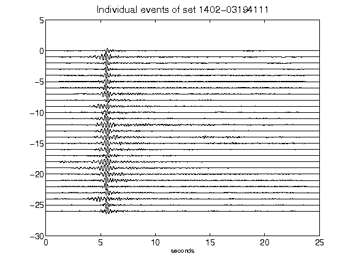](figures/1402-03194111_AllEv.png)[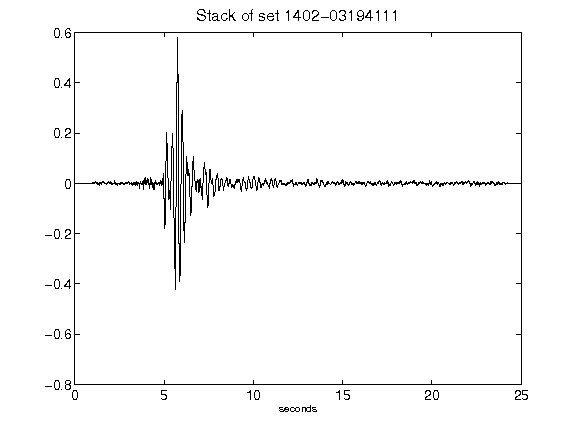](figures/1402-03194111_Stack.png)[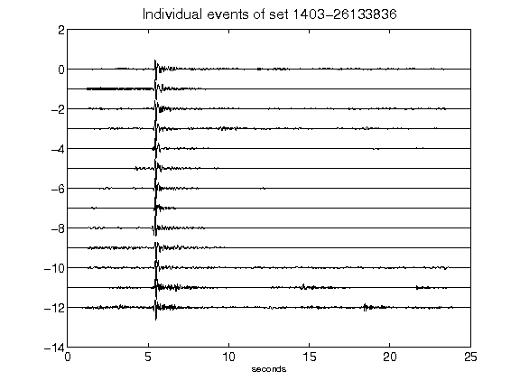](figures/1403-26133836_AllEv.png)[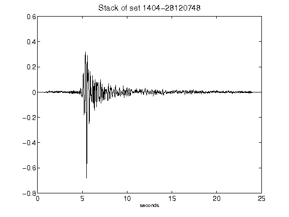](figures/1404-28120748_Stack.png)[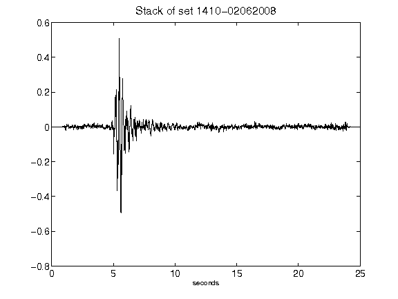](figures/1410-02062008_Stack.png)[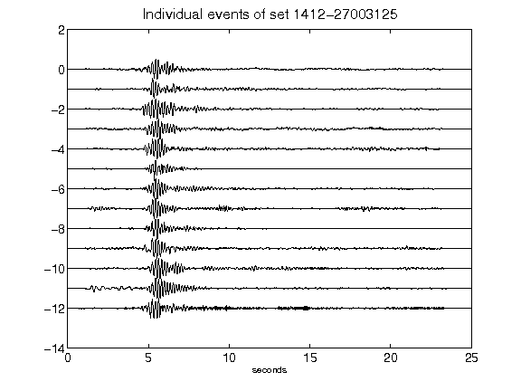](figures/1412-27003125_AllEv.png)[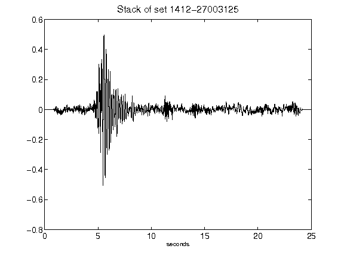](figures/1412-27003125_Stack.png)[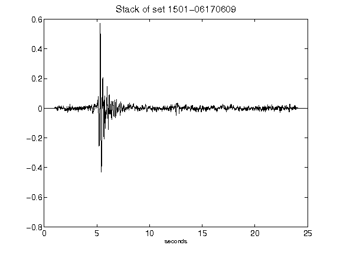](figures/1501-06170609_Stack.png)[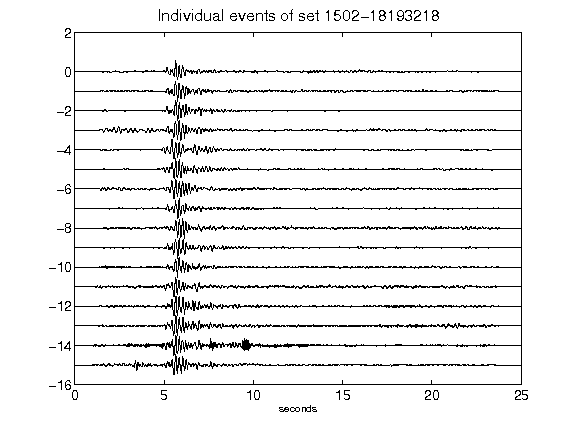](figures/1502-18193218_AllEv.png)[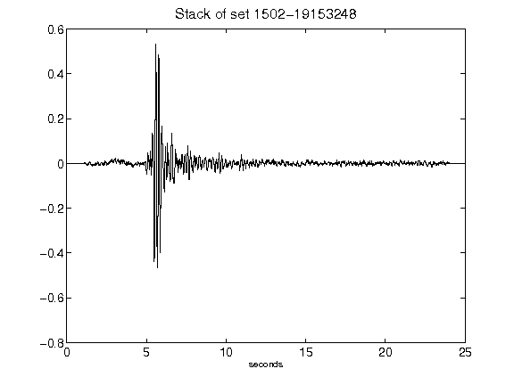](figures/1502-19153248_Stack.png)[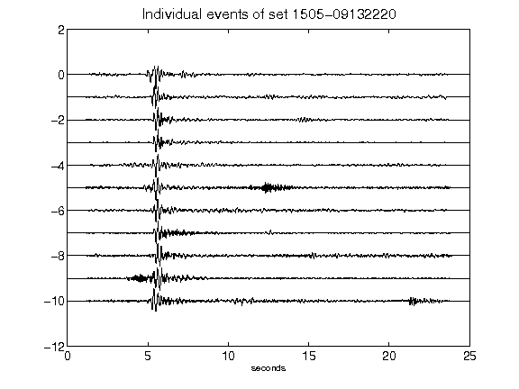](figures/1505-09132220_AllEv.png)[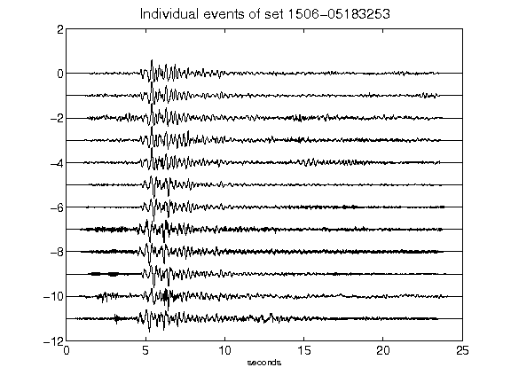](figures/1506-05183253_AllEv.png)[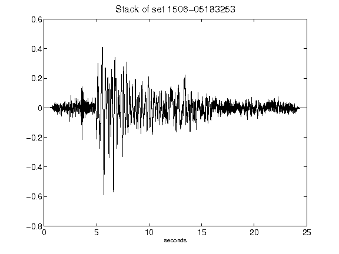](figures/1506-05183253_Stack.png)