# Repeating Earthquake Activity at RCM

## Waveforms
[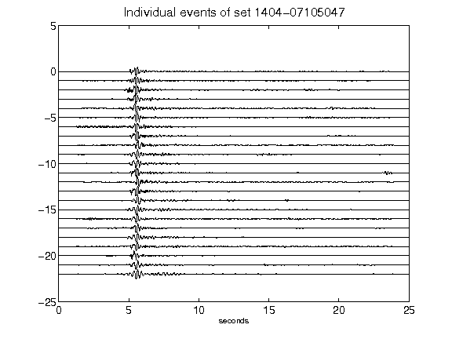](figures/1404-07105047_AllEv.png)[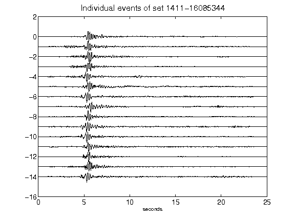](figures/1411-16085344_AllEv.png)[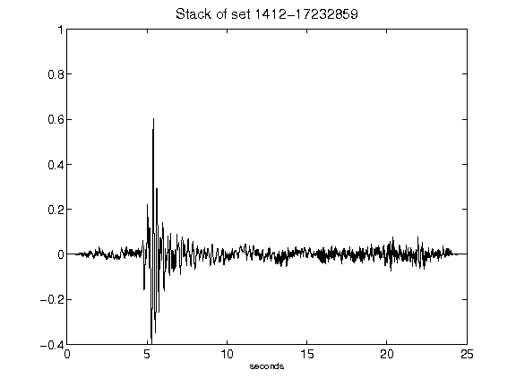](figures/1412-17232859_Stack.png)[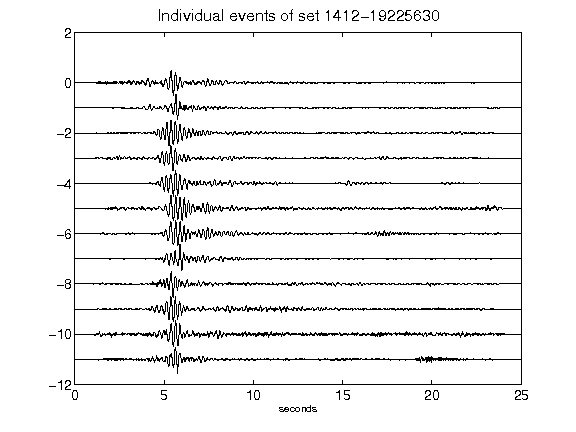](figures/1412-19225630_AllEv.png)[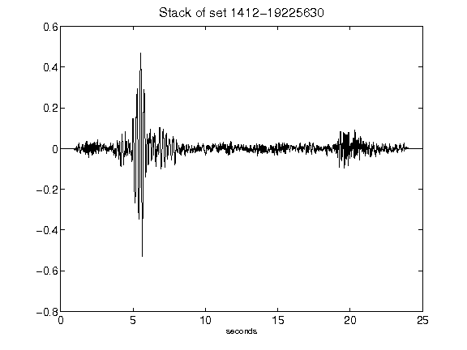](figures/1412-19225630_Stack.png)[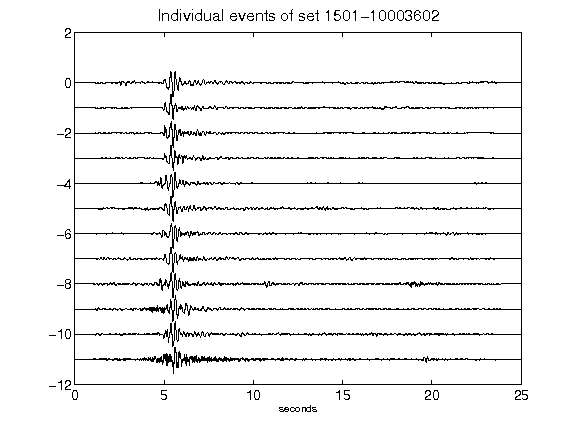](figures/1501-10003602_AllEv.png)[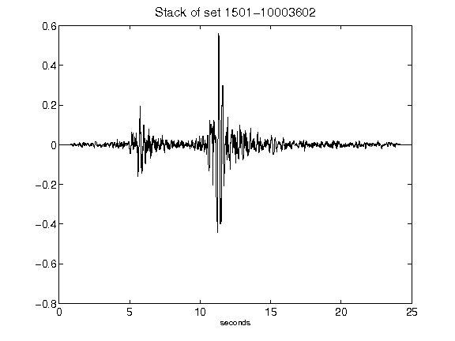](figures/1501-10003602_Stack.png)[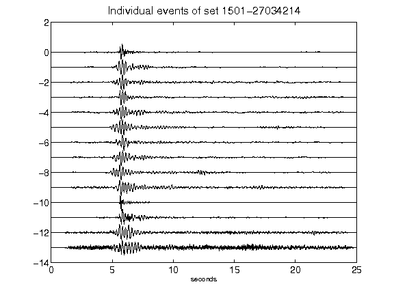](figures/1501-27034214_AllEv.png)[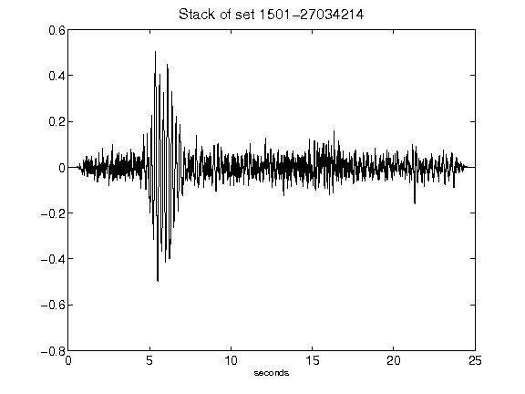](figures/1501-27034214_Stack.png)[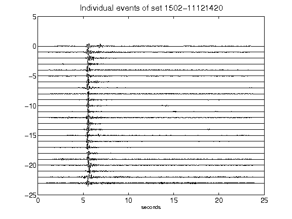](figures/1502-11121420_AllEv.png)[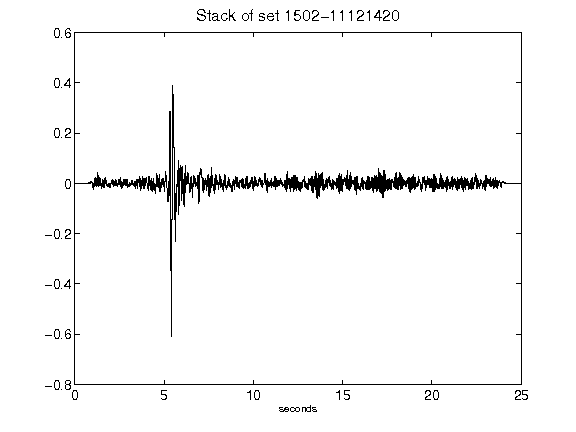](figures/1502-11121420_Stack.png)[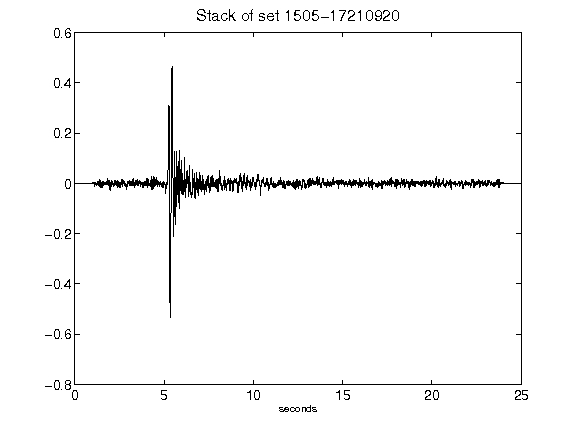](figures/1505-17210920_Stack.png)[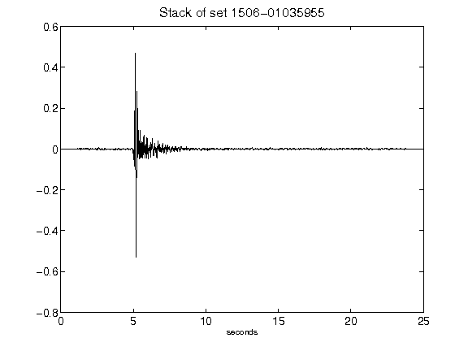](figures/1506-01035955_Stack.png)[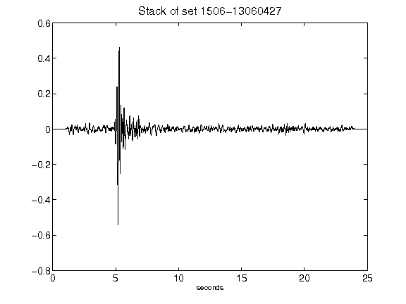](figures/1506-13060427_Stack.png)[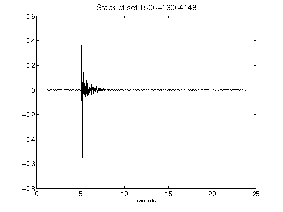](figures/1506-13064148_Stack.png)[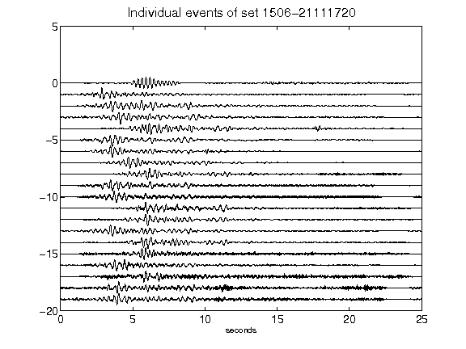](figures/1506-21111720_AllEv.png)[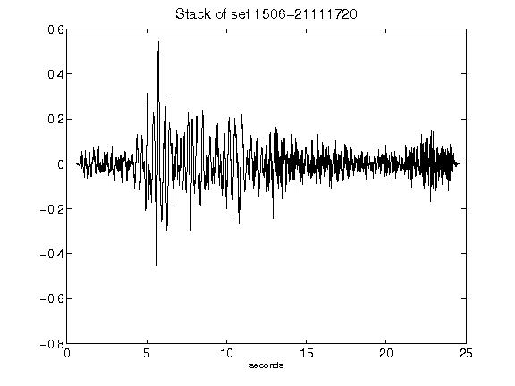](figures/1506-21111720_Stack.png)