# Repeating Earthquake Activity at RCM

## Waveforms
[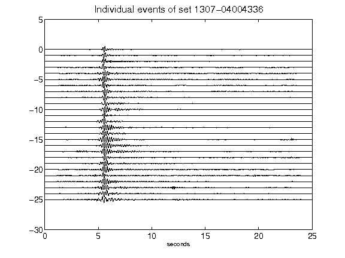](figures/1307-04004336_AllEv.png)[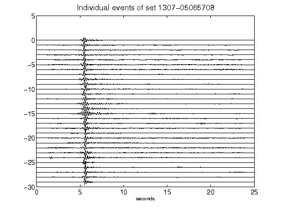](figures/1307-05065708_AllEv.png)[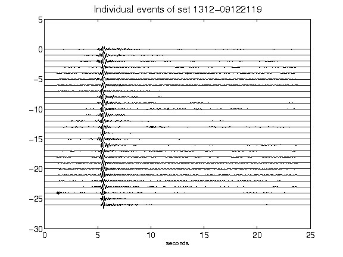](figures/1312-09122119_AllEv.png)[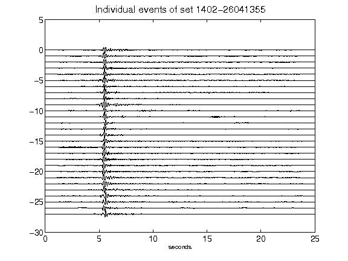](figures/1402-26041355_AllEv.png)[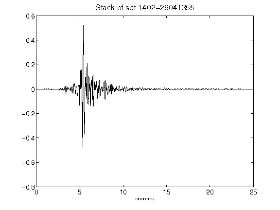](figures/1402-26041355_Stack.png)[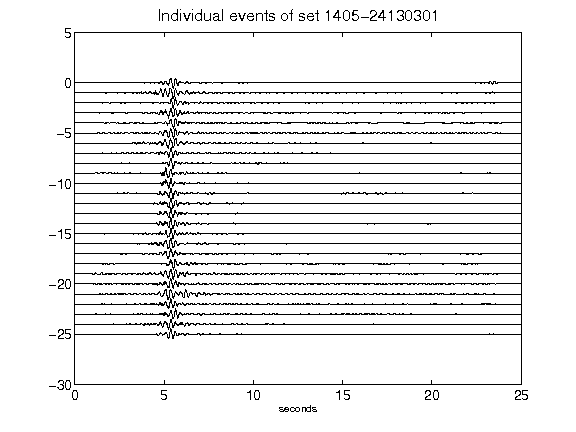](figures/1405-24130301_AllEv.png)[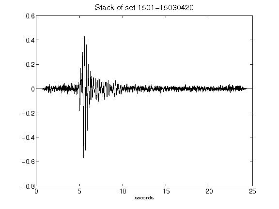](figures/1501-15030420_Stack.png)[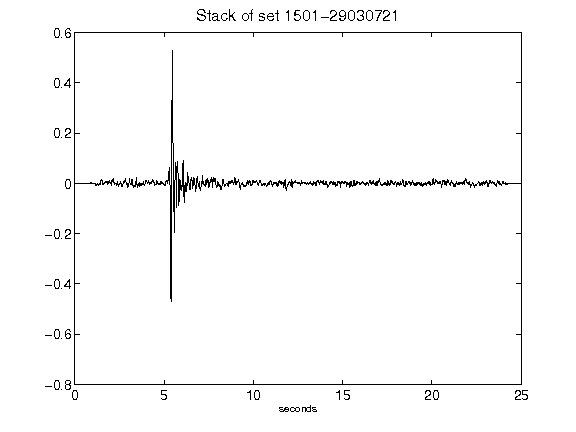](figures/1501-29030721_Stack.png)[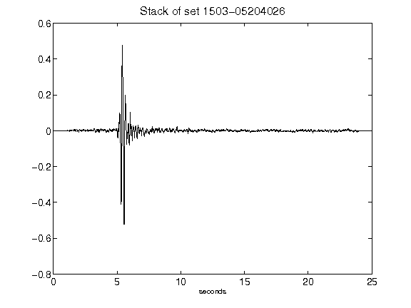](figures/1503-05204026_Stack.png)[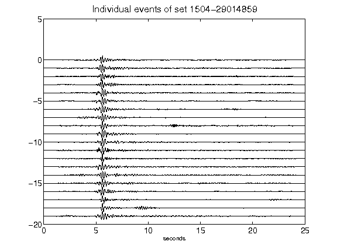](figures/1504-29014859_AllEv.png)[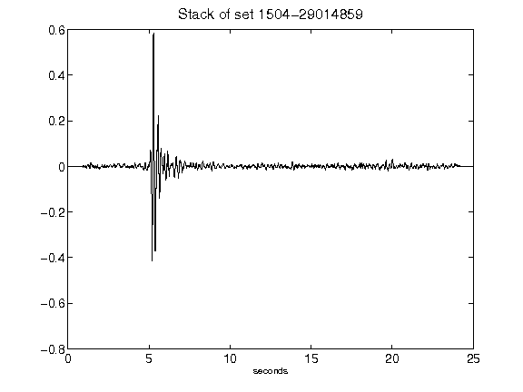](figures/1504-29014859_Stack.png)[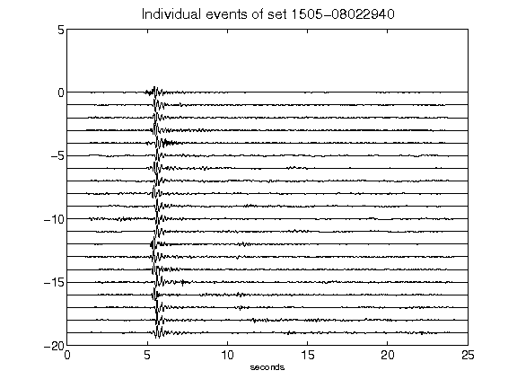](figures/1505-08022940_AllEv.png)[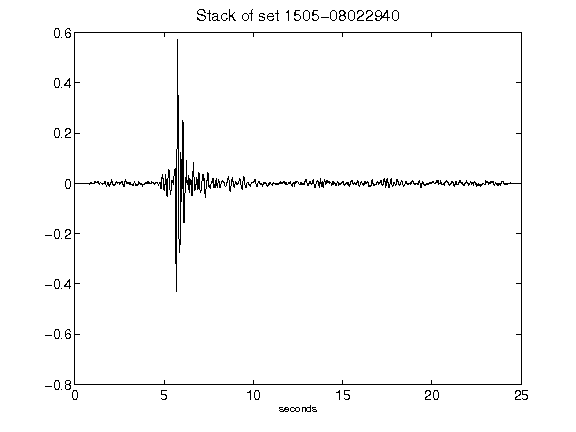](figures/1505-08022940_Stack.png)[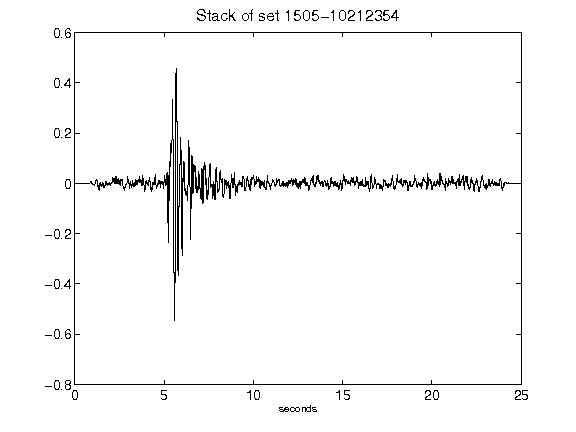](figures/1505-10212354_Stack.png)[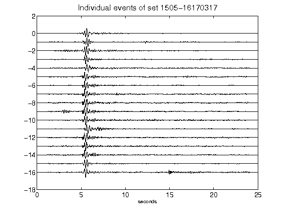](figures/1505-16170317_AllEv.png)[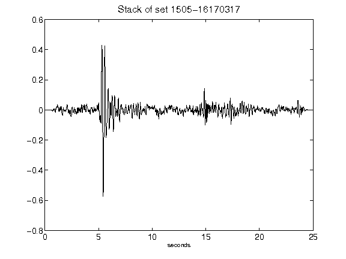](figures/1505-16170317_Stack.png)[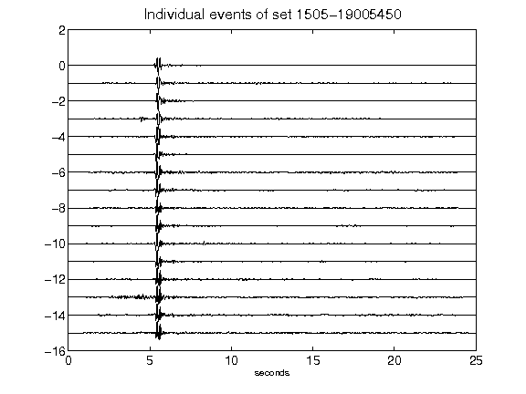](figures/1505-19005450_AllEv.png)[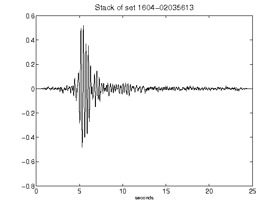](figures/1604-02035613_Stack.png)[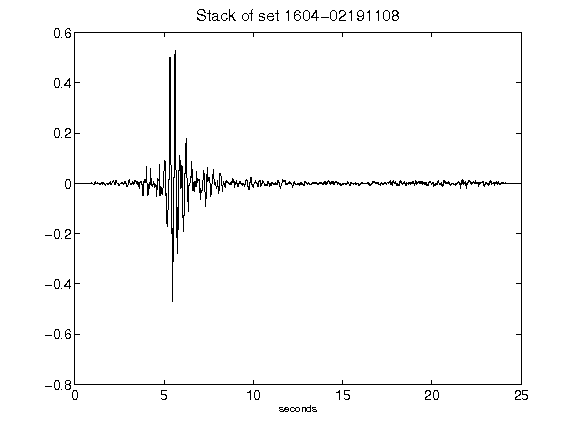](figures/1604-02191108_Stack.png)[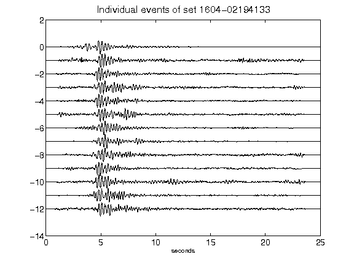](figures/1604-02194133_AllEv.png)[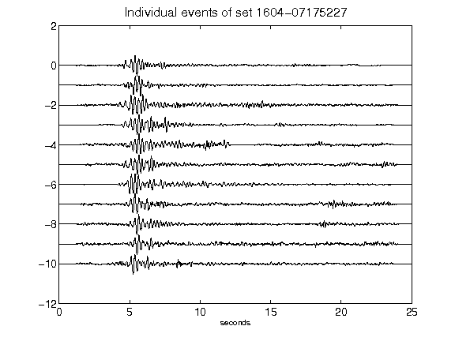](figures/1604-07175227_AllEv.png)[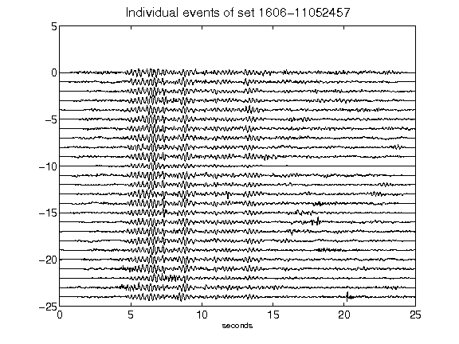](figures/1606-11052457_AllEv.png)[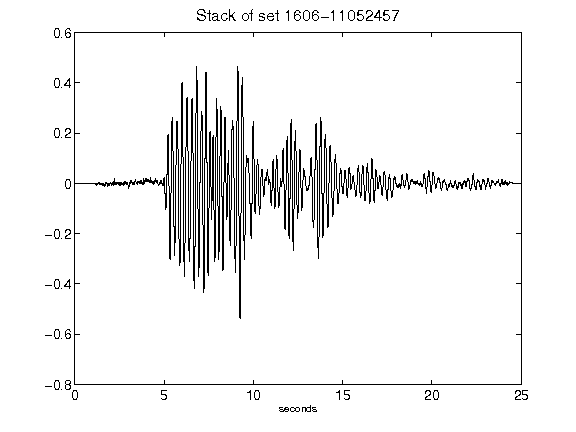](figures/1606-11052457_Stack.png)[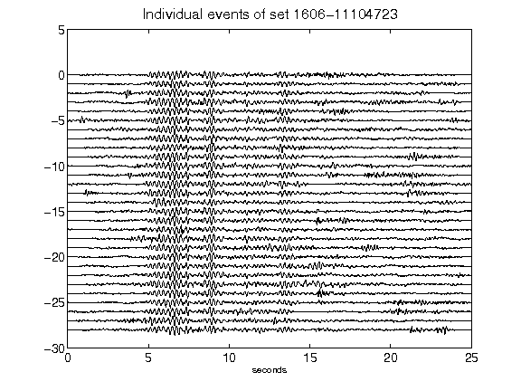](figures/1606-11104723_AllEv.png)