# Repeating Earthquake Activity at RCM

## Waveforms
[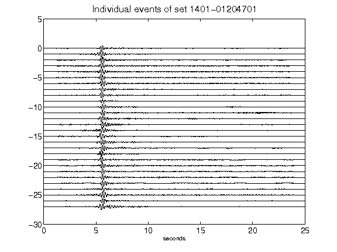](figures/1401-01204701_AllEv.png)[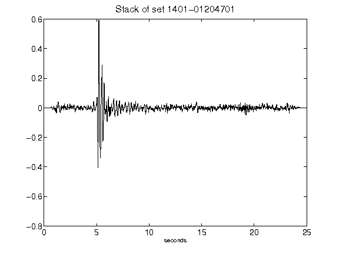](figures/1401-01204701_Stack.png)[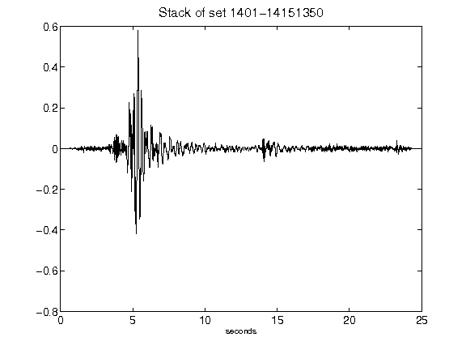](figures/1401-14151350_Stack.png)[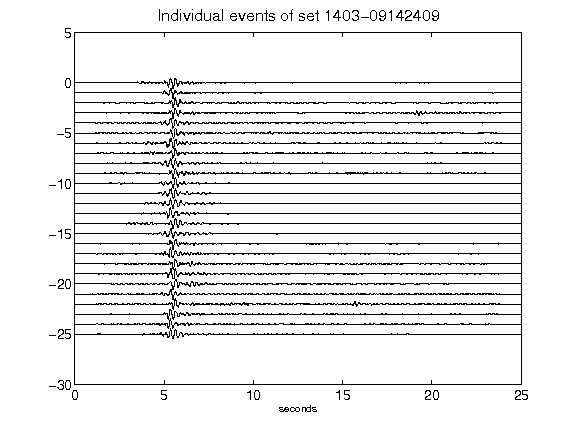](figures/1403-09142409_AllEv.png)[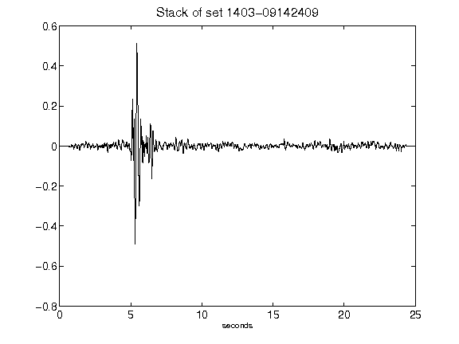](figures/1403-09142409_Stack.png)[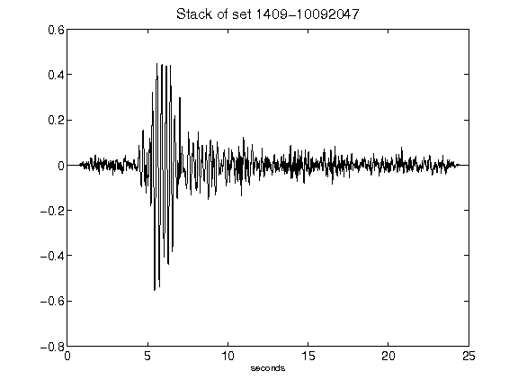](figures/1409-10092047_Stack.png)[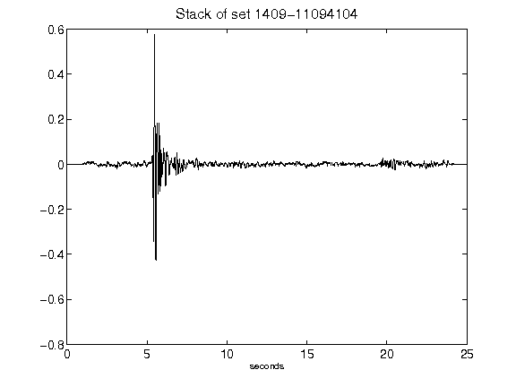](figures/1409-11094104_Stack.png)[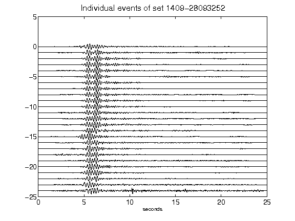](figures/1409-28093252_AllEv.png)[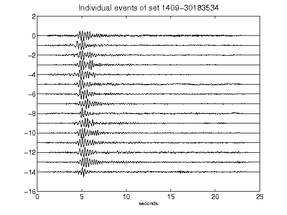](figures/1409-30183534_AllEv.png)[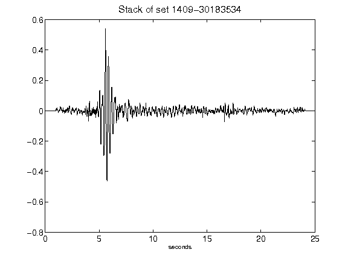](figures/1409-30183534_Stack.png)[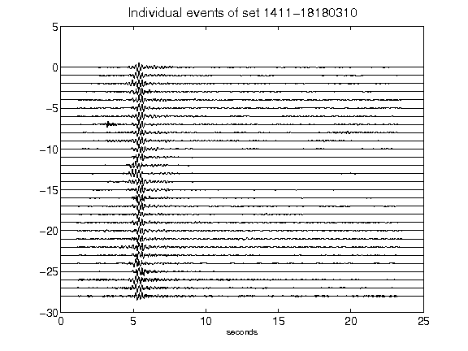](figures/1411-18180310_AllEv.png)[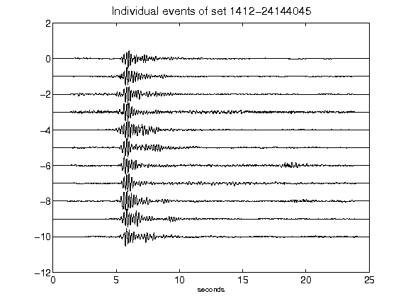](figures/1412-24144045_AllEv.png)[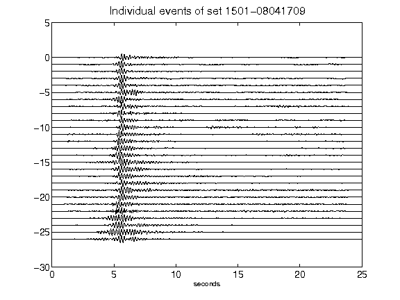](figures/1501-08041709_AllEv.png)[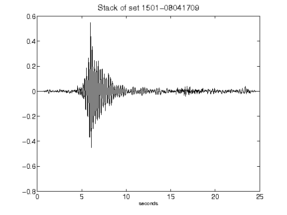](figures/1501-08041709_Stack.png)[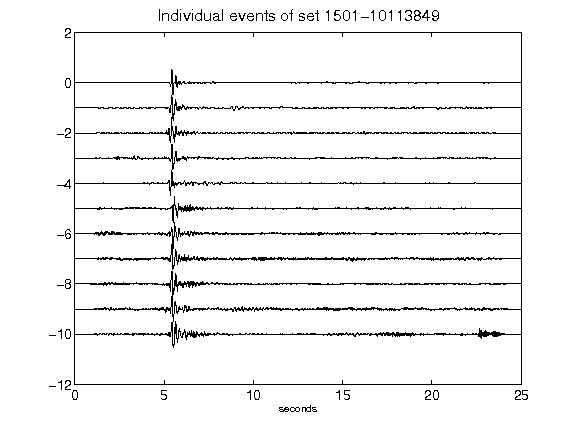](figures/1501-10113849_AllEv.png)[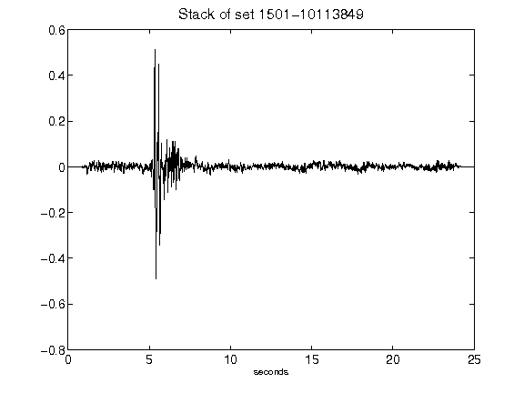](figures/1501-10113849_Stack.png)[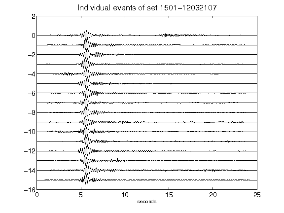](figures/1501-12032107_AllEv.png)[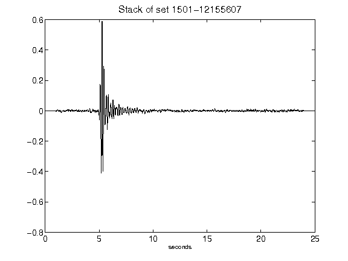](figures/1501-12155607_Stack.png)[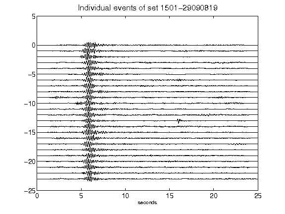](figures/1501-29090819_AllEv.png)[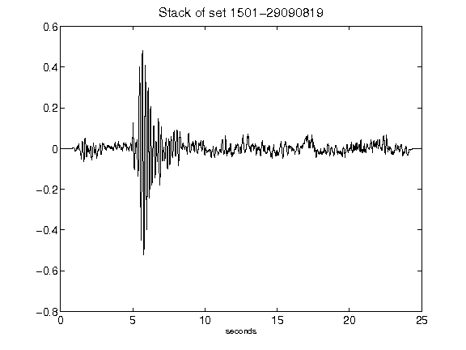](figures/1501-29090819_Stack.png)[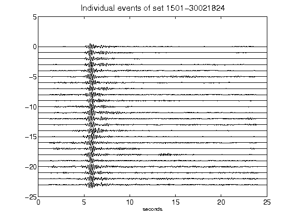](figures/1501-30021824_AllEv.png)[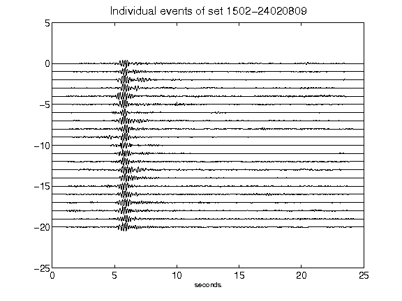](figures/1502-24020809_AllEv.png)[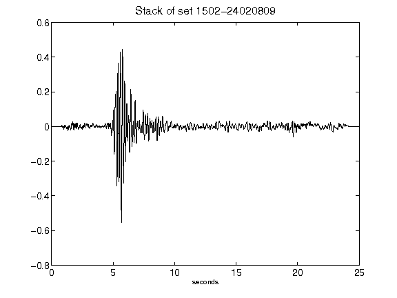](figures/1502-24020809_Stack.png)[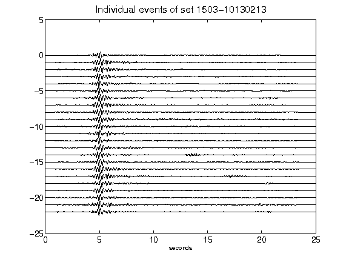](figures/1503-10130213_AllEv.png)[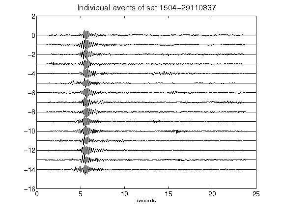](figures/1504-29110837_AllEv.png)[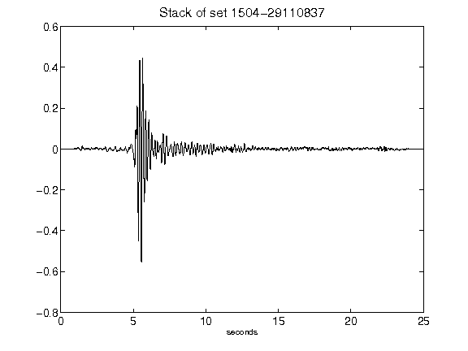](figures/1504-29110837_Stack.png)[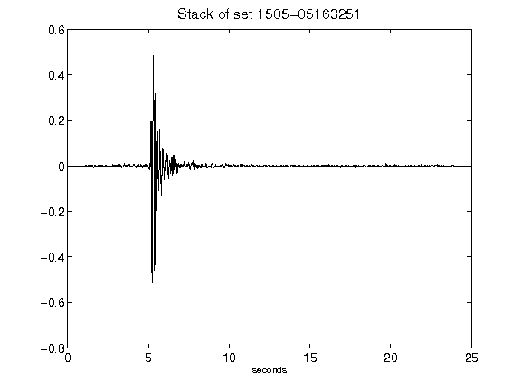](figures/1505-05163251_Stack.png)