# Repeating Earthquake Activity at RCM

## Waveforms
[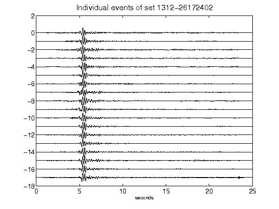](figures/1312-26172402_AllEv.png)[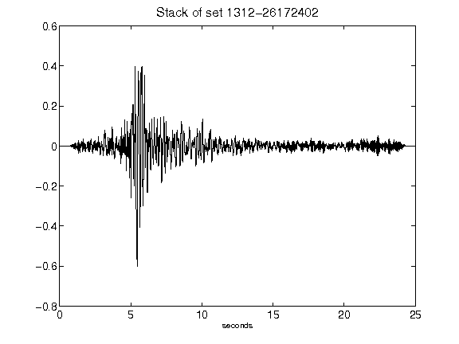](figures/1312-26172402_Stack.png)[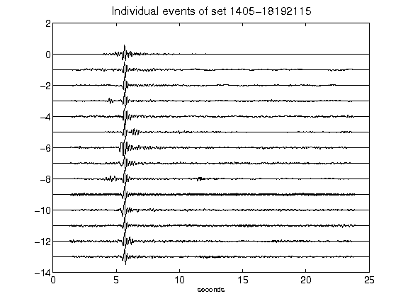](figures/1405-18192115_AllEv.png)[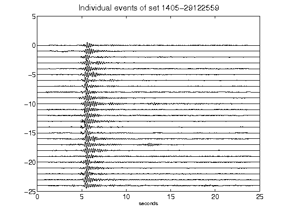](figures/1405-29122559_AllEv.png)[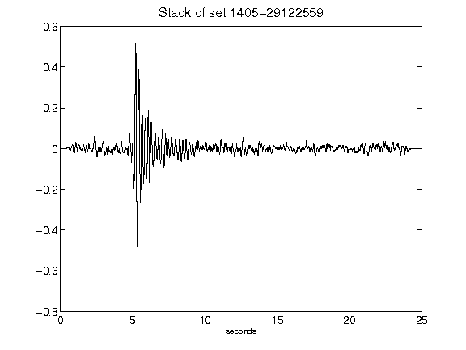](figures/1405-29122559_Stack.png)[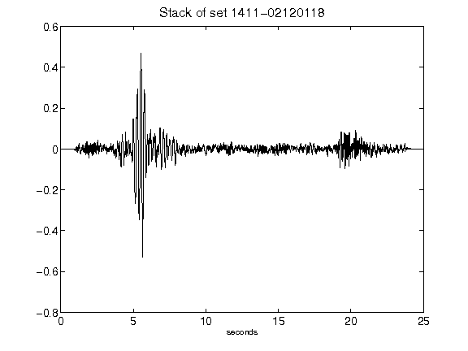](figures/1411-02120118_Stack.png)[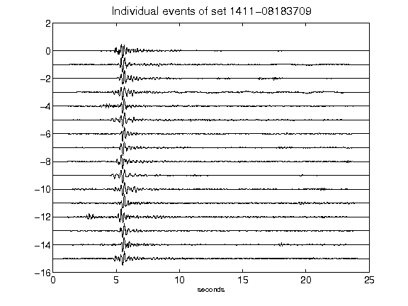](figures/1411-08183709_AllEv.png)[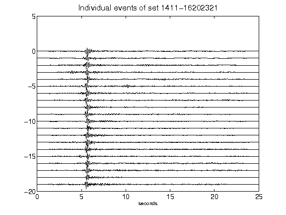](figures/1411-16202321_AllEv.png)[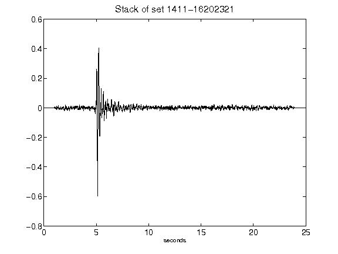](figures/1411-16202321_Stack.png)[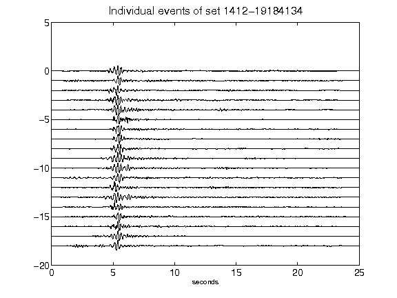](figures/1412-19184134_AllEv.png)[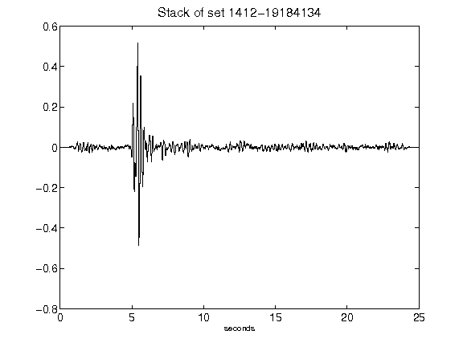](figures/1412-19184134_Stack.png)[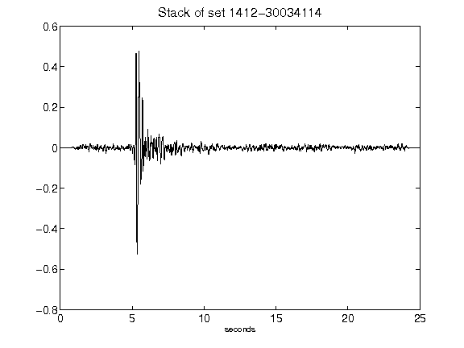](figures/1412-30034114_Stack.png)[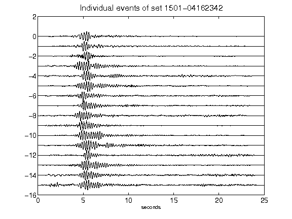](figures/1501-04162342_AllEv.png)[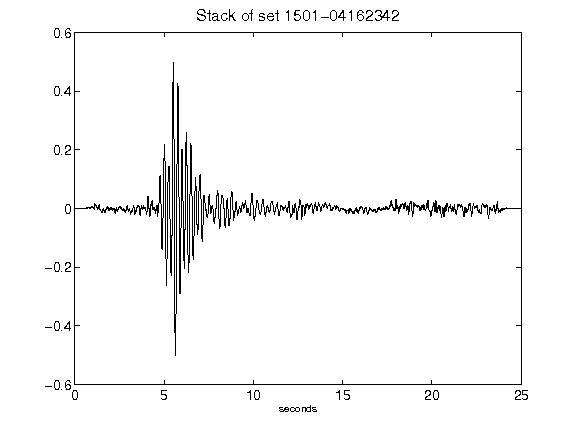](figures/1501-04162342_Stack.png)[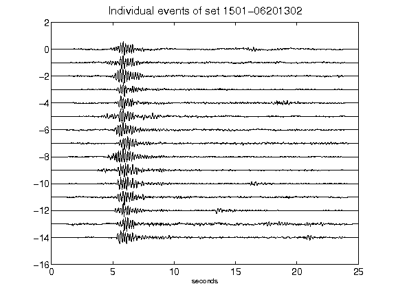](figures/1501-06201302_AllEv.png)[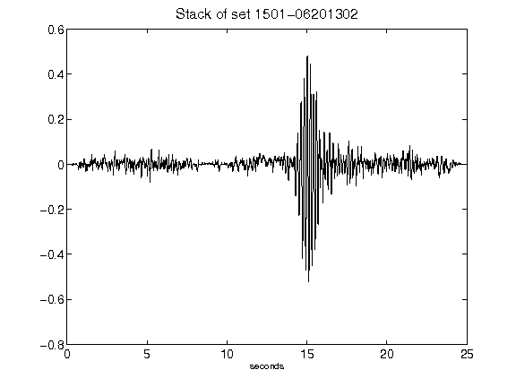](figures/1501-06201302_Stack.png)[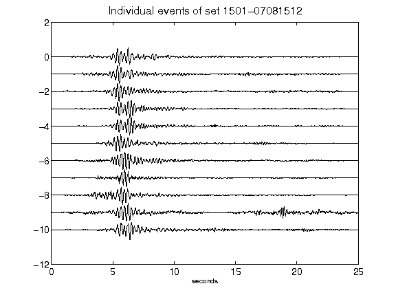](figures/1501-07081512_AllEv.png)[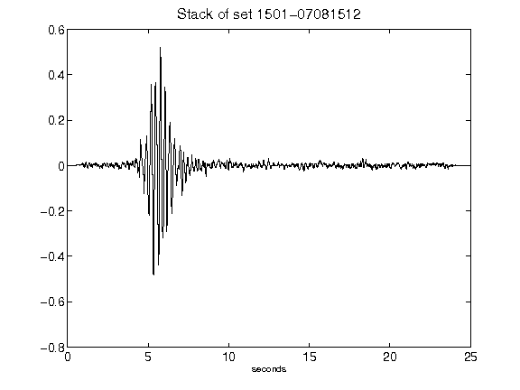](figures/1501-07081512_Stack.png)[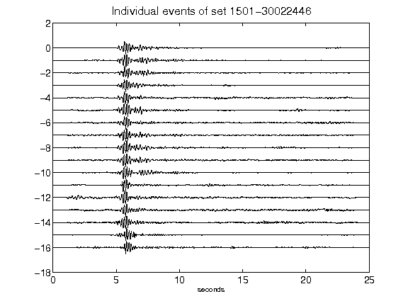](figures/1501-30022446_AllEv.png)[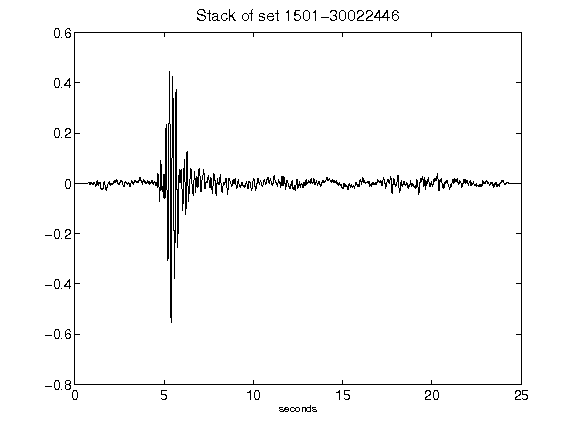](figures/1501-30022446_Stack.png)[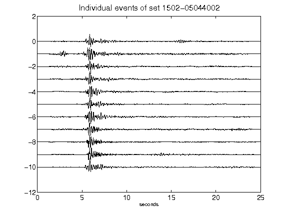](figures/1502-05044002_AllEv.png)[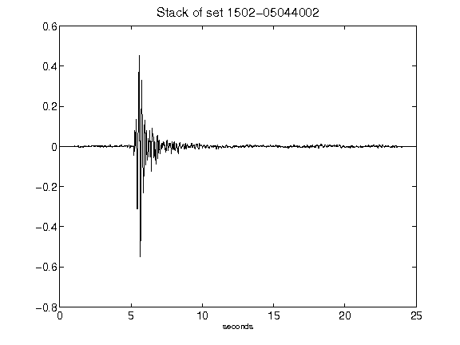](figures/1502-05044002_Stack.png)[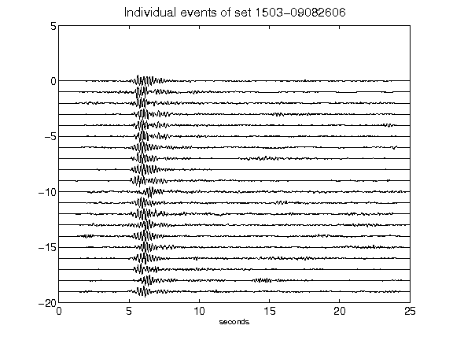](figures/1503-09082606_AllEv.png)[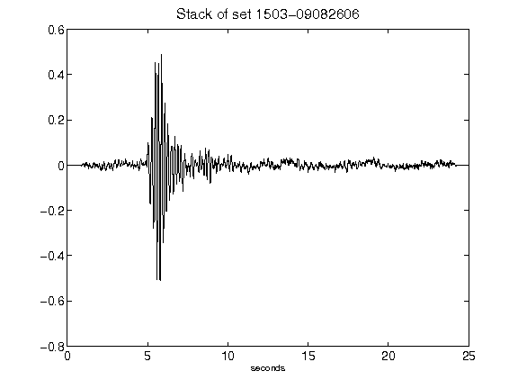](figures/1503-09082606_Stack.png)[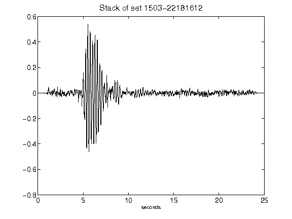](figures/1503-22181612_Stack.png)