# Repeating Earthquake Activity at RCM

## Waveforms
[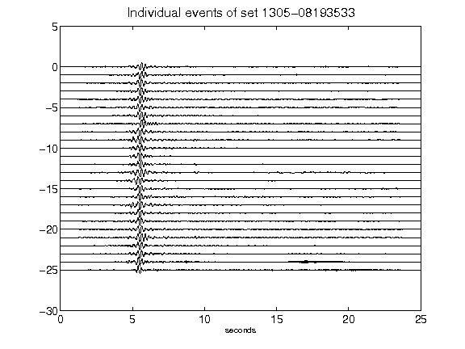](figures/1305-08193533_AllEv.png)[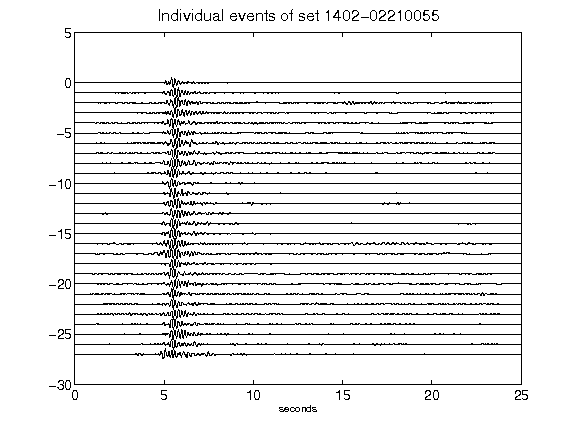](figures/1402-02210055_AllEv.png)[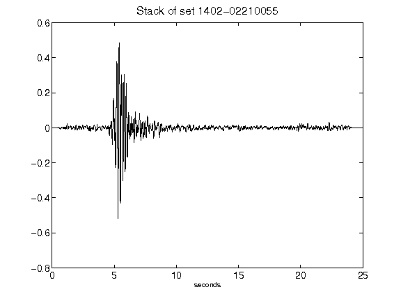](figures/1402-02210055_Stack.png)[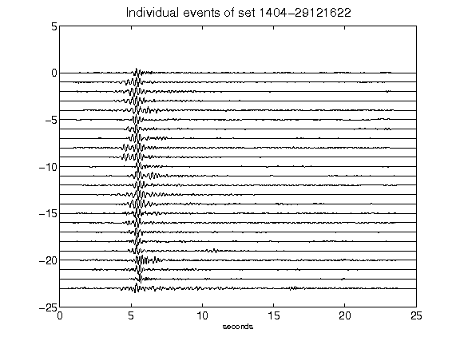](figures/1404-29121622_AllEv.png)[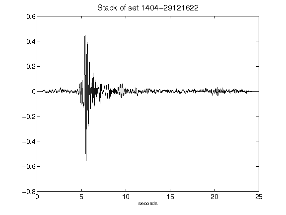](figures/1404-29121622_Stack.png)[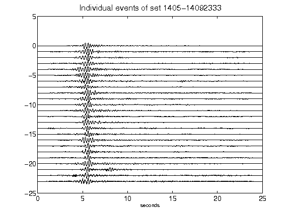](figures/1405-14092333_AllEv.png)[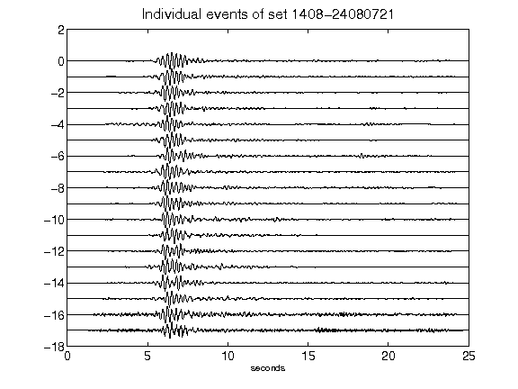](figures/1408-24080721_AllEv.png)[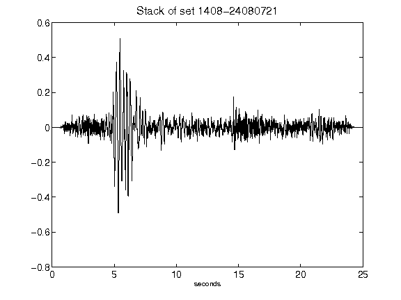](figures/1408-24080721_Stack.png)[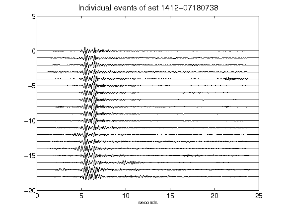](figures/1412-07180738_AllEv.png)[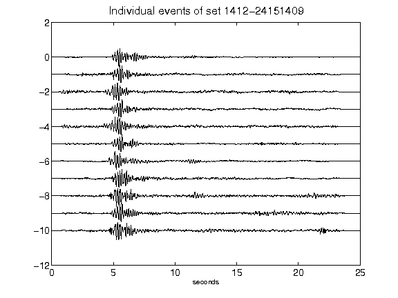](figures/1412-24151409_AllEv.png)[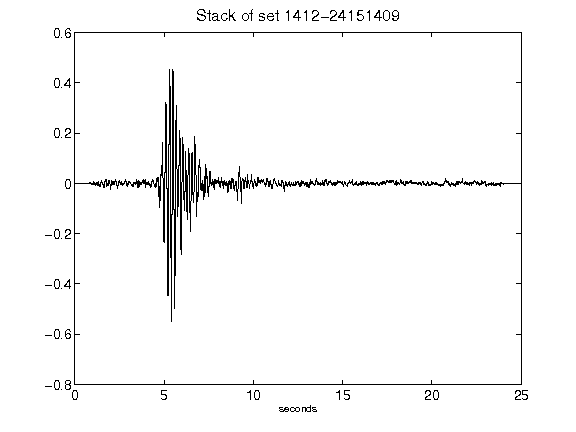](figures/1412-24151409_Stack.png)[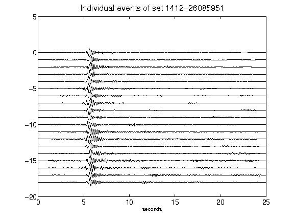](figures/1412-26085951_AllEv.png)[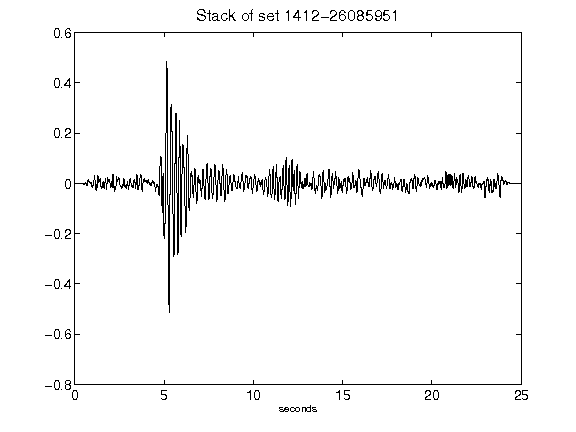](figures/1412-26085951_Stack.png)[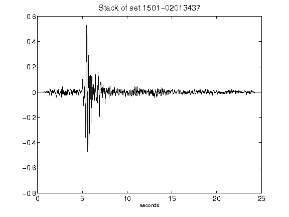](figures/1501-02013437_Stack.png)[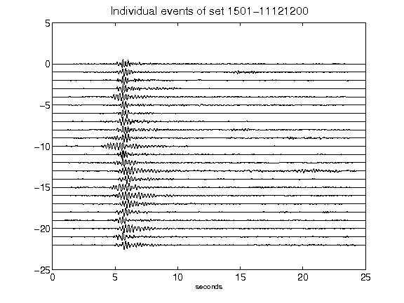](figures/1501-11121200_AllEv.png)[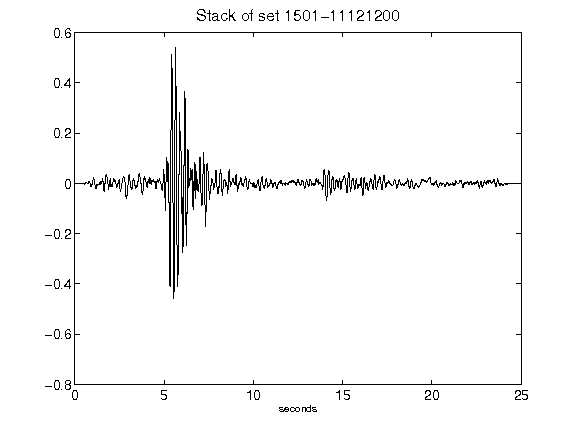](figures/1501-11121200_Stack.png)[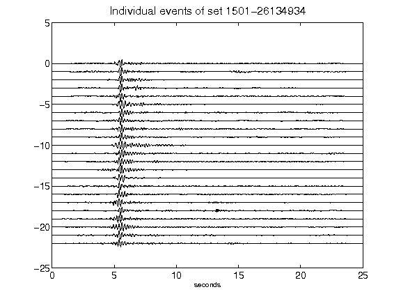](figures/1501-26134934_AllEv.png)[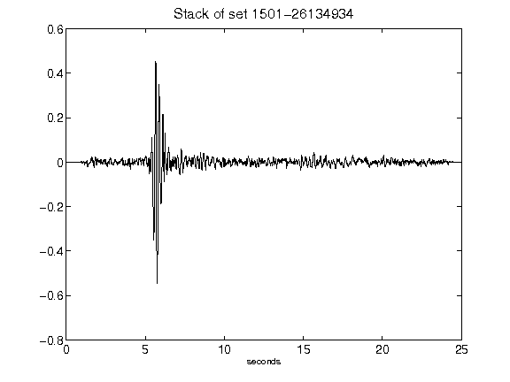](figures/1501-26134934_Stack.png)[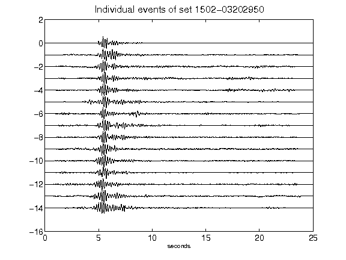](figures/1502-03202950_AllEv.png)[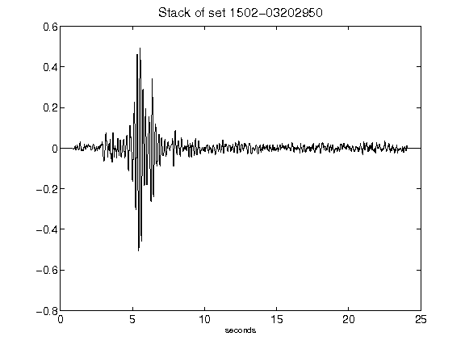](figures/1502-03202950_Stack.png)[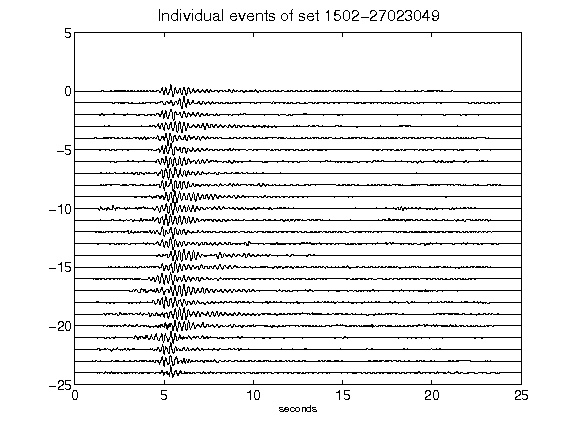](figures/1502-27023049_AllEv.png)[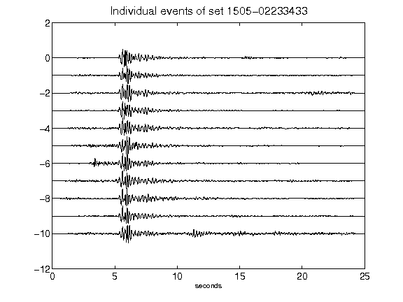](figures/1505-02233433_AllEv.png)