# Repeating Earthquake Activity at RCM

## Waveforms
[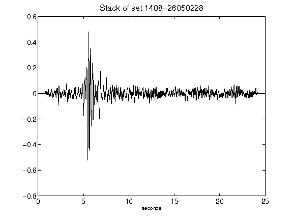](figures/1408-26050228_Stack.png)[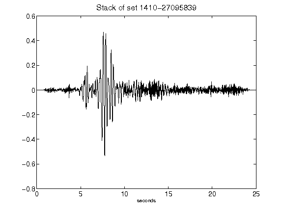](figures/1410-27095839_Stack.png)[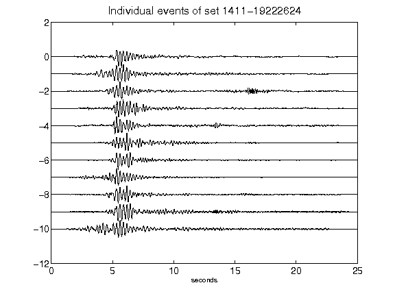](figures/1411-19222624_AllEv.png)[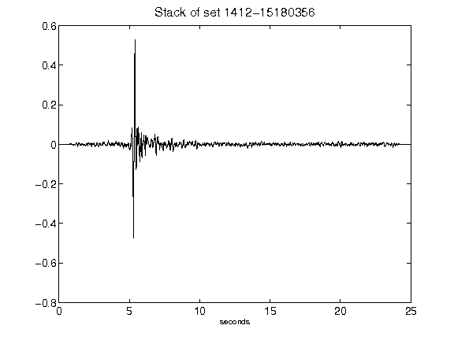](figures/1412-15180356_Stack.png)[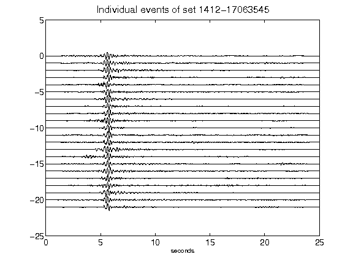](figures/1412-17063545_AllEv.png)[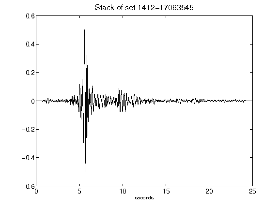](figures/1412-17063545_Stack.png)[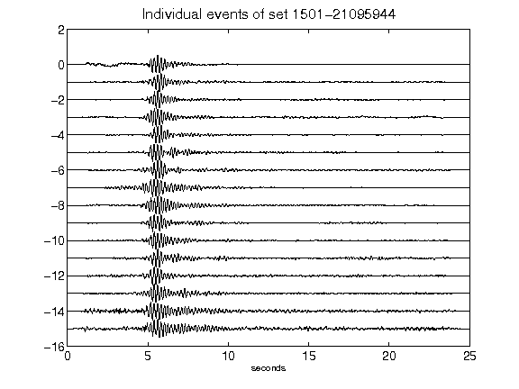](figures/1501-21095944_AllEv.png)[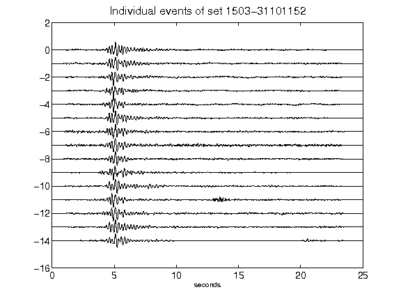](figures/1503-31101152_AllEv.png)[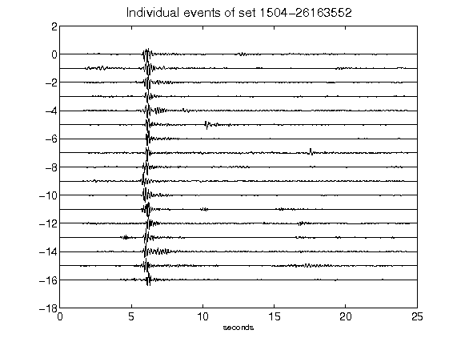](figures/1504-26163552_AllEv.png)[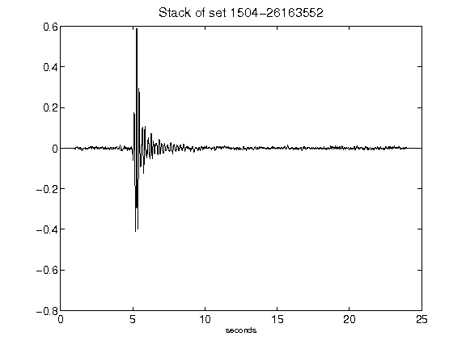](figures/1504-26163552_Stack.png)[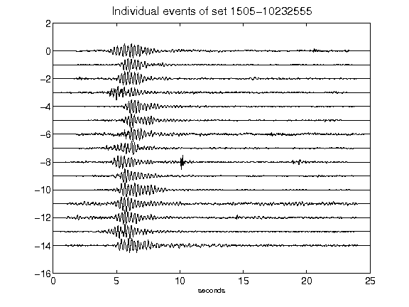](figures/1505-10232555_AllEv.png)[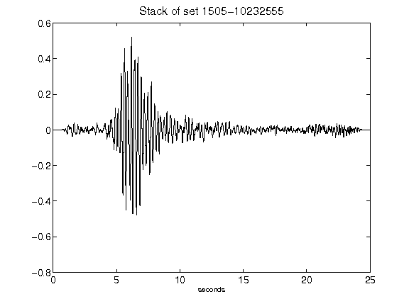](figures/1505-10232555_Stack.png)[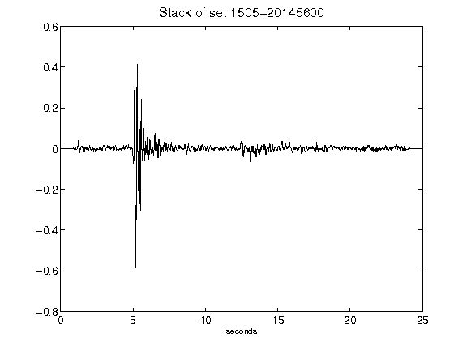](figures/1505-20145600_Stack.png)[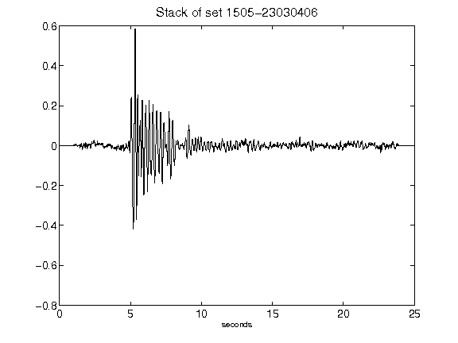](figures/1505-23030406_Stack.png)