# Repeating Earthquake Activity at RCM

## Waveforms
[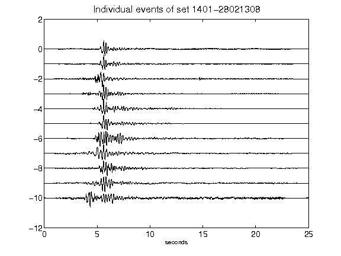](figures/1401-28021308_AllEv.png)[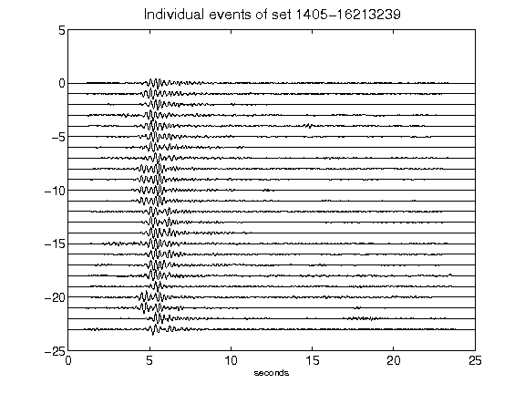](figures/1405-16213239_AllEv.png)[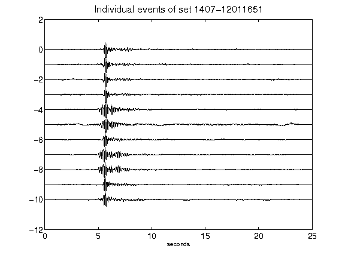](figures/1407-12011651_AllEv.png)[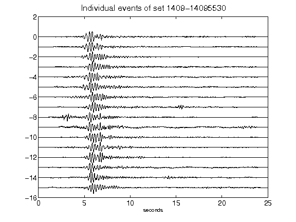](figures/1409-14095530_AllEv.png)[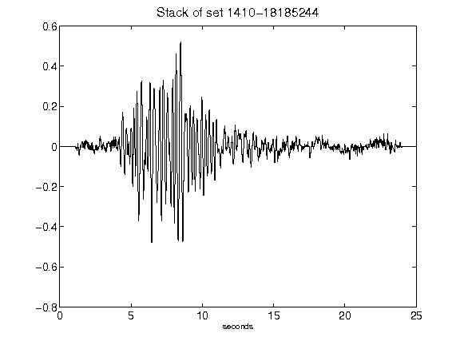](figures/1410-18185244_Stack.png)[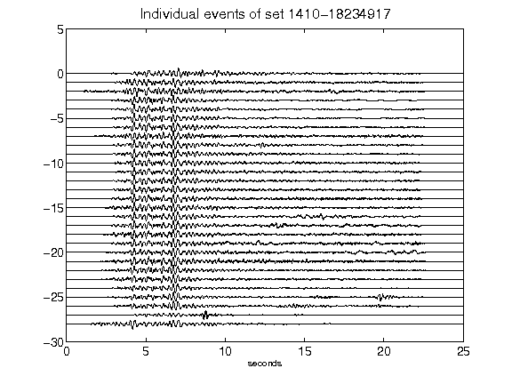](figures/1410-18234917_AllEv.png)[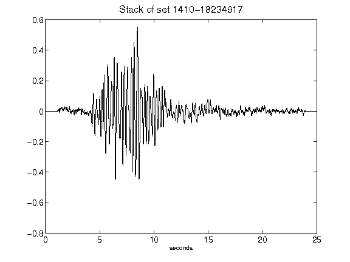](figures/1410-18234917_Stack.png)[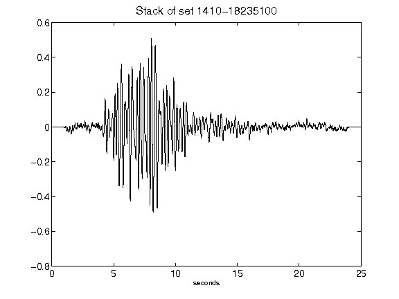](figures/1410-18235100_Stack.png)[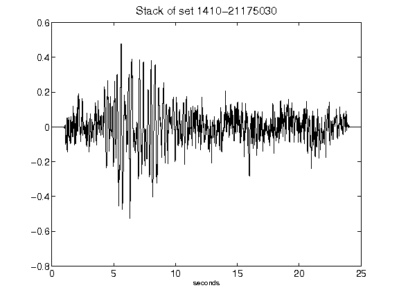](figures/1410-21175030_Stack.png)[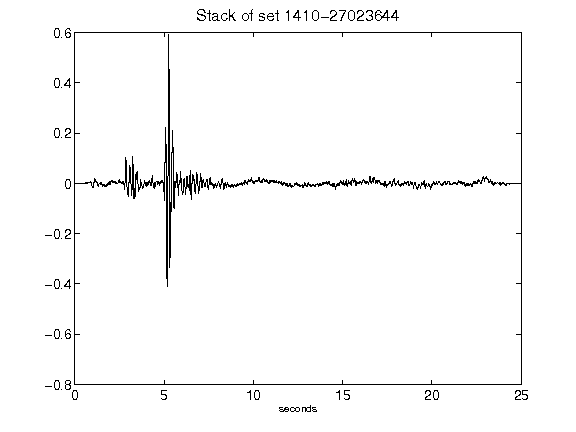](figures/1410-27023644_Stack.png)[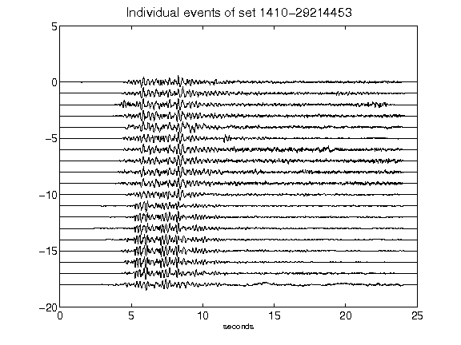](figures/1410-29214453_AllEv.png)[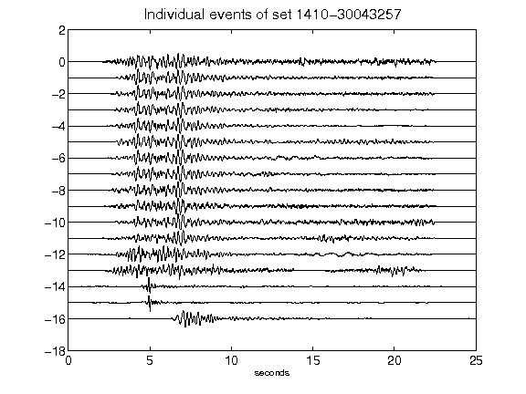](figures/1410-30043257_AllEv.png)[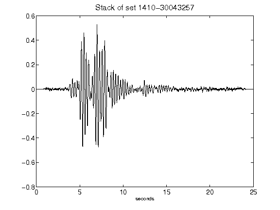](figures/1410-30043257_Stack.png)[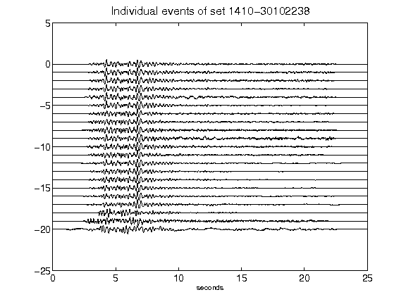](figures/1410-30102238_AllEv.png)[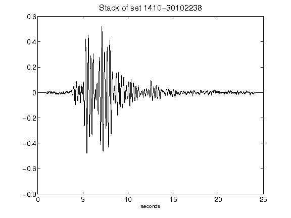](figures/1410-30102238_Stack.png)[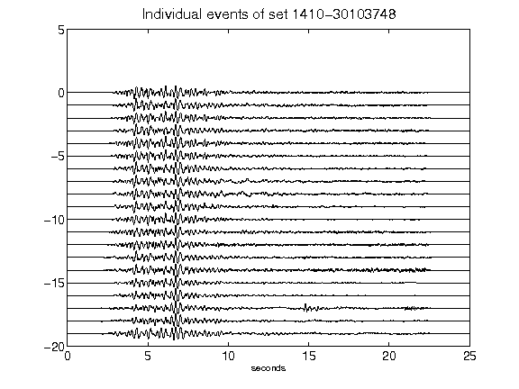](figures/1410-30103748_AllEv.png)[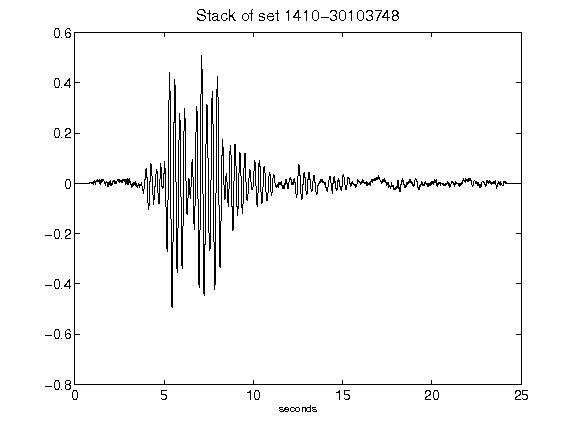](figures/1410-30103748_Stack.png)[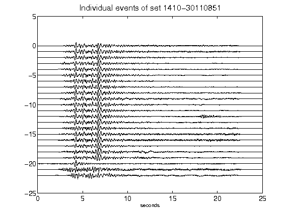](figures/1410-30110851_AllEv.png)[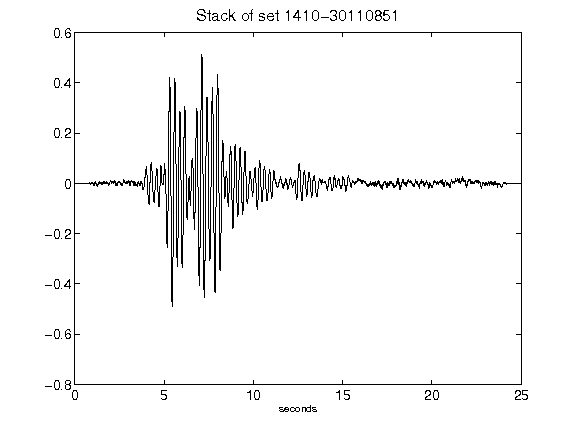](figures/1410-30110851_Stack.png)[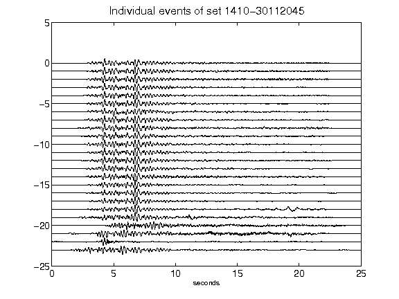](figures/1410-30112045_AllEv.png)[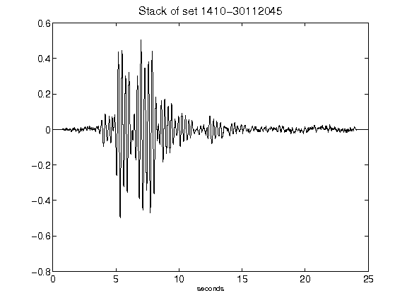](figures/1410-30112045_Stack.png)[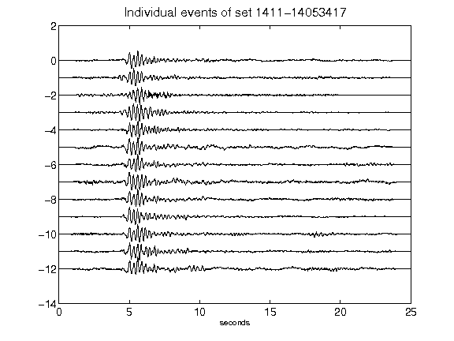](figures/1411-14053417_AllEv.png)[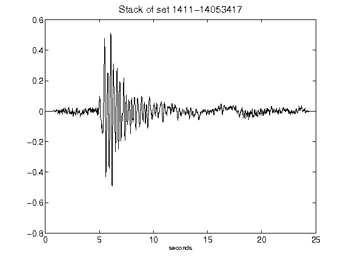](figures/1411-14053417_Stack.png)[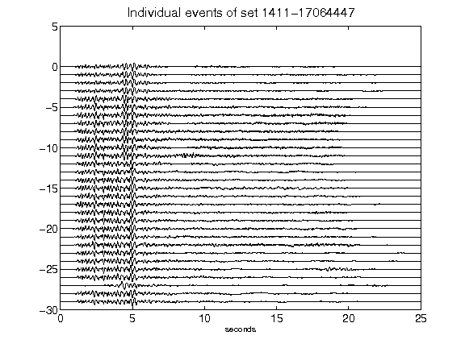](figures/1411-17064447_AllEv.png)[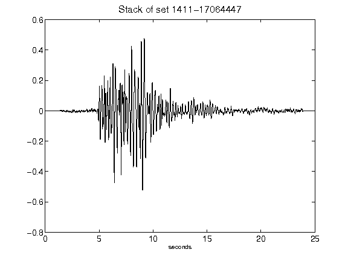](figures/1411-17064447_Stack.png)[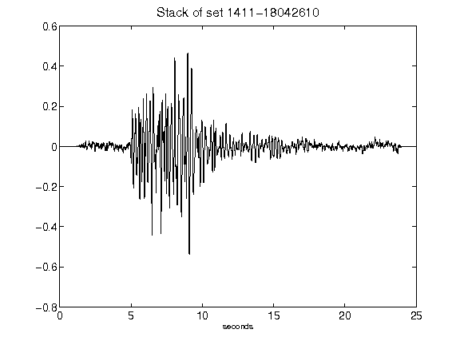](figures/1411-18042610_Stack.png)[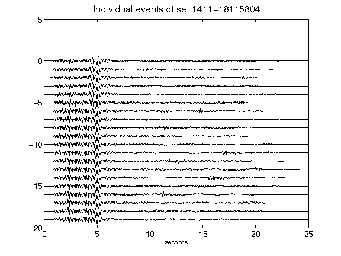](figures/1411-18115804_AllEv.png)