# Repeating Earthquake Activity at RCM

## Waveforms
[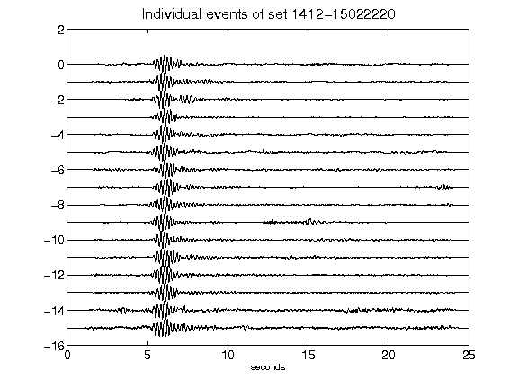](figures/1412-15022220_AllEv.png)[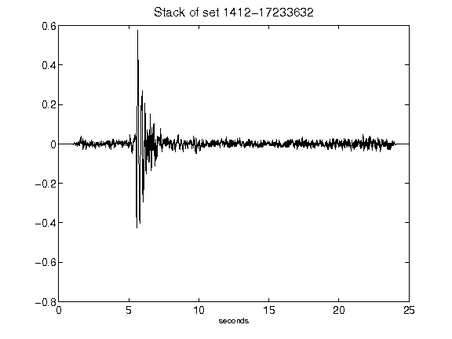](figures/1412-17233632_Stack.png)[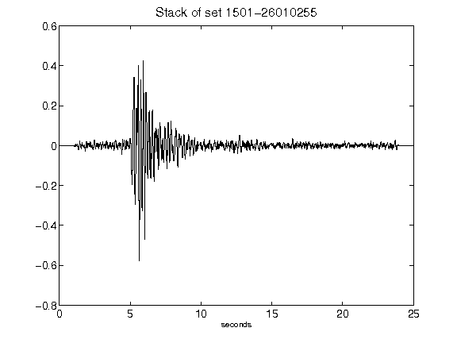](figures/1501-26010255_Stack.png)[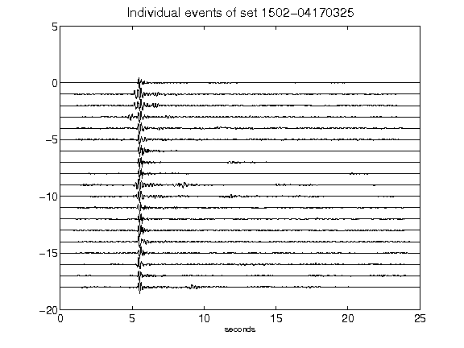](figures/1502-04170325_AllEv.png)[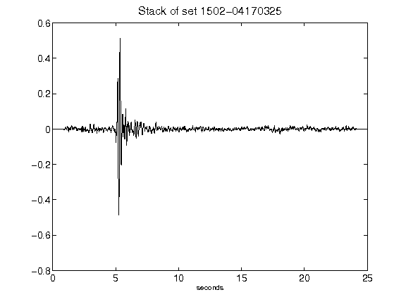](figures/1502-04170325_Stack.png)[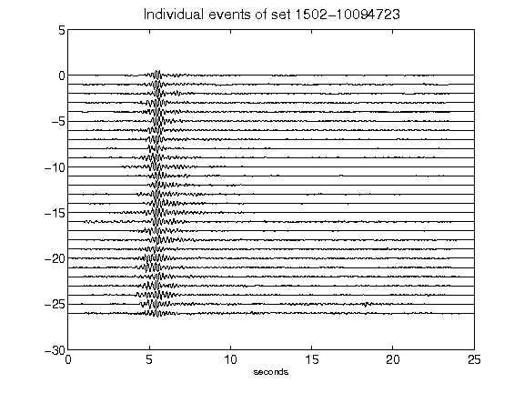](figures/1502-10094723_AllEv.png)[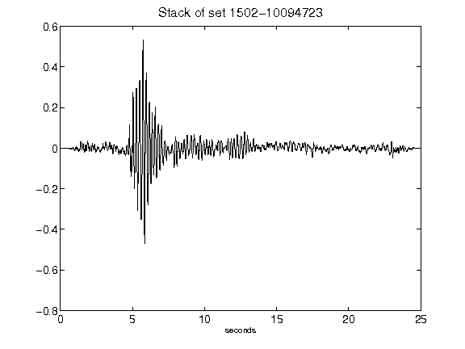](figures/1502-10094723_Stack.png)[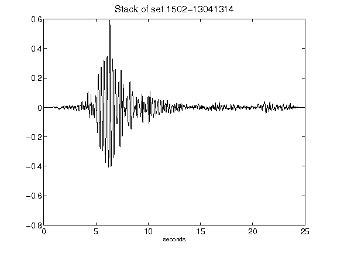](figures/1502-13041314_Stack.png)[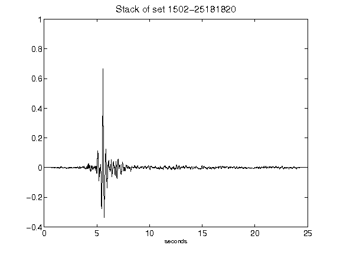](figures/1502-25181820_Stack.png)[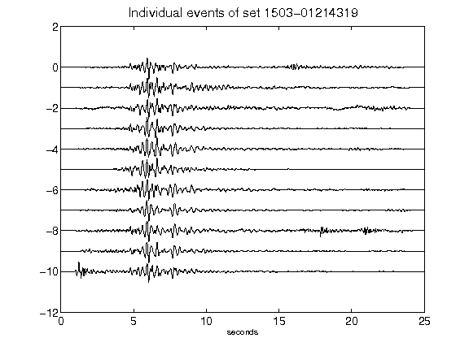](figures/1503-01214319_AllEv.png)[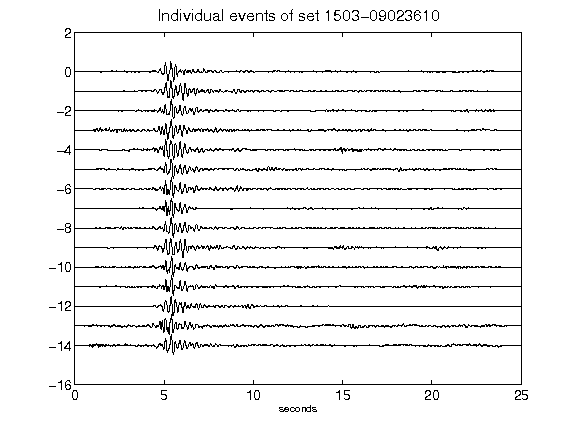](figures/1503-09023610_AllEv.png)[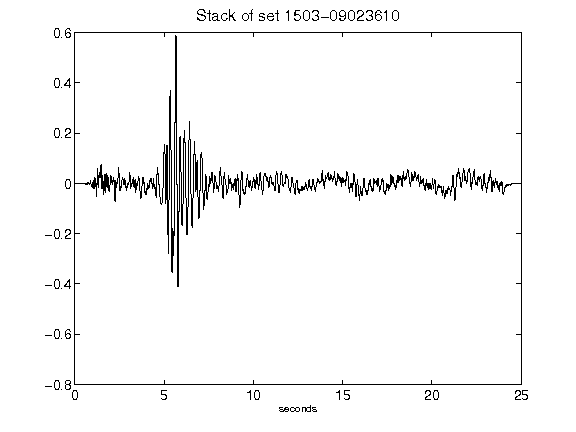](figures/1503-09023610_Stack.png)[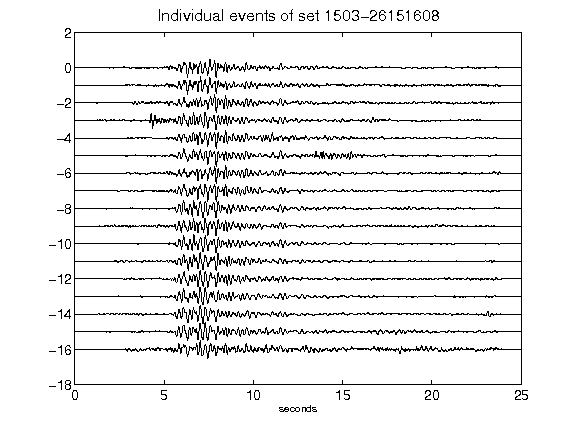](figures/1503-26151608_AllEv.png)