# Repeating Earthquake Activity at RCM

## Waveforms
[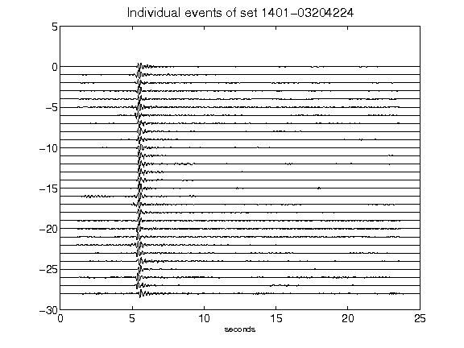](figures/1401-03204224_AllEv.png)[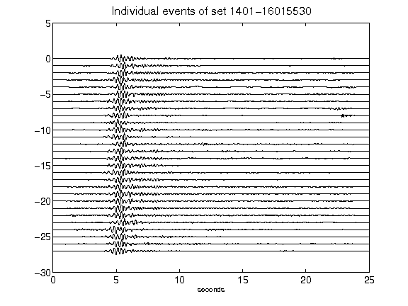](figures/1401-16015530_AllEv.png)[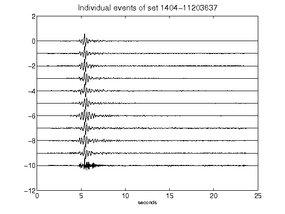](figures/1404-11203637_AllEv.png)[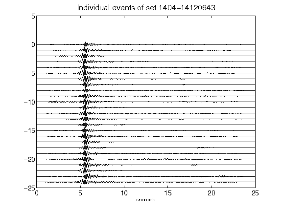](figures/1404-14120643_AllEv.png)[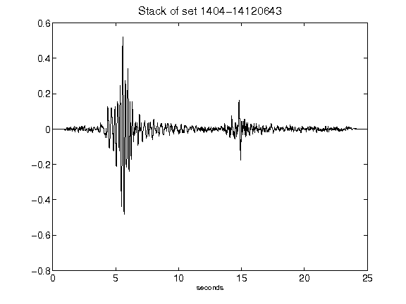](figures/1404-14120643_Stack.png)[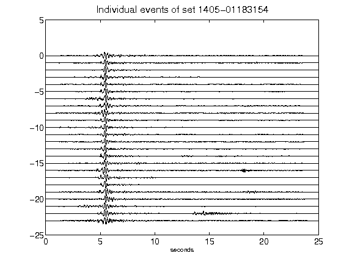](figures/1405-01183154_AllEv.png)[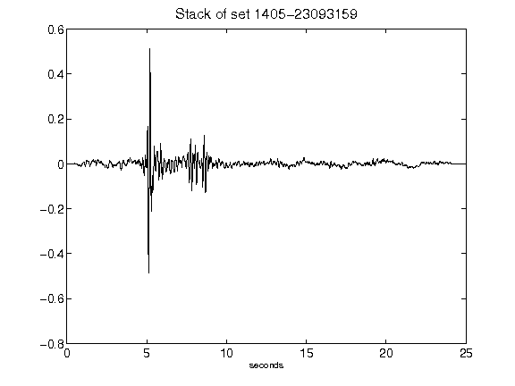](figures/1405-23093159_Stack.png)[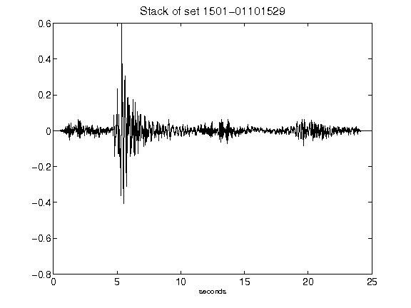](figures/1501-01101529_Stack.png)[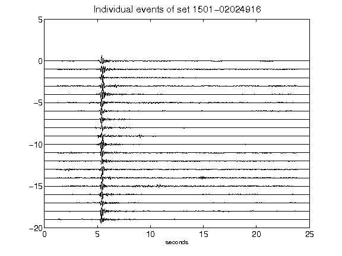](figures/1501-02024916_AllEv.png)[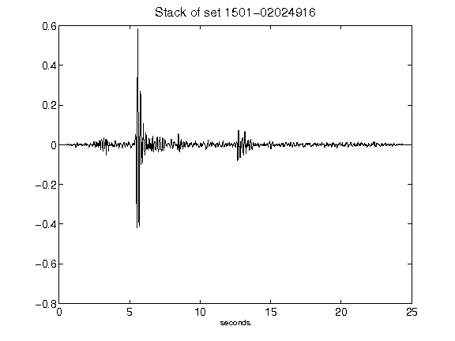](figures/1501-02024916_Stack.png)[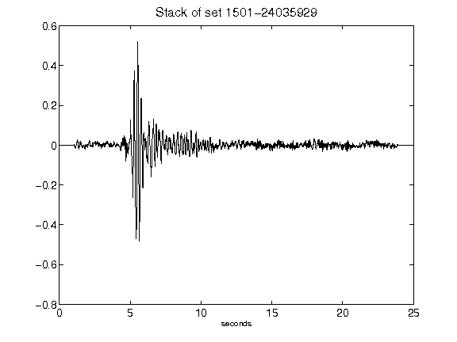](figures/1501-24035929_Stack.png)[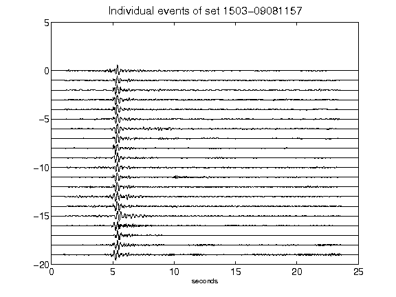](figures/1503-09081157_AllEv.png)[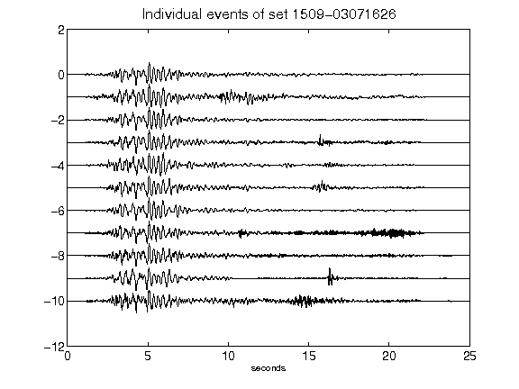](figures/1509-03071626_AllEv.png)[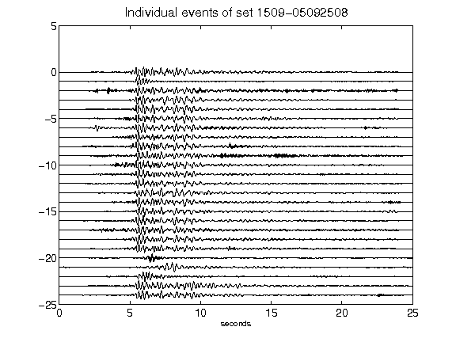](figures/1509-05092508_AllEv.png)[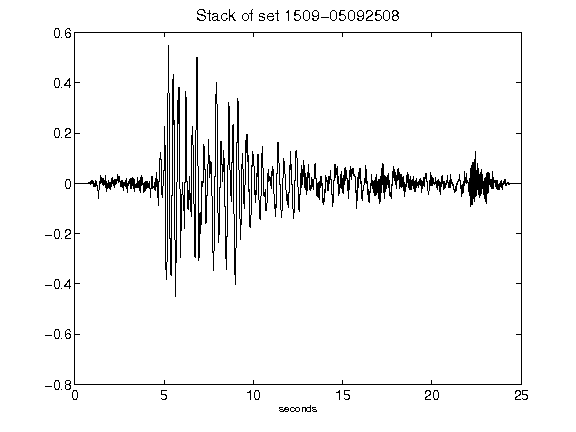](figures/1509-05092508_Stack.png)[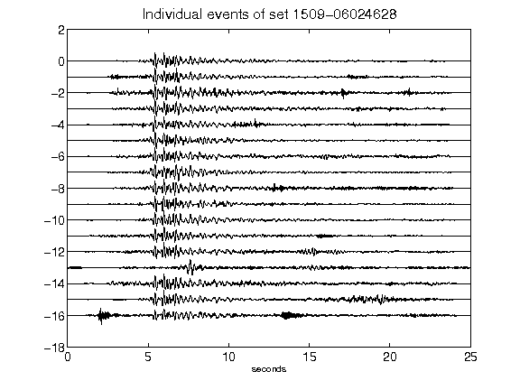](figures/1509-06024628_AllEv.png)