# Repeating Earthquake Activity at RCM

## Waveforms
[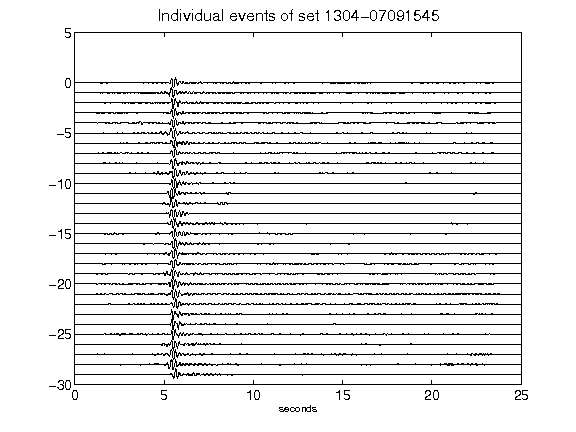](figures/1304-07091545_AllEv.png)[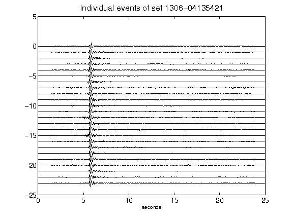](figures/1306-04135421_AllEv.png)[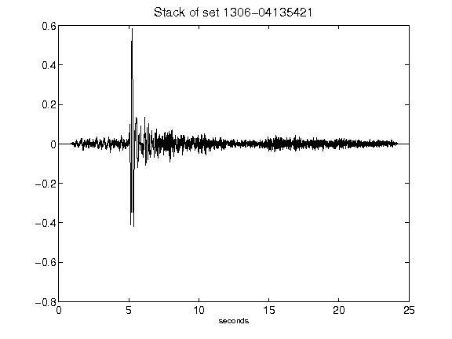](figures/1306-04135421_Stack.png)[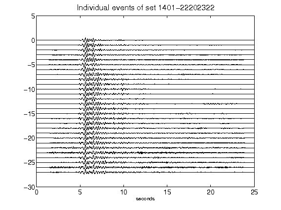](figures/1401-22202322_AllEv.png)[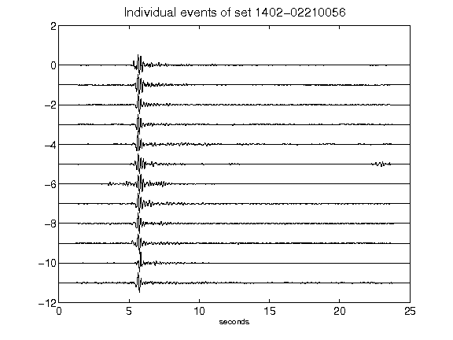](figures/1402-02210056_AllEv.png)[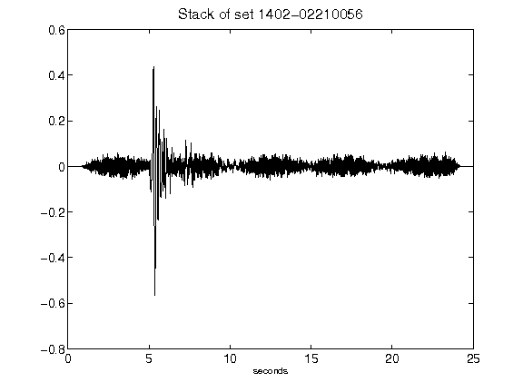](figures/1402-02210056_Stack.png)[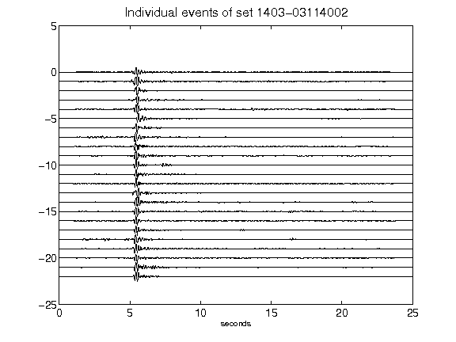](figures/1403-03114002_AllEv.png)[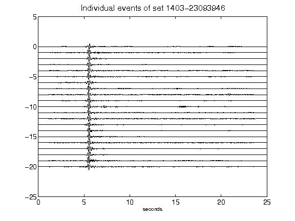](figures/1403-23093946_AllEv.png)[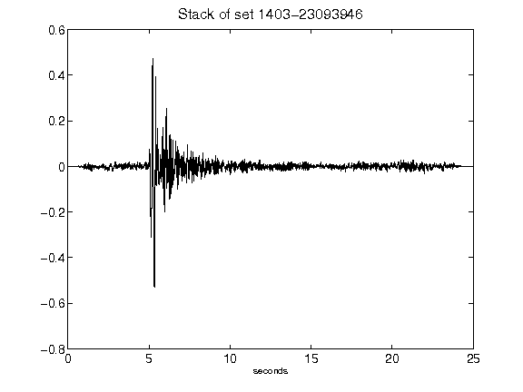](figures/1403-23093946_Stack.png)[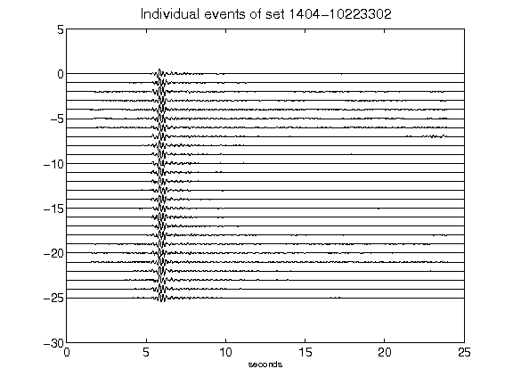](figures/1404-10223302_AllEv.png)[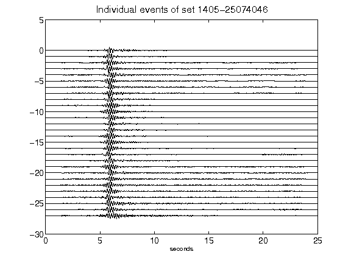](figures/1405-25074046_AllEv.png)[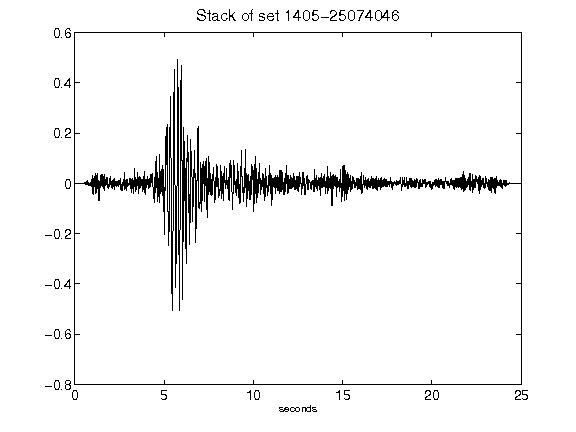](figures/1405-25074046_Stack.png)[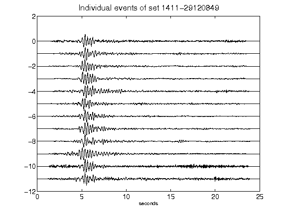](figures/1411-29120849_AllEv.png)[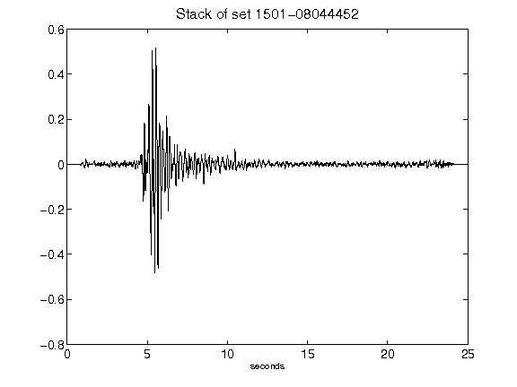](figures/1501-08044452_Stack.png)[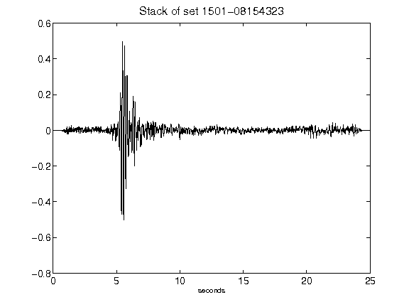](figures/1501-08154323_Stack.png)[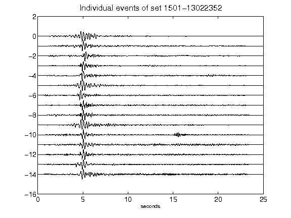](figures/1501-13022352_AllEv.png)[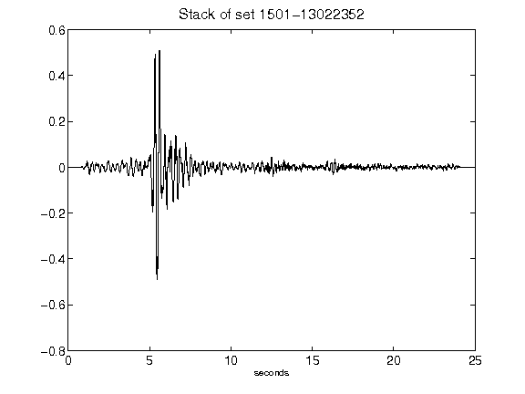](figures/1501-13022352_Stack.png)[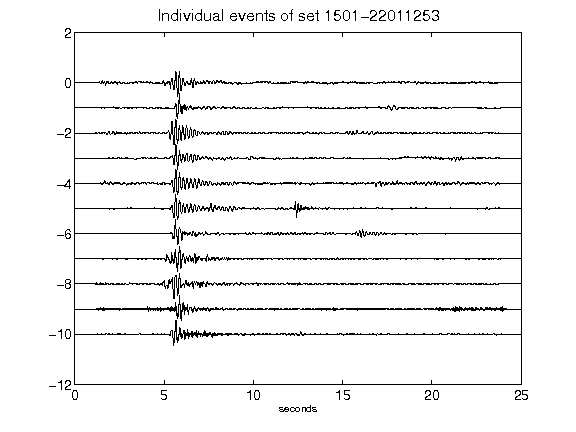](figures/1501-22011253_AllEv.png)[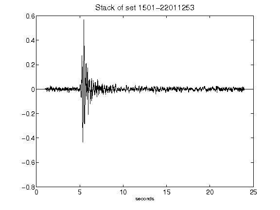](figures/1501-22011253_Stack.png)[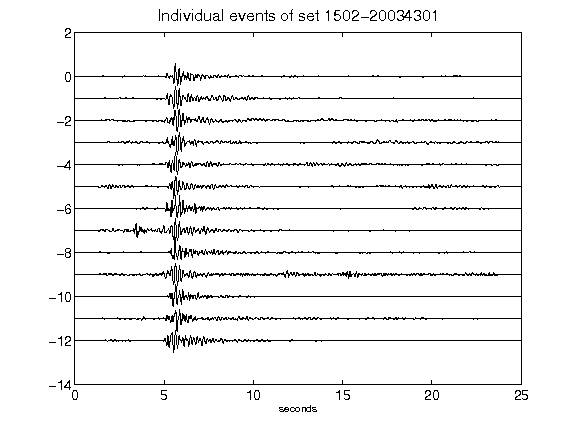](figures/1502-20034301_AllEv.png)[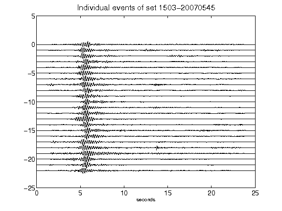](figures/1503-20070545_AllEv.png)[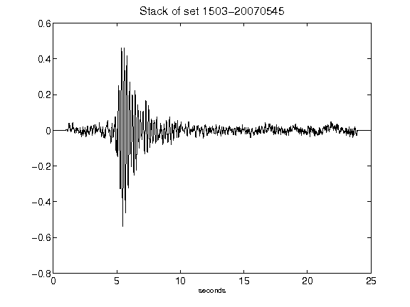](figures/1503-20070545_Stack.png)[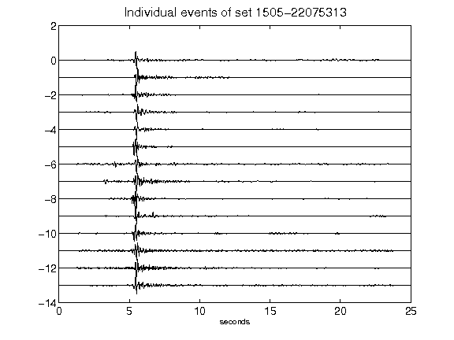](figures/1505-22075313_AllEv.png)[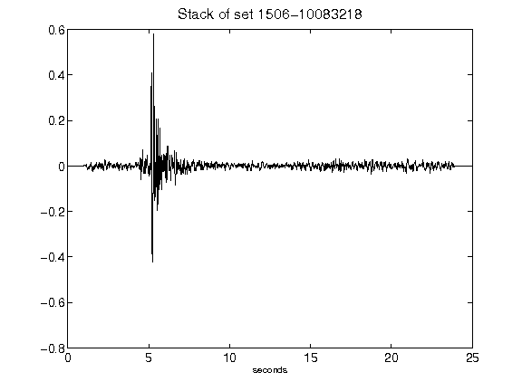](figures/1506-10083218_Stack.png)[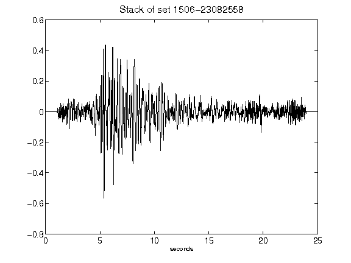](figures/1506-23082558_Stack.png)