# Repeating Earthquake Activity at RCM

## Waveforms
[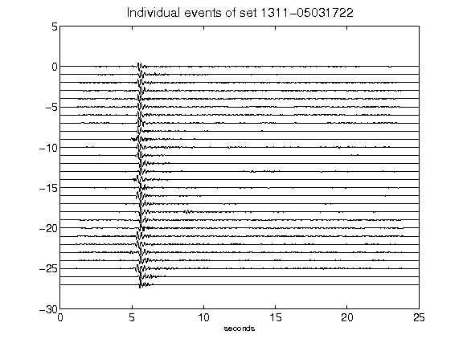](figures/1311-05031722_AllEv.png)[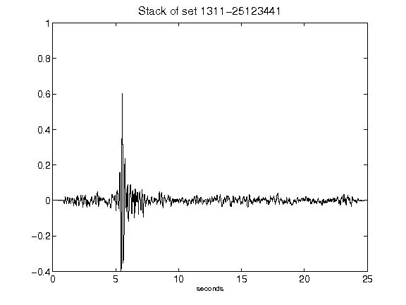](figures/1311-25123441_Stack.png)[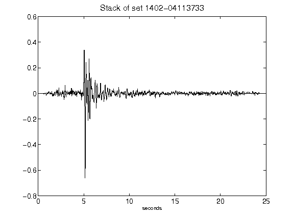](figures/1402-04113733_Stack.png)[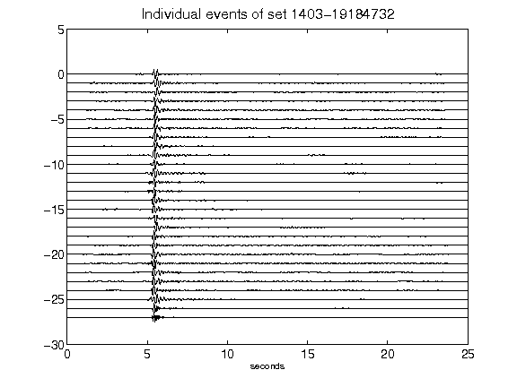](figures/1403-19184732_AllEv.png)[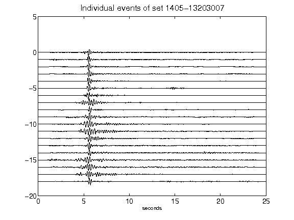](figures/1405-13203007_AllEv.png)[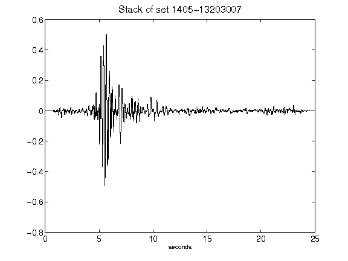](figures/1405-13203007_Stack.png)[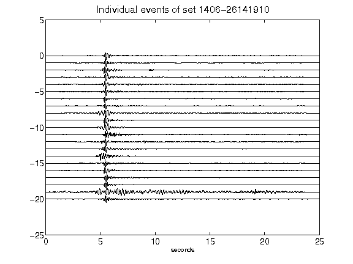](figures/1406-26141910_AllEv.png)[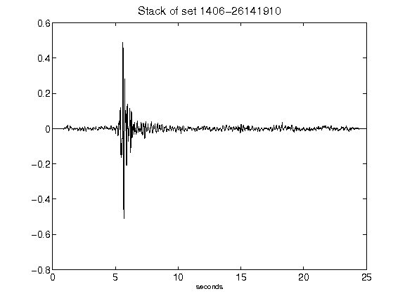](figures/1406-26141910_Stack.png)[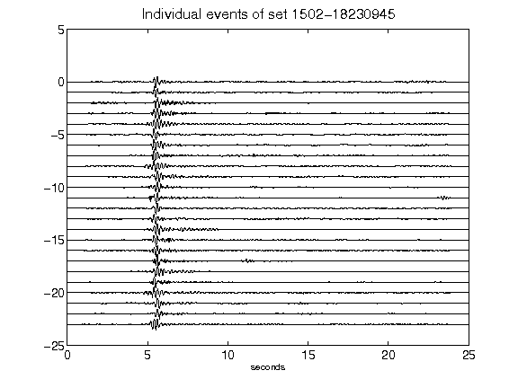](figures/1502-18230945_AllEv.png)[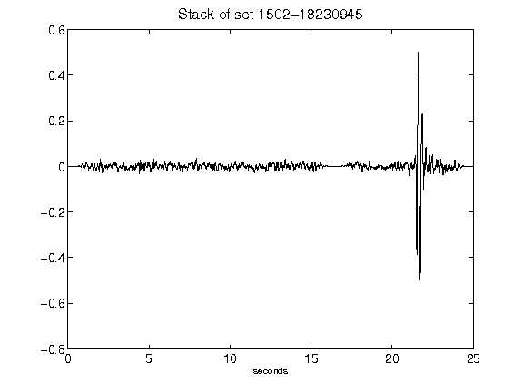](figures/1502-18230945_Stack.png)[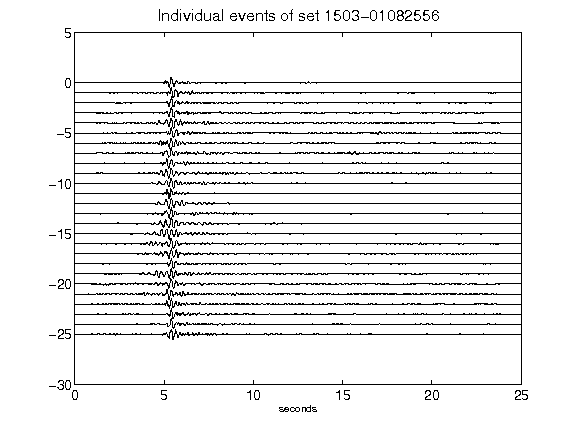](figures/1503-01082556_AllEv.png)[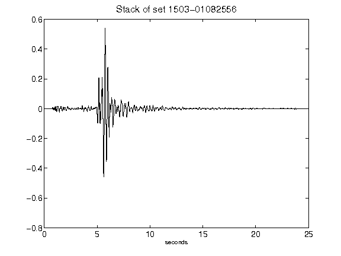](figures/1503-01082556_Stack.png)[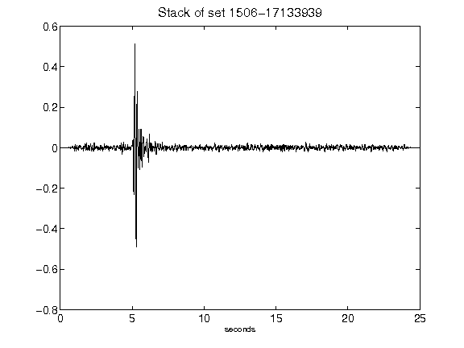](figures/1506-17133939_Stack.png)[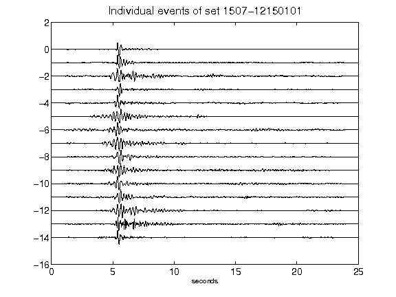](figures/1507-12150101_AllEv.png)[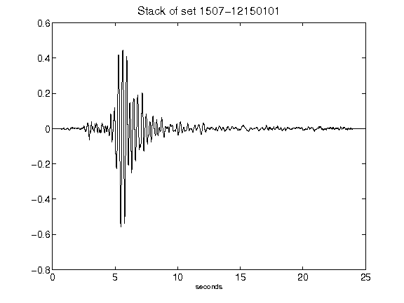](figures/1507-12150101_Stack.png)[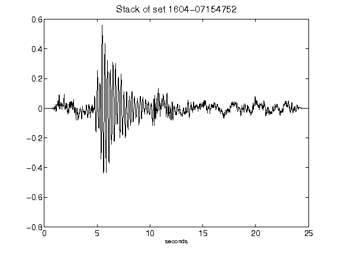](figures/1604-07154752_Stack.png)[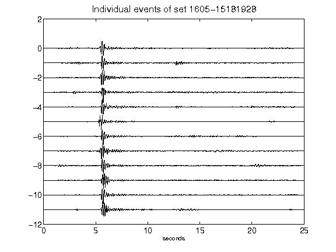](figures/1605-15181928_AllEv.png)[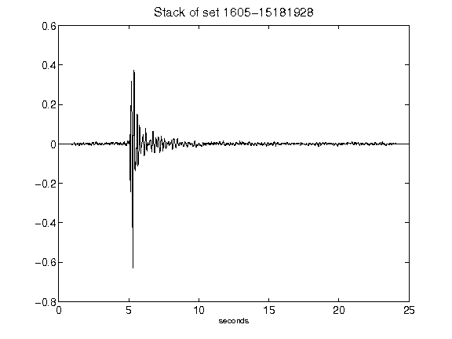](figures/1605-15181928_Stack.png)[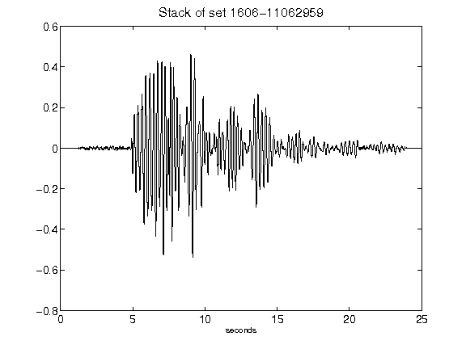](figures/1606-11062959_Stack.png)