# Repeating Earthquake Activity at RCM

## Waveforms
[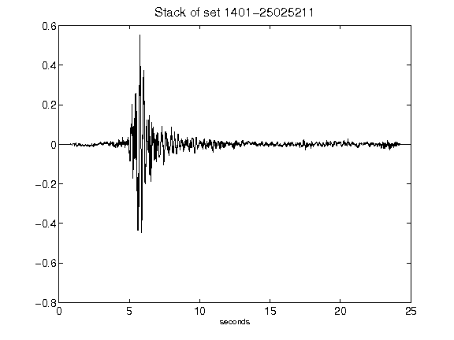](figures/1401-25025211_Stack.png)[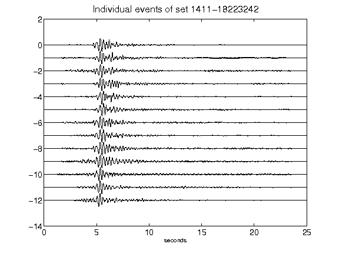](figures/1411-18223242_AllEv.png)[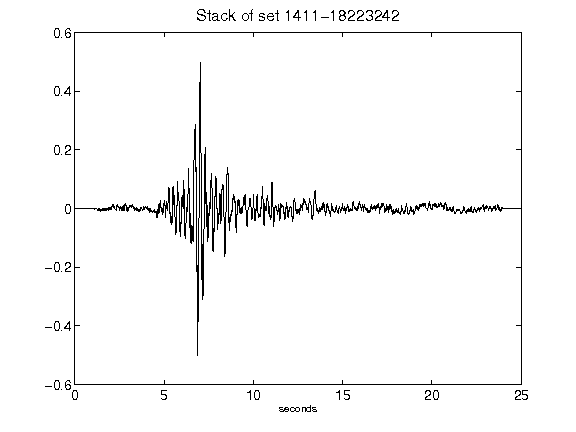](figures/1411-18223242_Stack.png)[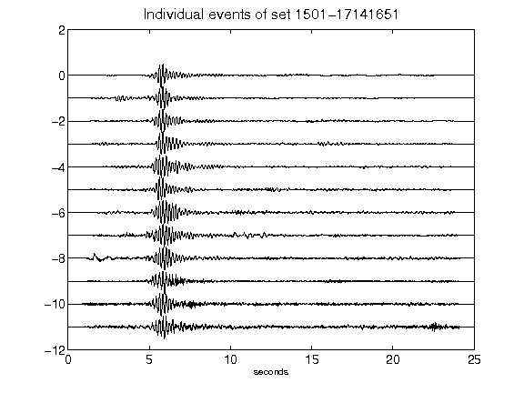](figures/1501-17141651_AllEv.png)[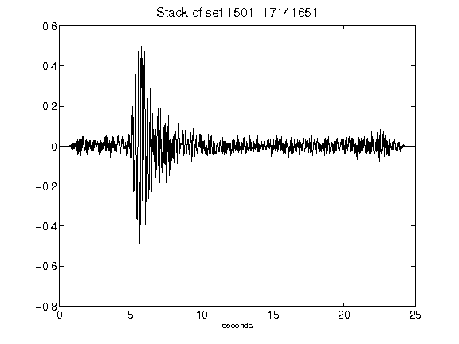](figures/1501-17141651_Stack.png)[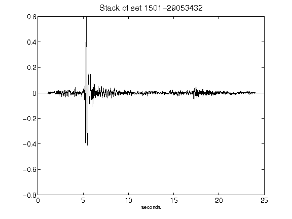](figures/1501-29053432_Stack.png)[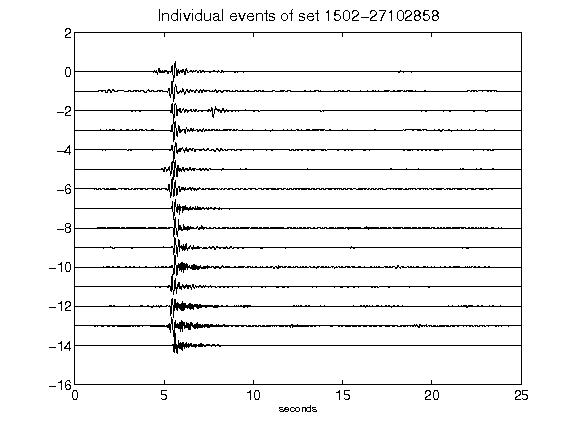](figures/1502-27102858_AllEv.png)[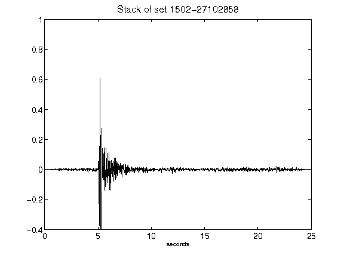](figures/1502-27102858_Stack.png)[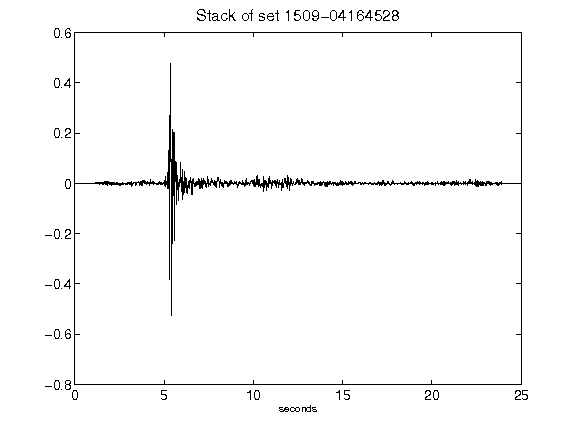](figures/1509-04164528_Stack.png)[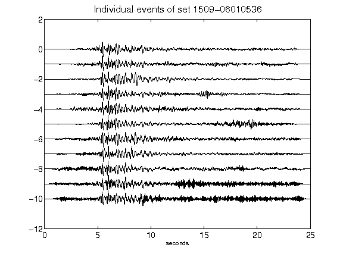](figures/1509-06010536_AllEv.png)[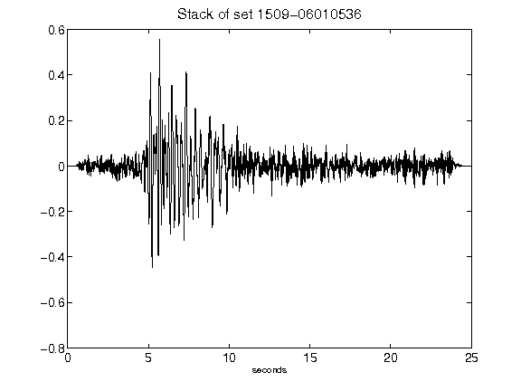](figures/1509-06010536_Stack.png)