# Repeating Earthquake Activity at RCM
  
  

## Waveforms
[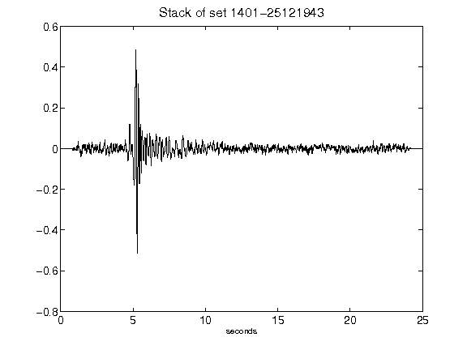](figures/1401-25121943_Stack.png)[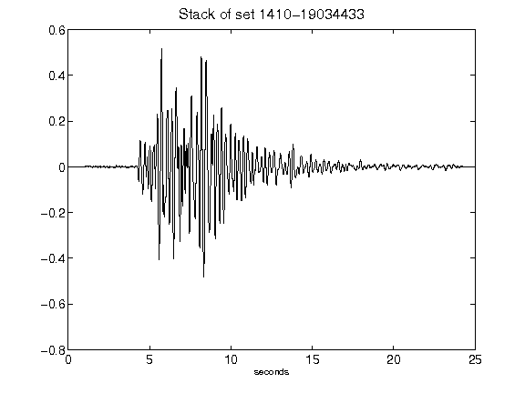](figures/1410-19034433_Stack.png)[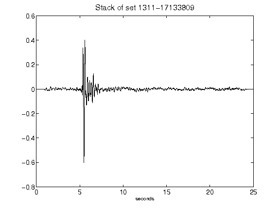](figures/1311-17133809_Stack.png)[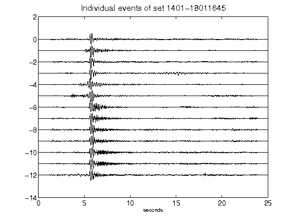](figures/1401-18011645_AllEv.png)[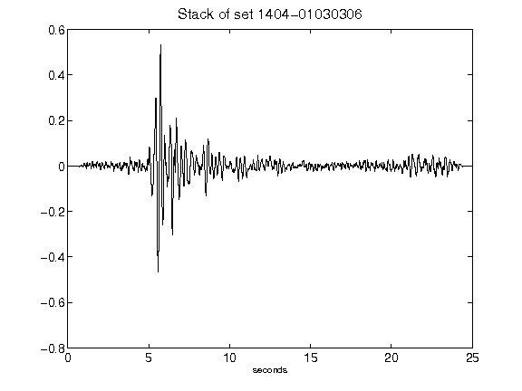](figures/1404-01030306_Stack.png)[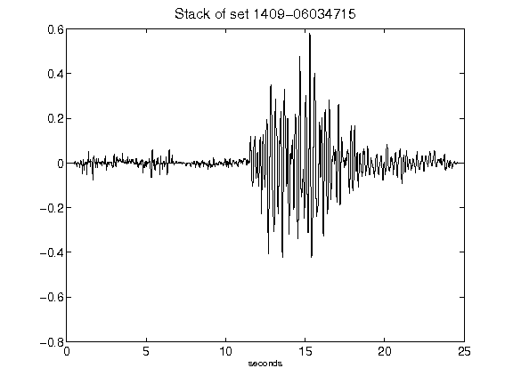](figures/1409-06034715_Stack.png)[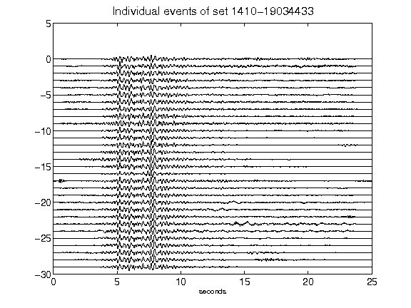](figures/1410-19034433_AllEv.png)[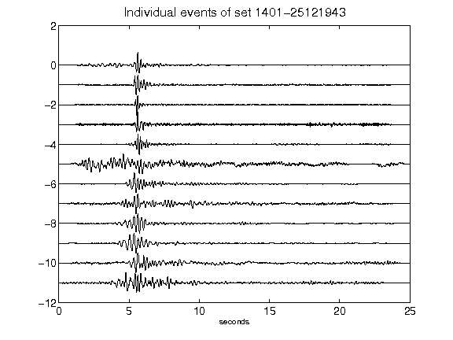](figures/1401-25121943_AllEv.png)[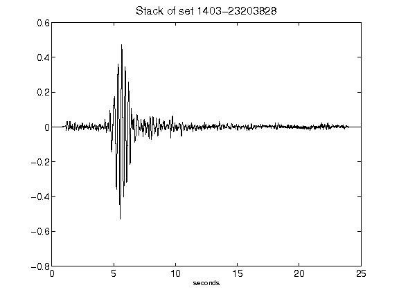](figures/1403-23203828_Stack.png)[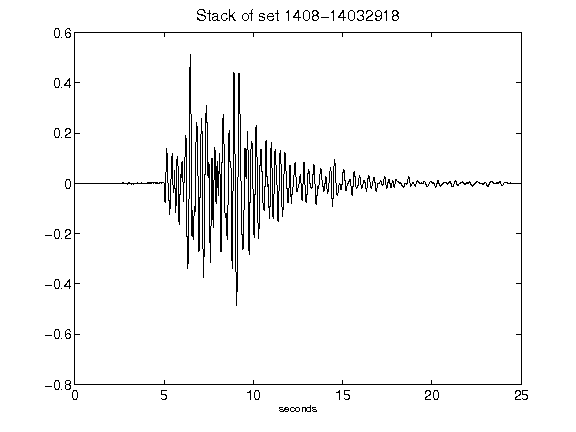](figures/1408-14032918_Stack.png)[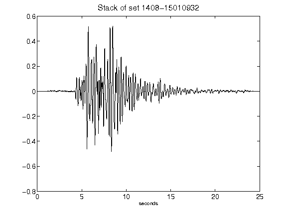](figures/1408-15010932_Stack.png)[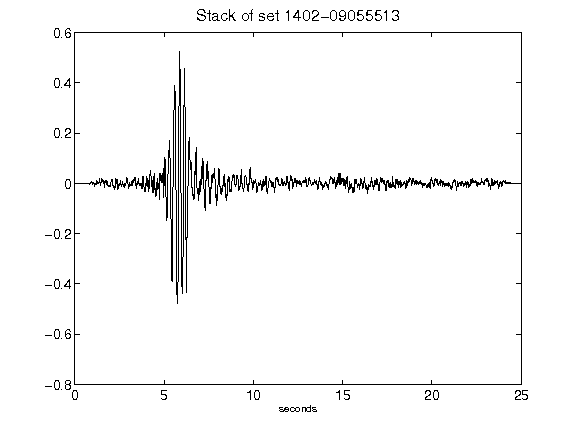](figures/1402-09055513_Stack.png)[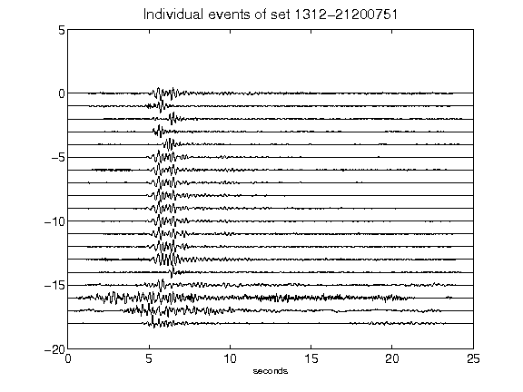](figures/1312-21200751_AllEv.png)[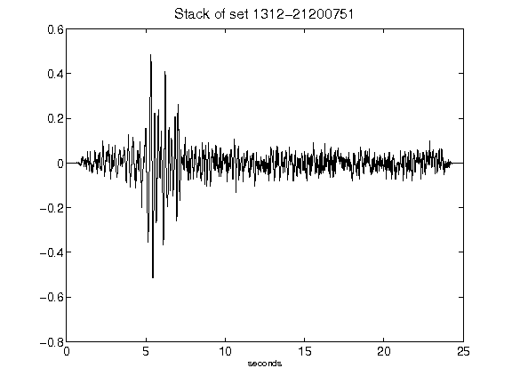](figures/1312-21200751_Stack.png)[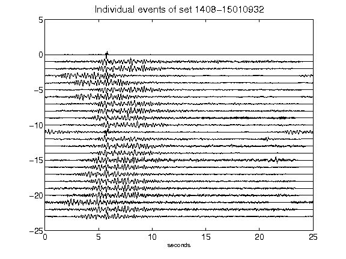](figures/1408-15010932_AllEv.png)[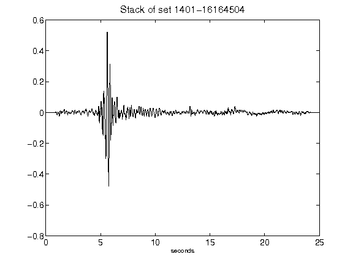](figures/1401-16164504_Stack.png)[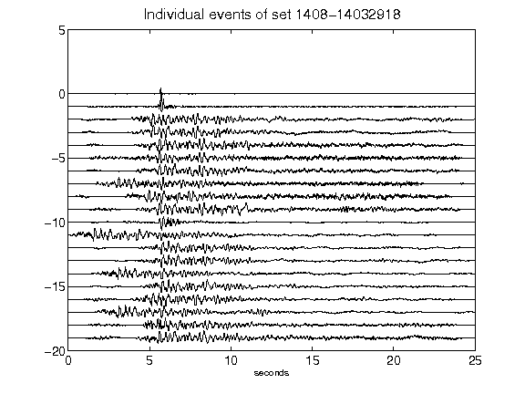](figures/1408-14032918_AllEv.png)[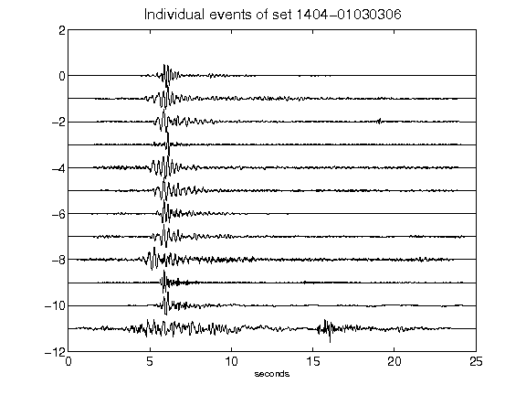](figures/1404-01030306_AllEv.png)[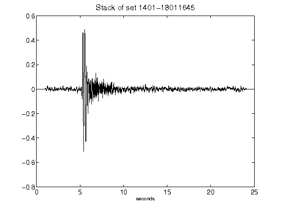](figures/1401-18011645_Stack.png)[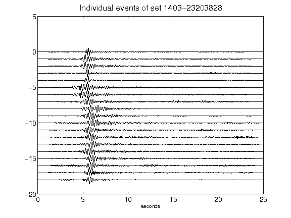](figures/1403-23203828_AllEv.png)[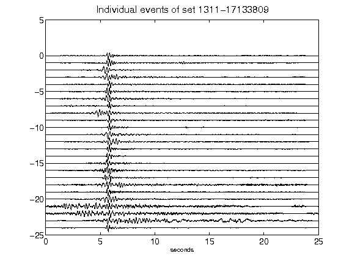](figures/1311-17133809_AllEv.png)[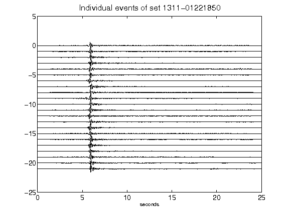](figures/1311-01221850_AllEv.png)[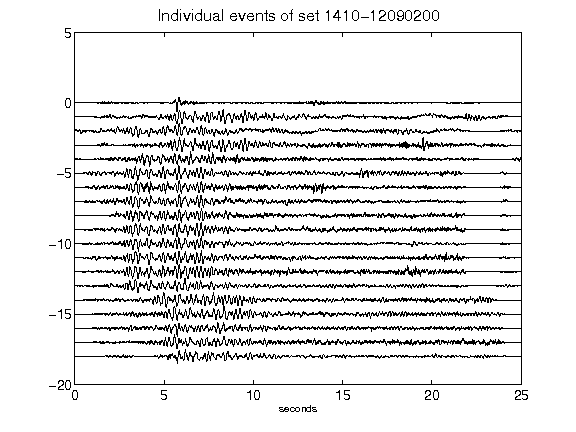](figures/1410-12090200_AllEv.png)[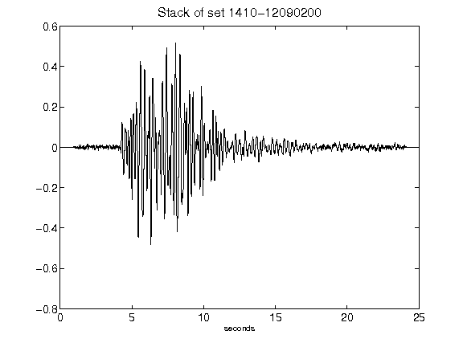](figures/1410-12090200_Stack.png)[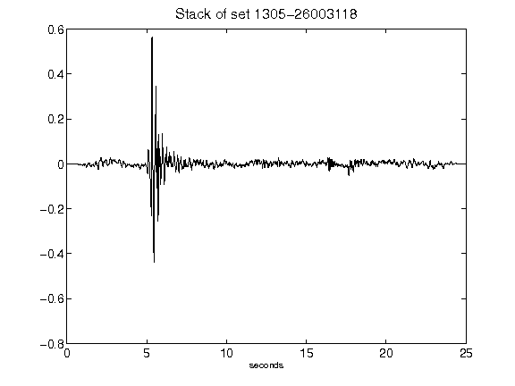](figures/1305-26003118_Stack.png)[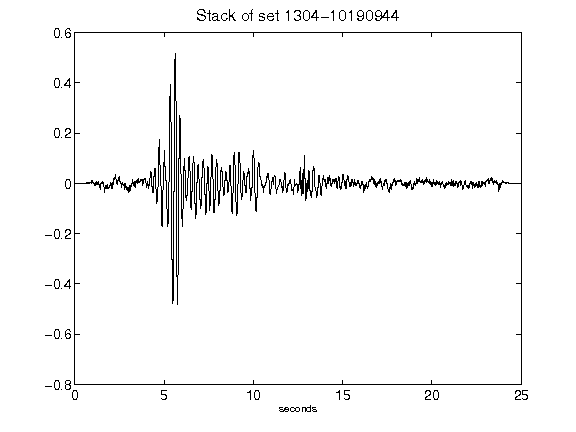](figures/1304-10190944_Stack.png)[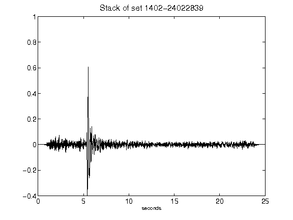](figures/1402-24022839_Stack.png)[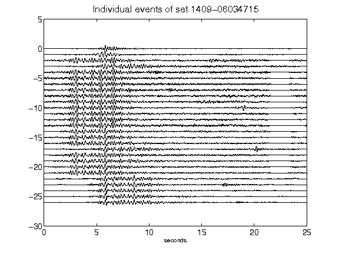](figures/1409-06034715_AllEv.png)