# Repeating Earthquake Activity at RCM

## Waveforms
[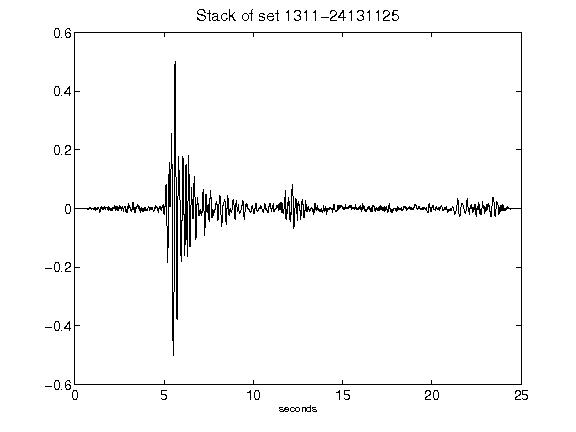](figures/1311-24131125_Stack.png)[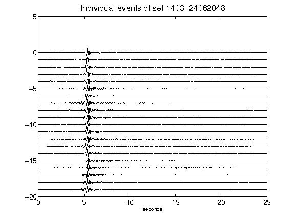](figures/1403-24062048_AllEv.png)[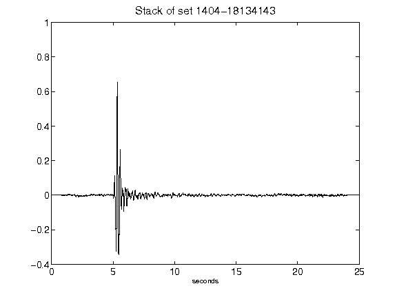](figures/1404-18134143_Stack.png)[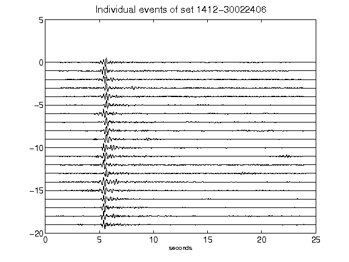](figures/1412-30022406_AllEv.png)[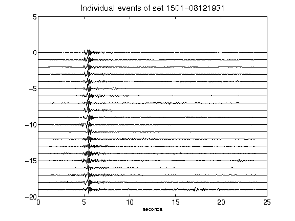](figures/1501-08121931_AllEv.png)[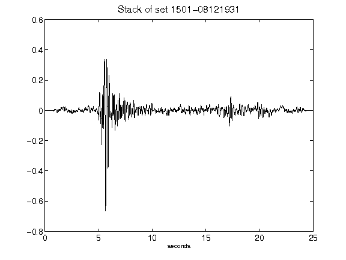](figures/1501-08121931_Stack.png)[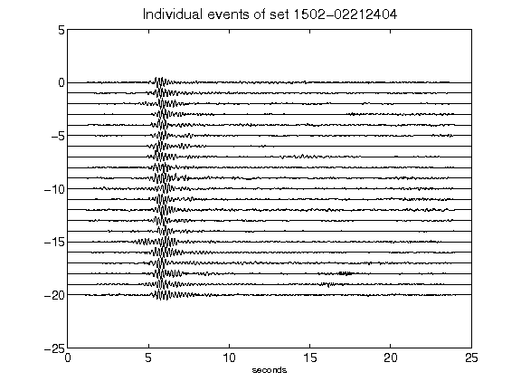](figures/1502-02212404_AllEv.png)[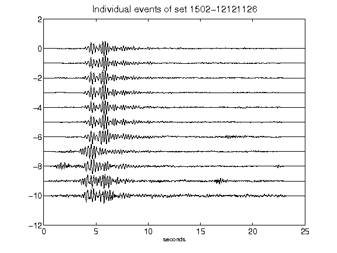](figures/1502-12121126_AllEv.png)[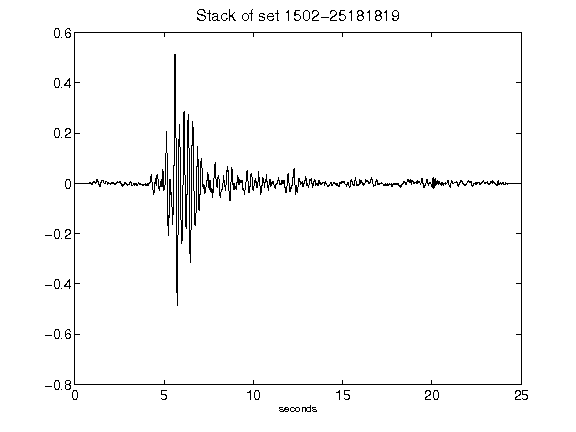](figures/1502-25181819_Stack.png)[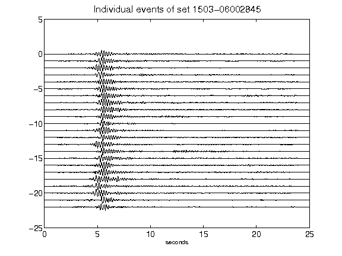](figures/1503-06002845_AllEv.png)[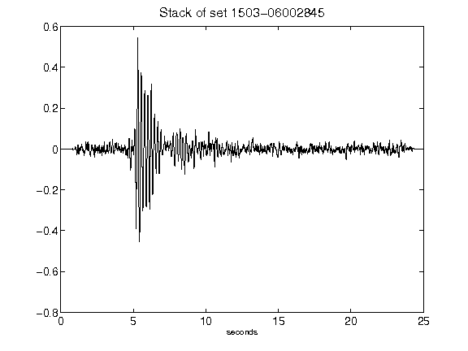](figures/1503-06002845_Stack.png)[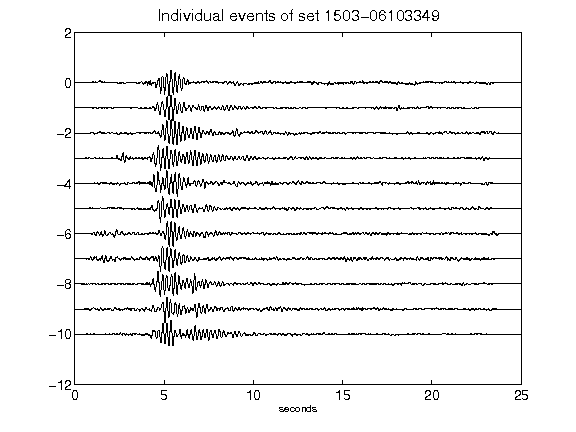](figures/1503-06103349_AllEv.png)[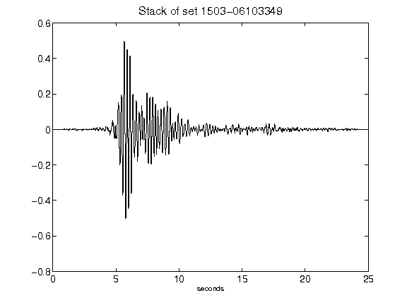](figures/1503-06103349_Stack.png)[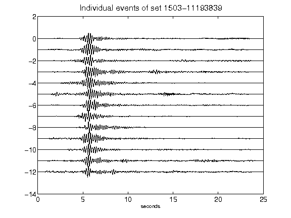](figures/1503-11193839_AllEv.png)[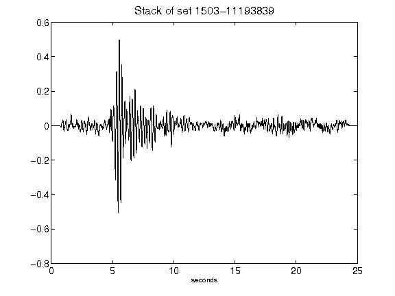](figures/1503-11193839_Stack.png)[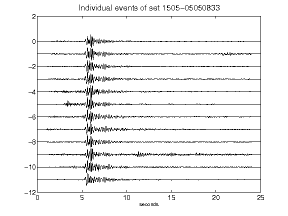](figures/1505-05050833_AllEv.png)