# Repeating Earthquake Activity at RCM

## Waveforms
[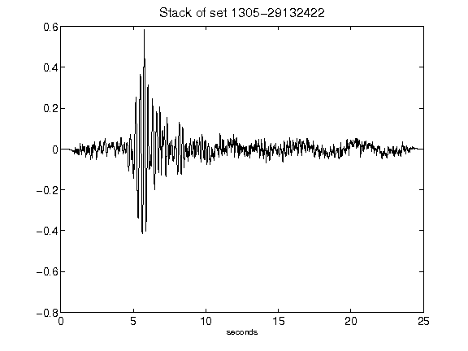](figures/1305-29132422_Stack.png)[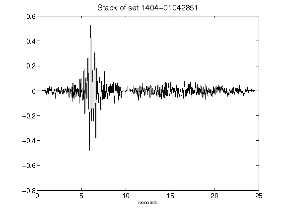](figures/1404-01042851_Stack.png)[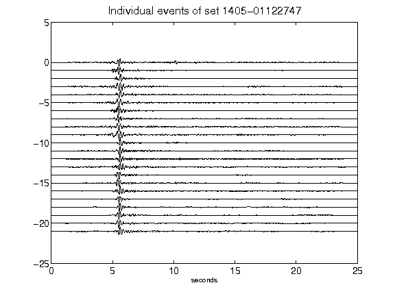](figures/1405-01122747_AllEv.png)[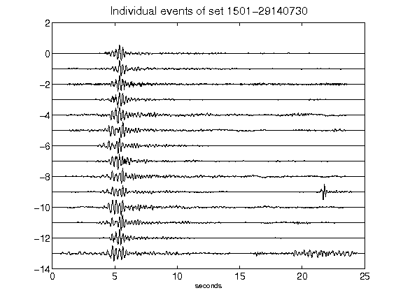](figures/1501-29140730_AllEv.png)[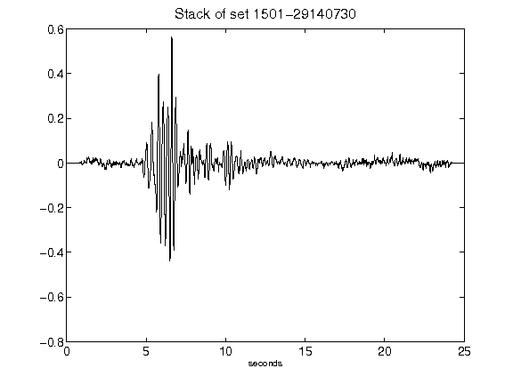](figures/1501-29140730_Stack.png)[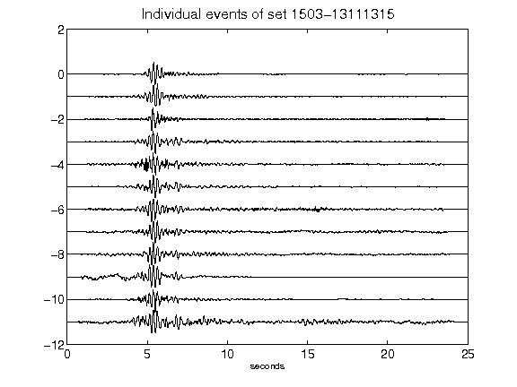](figures/1503-13111315_AllEv.png)[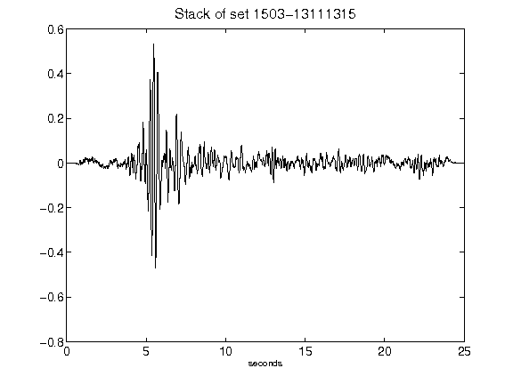](figures/1503-13111315_Stack.png)[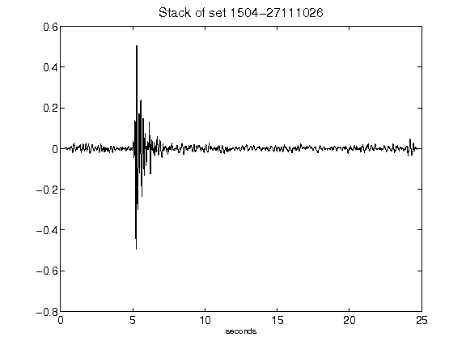](figures/1504-27111026_Stack.png)[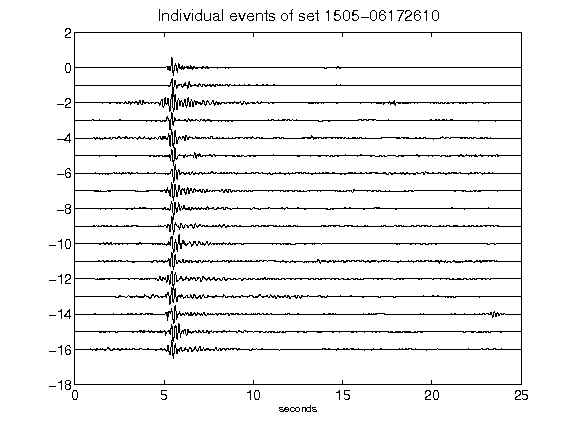](figures/1505-06172610_AllEv.png)[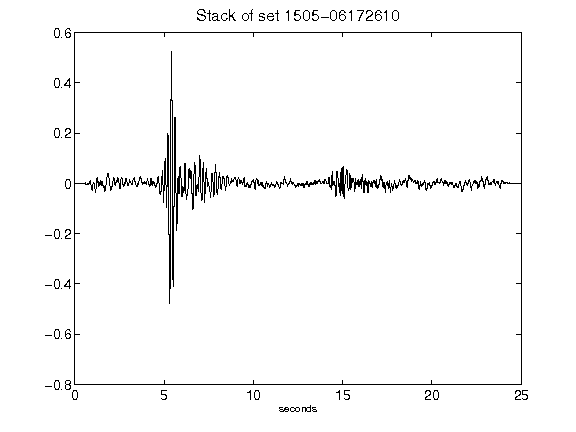](figures/1505-06172610_Stack.png)[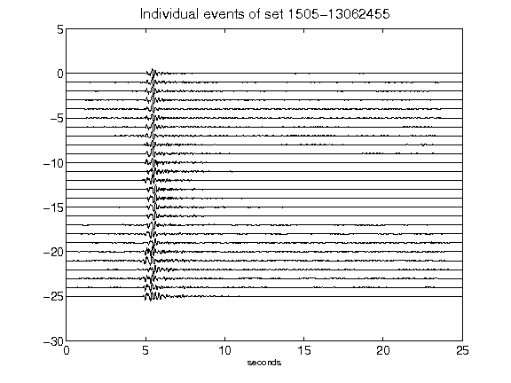](figures/1505-13062455_AllEv.png)[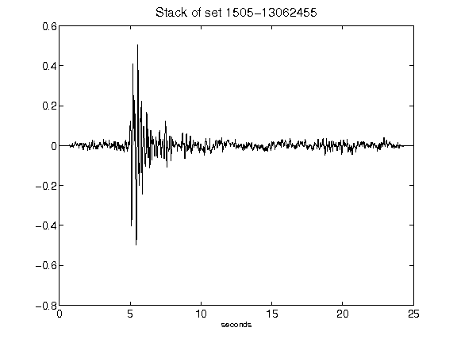](figures/1505-13062455_Stack.png)[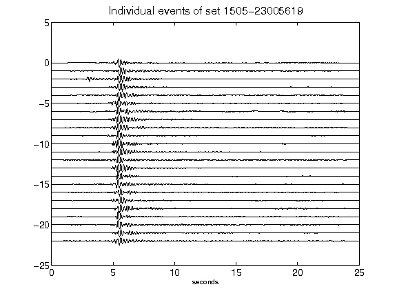](figures/1505-23005619_AllEv.png)[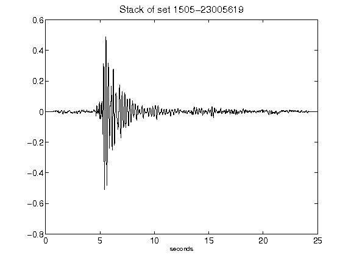](figures/1505-23005619_Stack.png)[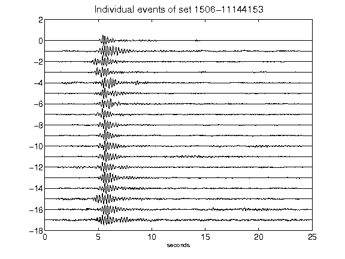](figures/1506-11144153_AllEv.png)[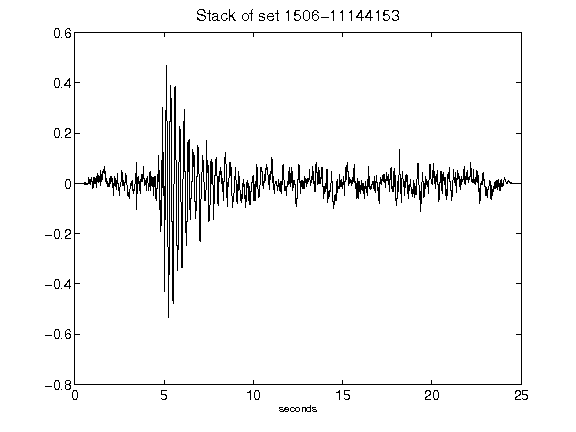](figures/1506-11144153_Stack.png)[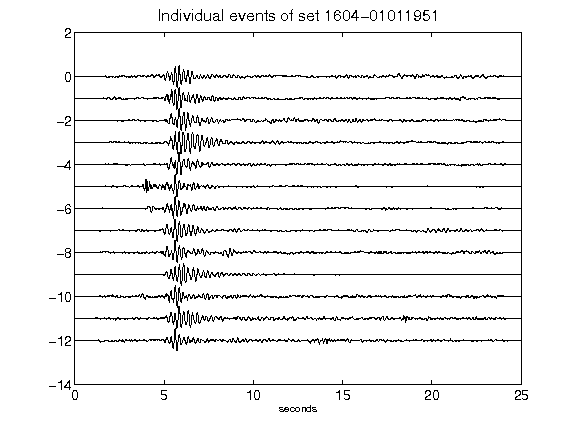](figures/1604-01011951_AllEv.png)[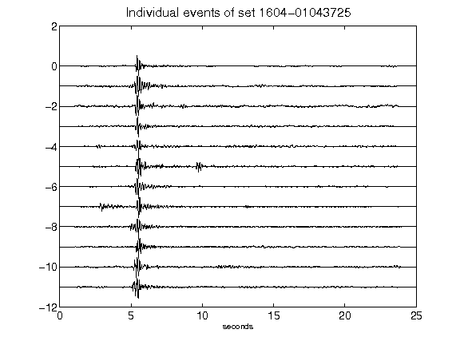](figures/1604-01043725_AllEv.png)[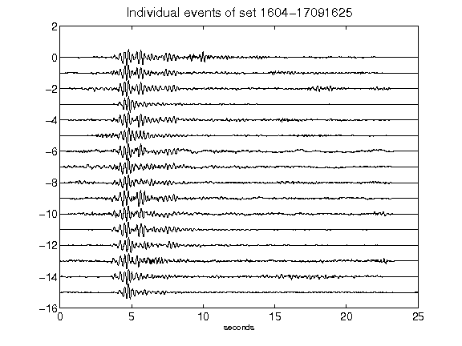](figures/1604-17091625_AllEv.png)[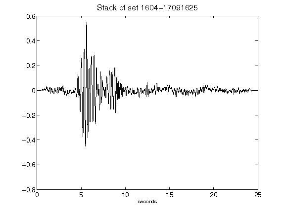](figures/1604-17091625_Stack.png)