# Repeating Earthquake Activity at RCM

## Waveforms
[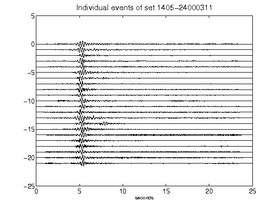](figures/1405-24000311_AllEv.png)[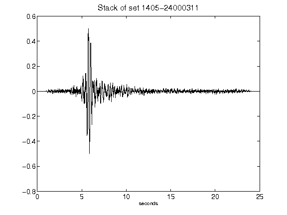](figures/1405-24000311_Stack.png)[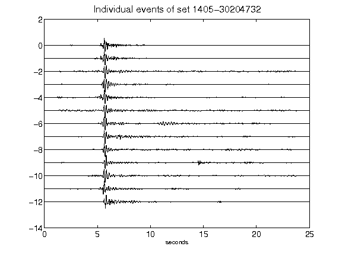](figures/1405-30204732_AllEv.png)[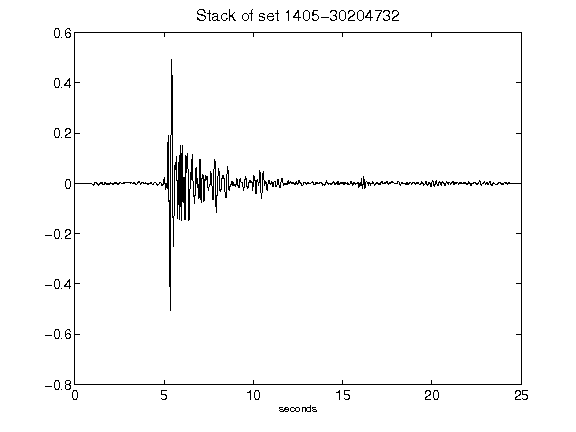](figures/1405-30204732_Stack.png)[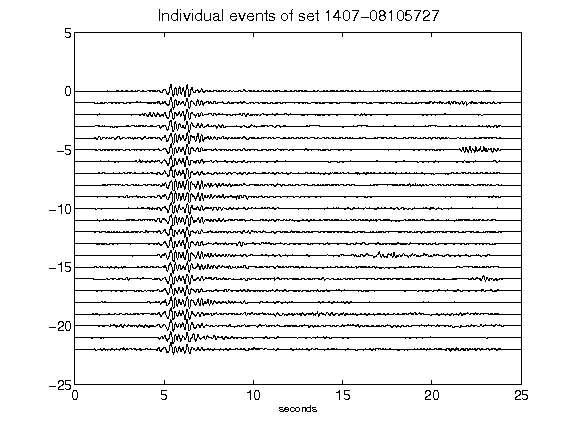](figures/1407-08105727_AllEv.png)[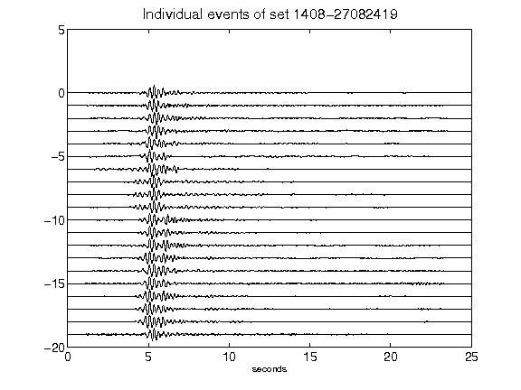](figures/1408-27082419_AllEv.png)[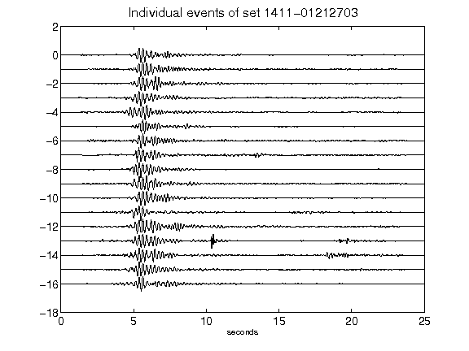](figures/1411-01212703_AllEv.png)[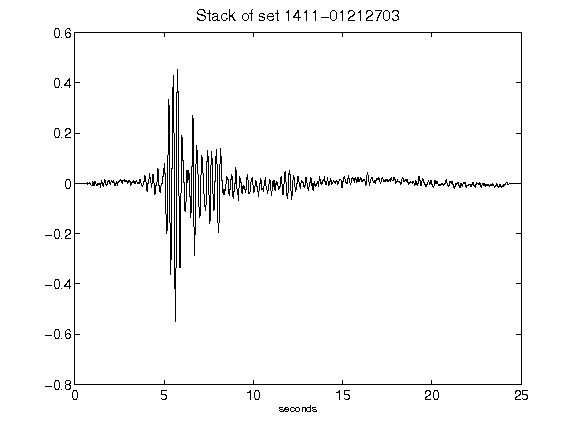](figures/1411-01212703_Stack.png)[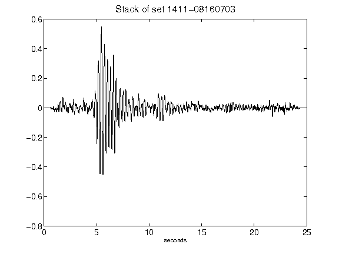](figures/1411-08160703_Stack.png)[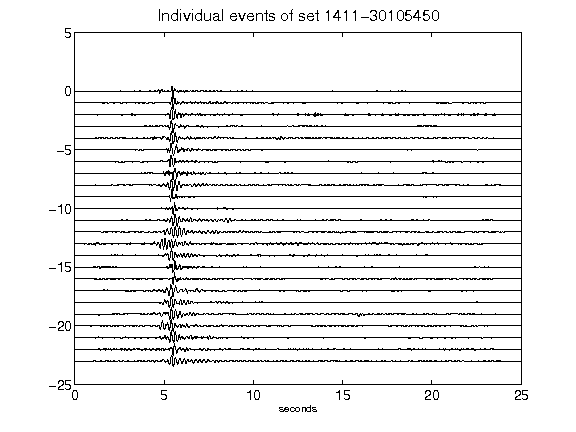](figures/1411-30105450_AllEv.png)[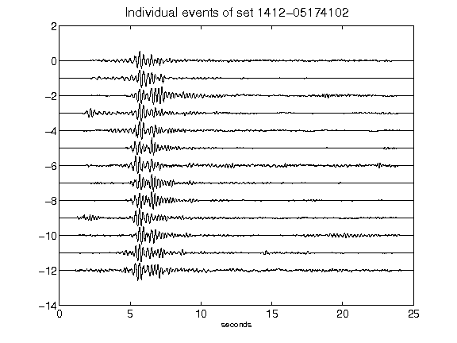](figures/1412-05174102_AllEv.png)[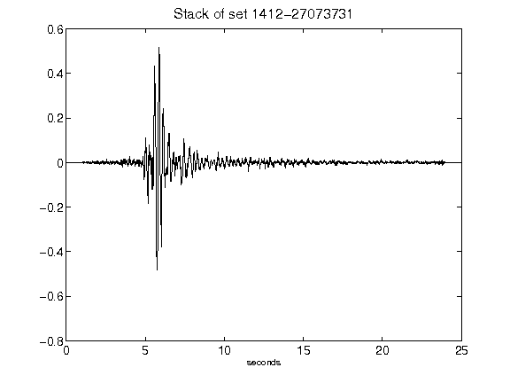](figures/1412-27073731_Stack.png)[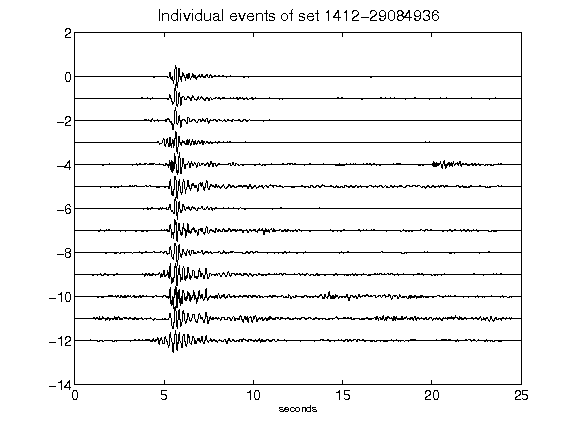](figures/1412-29084936_AllEv.png)[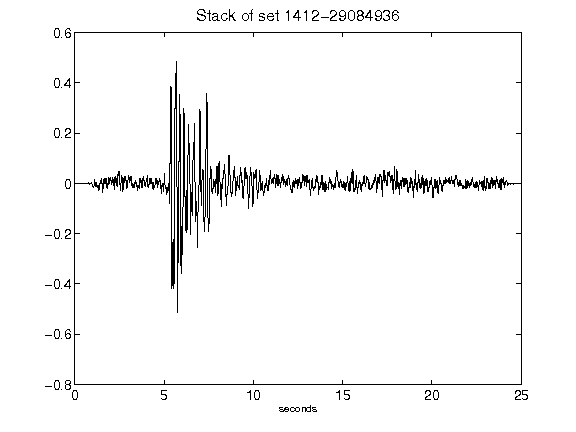](figures/1412-29084936_Stack.png)[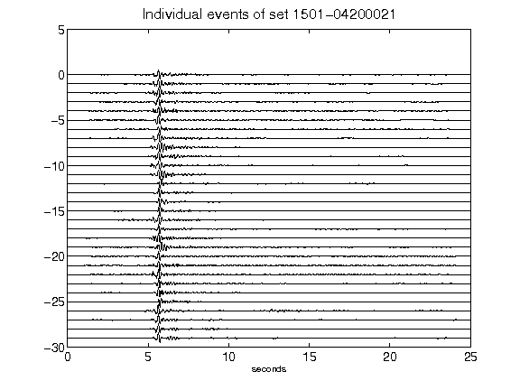](figures/1501-04200021_AllEv.png)[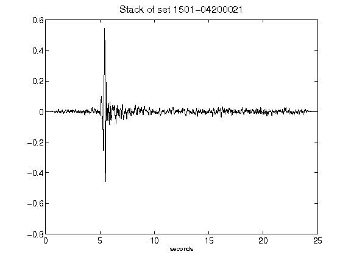](figures/1501-04200021_Stack.png)[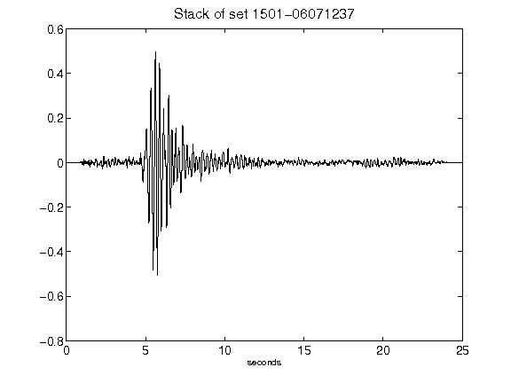](figures/1501-06071237_Stack.png)[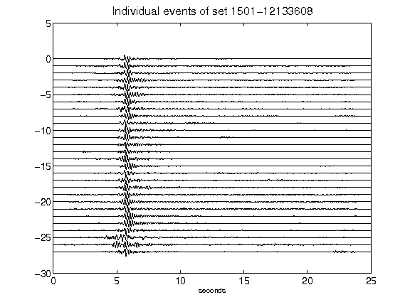](figures/1501-12133608_AllEv.png)[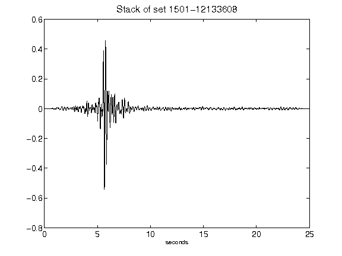](figures/1501-12133608_Stack.png)[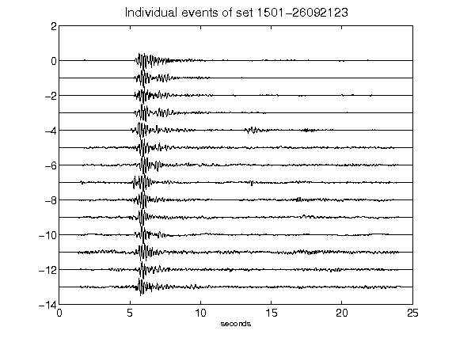](figures/1501-26092123_AllEv.png)[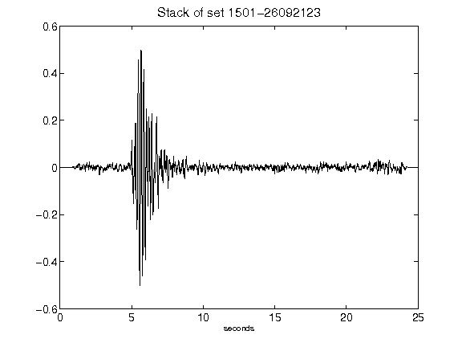](figures/1501-26092123_Stack.png)[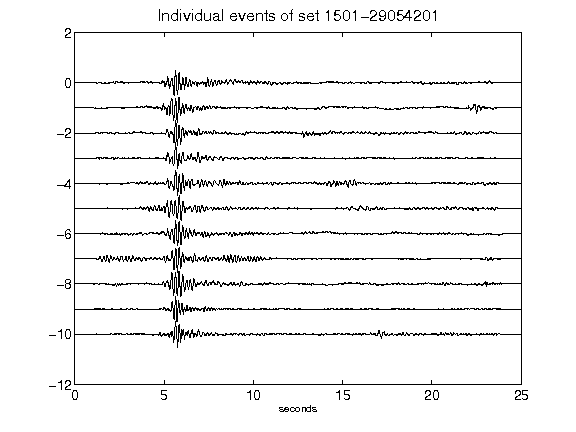](figures/1501-29054201_AllEv.png)[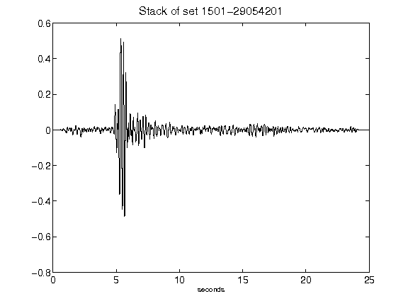](figures/1501-29054201_Stack.png)[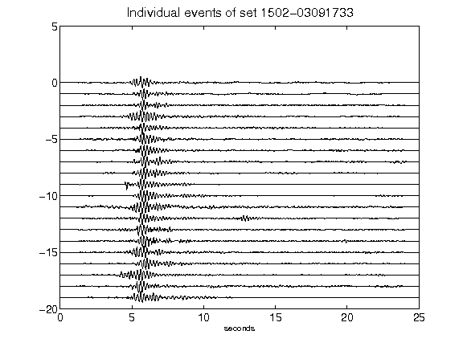](figures/1502-03091733_AllEv.png)[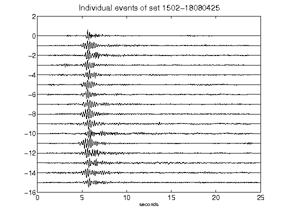](figures/1502-18080425_AllEv.png)[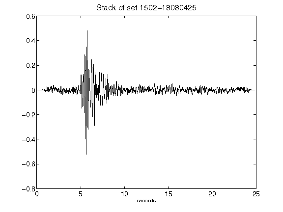](figures/1502-18080425_Stack.png)