# Repeating Earthquake Activity at RCM

## Waveforms
[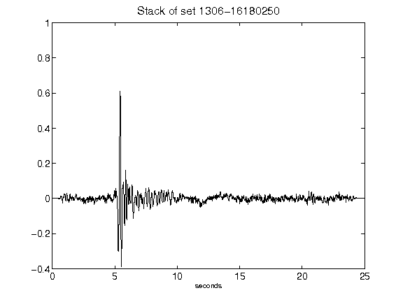](figures/1306-16180250_Stack.png)[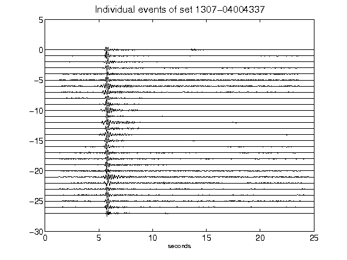](figures/1307-04004337_AllEv.png)[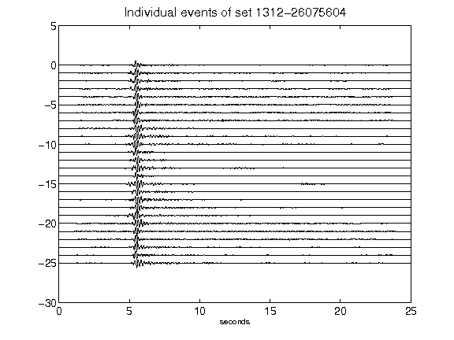](figures/1312-26075604_AllEv.png)[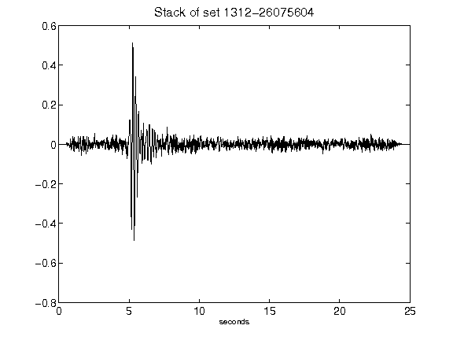](figures/1312-26075604_Stack.png)[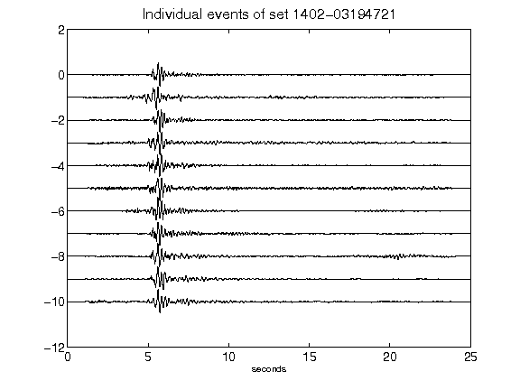](figures/1402-03194721_AllEv.png)[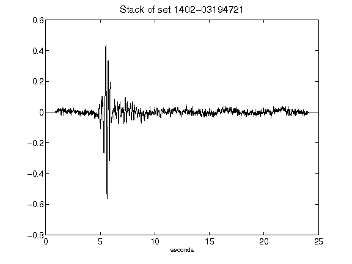](figures/1402-03194721_Stack.png)[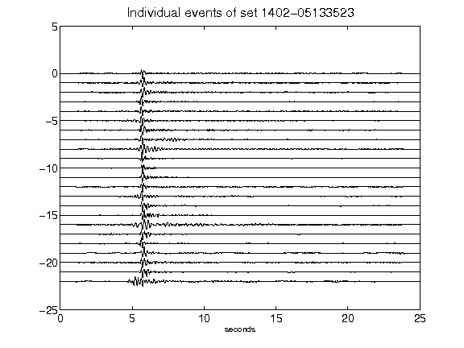](figures/1402-05133523_AllEv.png)[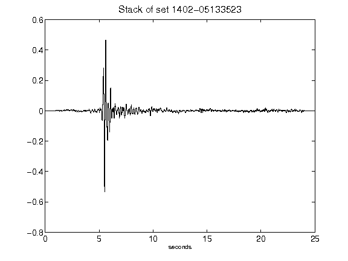](figures/1402-05133523_Stack.png)[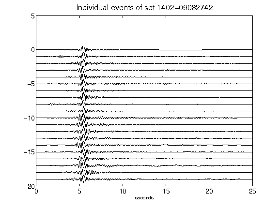](figures/1402-09082742_AllEv.png)[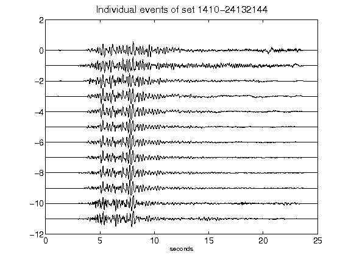](figures/1410-24132144_AllEv.png)[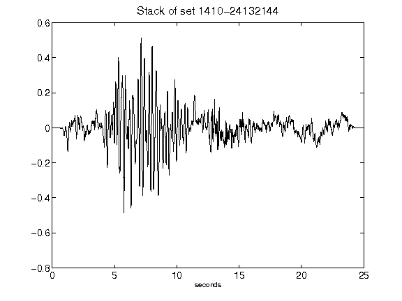](figures/1410-24132144_Stack.png)[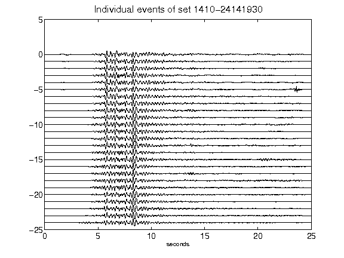](figures/1410-24141930_AllEv.png)[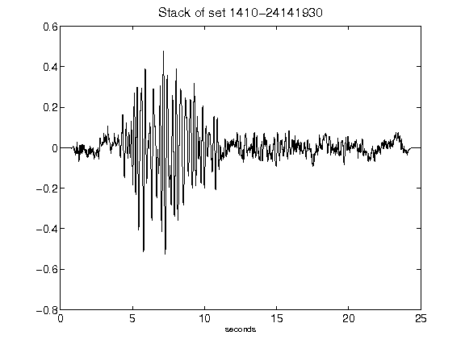](figures/1410-24141930_Stack.png)[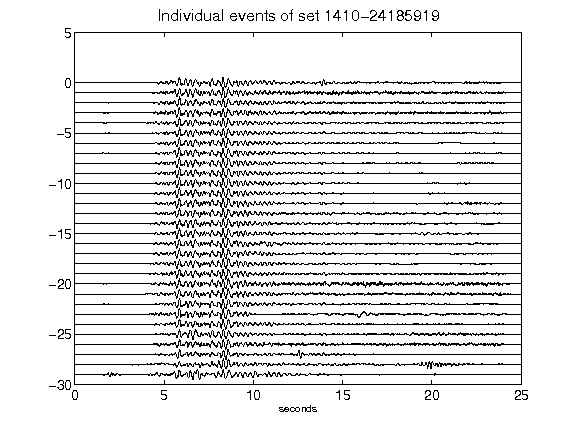](figures/1410-24185919_AllEv.png)[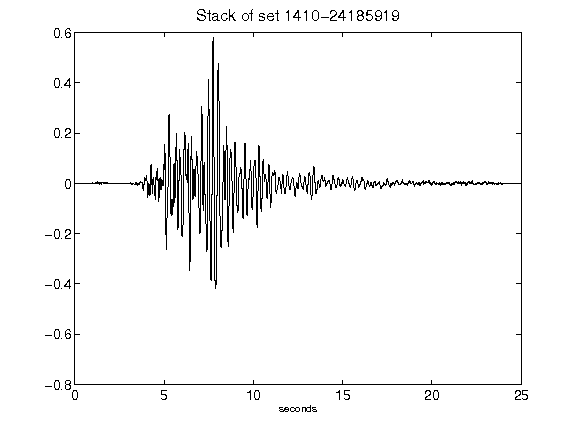](figures/1410-24185919_Stack.png)[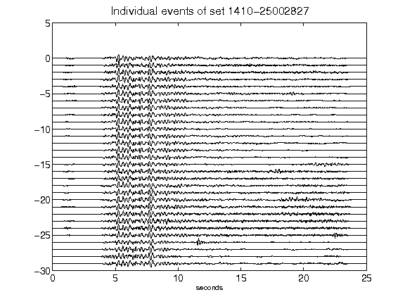](figures/1410-25002827_AllEv.png)[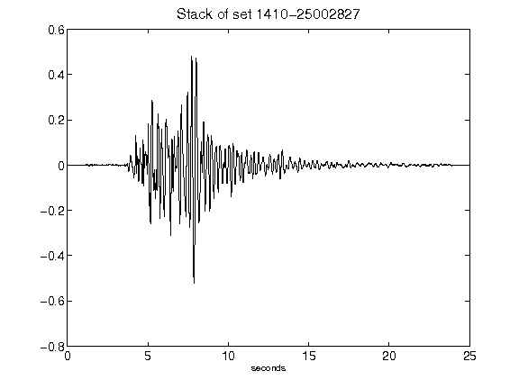](figures/1410-25002827_Stack.png)[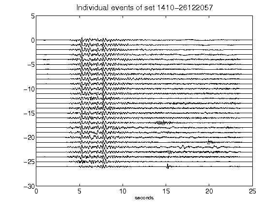](figures/1410-26122057_AllEv.png)[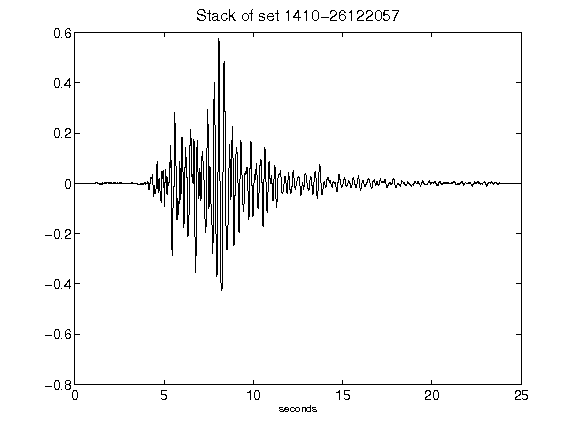](figures/1410-26122057_Stack.png)[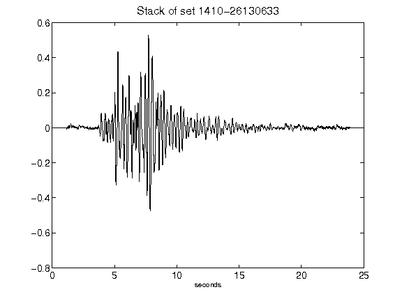](figures/1410-26130633_Stack.png)[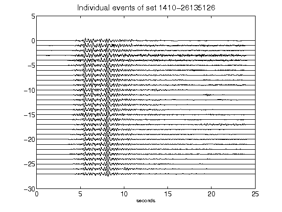](figures/1410-26135126_AllEv.png)[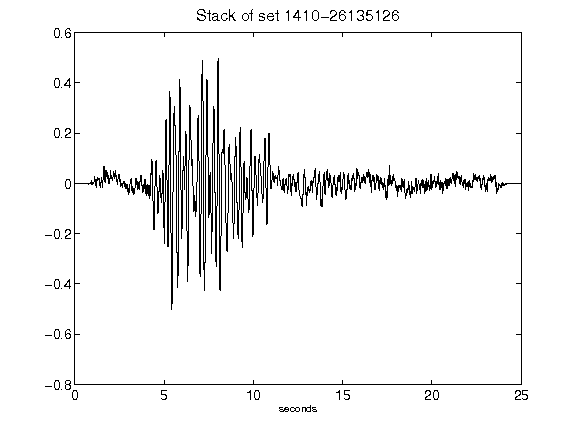](figures/1410-26135126_Stack.png)[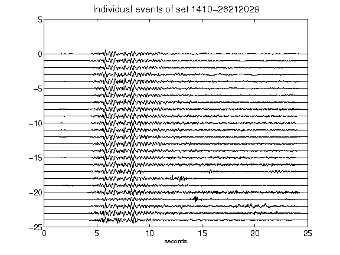](figures/1410-26212029_AllEv.png)[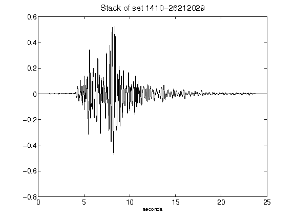](figures/1410-26212029_Stack.png)[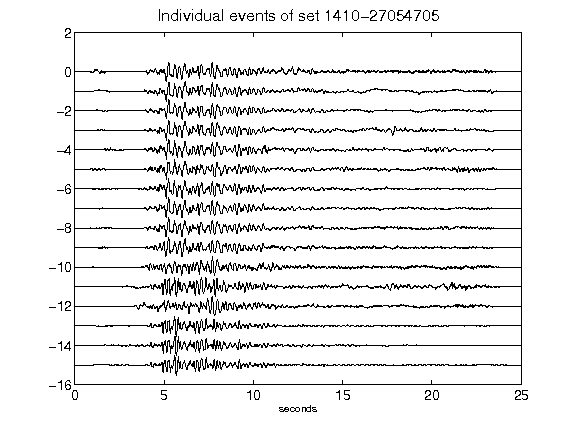](figures/1410-27054705_AllEv.png)[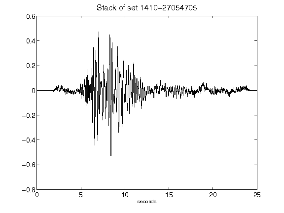](figures/1410-27054705_Stack.png)[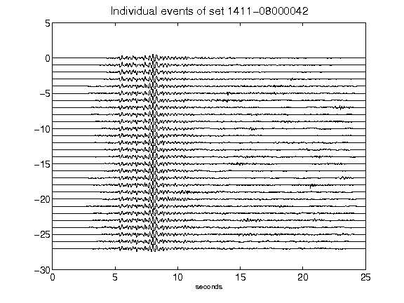](figures/1411-08000042_AllEv.png)[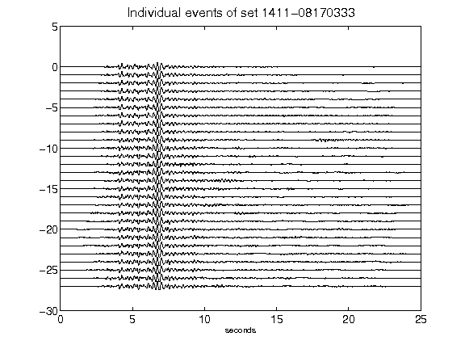](figures/1411-08170333_AllEv.png)[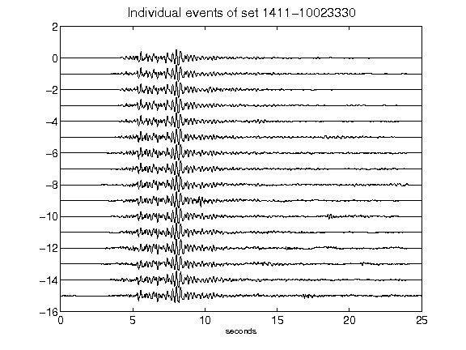](figures/1411-10023330_AllEv.png)[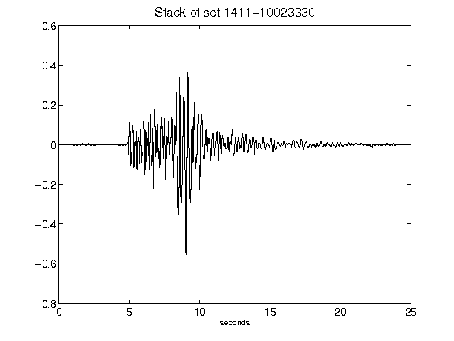](figures/1411-10023330_Stack.png)[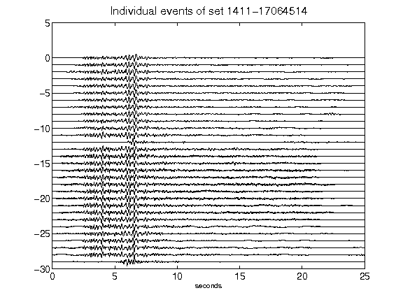](figures/1411-17064514_AllEv.png)[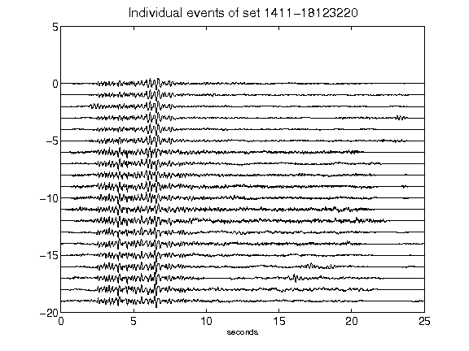](figures/1411-18123220_AllEv.png)[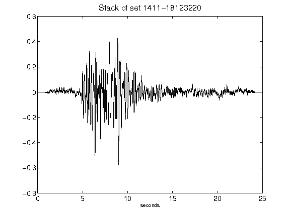](figures/1411-18123220_Stack.png)[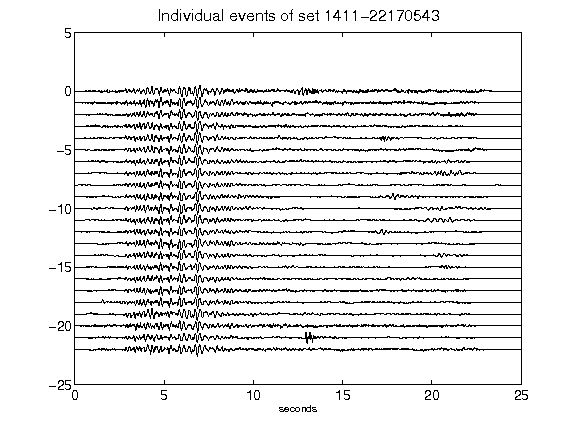](figures/1411-22170543_AllEv.png)[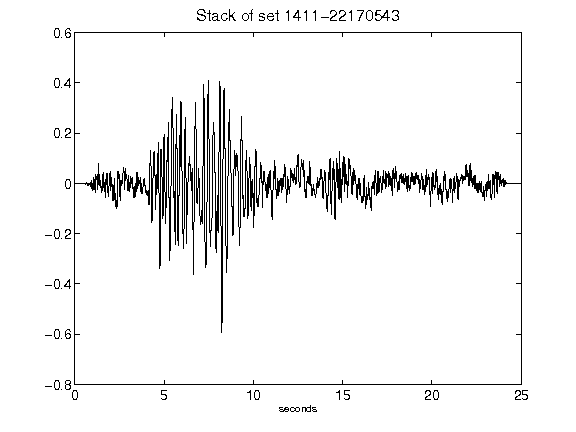](figures/1411-22170543_Stack.png)