# Repeating Earthquake Activity at RCM

## Waveforms
[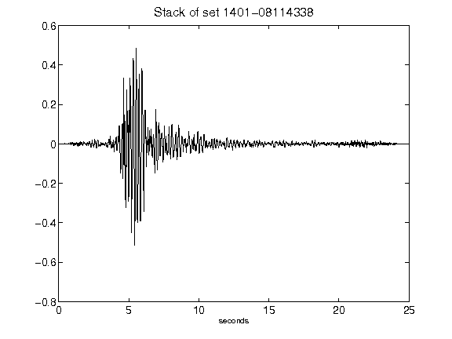](figures/1401-08114338_Stack.png)[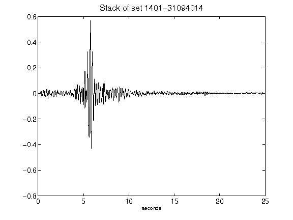](figures/1401-31094014_Stack.png)[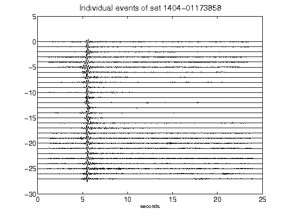](figures/1404-01173858_AllEv.png)[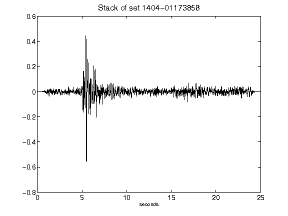](figures/1404-01173858_Stack.png)[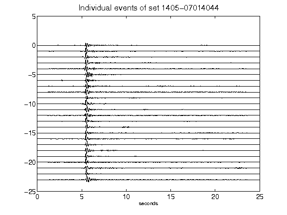](figures/1405-07014044_AllEv.png)[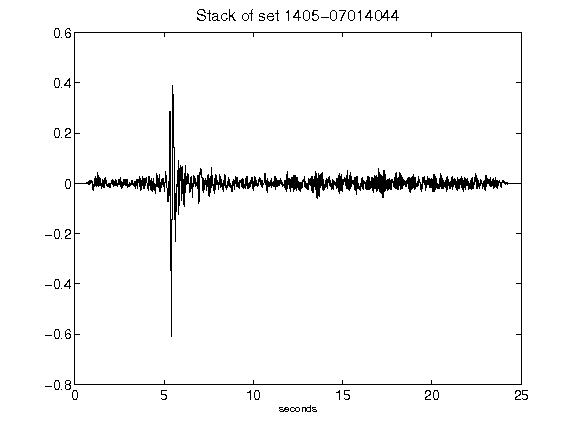](figures/1405-07014044_Stack.png)[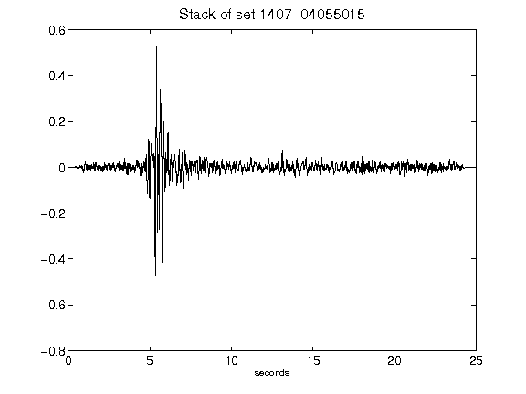](figures/1407-04055015_Stack.png)[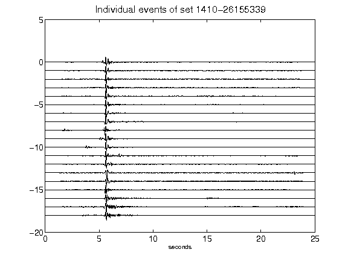](figures/1410-26155339_AllEv.png)[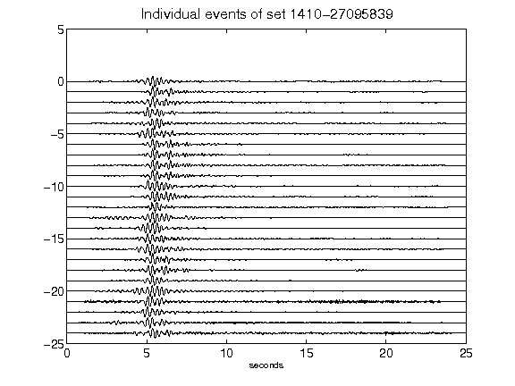](figures/1410-27095839_AllEv.png)[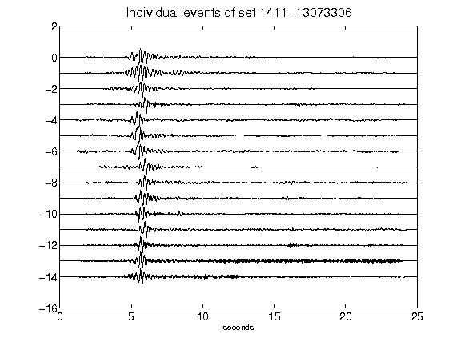](figures/1411-13073306_AllEv.png)[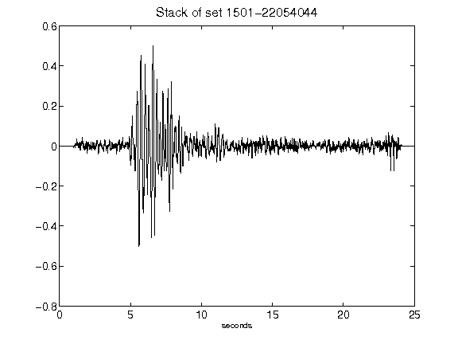](figures/1501-22054044_Stack.png)[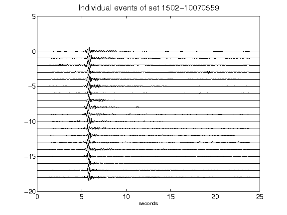](figures/1502-10070559_AllEv.png)[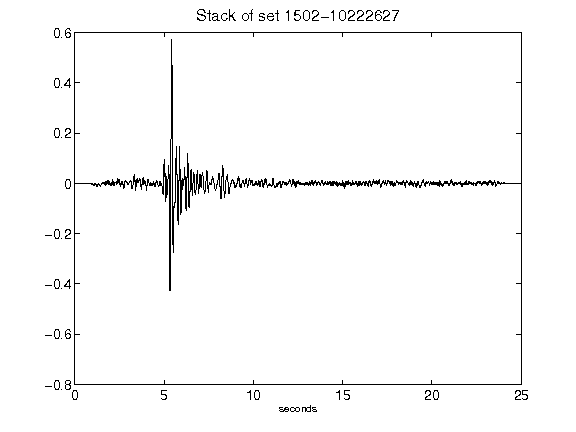](figures/1502-10222627_Stack.png)[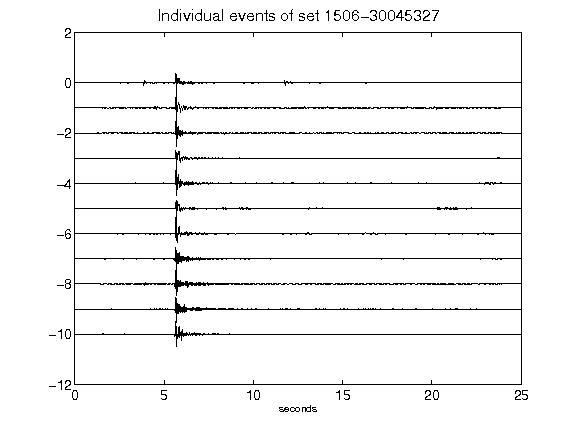](figures/1506-30045327_AllEv.png)[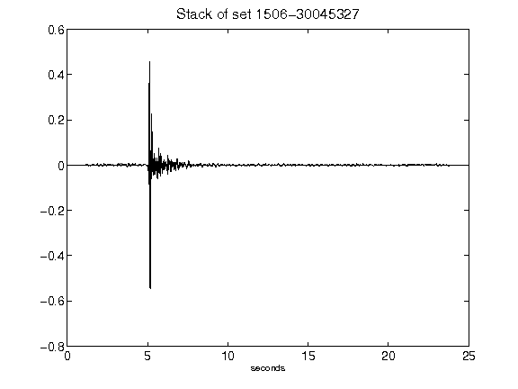](figures/1506-30045327_Stack.png)