# Repeating Earthquake Activity at RCM

## Waveforms
[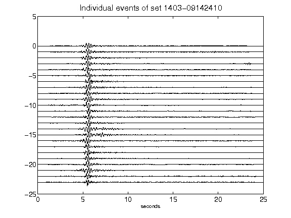](figures/1403-09142410_AllEv.png)[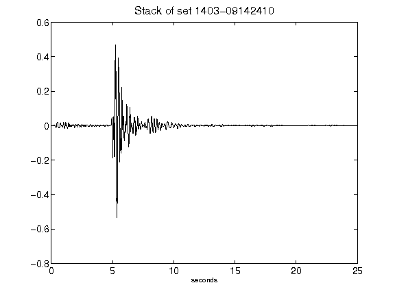](figures/1403-09142410_Stack.png)[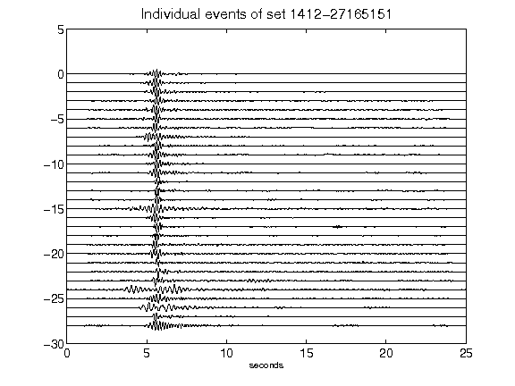](figures/1412-27165151_AllEv.png)[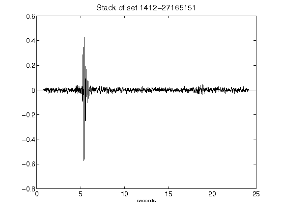](figures/1412-27165151_Stack.png)[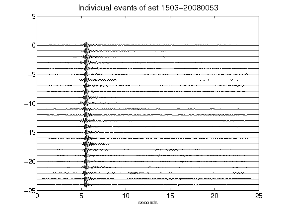](figures/1503-20080053_AllEv.png)[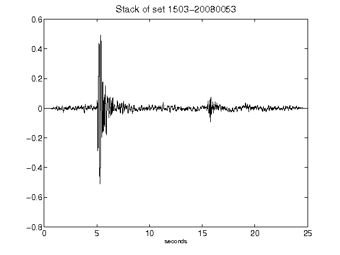](figures/1503-20080053_Stack.png)[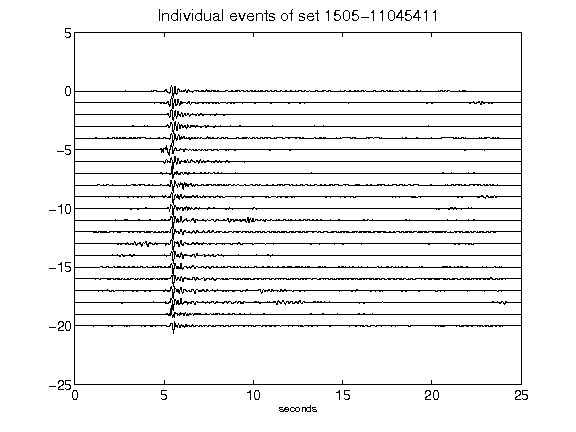](figures/1505-11045411_AllEv.png)[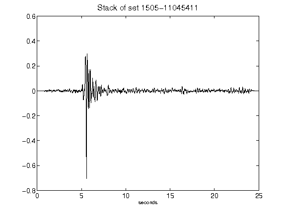](figures/1505-11045411_Stack.png)[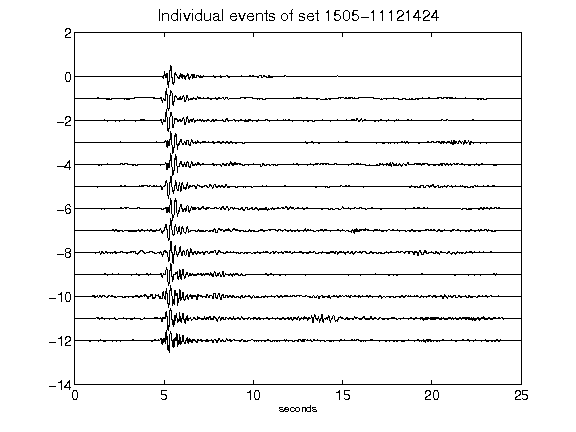](figures/1505-11121424_AllEv.png)[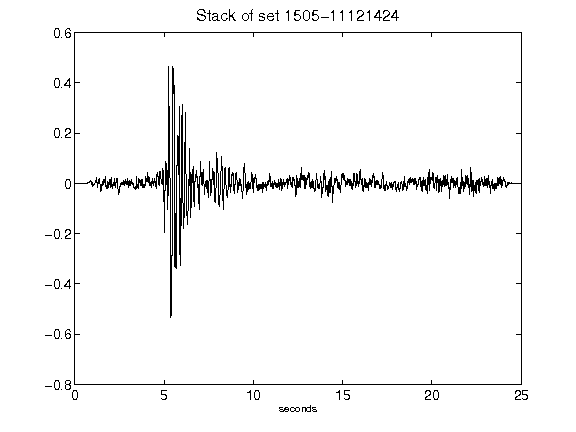](figures/1505-11121424_Stack.png)[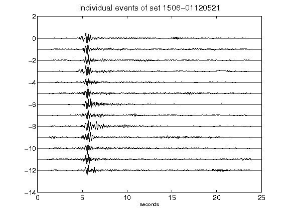](figures/1506-01120521_AllEv.png)[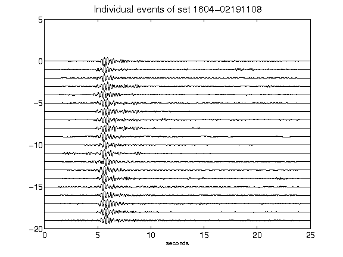](figures/1604-02191108_AllEv.png)[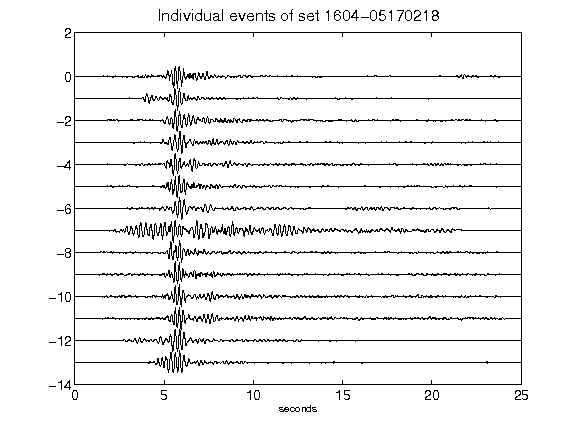](figures/1604-05170218_AllEv.png)[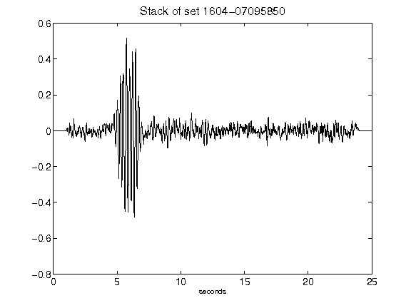](figures/1604-07095850_Stack.png)[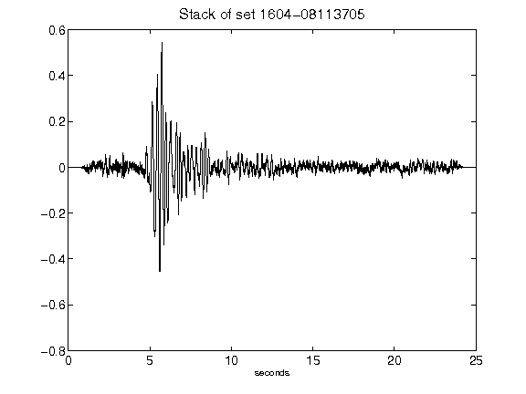](figures/1604-08113705_Stack.png)[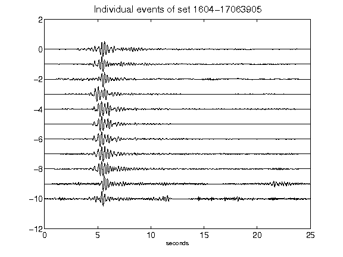](figures/1604-17063905_AllEv.png)[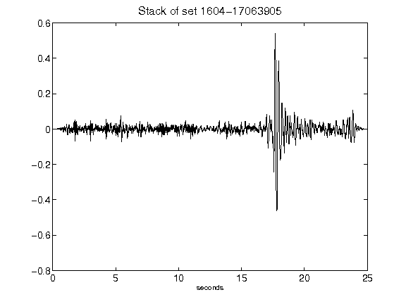](figures/1604-17063905_Stack.png)[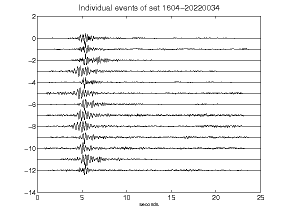](figures/1604-20220034_AllEv.png)[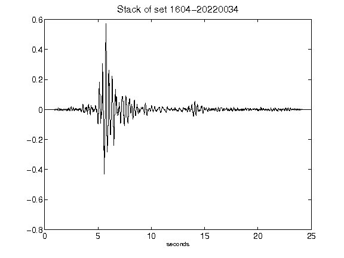](figures/1604-20220034_Stack.png)[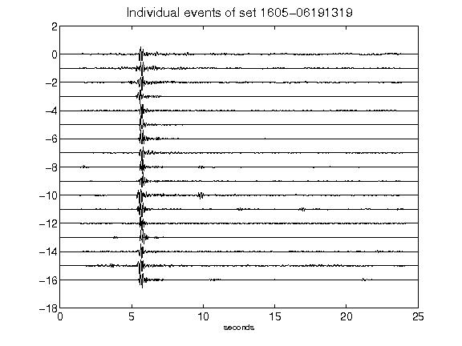](figures/1605-06191319_AllEv.png)[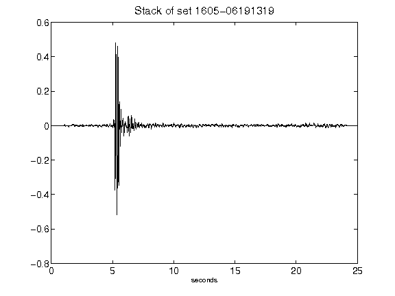](figures/1605-06191319_Stack.png)[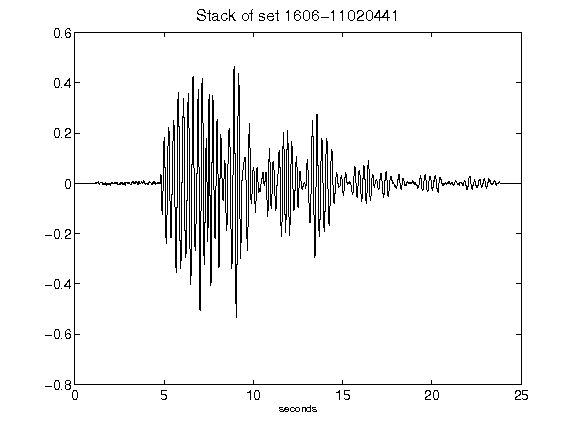](figures/1606-11020441_Stack.png)[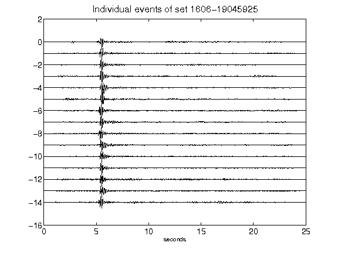](figures/1606-19045925_AllEv.png)[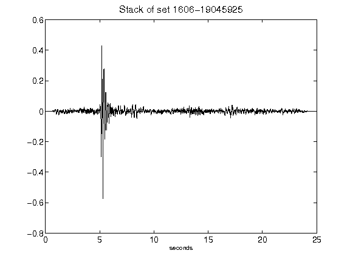](figures/1606-19045925_Stack.png)