# Repeating Earthquake Activity at RCM

## Waveforms
[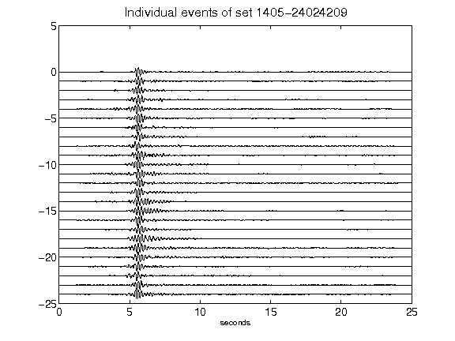](figures/1405-24024209_AllEv.png)[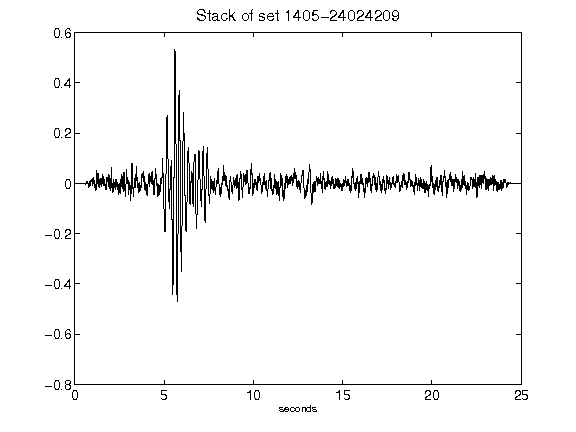](figures/1405-24024209_Stack.png)[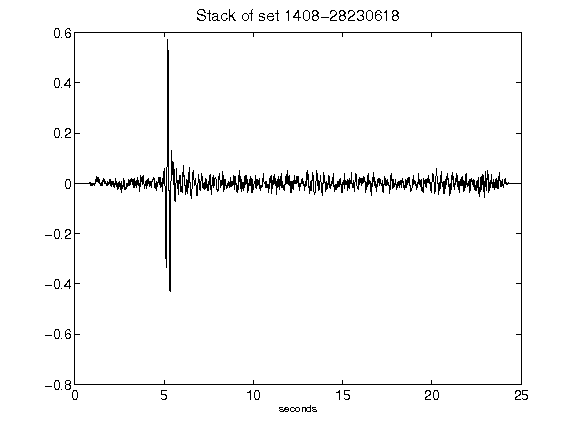](figures/1408-28230618_Stack.png)[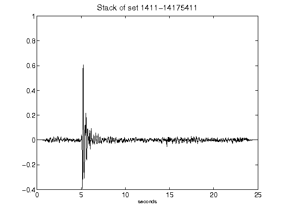](figures/1411-14175411_Stack.png)[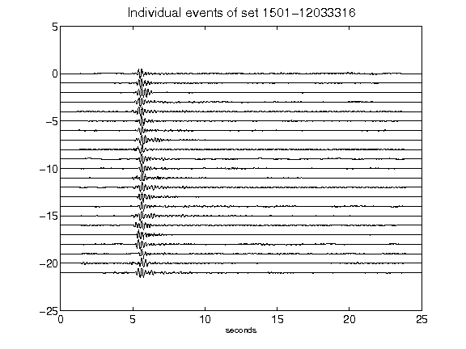](figures/1501-12033316_AllEv.png)[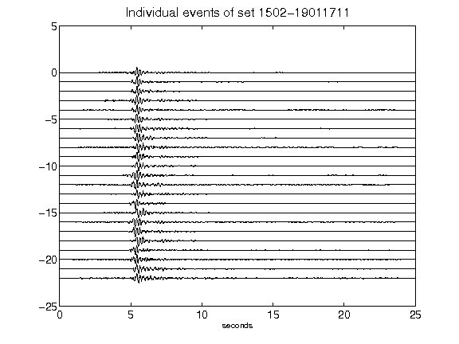](figures/1502-19011711_AllEv.png)[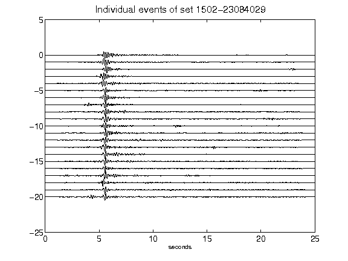](figures/1502-23084029_AllEv.png)[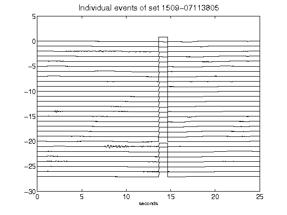](figures/1509-07113805_AllEv.png)[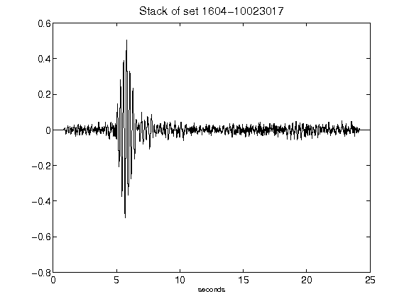](figures/1604-10023017_Stack.png)[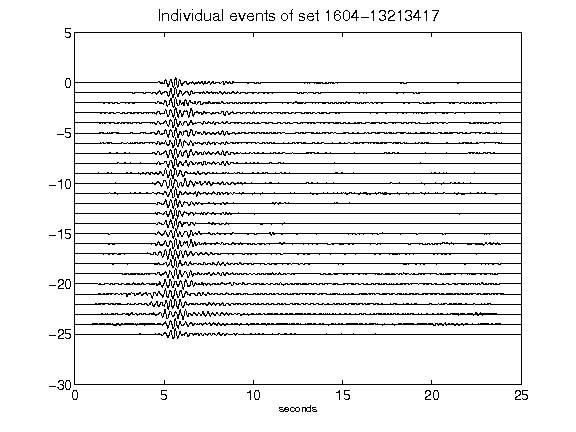](figures/1604-13213417_AllEv.png)[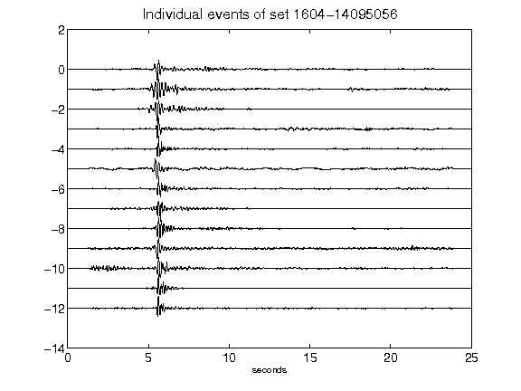](figures/1604-14095056_AllEv.png)[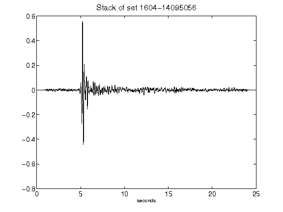](figures/1604-14095056_Stack.png)[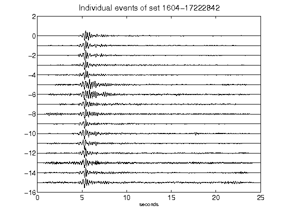](figures/1604-17222842_AllEv.png)[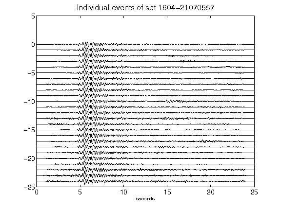](figures/1604-21070557_AllEv.png)[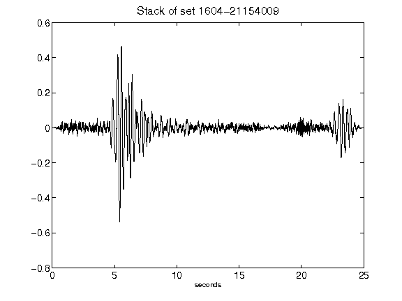](figures/1604-21154009_Stack.png)[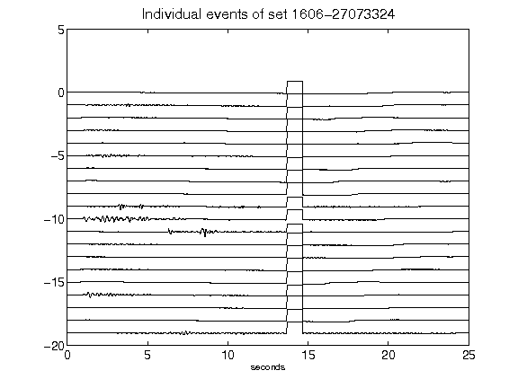](figures/1606-27073324_AllEv.png)[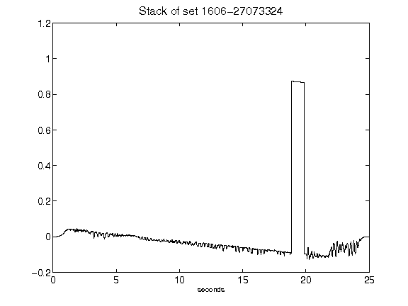](figures/1606-27073324_Stack.png)