# Repeating Earthquake Activity at RCM

## Waveforms
[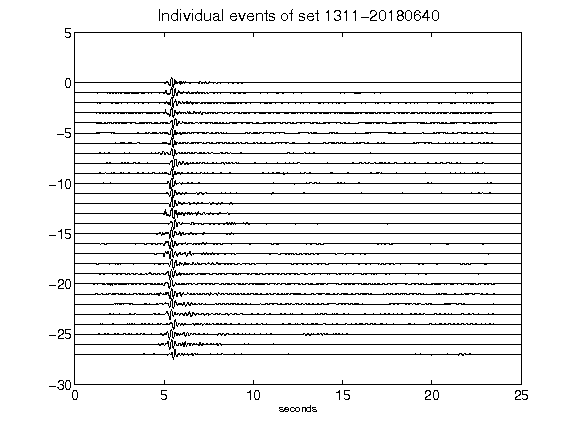](figures/1311-20180640_AllEv.png)[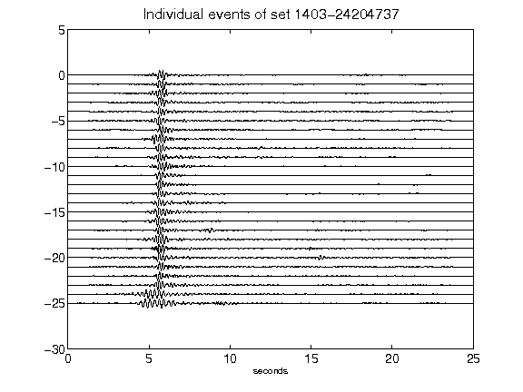](figures/1403-24204737_AllEv.png)[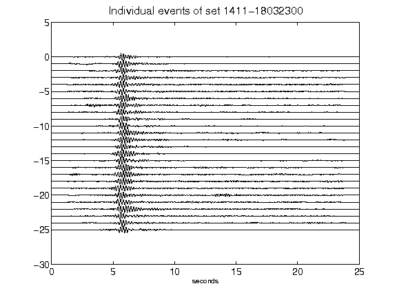](figures/1411-18032300_AllEv.png)[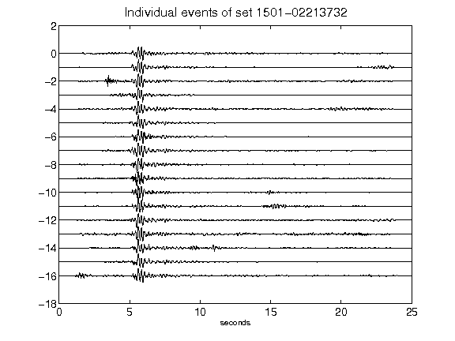](figures/1501-02213732_AllEv.png)[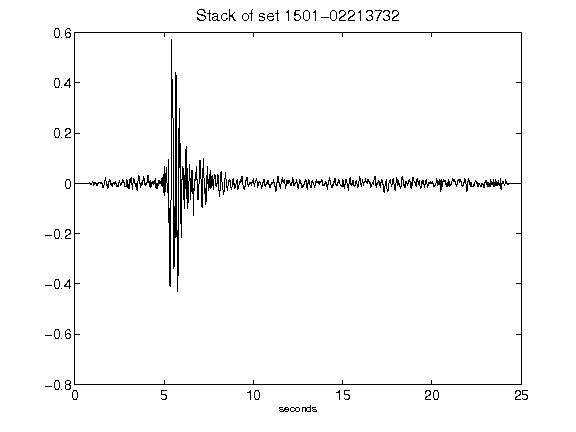](figures/1501-02213732_Stack.png)[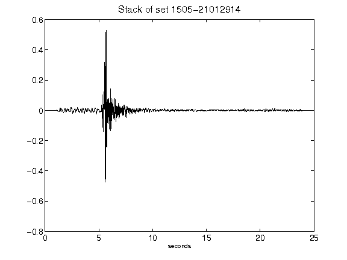](figures/1505-21012914_Stack.png)[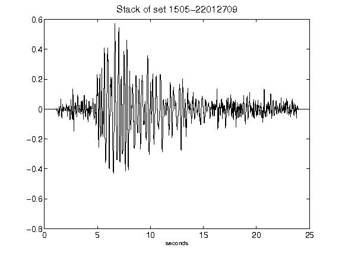](figures/1505-22012709_Stack.png)[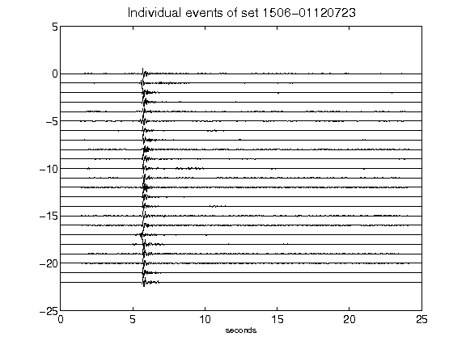](figures/1506-01120723_AllEv.png)[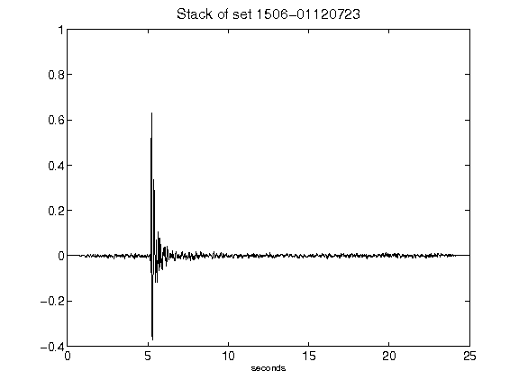](figures/1506-01120723_Stack.png)[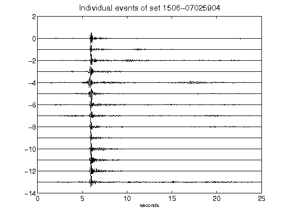](figures/1506-07025904_AllEv.png)[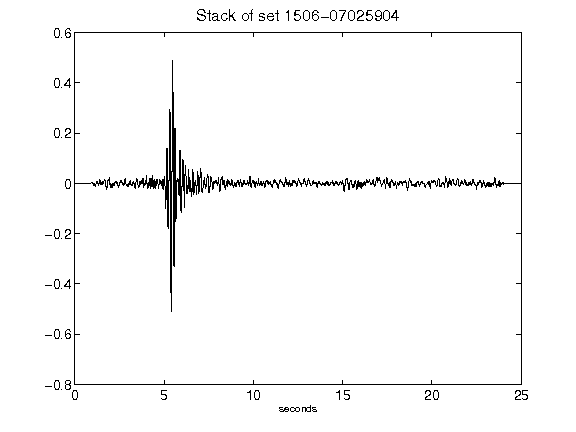](figures/1506-07025904_Stack.png)