# Repeating Earthquake Activity at RCM

## Waveforms
[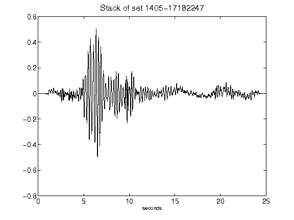](figures/1405-17182247_Stack.png)[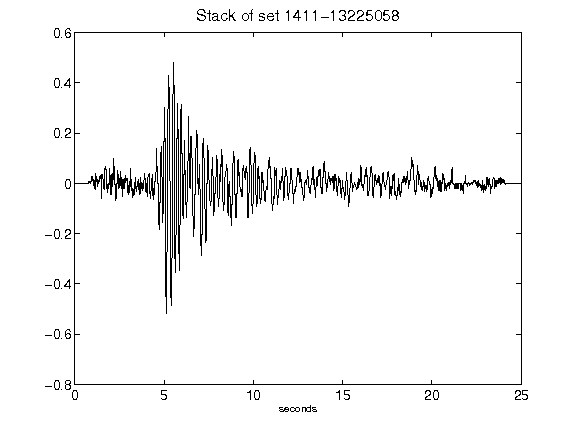](figures/1411-13225058_Stack.png)[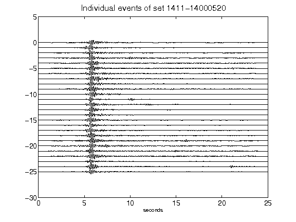](figures/1411-14000520_AllEv.png)[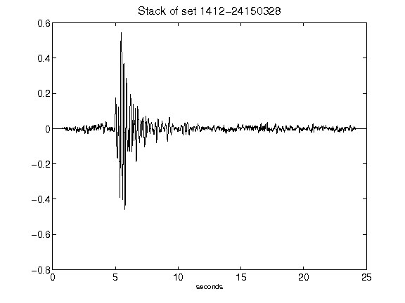](figures/1412-24150328_Stack.png)[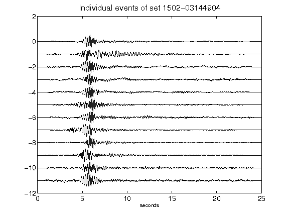](figures/1502-03144904_AllEv.png)[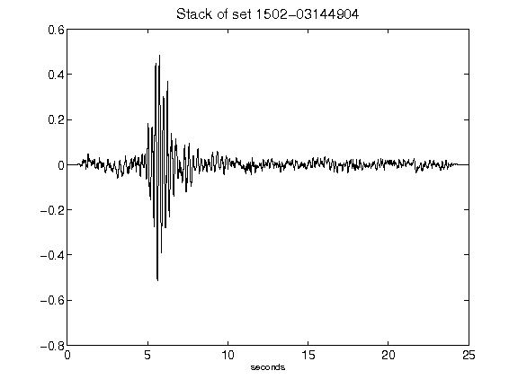](figures/1502-03144904_Stack.png)[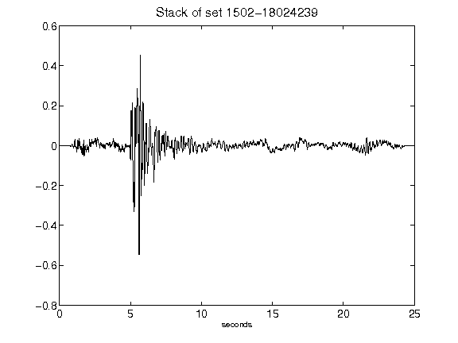](figures/1502-18024239_Stack.png)[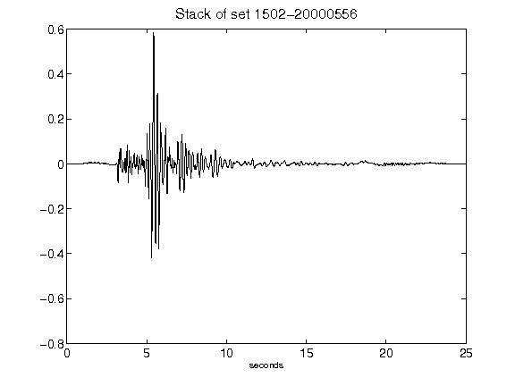](figures/1502-20000556_Stack.png)[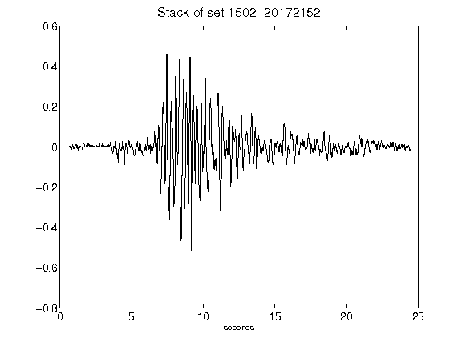](figures/1502-20172152_Stack.png)[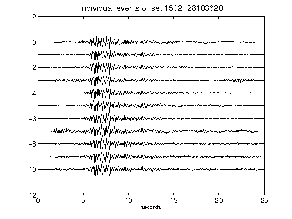](figures/1502-28103620_AllEv.png)[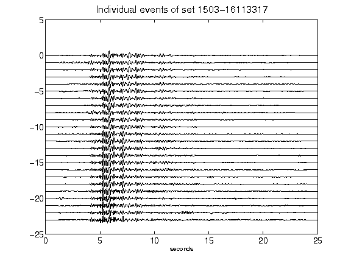](figures/1503-16113317_AllEv.png)[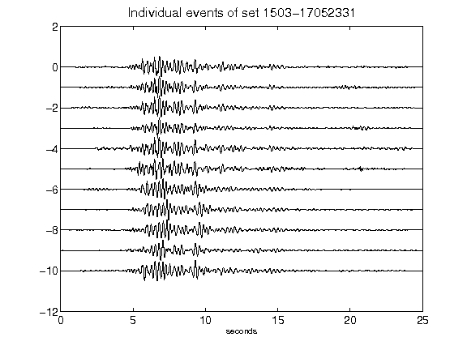](figures/1503-17052331_AllEv.png)[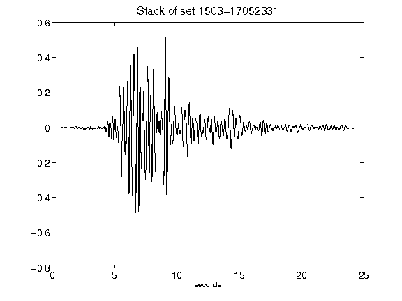](figures/1503-17052331_Stack.png)[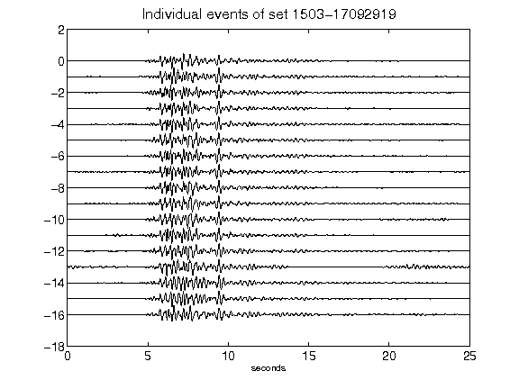](figures/1503-17092919_AllEv.png)[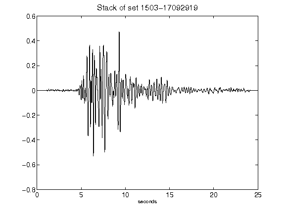](figures/1503-17092919_Stack.png)