# Repeating Earthquake Activity at RCM
[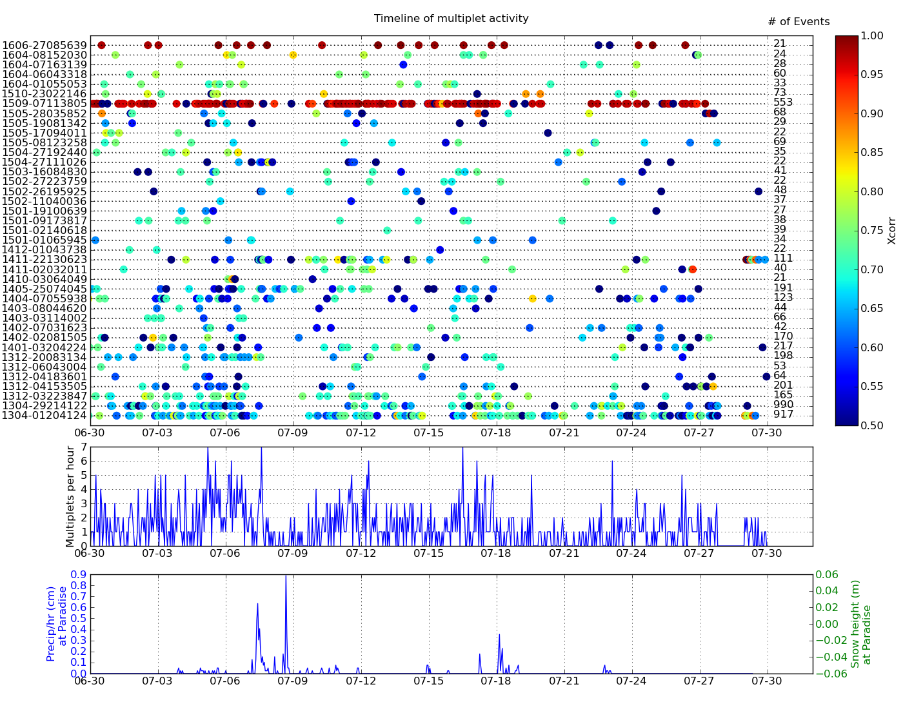](figures/multTimeline20py.png)

## Waveforms
[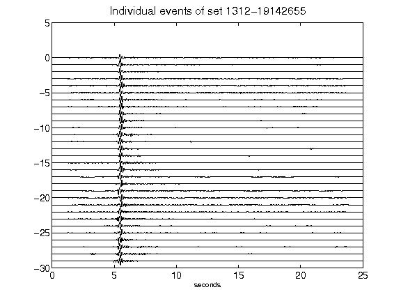](figures/1312-19142655_AllEv.png)[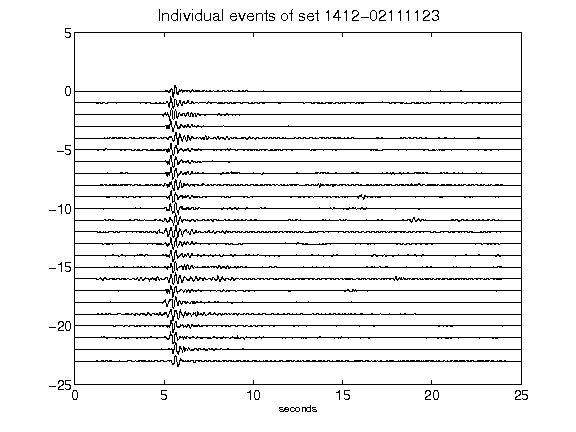](figures/1412-02111123_AllEv.png)[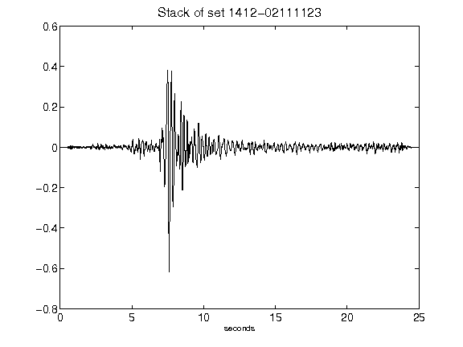](figures/1412-02111123_Stack.png)[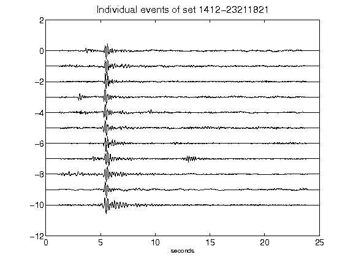](figures/1412-23211821_AllEv.png)[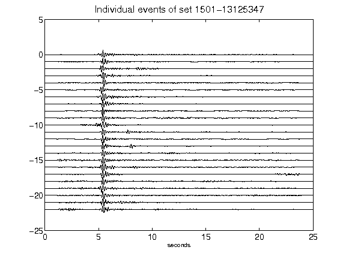](figures/1501-13125347_AllEv.png)[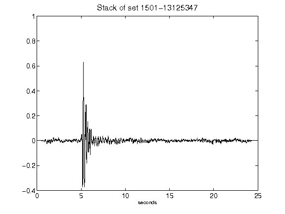](figures/1501-13125347_Stack.png)[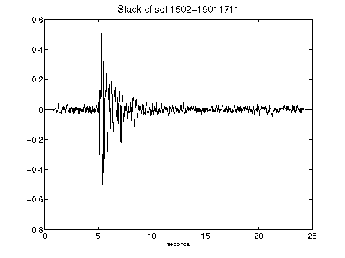](figures/1502-19011711_Stack.png)[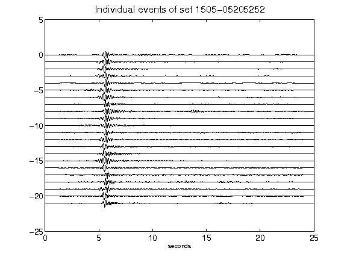](figures/1505-05205252_AllEv.png)[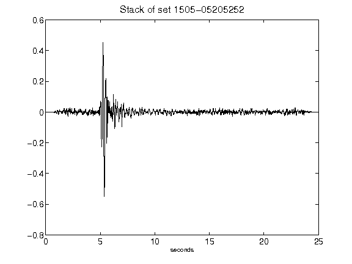](figures/1505-05205252_Stack.png)[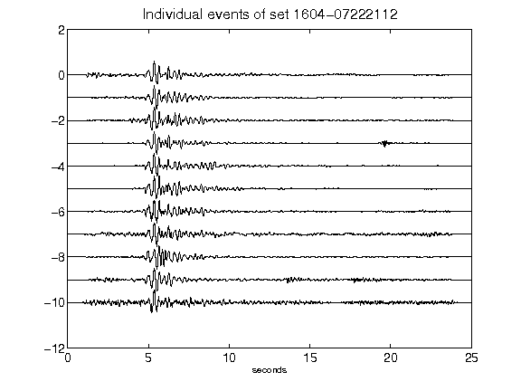](figures/1604-07222112_AllEv.png)[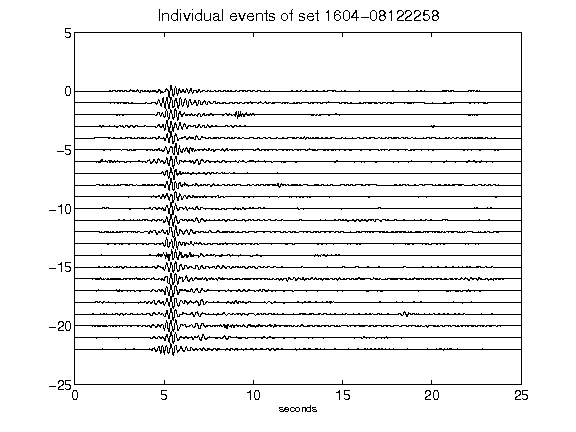](figures/1604-08122258_AllEv.png)[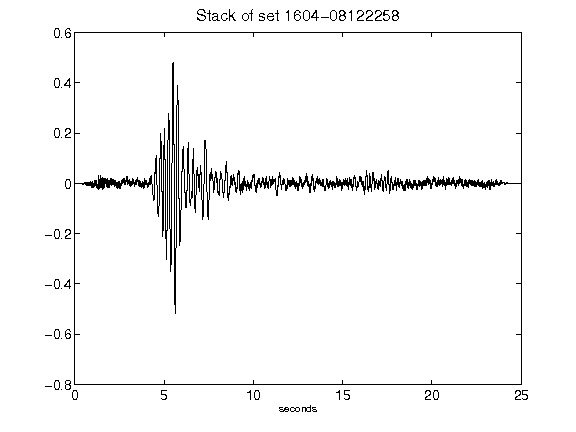](figures/1604-08122258_Stack.png)[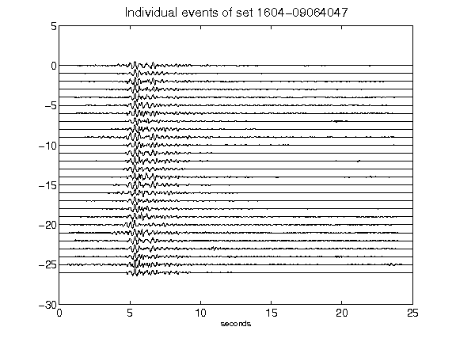](figures/1604-09064047_AllEv.png)[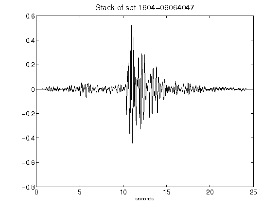](figures/1604-09064047_Stack.png)[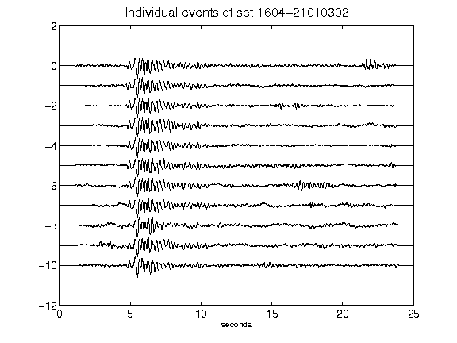](figures/1604-21010302_AllEv.png)[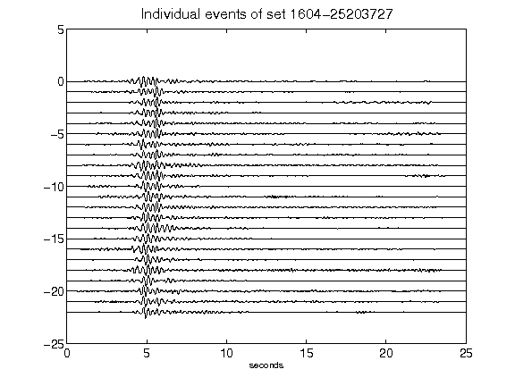](figures/1604-25203727_AllEv.png)[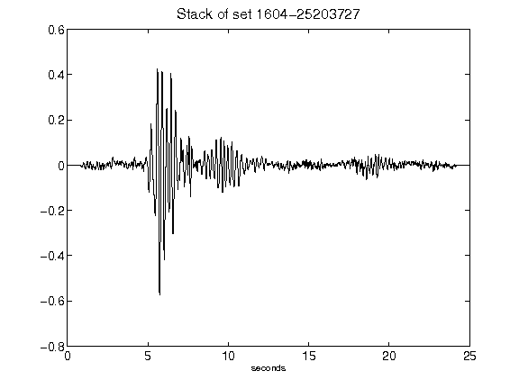](figures/1604-25203727_Stack.png)[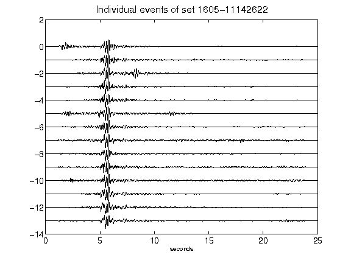](figures/1605-11142622_AllEv.png)[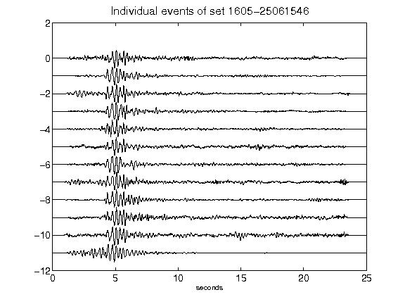](figures/1605-25061546_AllEv.png)[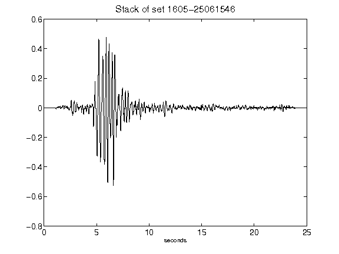](figures/1605-25061546_Stack.png)[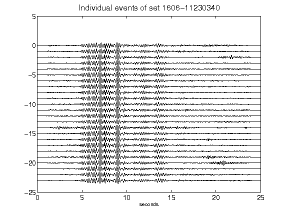](figures/1606-11230340_AllEv.png)[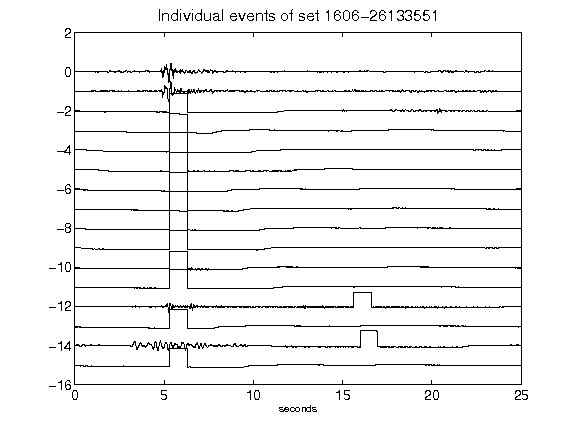](figures/1606-26133551_AllEv.png)[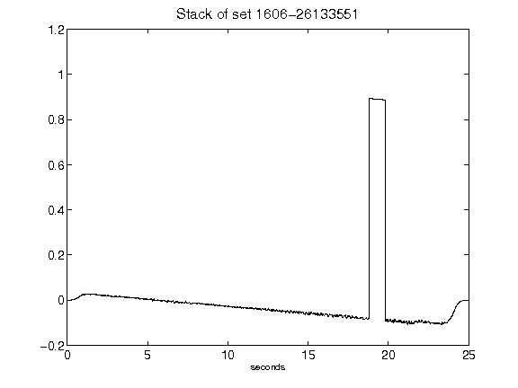](figures/1606-26133551_Stack.png)