# Repeating Earthquake Activity at RCM

## Waveforms
[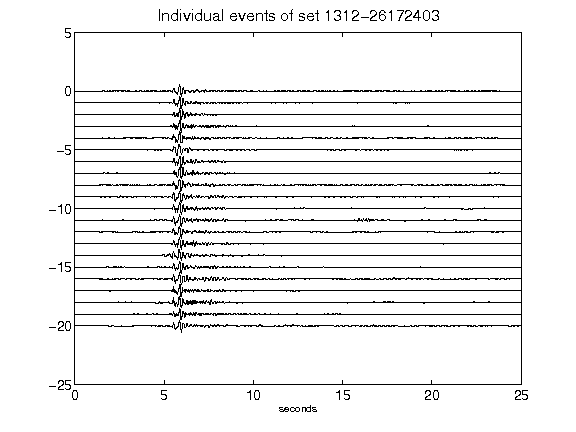](figures/1312-26172403_AllEv.png)[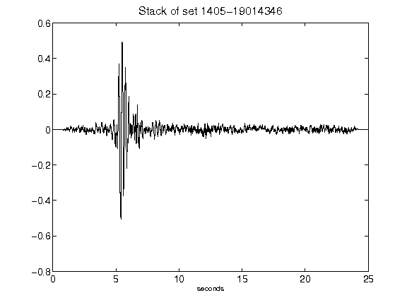](figures/1405-19014346_Stack.png)[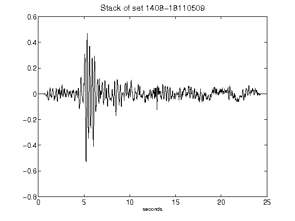](figures/1408-18110509_Stack.png)[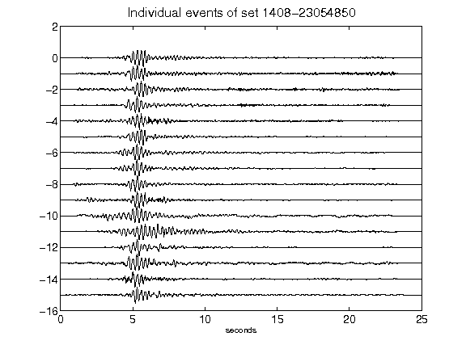](figures/1408-23054850_AllEv.png)[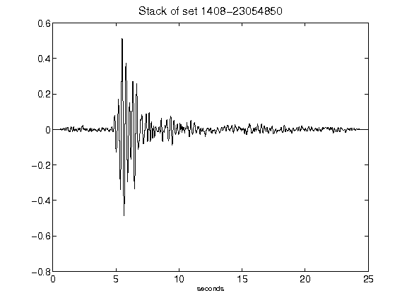](figures/1408-23054850_Stack.png)[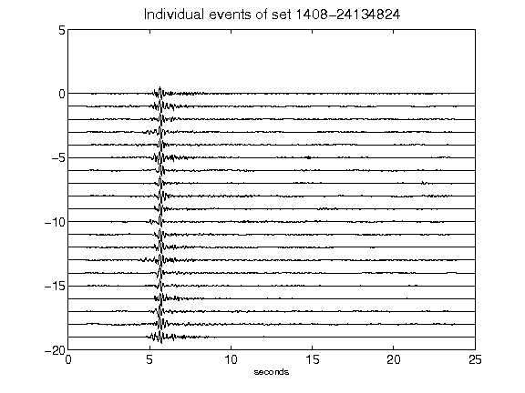](figures/1408-24134824_AllEv.png)[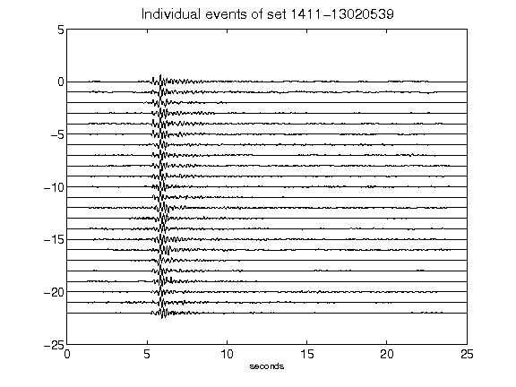](figures/1411-13020539_AllEv.png)[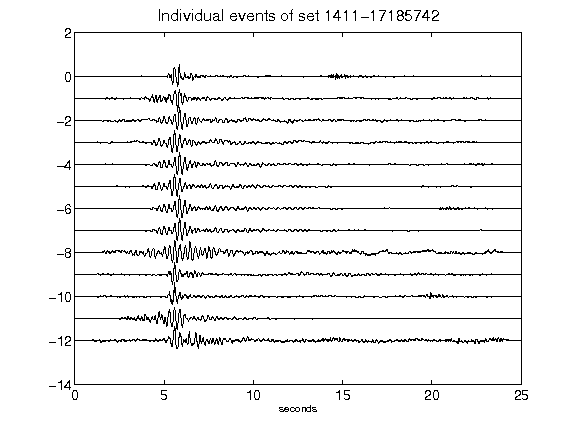](figures/1411-17185742_AllEv.png)[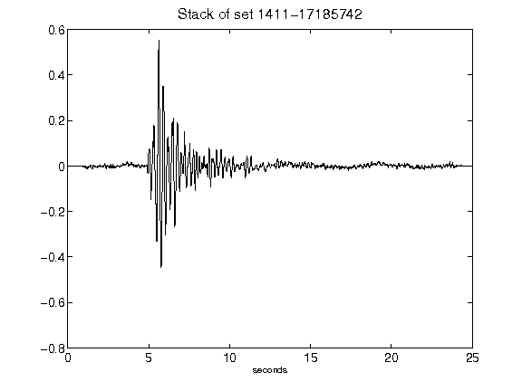](figures/1411-17185742_Stack.png)[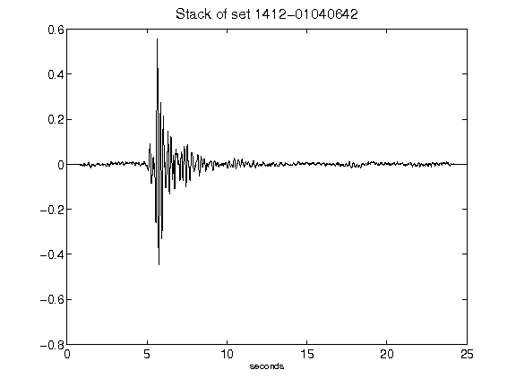](figures/1412-01040642_Stack.png)[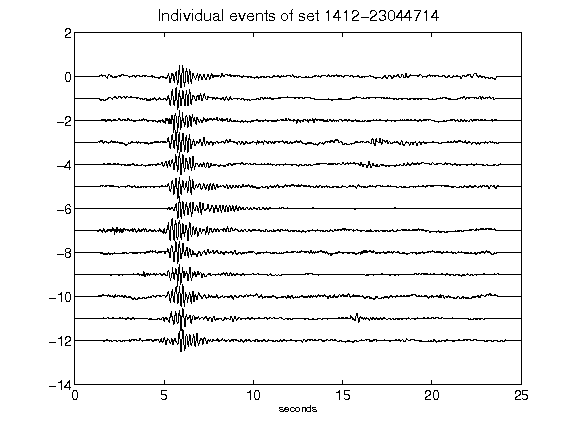](figures/1412-23044714_AllEv.png)[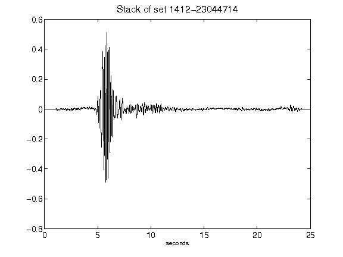](figures/1412-23044714_Stack.png)[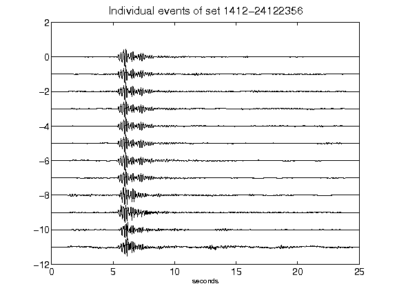](figures/1412-24122356_AllEv.png)[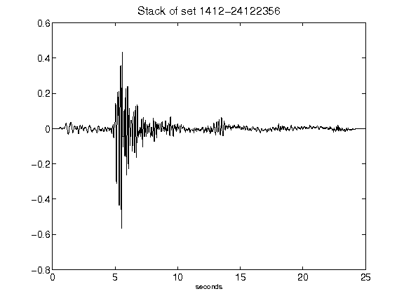](figures/1412-24122356_Stack.png)[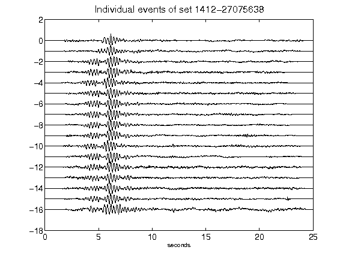](figures/1412-27075638_AllEv.png)[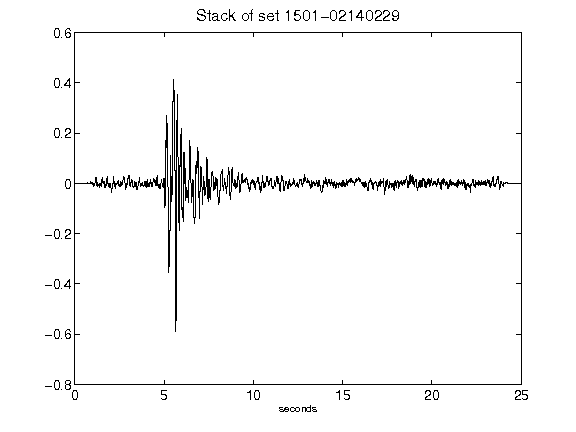](figures/1501-02140229_Stack.png)[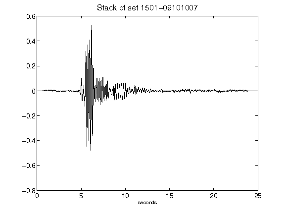](figures/1501-09101007_Stack.png)[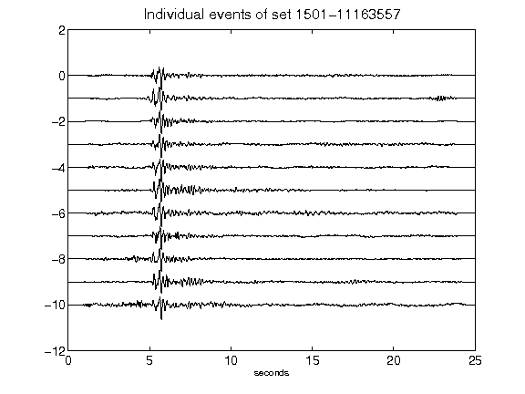](figures/1501-11163557_AllEv.png)[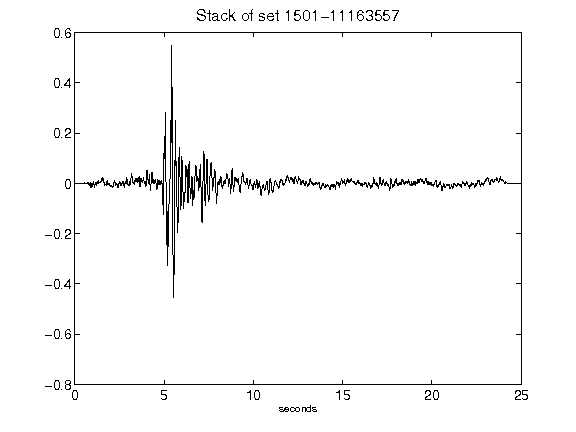](figures/1501-11163557_Stack.png)[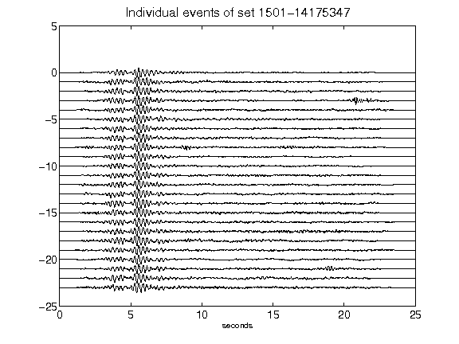](figures/1501-14175347_AllEv.png)[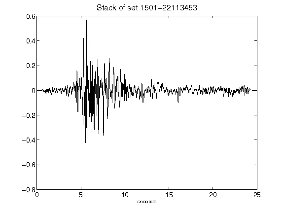](figures/1501-22113453_Stack.png)[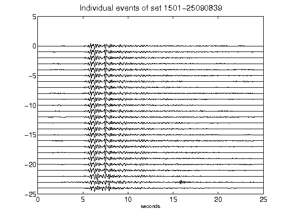](figures/1501-25090839_AllEv.png)[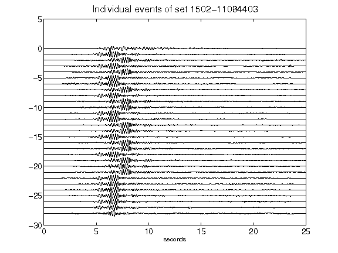](figures/1502-11084403_AllEv.png)[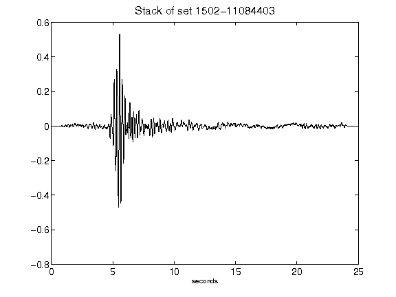](figures/1502-11084403_Stack.png)