# Repeating Earthquake Activity at RCM

## Waveforms
[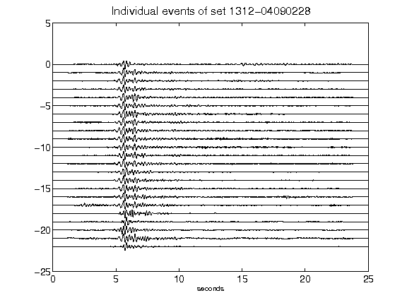](figures/1312-04090228_AllEv.png)[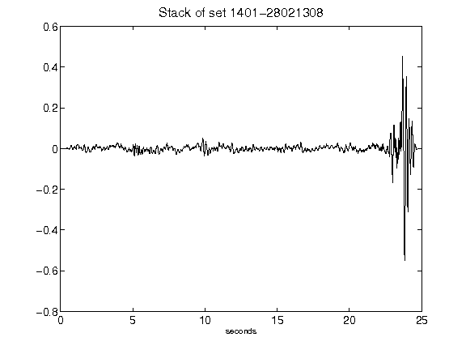](figures/1401-28021308_Stack.png)[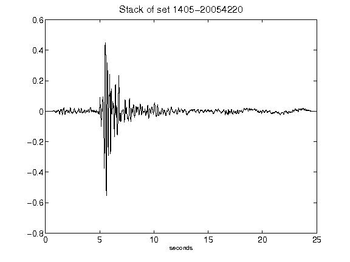](figures/1405-20054220_Stack.png)[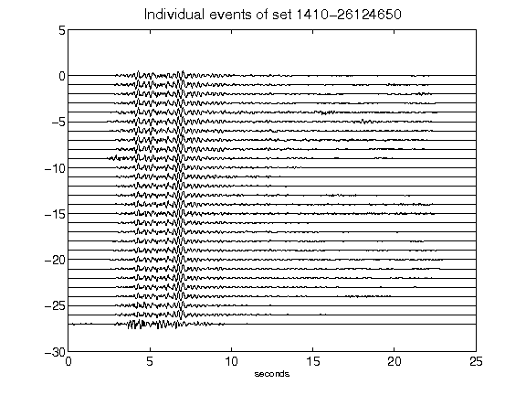](figures/1410-26124650_AllEv.png)[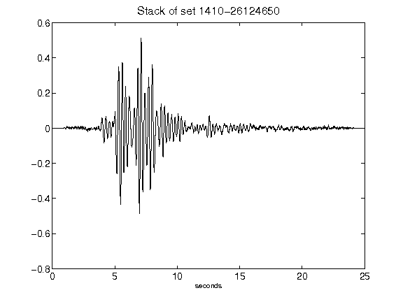](figures/1410-26124650_Stack.png)[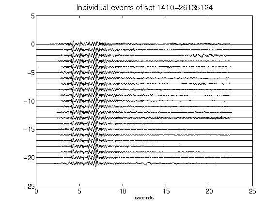](figures/1410-26135124_AllEv.png)[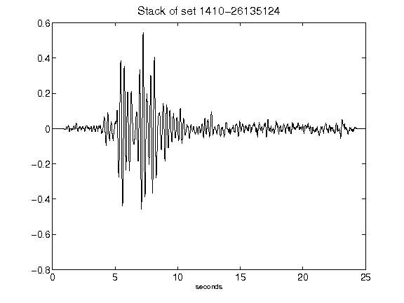](figures/1410-26135124_Stack.png)[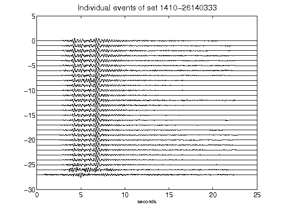](figures/1410-26140333_AllEv.png)[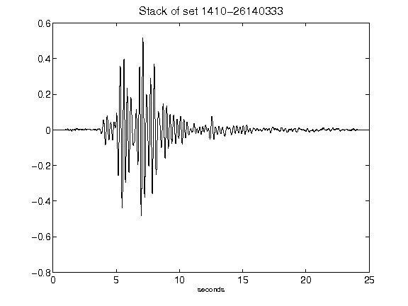](figures/1410-26140333_Stack.png)[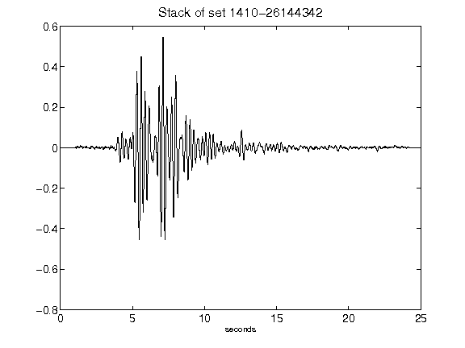](figures/1410-26144342_Stack.png)[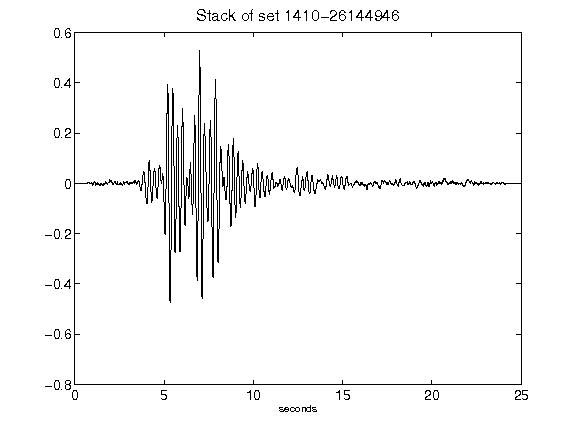](figures/1410-26144946_Stack.png)[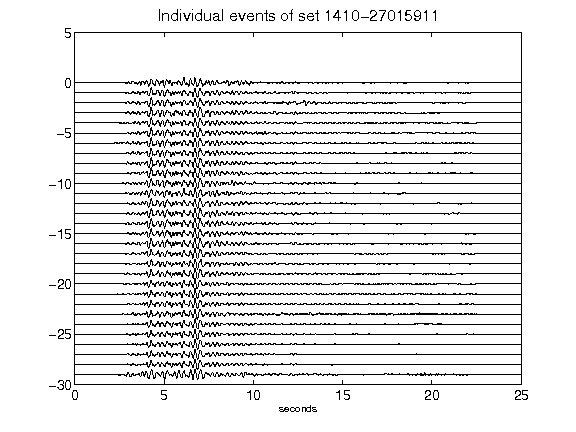](figures/1410-27015911_AllEv.png)[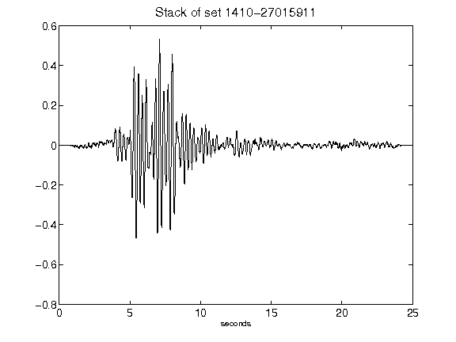](figures/1410-27015911_Stack.png)[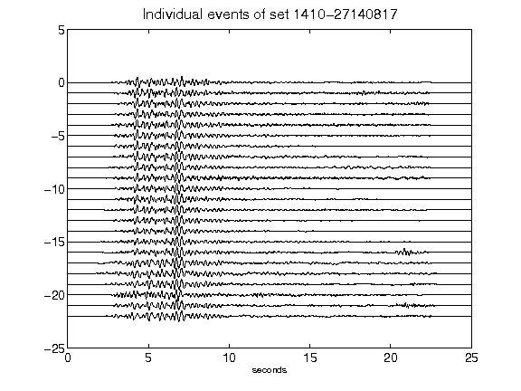](figures/1410-27140817_AllEv.png)[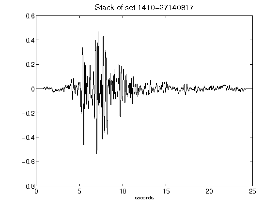](figures/1410-27140817_Stack.png)[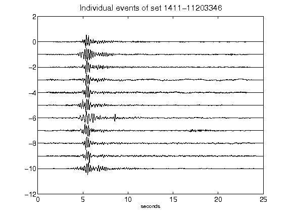](figures/1411-11203346_AllEv.png)[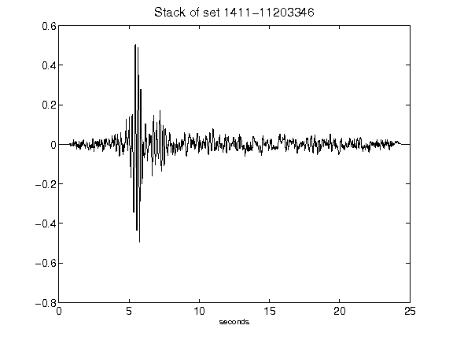](figures/1411-11203346_Stack.png)[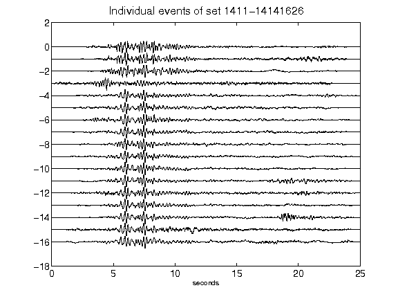](figures/1411-14141626_AllEv.png)[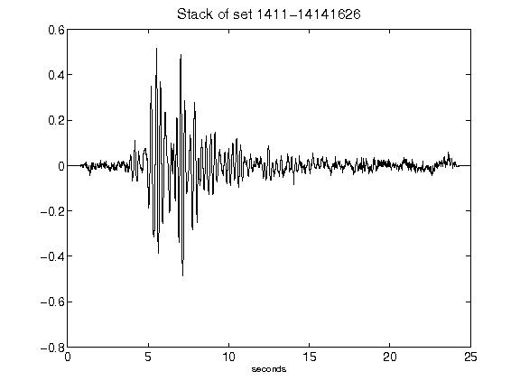](figures/1411-14141626_Stack.png)[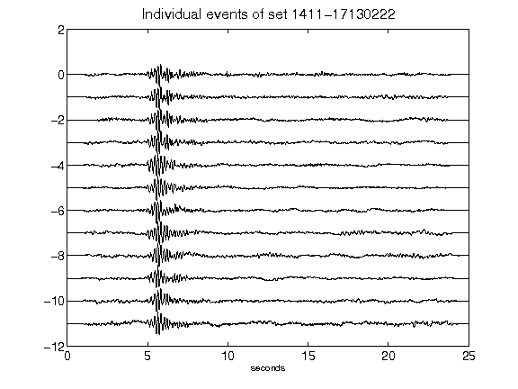](figures/1411-17130222_AllEv.png)[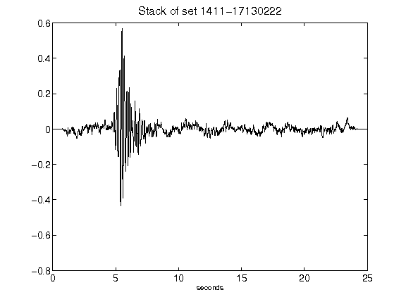](figures/1411-17130222_Stack.png)[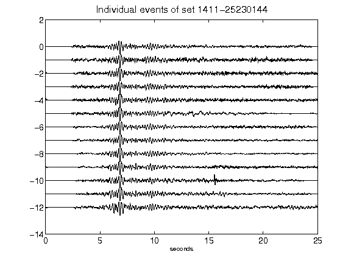](figures/1411-25230144_AllEv.png)[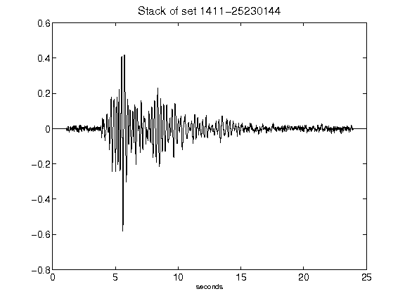](figures/1411-25230144_Stack.png)