# Repeating Earthquake Activity at RCM

## Waveforms
[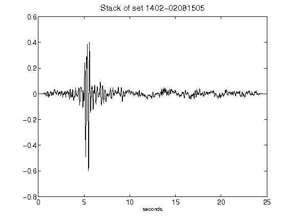](figures/1402-02081505_Stack.png)[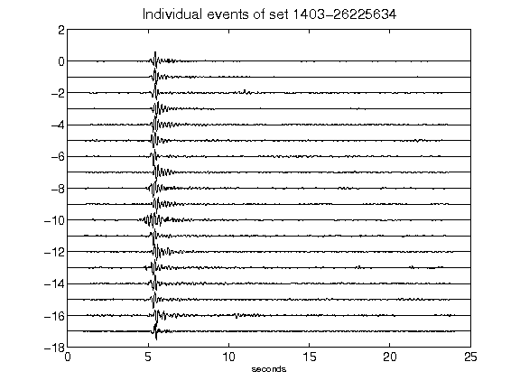](figures/1403-26225634_AllEv.png)[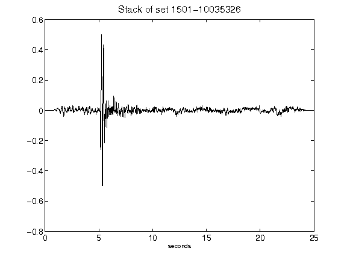](figures/1501-10035326_Stack.png)[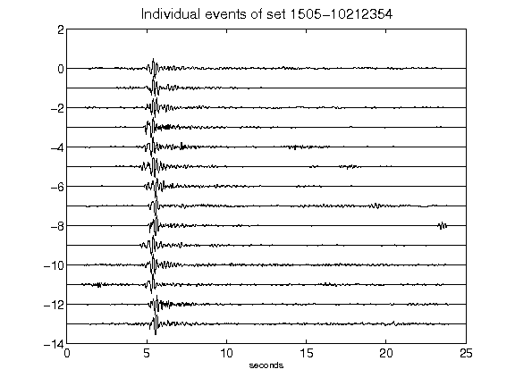](figures/1505-10212354_AllEv.png)[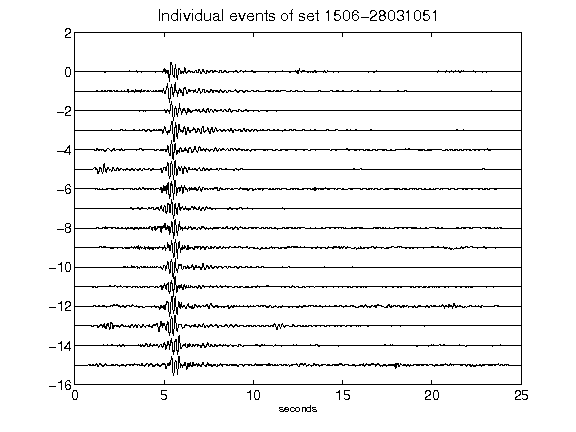](figures/1506-28031051_AllEv.png)[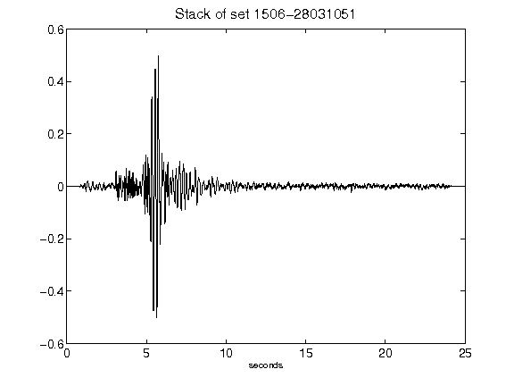](figures/1506-28031051_Stack.png)[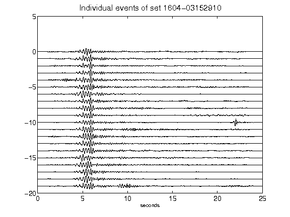](figures/1604-03152910_AllEv.png)[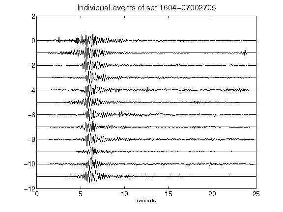](figures/1604-07002705_AllEv.png)[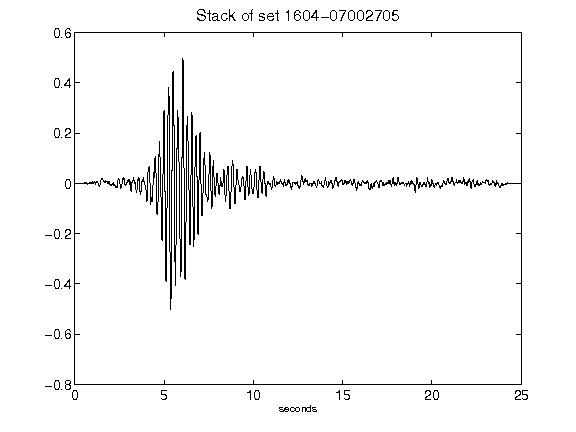](figures/1604-07002705_Stack.png)[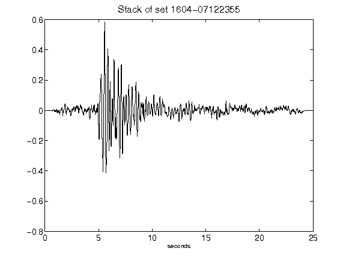](figures/1604-07122355_Stack.png)[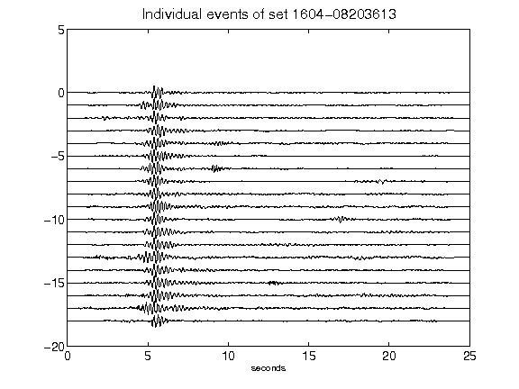](figures/1604-08203613_AllEv.png)[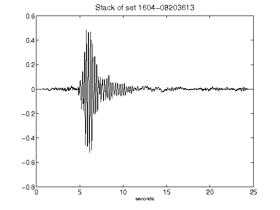](figures/1604-08203613_Stack.png)[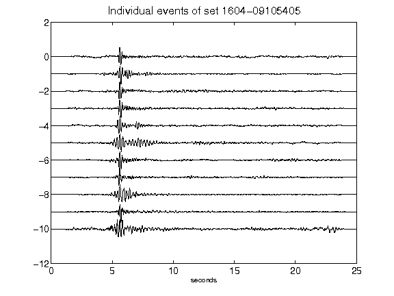](figures/1604-09105405_AllEv.png)[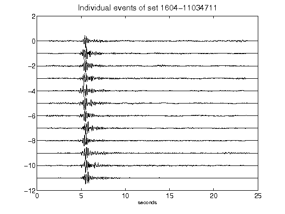](figures/1604-11034711_AllEv.png)[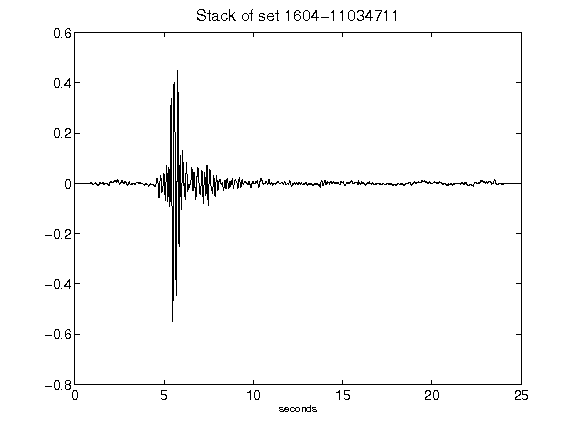](figures/1604-11034711_Stack.png)