# Repeating Earthquake Activity at RCM

## Waveforms
[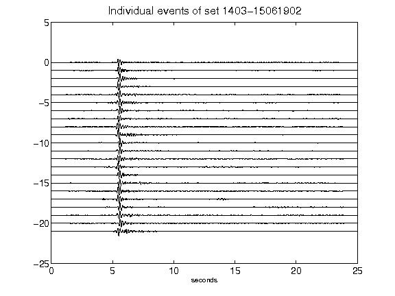](figures/1403-15061902_AllEv.png)[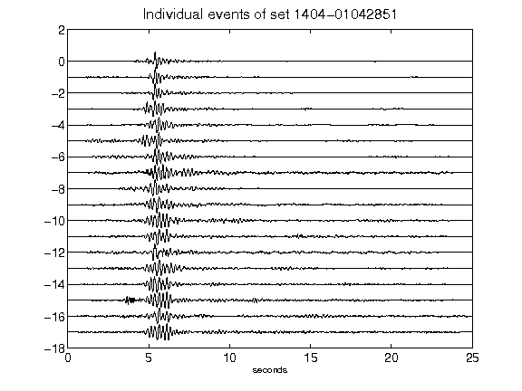](figures/1404-01042851_AllEv.png)[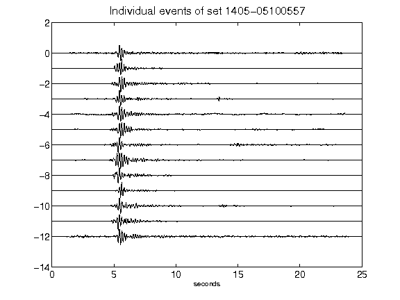](figures/1405-05100557_AllEv.png)[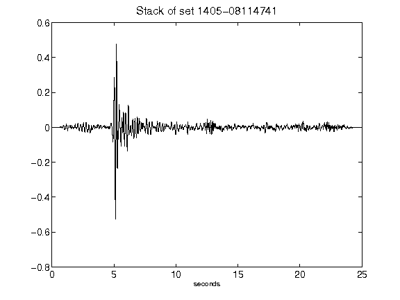](figures/1405-08114741_Stack.png)[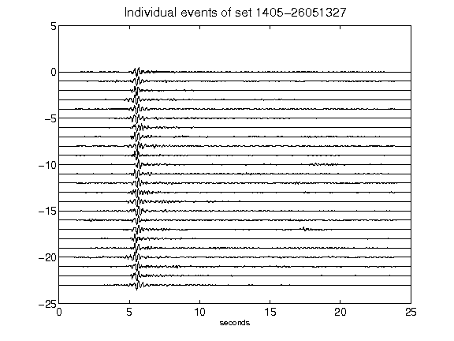](figures/1405-26051327_AllEv.png)[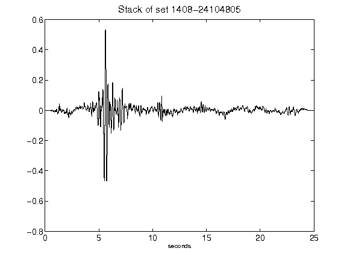](figures/1408-24104805_Stack.png)[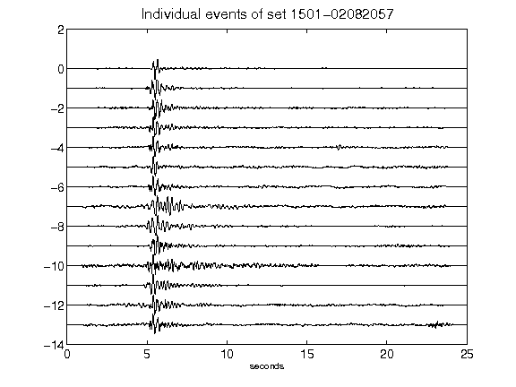](figures/1501-02082057_AllEv.png)[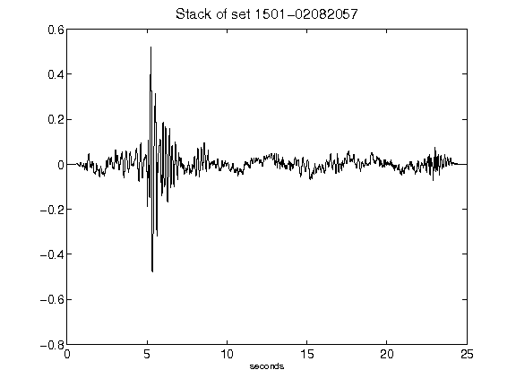](figures/1501-02082057_Stack.png)[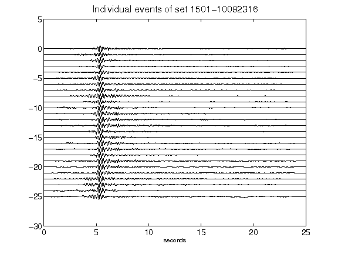](figures/1501-10092316_AllEv.png)[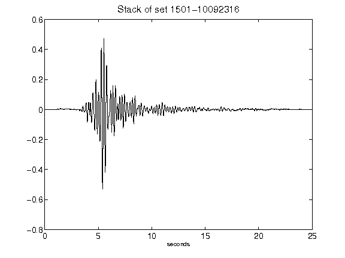](figures/1501-10092316_Stack.png)[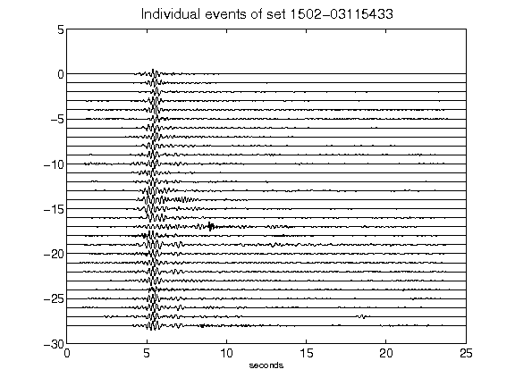](figures/1502-03115433_AllEv.png)[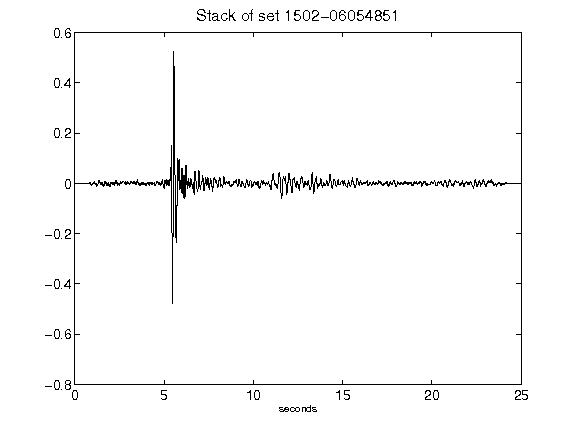](figures/1502-06054851_Stack.png)[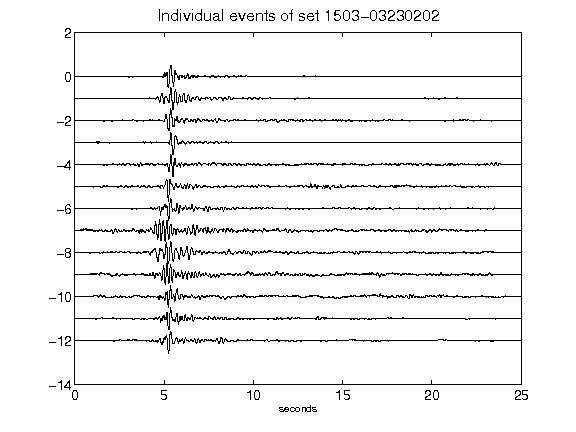](figures/1503-03230202_AllEv.png)[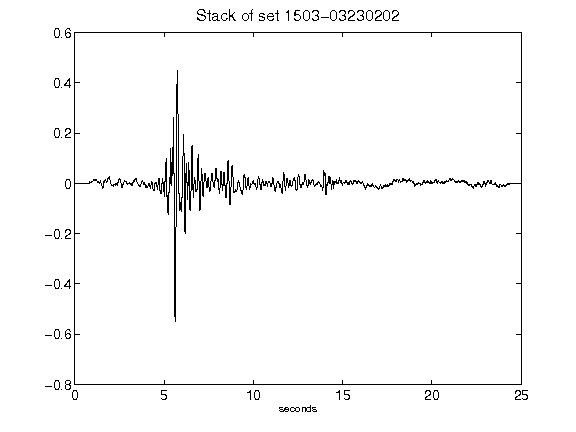](figures/1503-03230202_Stack.png)[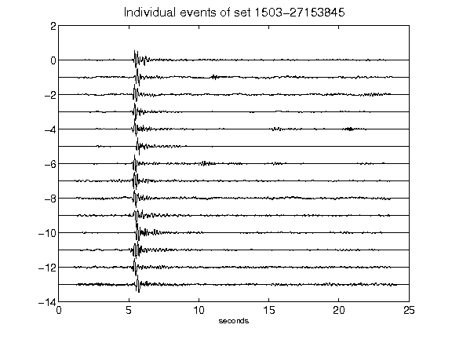](figures/1503-27153845_AllEv.png)[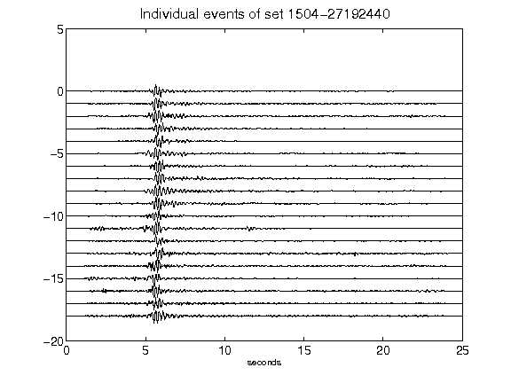](figures/1504-27192440_AllEv.png)[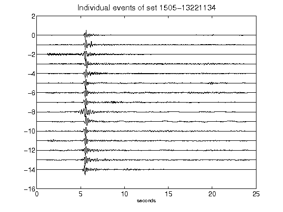](figures/1505-13221134_AllEv.png)[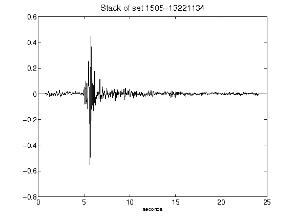](figures/1505-13221134_Stack.png)[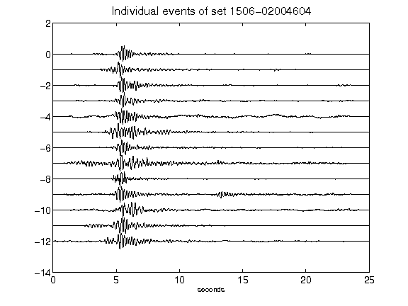](figures/1506-02004604_AllEv.png)[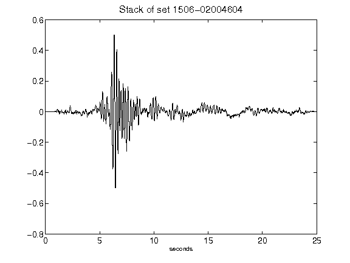](figures/1506-02004604_Stack.png)[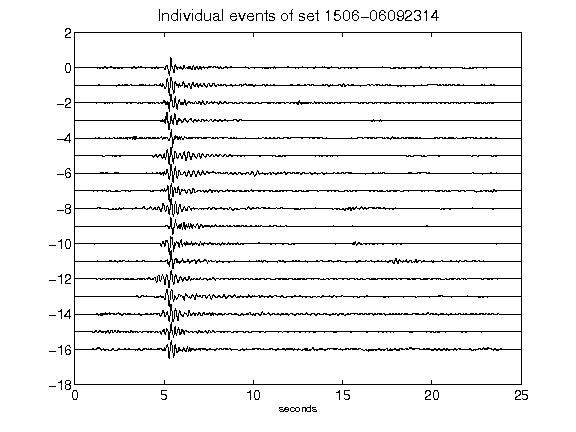](figures/1506-06092314_AllEv.png)[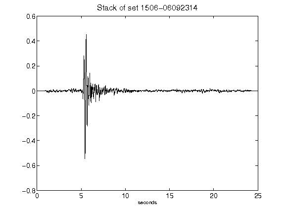](figures/1506-06092314_Stack.png)[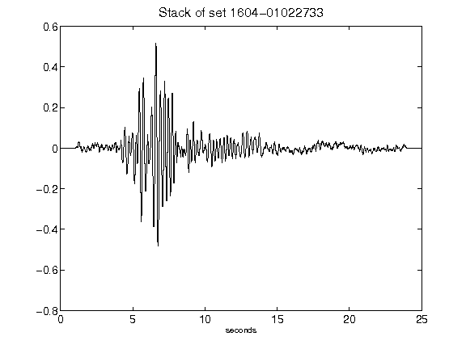](figures/1604-01022733_Stack.png)[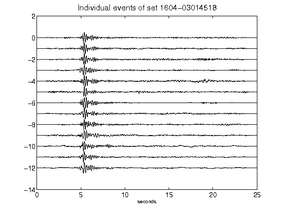](figures/1604-03014518_AllEv.png)[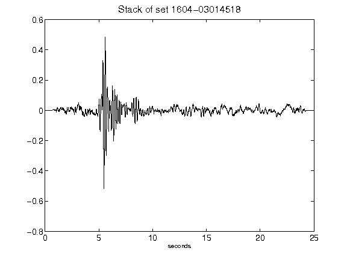](figures/1604-03014518_Stack.png)