# Repeating Earthquake Activity at RCM

## Waveforms
[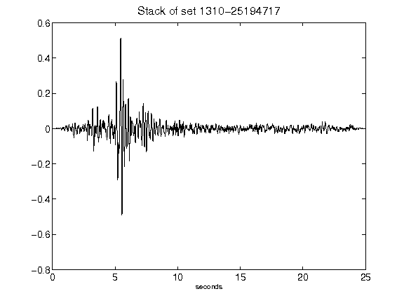](figures/1310-25194717_Stack.png)[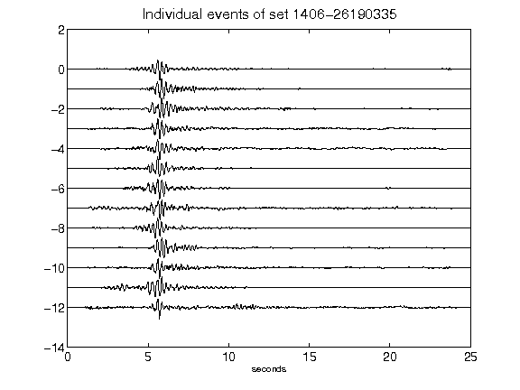](figures/1406-26190335_AllEv.png)[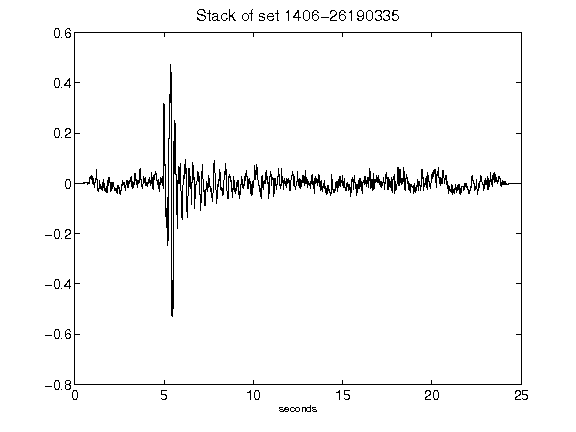](figures/1406-26190335_Stack.png)[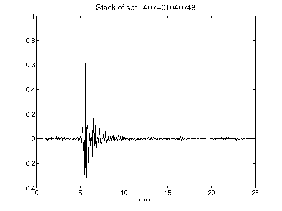](figures/1407-01040748_Stack.png)[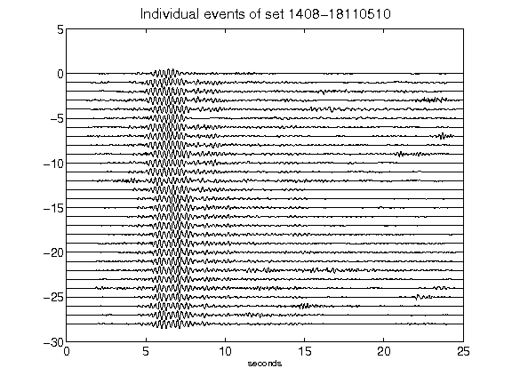](figures/1408-18110510_AllEv.png)[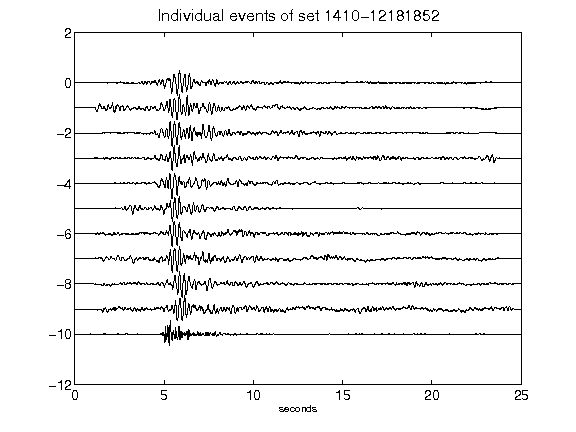](figures/1410-12181852_AllEv.png)[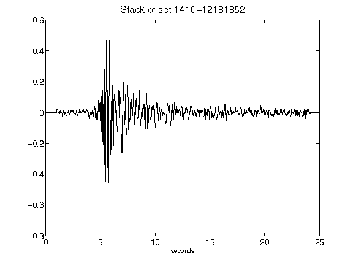](figures/1410-12181852_Stack.png)[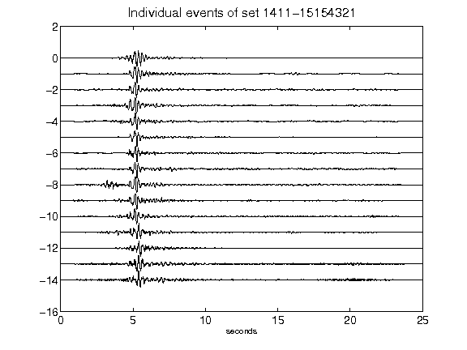](figures/1411-15154321_AllEv.png)[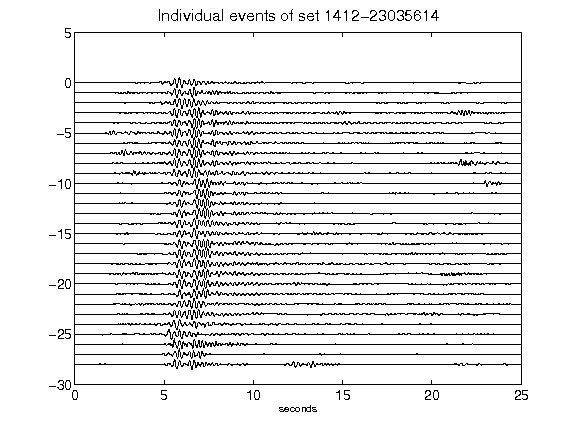](figures/1412-23035614_AllEv.png)[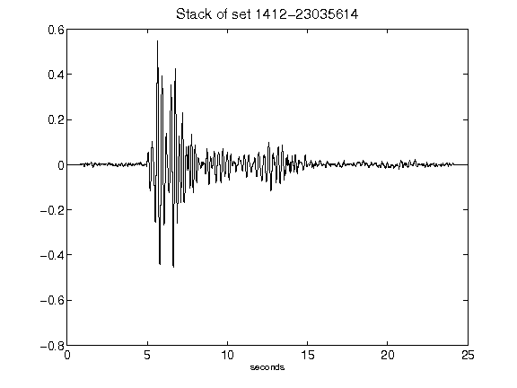](figures/1412-23035614_Stack.png)[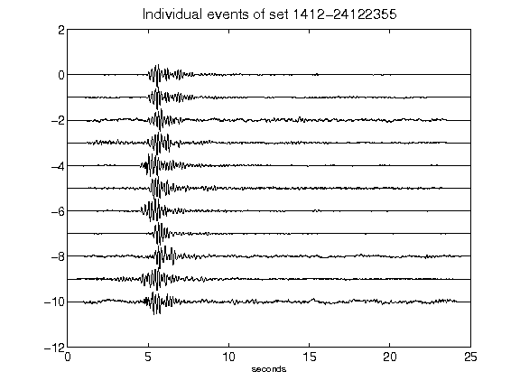](figures/1412-24122355_AllEv.png)[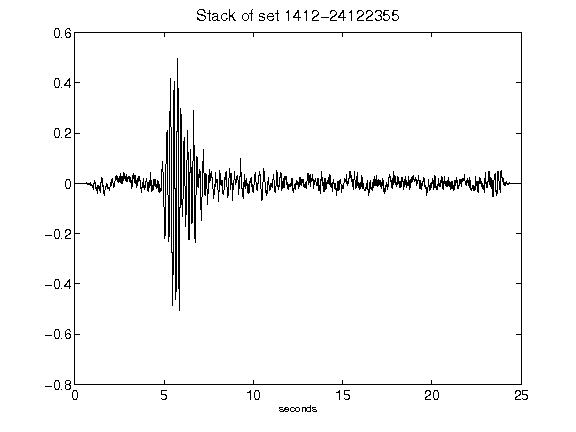](figures/1412-24122355_Stack.png)[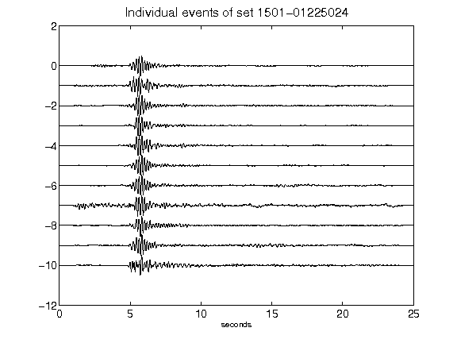](figures/1501-01225024_AllEv.png)[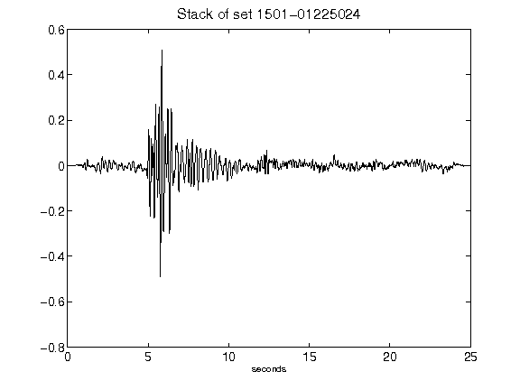](figures/1501-01225024_Stack.png)[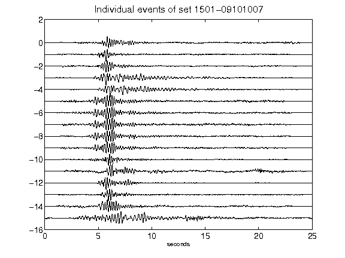](figures/1501-09101007_AllEv.png)[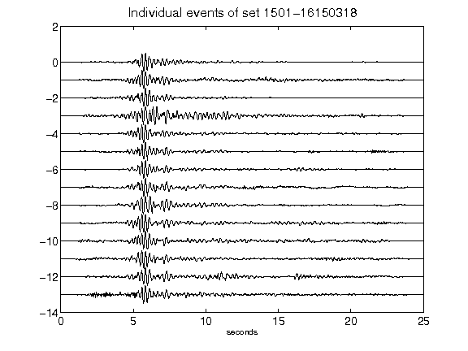](figures/1501-16150318_AllEv.png)[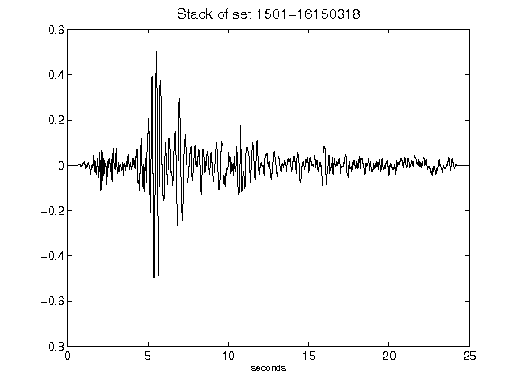](figures/1501-16150318_Stack.png)[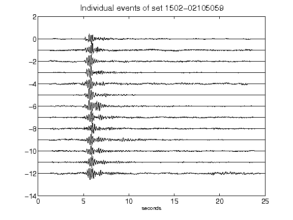](figures/1502-02105059_AllEv.png)[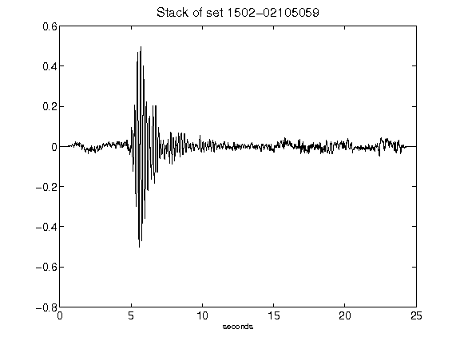](figures/1502-02105059_Stack.png)[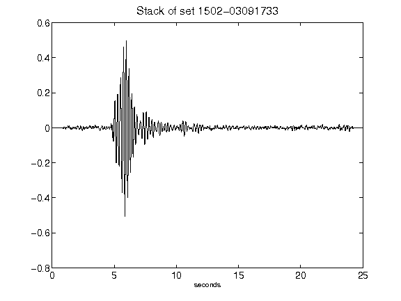](figures/1502-03091733_Stack.png)[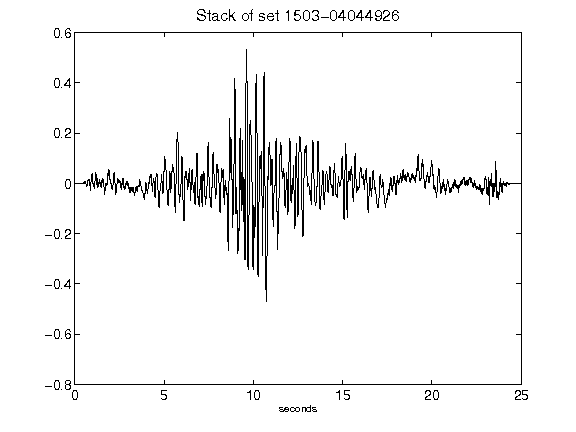](figures/1503-04044926_Stack.png)[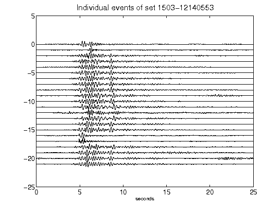](figures/1503-12140553_AllEv.png)[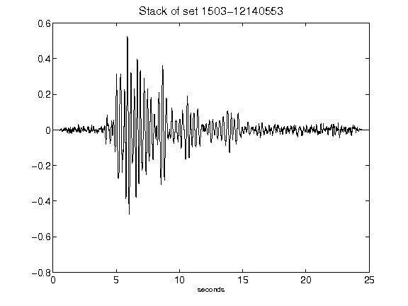](figures/1503-12140553_Stack.png)[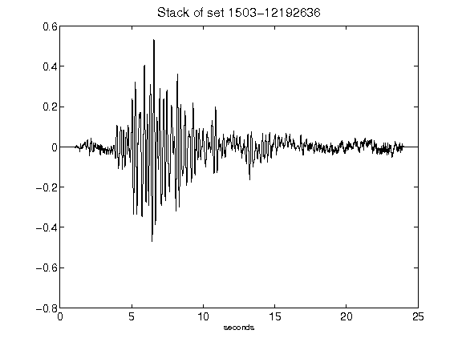](figures/1503-12192636_Stack.png)[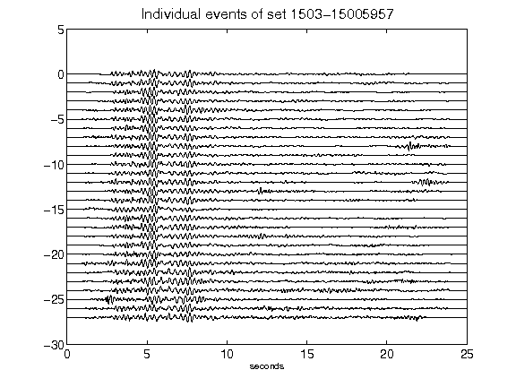](figures/1503-15005957_AllEv.png)[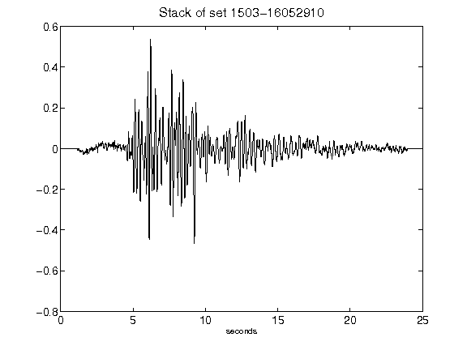](figures/1503-16052910_Stack.png)[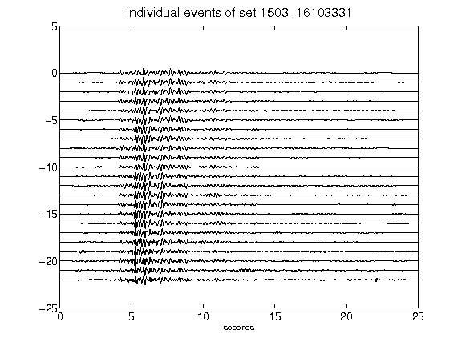](figures/1503-16103331_AllEv.png)[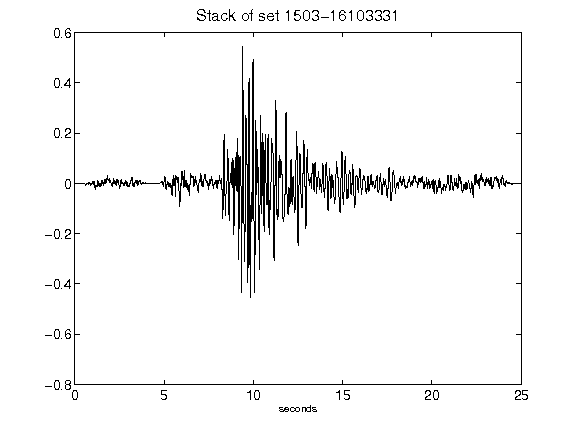](figures/1503-16103331_Stack.png)[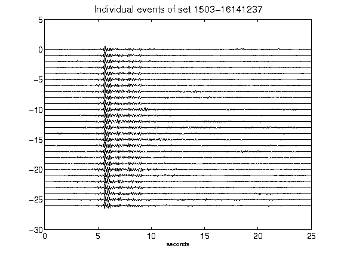](figures/1503-16141237_AllEv.png)[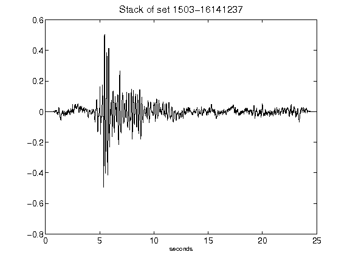](figures/1503-16141237_Stack.png)[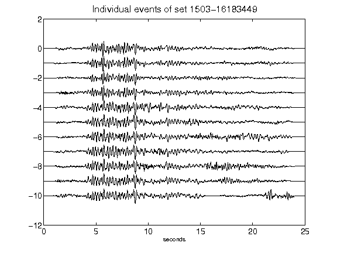](figures/1503-16183449_AllEv.png)[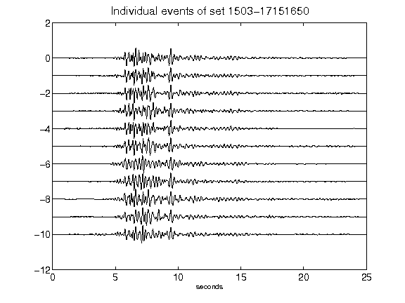](figures/1503-17151650_AllEv.png)[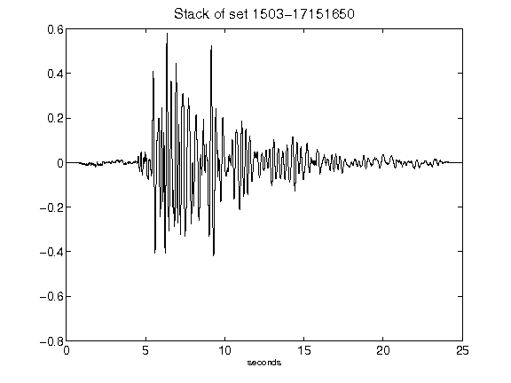](figures/1503-17151650_Stack.png)