# Repeating Earthquake Activity at RCM

## Waveforms
[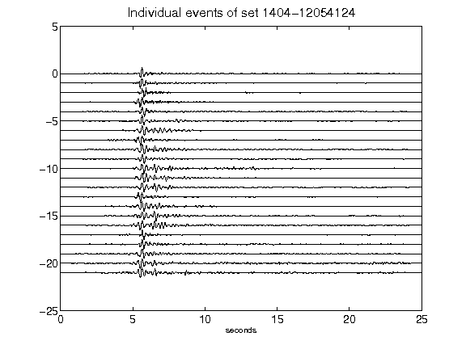](figures/1404-12054124_AllEv.png)[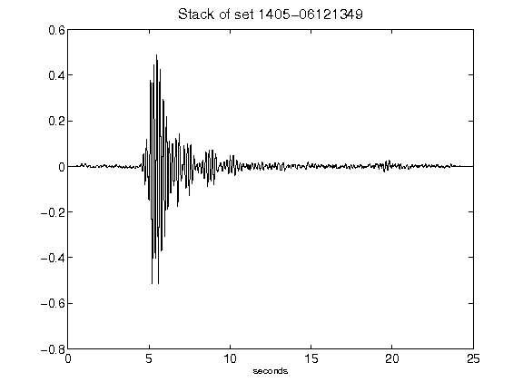](figures/1405-06121349_Stack.png)[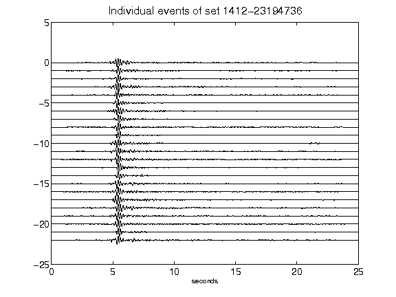](figures/1412-23194736_AllEv.png)[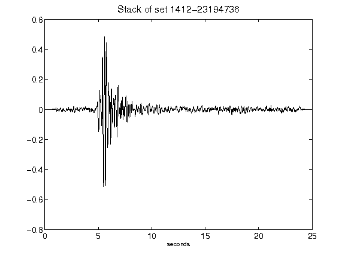](figures/1412-23194736_Stack.png)[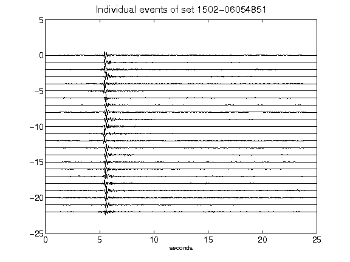](figures/1502-06054851_AllEv.png)[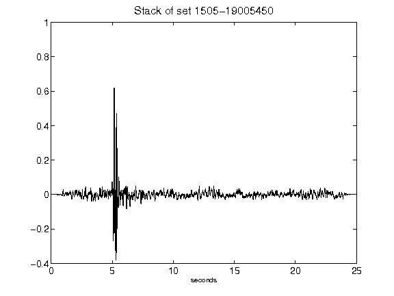](figures/1505-19005450_Stack.png)[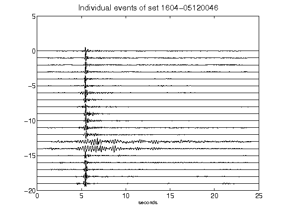](figures/1604-05120046_AllEv.png)[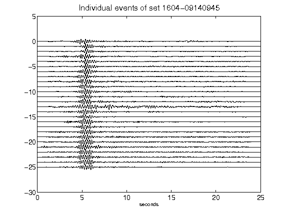](figures/1604-09140945_AllEv.png)[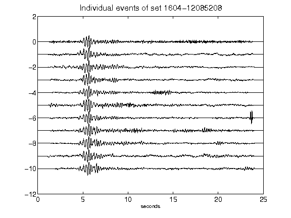](figures/1604-12085208_AllEv.png)[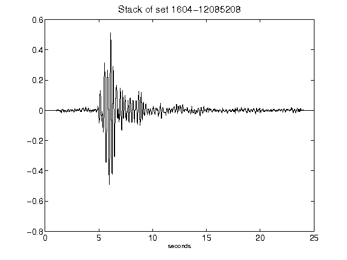](figures/1604-12085208_Stack.png)[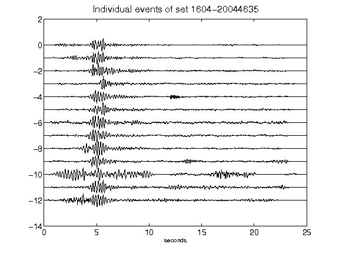](figures/1604-20044635_AllEv.png)[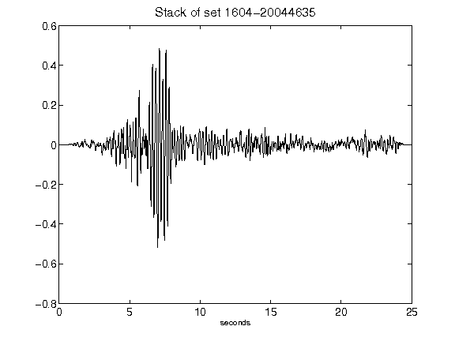](figures/1604-20044635_Stack.png)[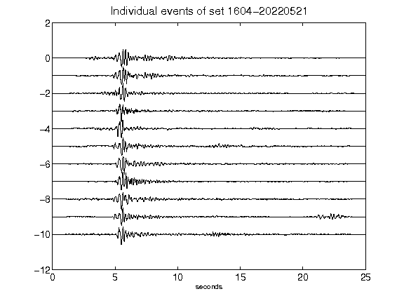](figures/1604-20220521_AllEv.png)[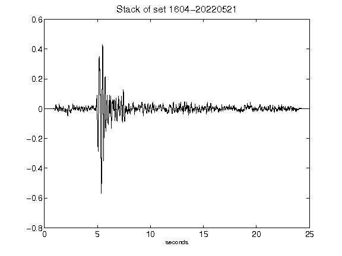](figures/1604-20220521_Stack.png)[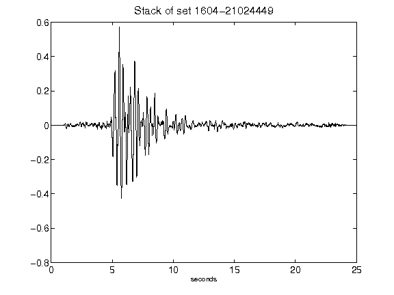](figures/1604-21024449_Stack.png)