# Repeating Earthquake Activity at RCM

## Waveforms
[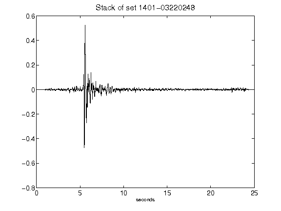](figures/1401-03220248_Stack.png)[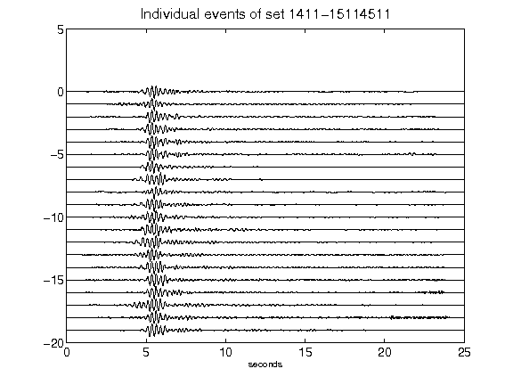](figures/1411-15114511_AllEv.png)[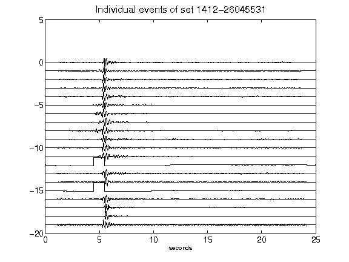](figures/1412-26045531_AllEv.png)[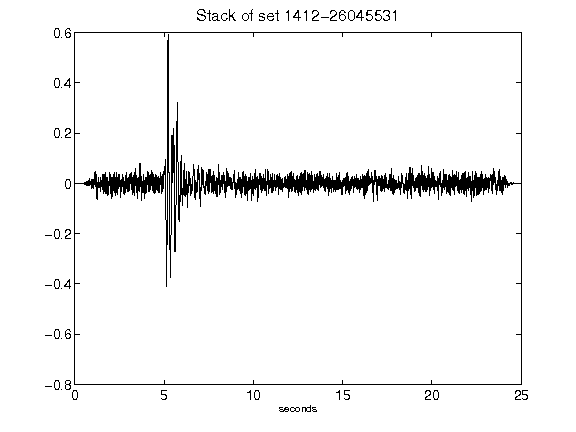](figures/1412-26045531_Stack.png)[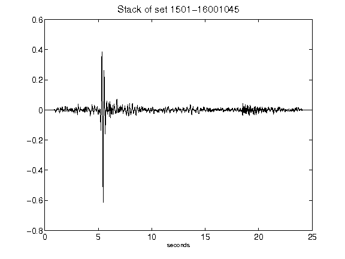](figures/1501-16001045_Stack.png)[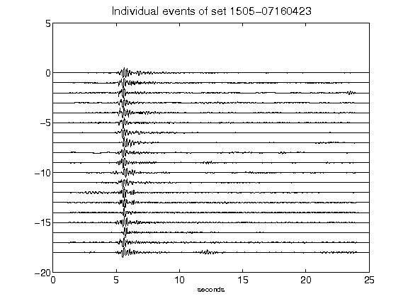](figures/1505-07160423_AllEv.png)[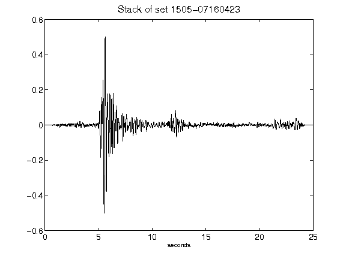](figures/1505-07160423_Stack.png)[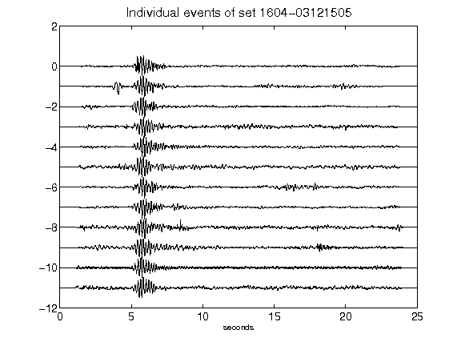](figures/1604-03121505_AllEv.png)[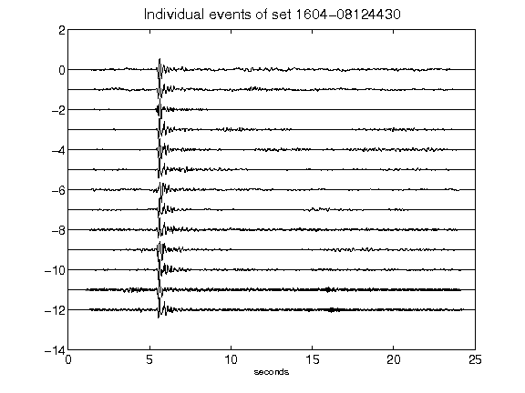](figures/1604-08124430_AllEv.png)[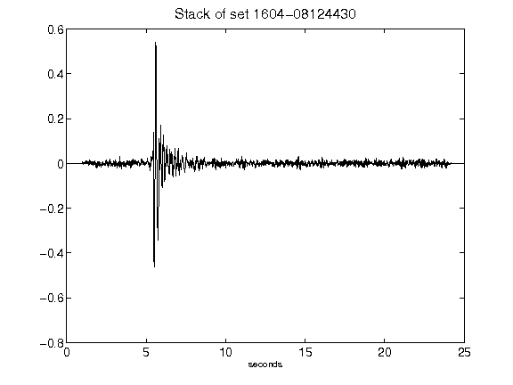](figures/1604-08124430_Stack.png)[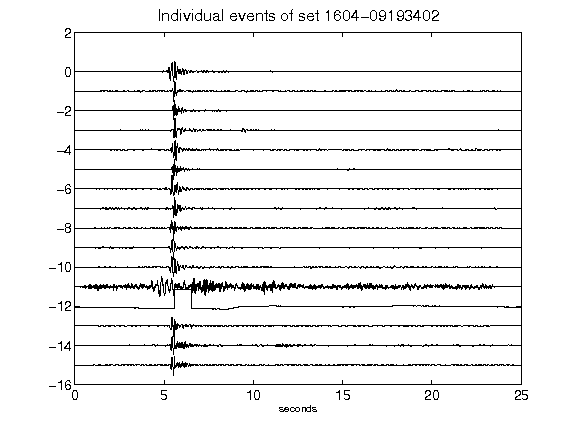](figures/1604-09193402_AllEv.png)[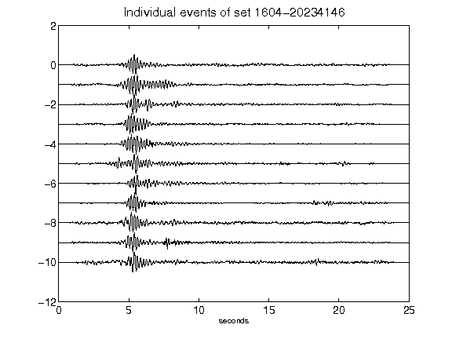](figures/1604-20234146_AllEv.png)[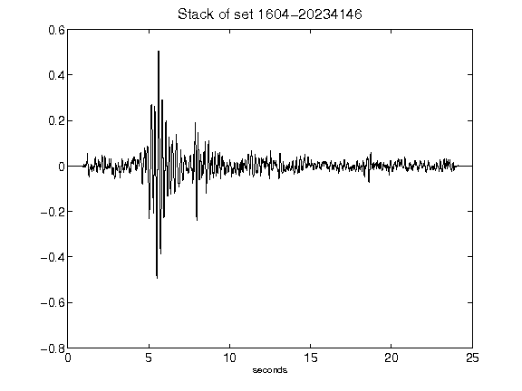](figures/1604-20234146_Stack.png)[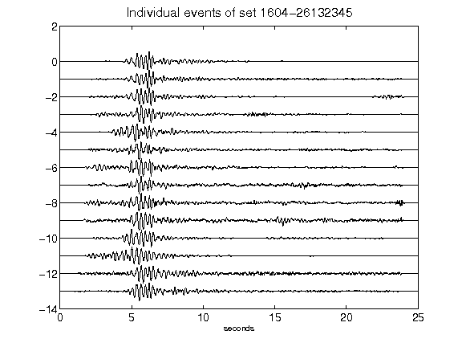](figures/1604-26132345_AllEv.png)[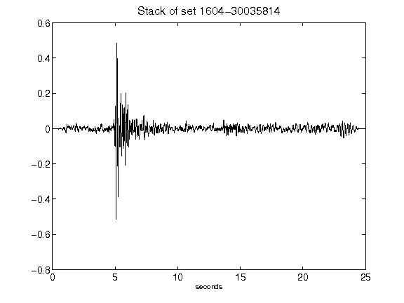](figures/1604-30035814_Stack.png)[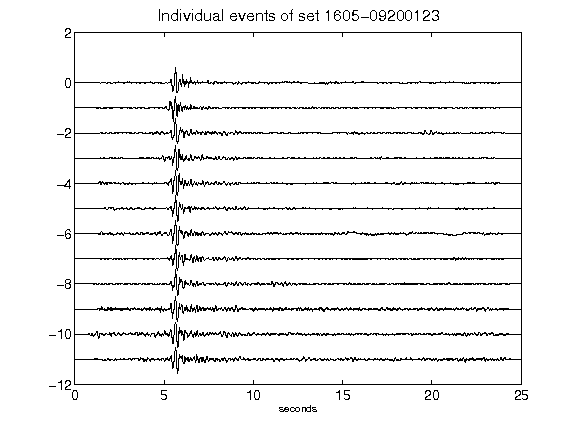](figures/1605-09200123_AllEv.png)[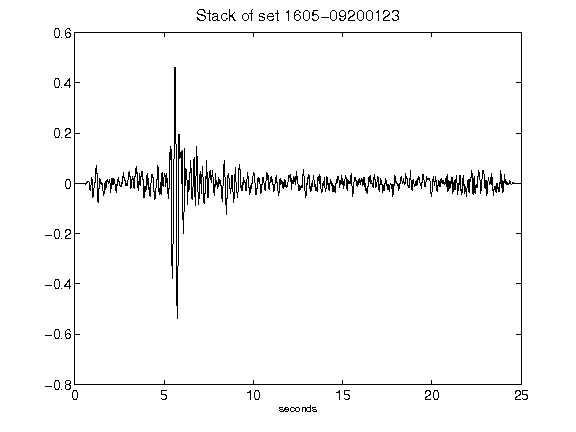](figures/1605-09200123_Stack.png)