# Repeating Earthquake Activity at RCM

## Waveforms
[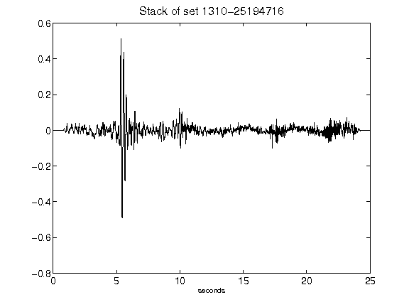](figures/1310-25194716_Stack.png)[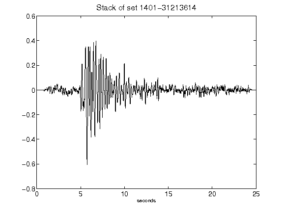](figures/1401-31213614_Stack.png)[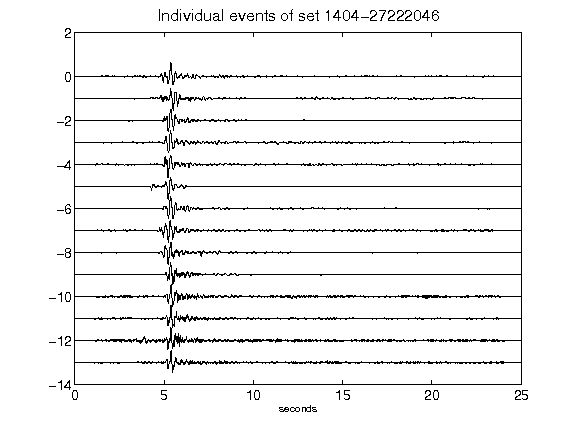](figures/1404-27222046_AllEv.png)[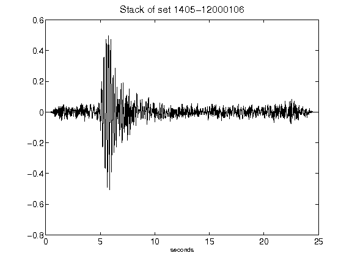](figures/1405-12000106_Stack.png)[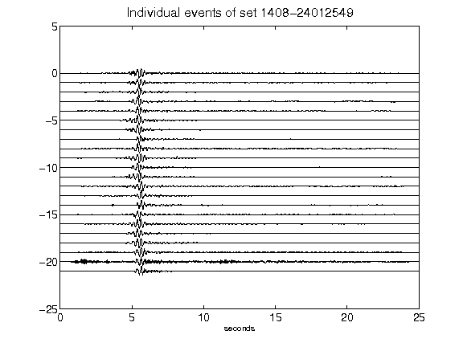](figures/1408-24012549_AllEv.png)[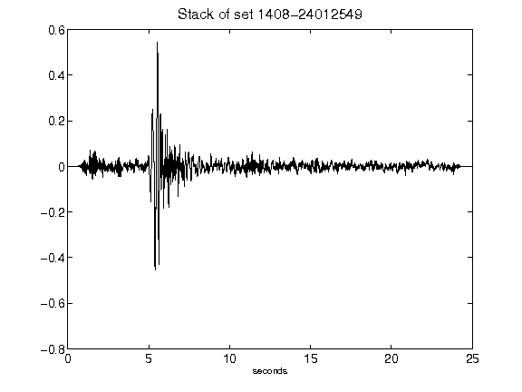](figures/1408-24012549_Stack.png)[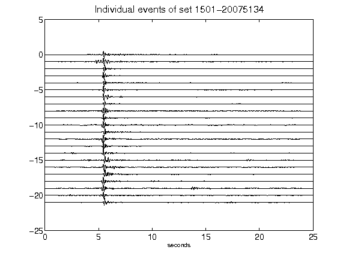](figures/1501-20075134_AllEv.png)[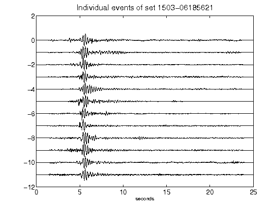](figures/1503-06185621_AllEv.png)[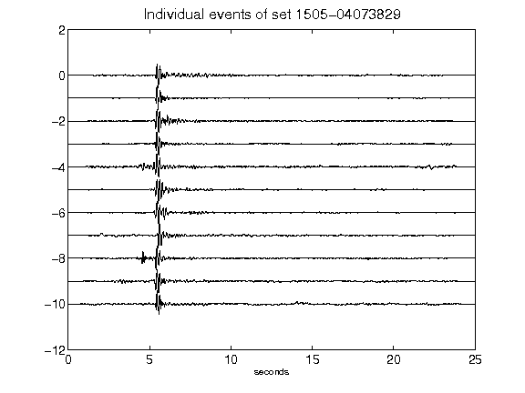](figures/1505-04073829_AllEv.png)[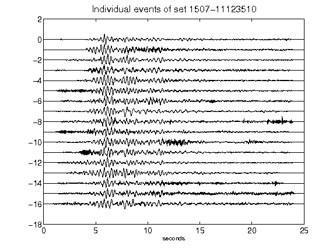](figures/1507-11123510_AllEv.png)[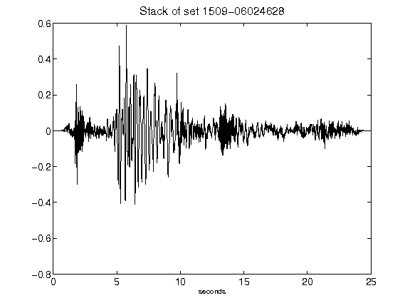](figures/1509-06024628_Stack.png)