# Repeating Earthquake Activity at RCM

## Waveforms
[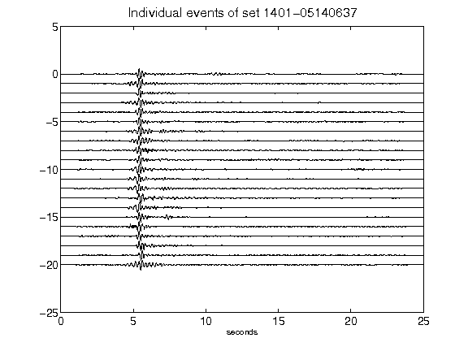](figures/1401-05140637_AllEv.png)[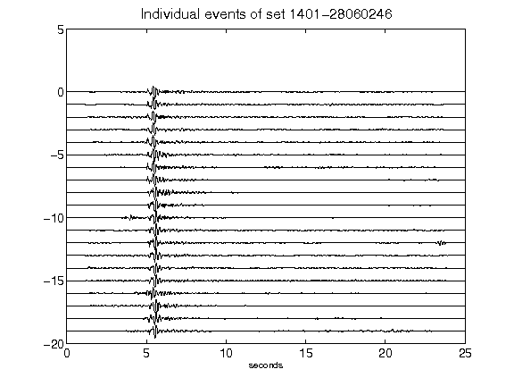](figures/1401-28060246_AllEv.png)[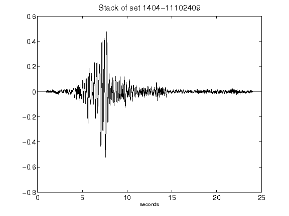](figures/1404-11102409_Stack.png)[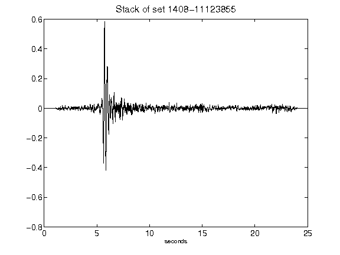](figures/1408-11123855_Stack.png)[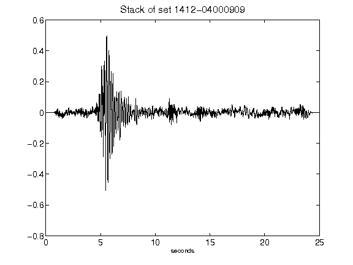](figures/1412-04000909_Stack.png)[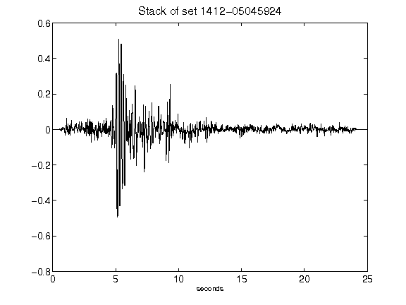](figures/1412-05045924_Stack.png)[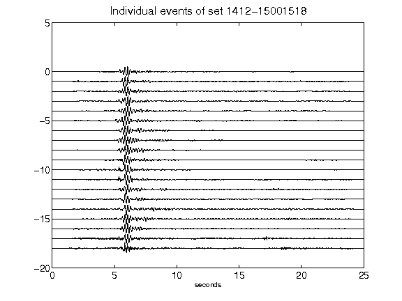](figures/1412-15001518_AllEv.png)[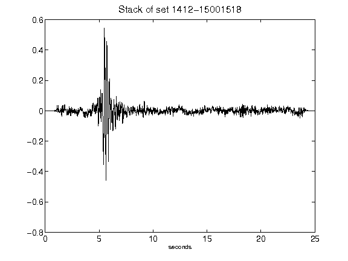](figures/1412-15001518_Stack.png)[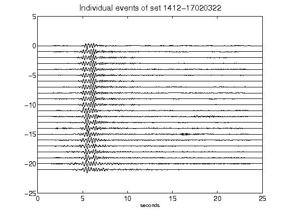](figures/1412-17020322_AllEv.png)[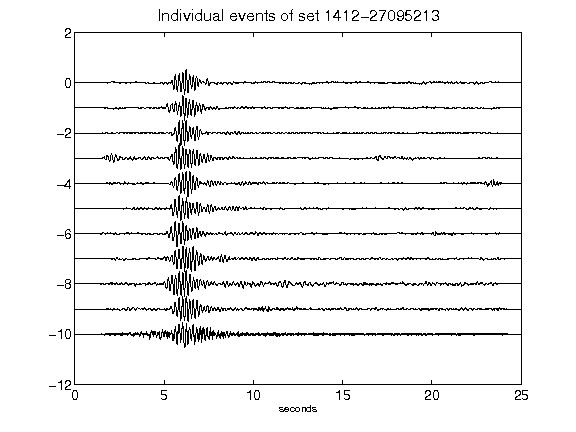](figures/1412-27095213_AllEv.png)[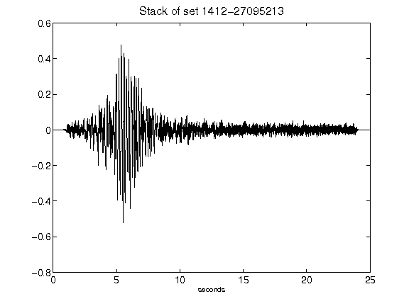](figures/1412-27095213_Stack.png)[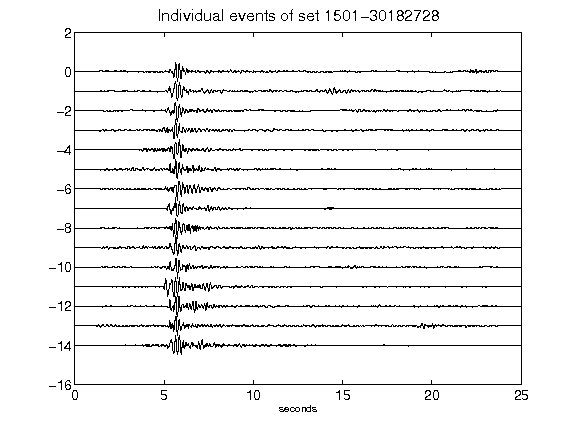](figures/1501-30182728_AllEv.png)[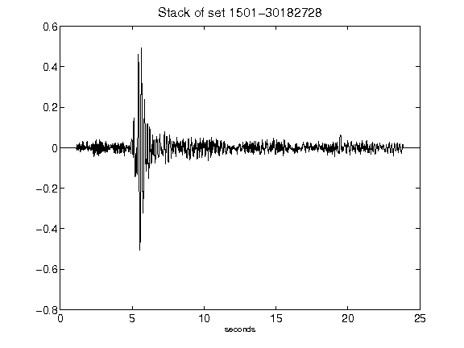](figures/1501-30182728_Stack.png)[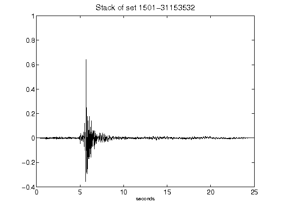](figures/1501-31153532_Stack.png)[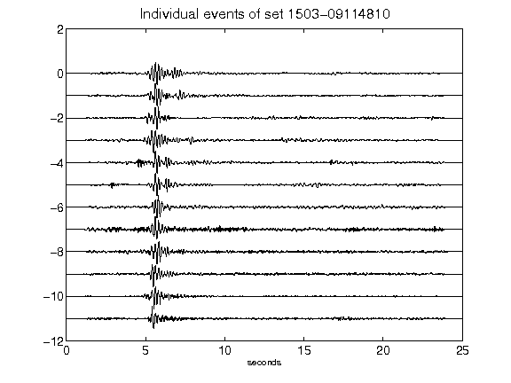](figures/1503-09114810_AllEv.png)[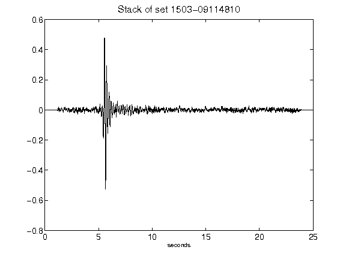](figures/1503-09114810_Stack.png)[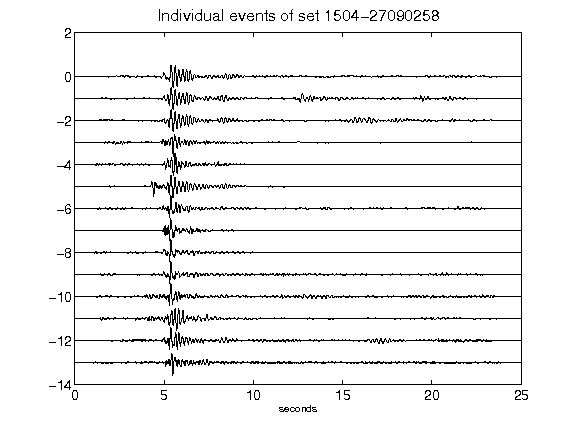](figures/1504-27090258_AllEv.png)[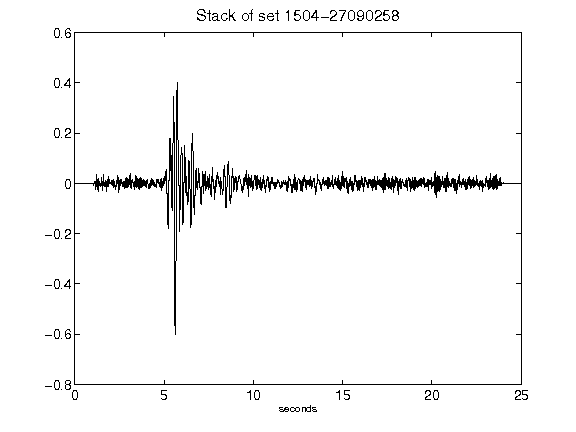](figures/1504-27090258_Stack.png)[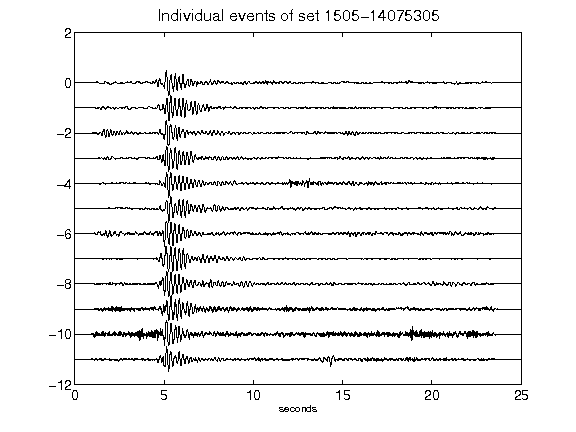](figures/1505-14075305_AllEv.png)