# Repeating Earthquake Activity at RCM

## Waveforms
[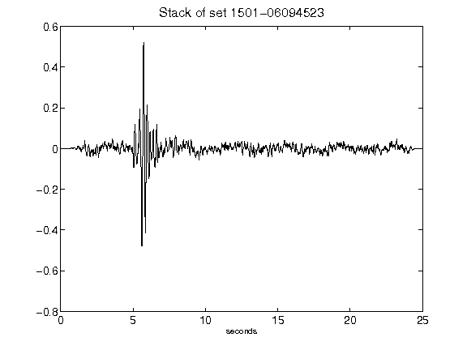](figures/1501-06094523_Stack.png)[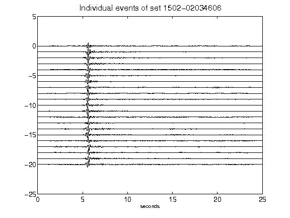](figures/1502-02034606_AllEv.png)[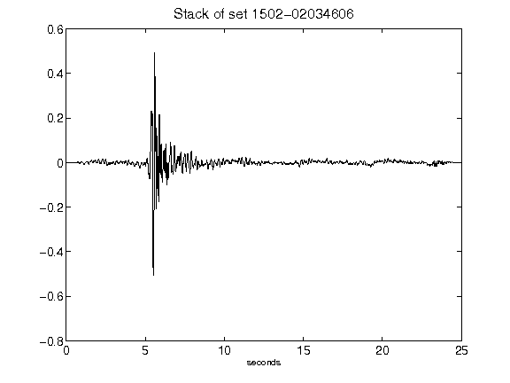](figures/1502-02034606_Stack.png)[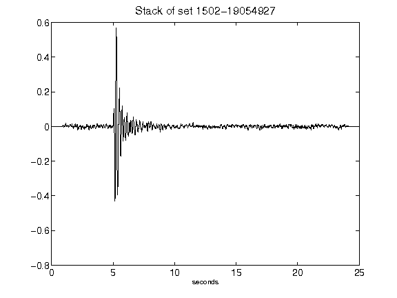](figures/1502-19054927_Stack.png)[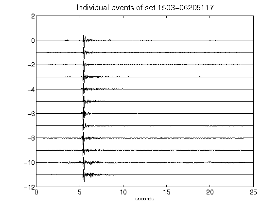](figures/1503-06205117_AllEv.png)[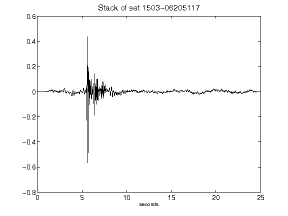](figures/1503-06205117_Stack.png)[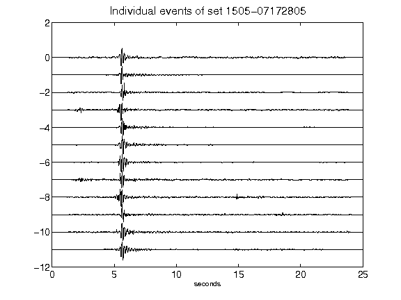](figures/1505-07172805_AllEv.png)[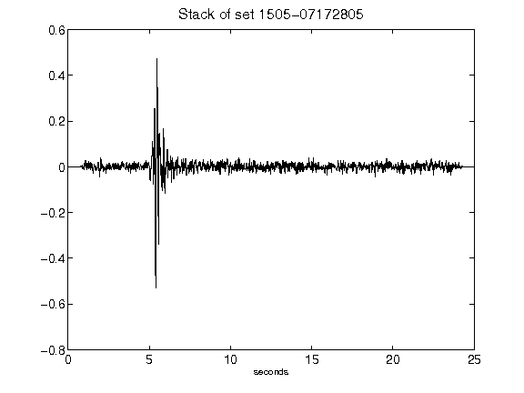](figures/1505-07172805_Stack.png)[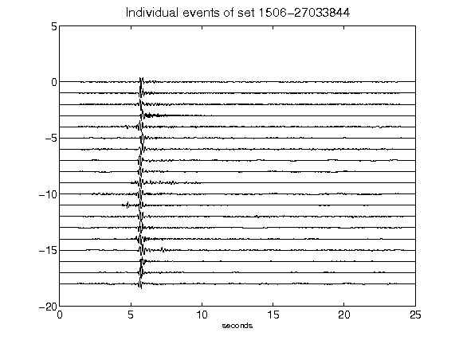](figures/1506-27033844_AllEv.png)[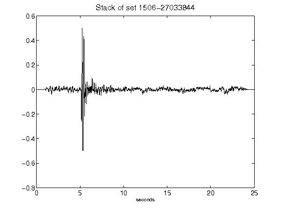](figures/1506-27033844_Stack.png)[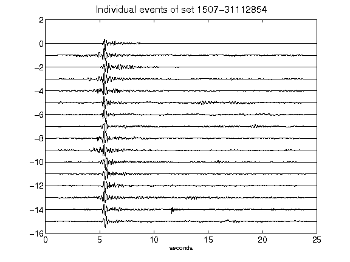](figures/1507-31112854_AllEv.png)[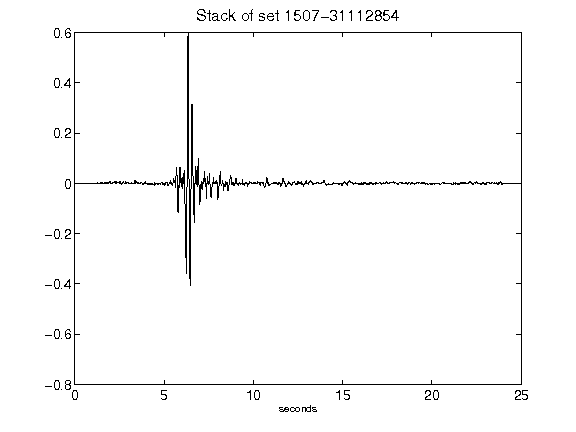](figures/1507-31112854_Stack.png)[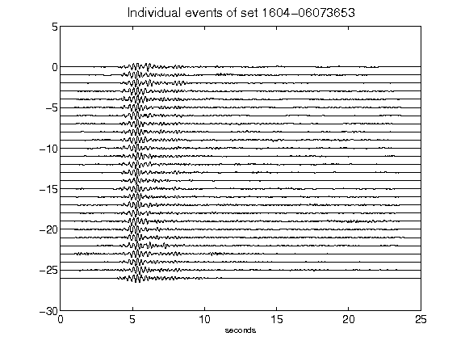](figures/1604-06073653_AllEv.png)[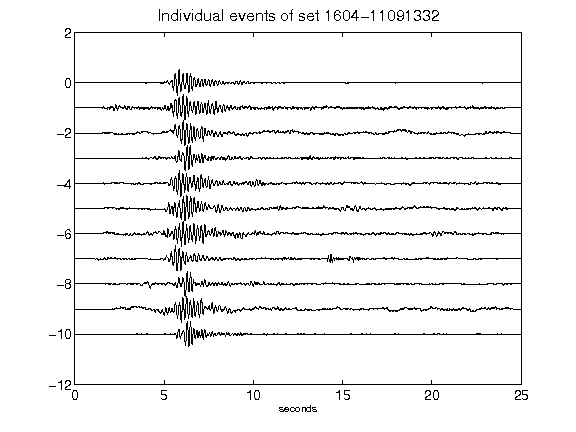](figures/1604-11091332_AllEv.png)[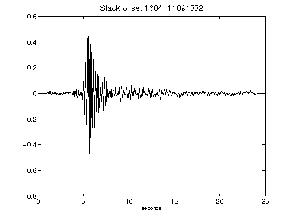](figures/1604-11091332_Stack.png)