# Repeating Earthquake Activity at RCM

## Waveforms
[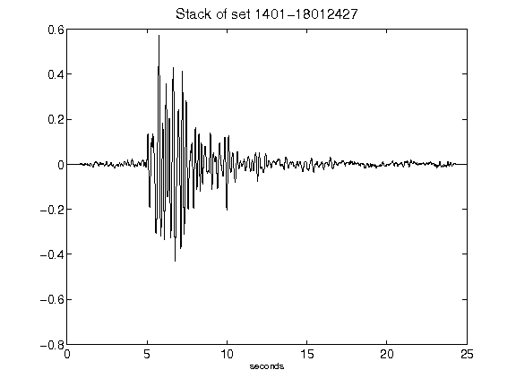](figures/1401-18012427_Stack.png)[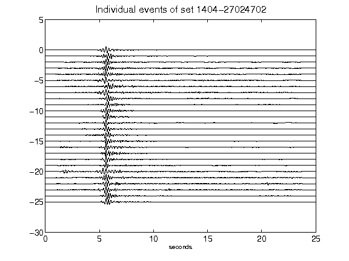](figures/1404-27024702_AllEv.png)[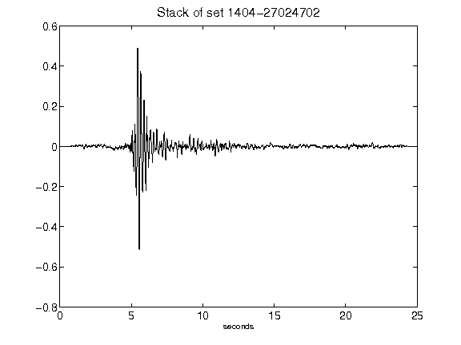](figures/1404-27024702_Stack.png)[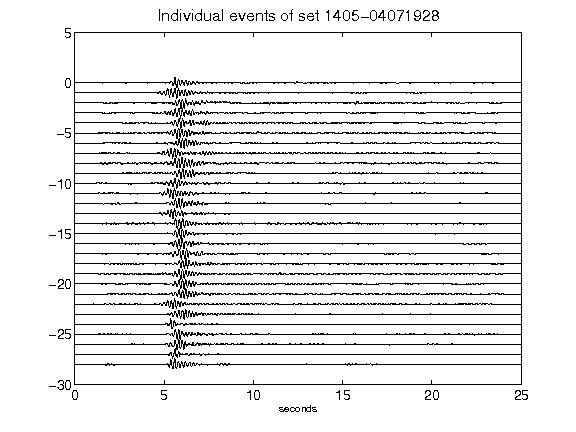](figures/1405-04071928_AllEv.png)[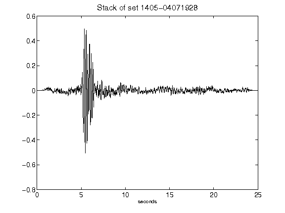](figures/1405-04071928_Stack.png)[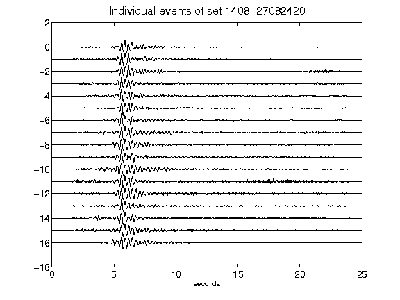](figures/1408-27082420_AllEv.png)[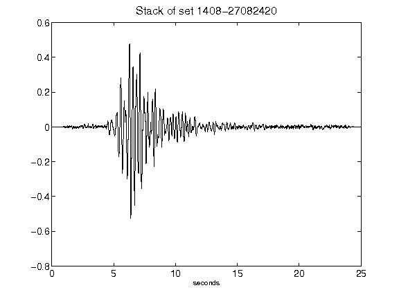](figures/1408-27082420_Stack.png)[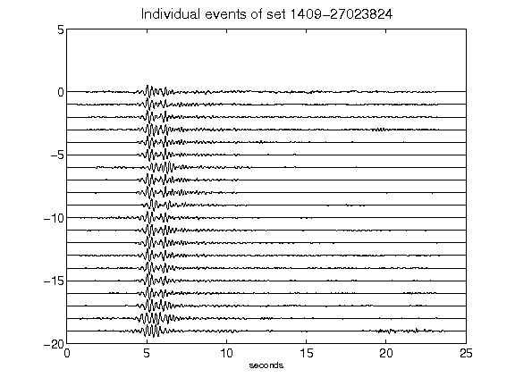](figures/1409-27023824_AllEv.png)[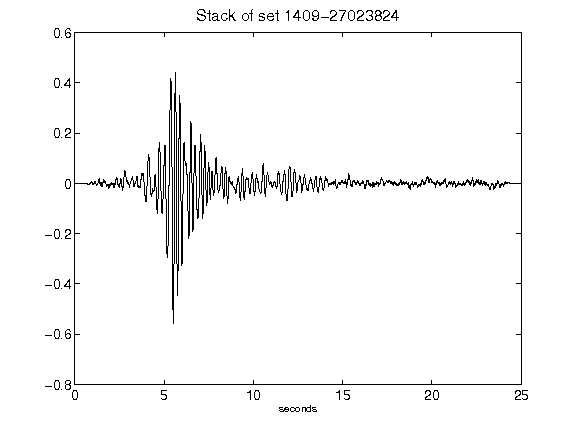](figures/1409-27023824_Stack.png)[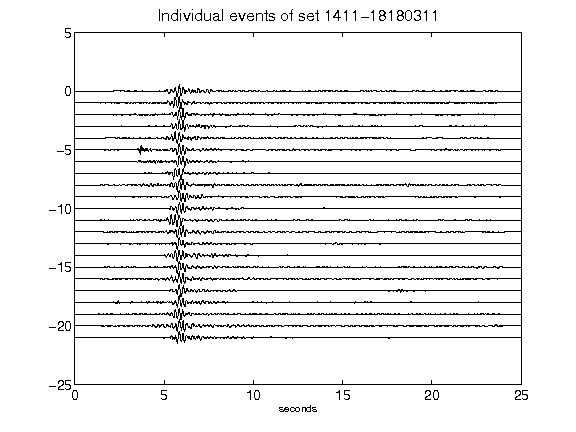](figures/1411-18180311_AllEv.png)[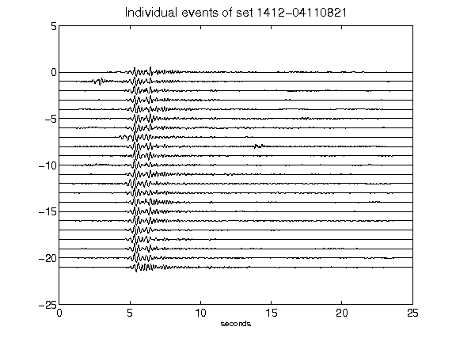](figures/1412-04110821_AllEv.png)[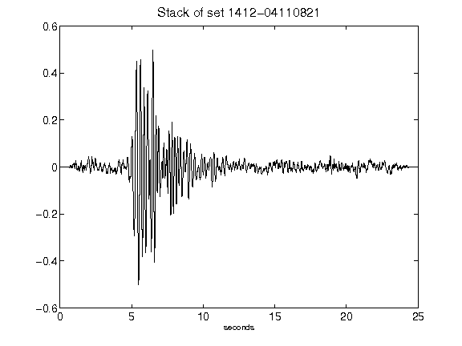](figures/1412-04110821_Stack.png)[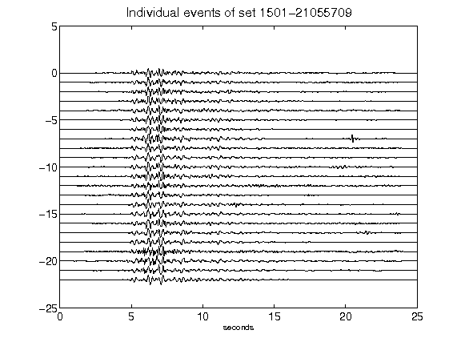](figures/1501-21055709_AllEv.png)[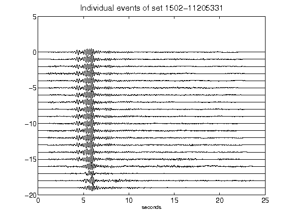](figures/1502-11205331_AllEv.png)[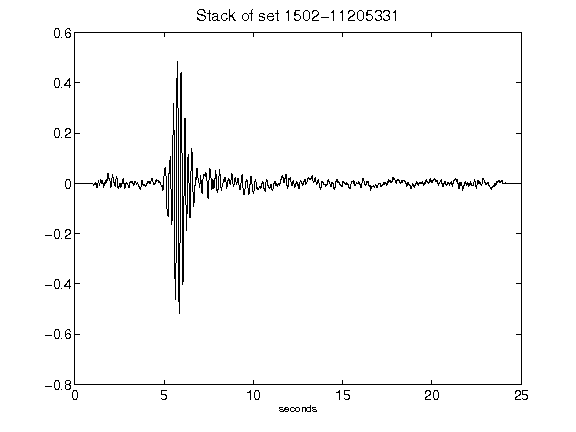](figures/1502-11205331_Stack.png)[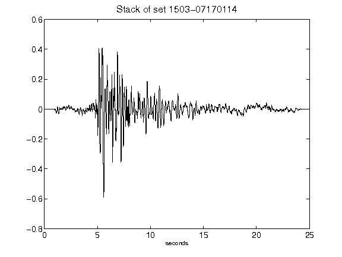](figures/1503-07170114_Stack.png)[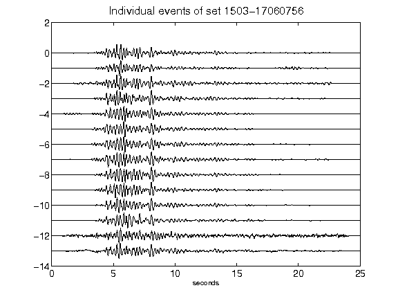](figures/1503-17060756_AllEv.png)[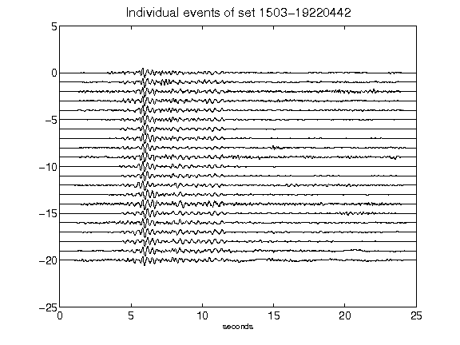](figures/1503-19220442_AllEv.png)[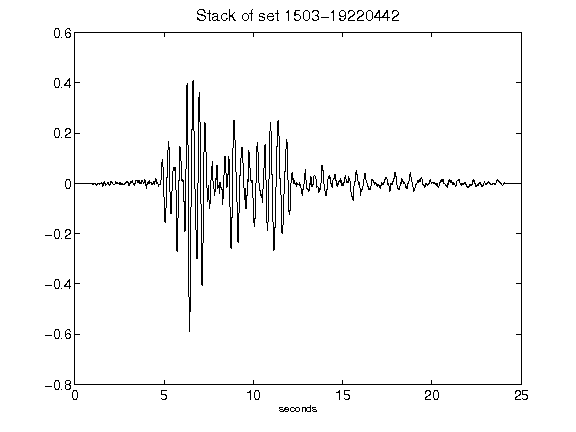](figures/1503-19220442_Stack.png)[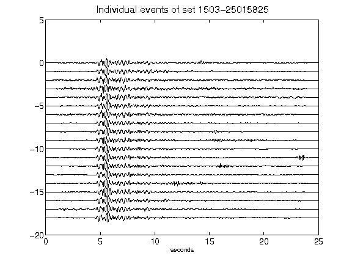](figures/1503-25015825_AllEv.png)[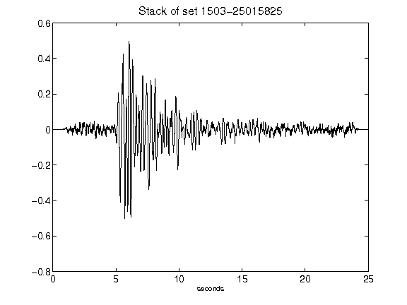](figures/1503-25015825_Stack.png)[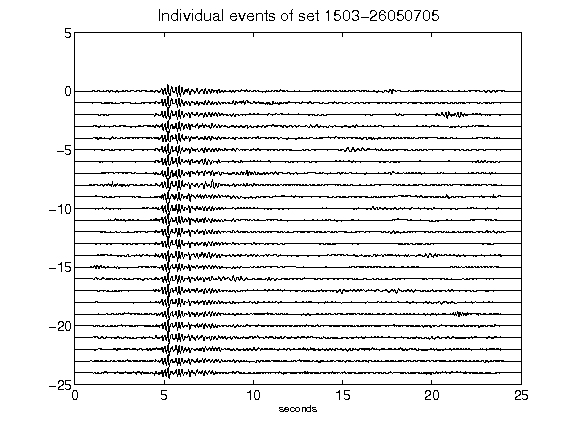](figures/1503-26050705_AllEv.png)