# Repeating Earthquake Activity at RCM

## Waveforms
[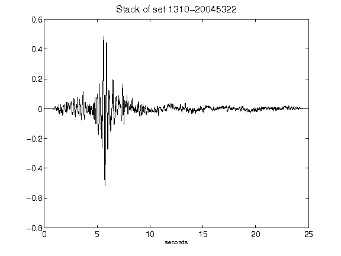](figures/1310-20045322_Stack.png)[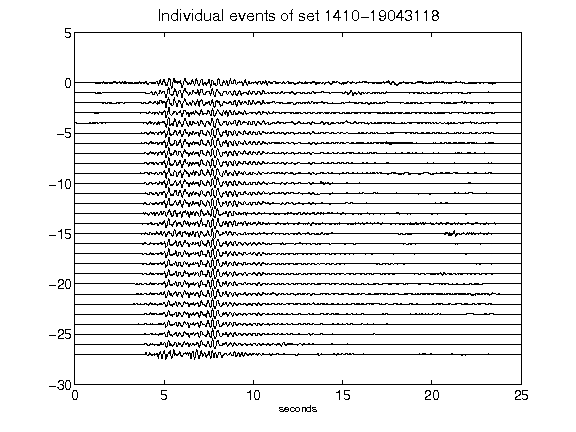](figures/1410-19043118_AllEv.png)[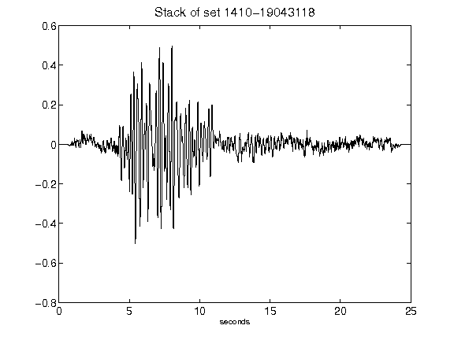](figures/1410-19043118_Stack.png)[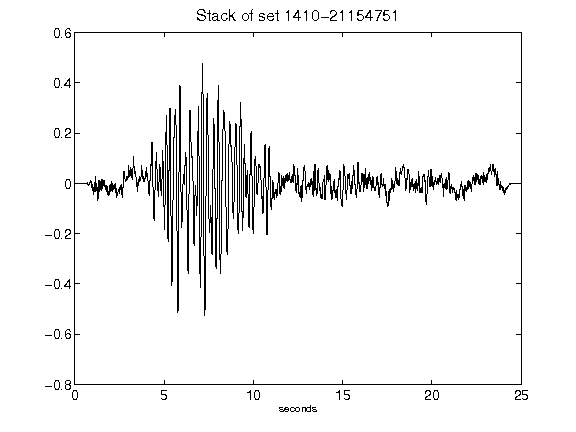](figures/1410-21154751_Stack.png)[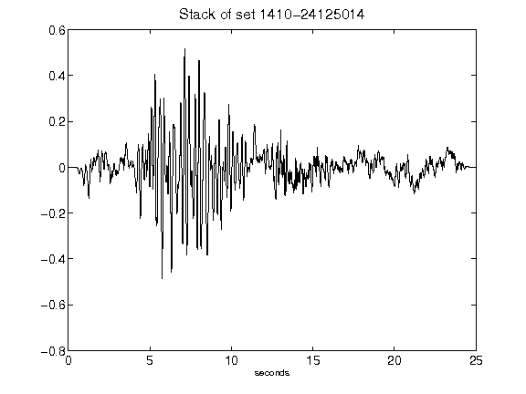](figures/1410-24125014_Stack.png)[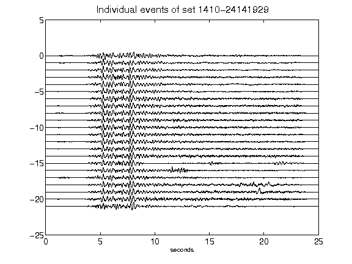](figures/1410-24141929_AllEv.png)[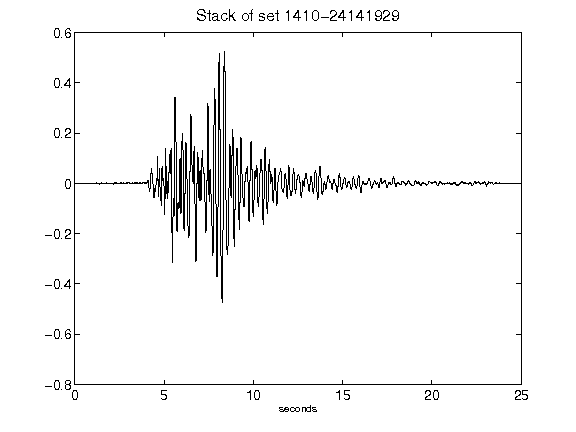](figures/1410-24141929_Stack.png)[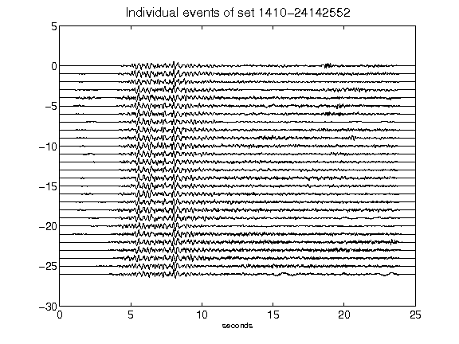](figures/1410-24142552_AllEv.png)[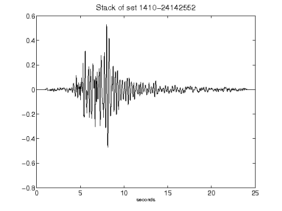](figures/1410-24142552_Stack.png)[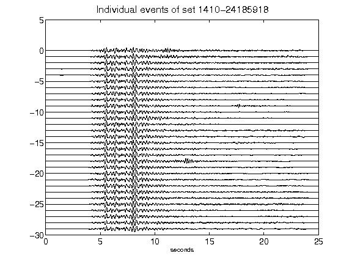](figures/1410-24185918_AllEv.png)[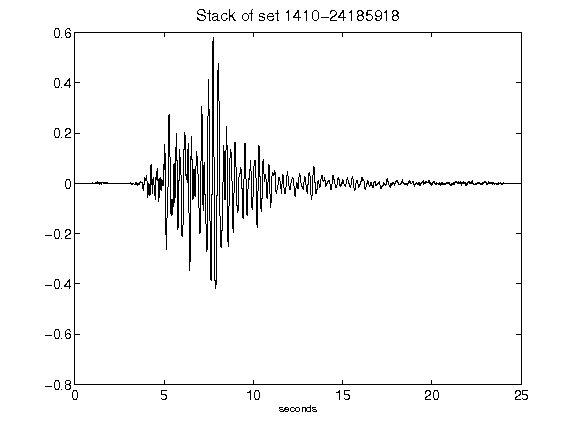](figures/1410-24185918_Stack.png)[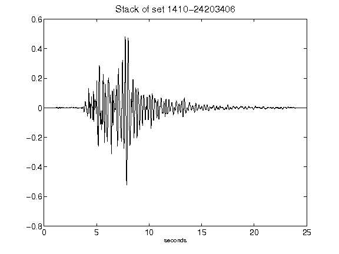](figures/1410-24203406_Stack.png)[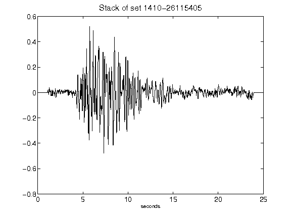](figures/1410-26115405_Stack.png)[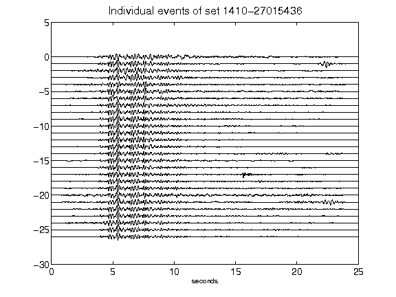](figures/1410-27015436_AllEv.png)[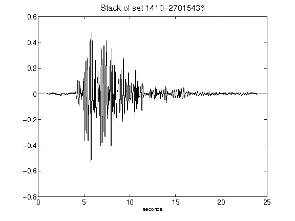](figures/1410-27015436_Stack.png)[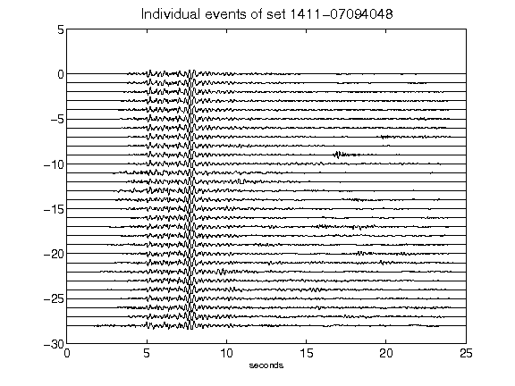](figures/1411-07094048_AllEv.png)[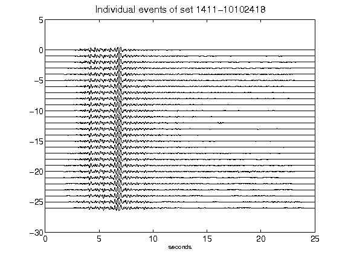](figures/1411-10102418_AllEv.png)[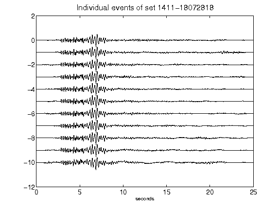](figures/1411-18072818_AllEv.png)[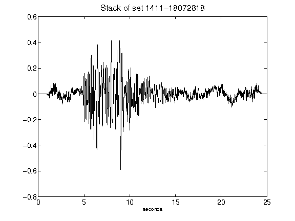](figures/1411-18072818_Stack.png)[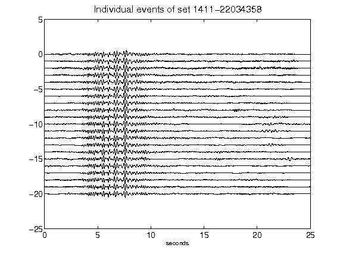](figures/1411-22034358_AllEv.png)[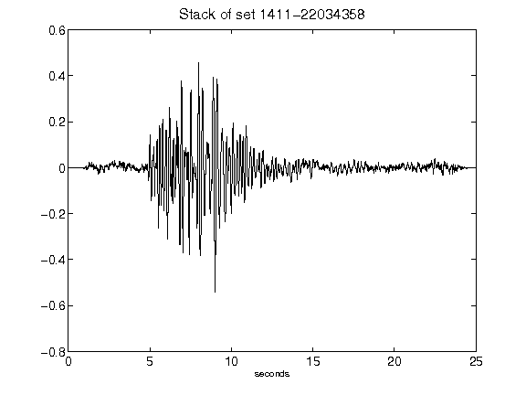](figures/1411-22034358_Stack.png)