# Repeating Earthquake Activity at RCM

## Waveforms
[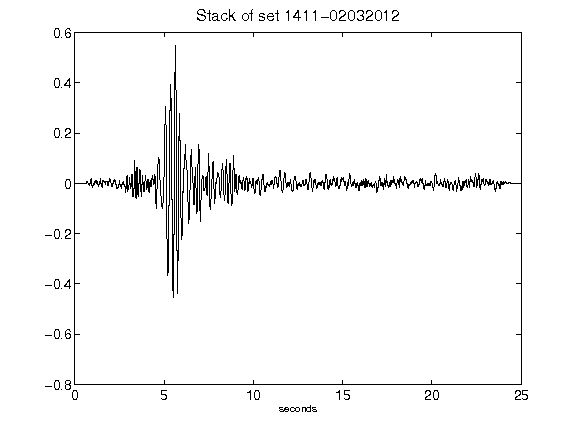](figures/1411-02032012_Stack.png)[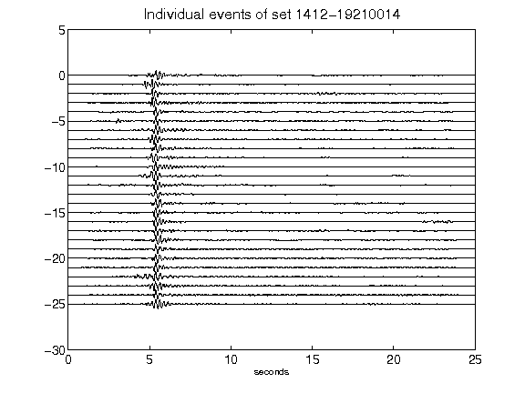](figures/1412-19210014_AllEv.png)[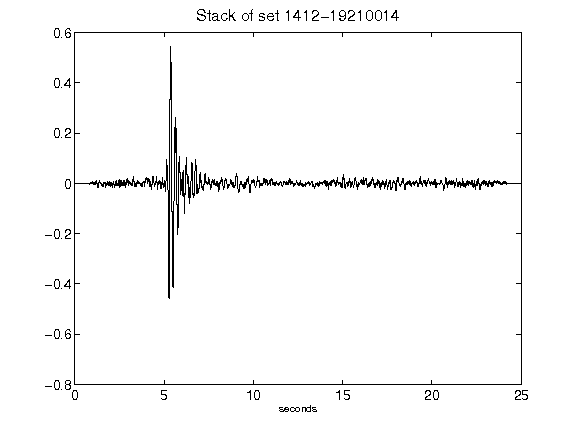](figures/1412-19210014_Stack.png)[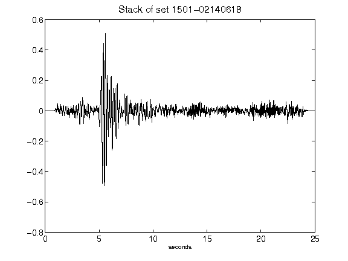](figures/1501-02140618_Stack.png)[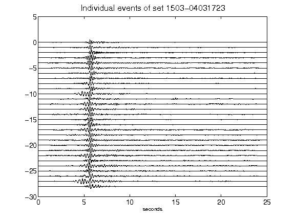](figures/1503-04031723_AllEv.png)[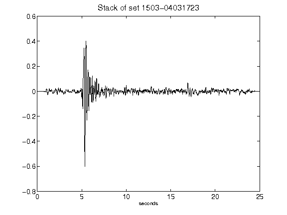](figures/1503-04031723_Stack.png)[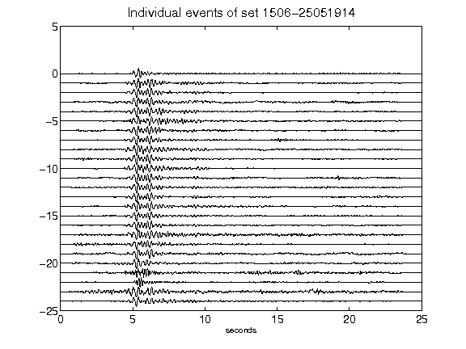](figures/1506-25051914_AllEv.png)[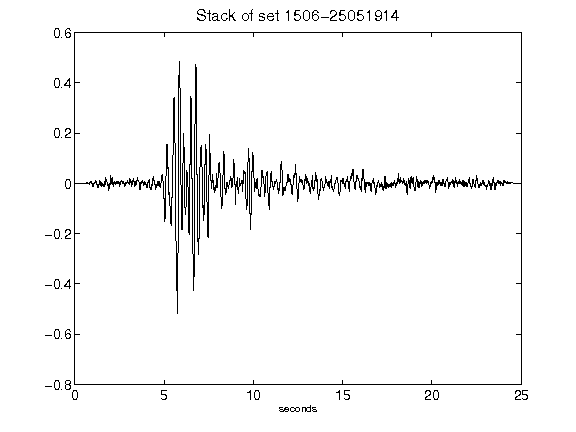](figures/1506-25051914_Stack.png)[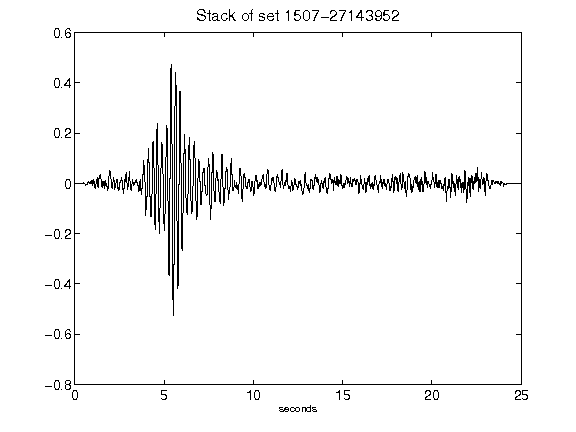](figures/1507-27143952_Stack.png)[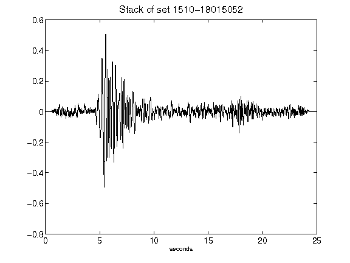](figures/1510-18015052_Stack.png)[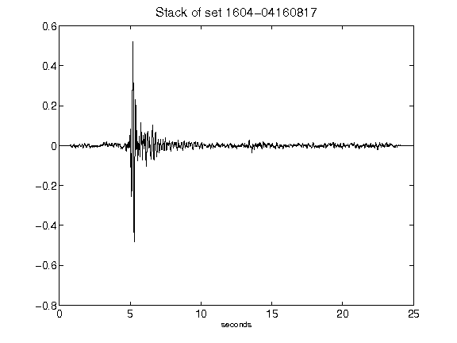](figures/1604-04160817_Stack.png)[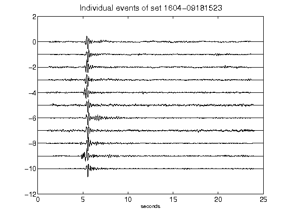](figures/1604-09181523_AllEv.png)[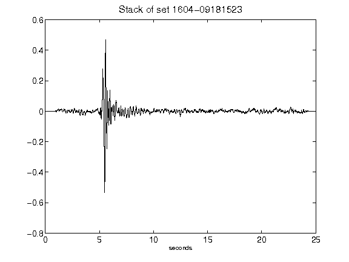](figures/1604-09181523_Stack.png)[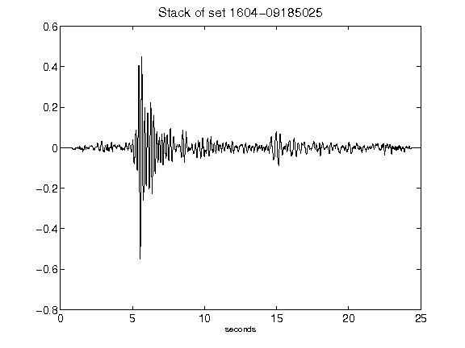](figures/1604-09185025_Stack.png)