# Repeating Earthquake Activity at RCM

## Waveforms
[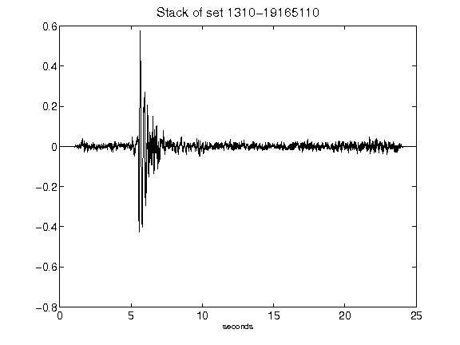](figures/1310-19165110_Stack.png)[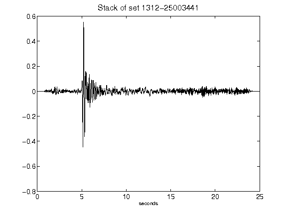](figures/1312-25003441_Stack.png)[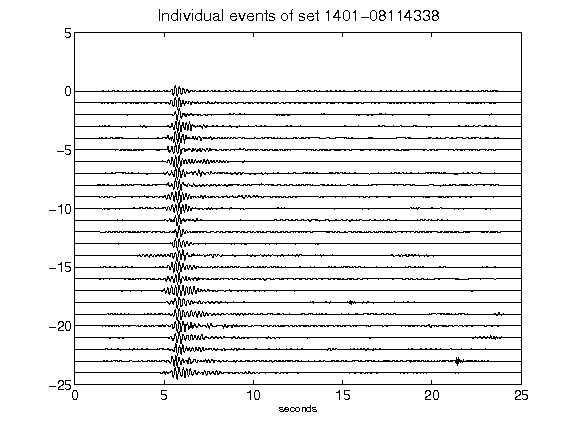](figures/1401-08114338_AllEv.png)[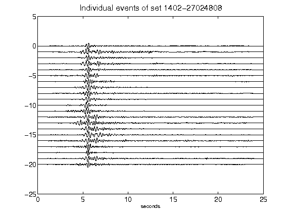](figures/1402-27024808_AllEv.png)[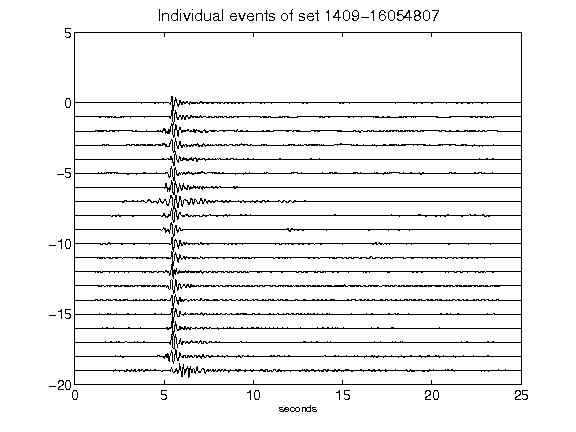](figures/1409-16054807_AllEv.png)[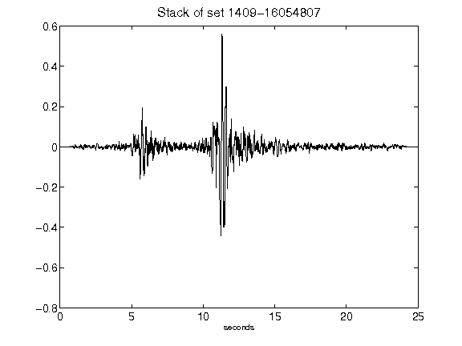](figures/1409-16054807_Stack.png)[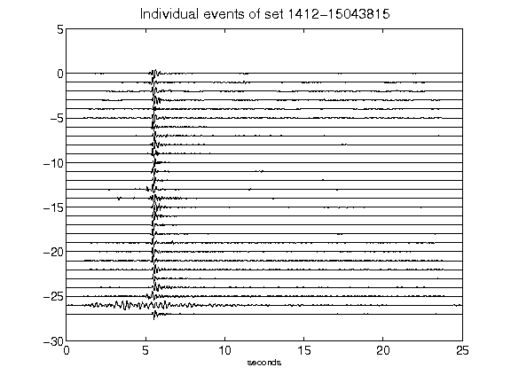](figures/1412-15043815_AllEv.png)[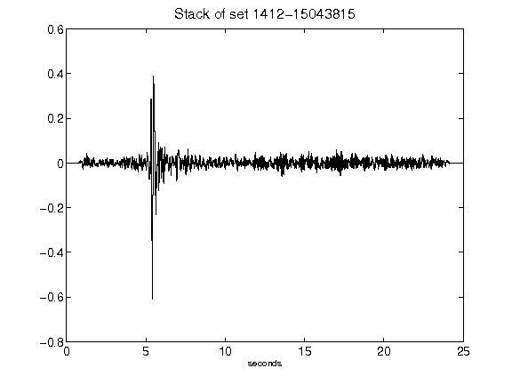](figures/1412-15043815_Stack.png)[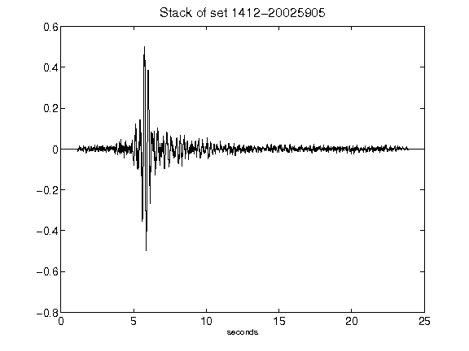](figures/1412-20025905_Stack.png)[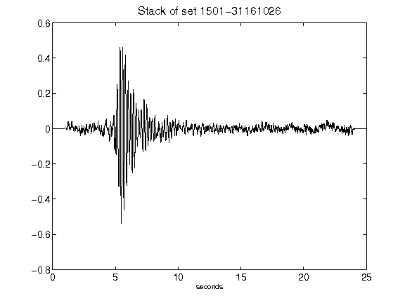](figures/1501-31161026_Stack.png)[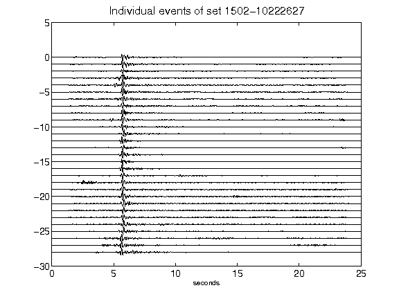](figures/1502-10222627_AllEv.png)[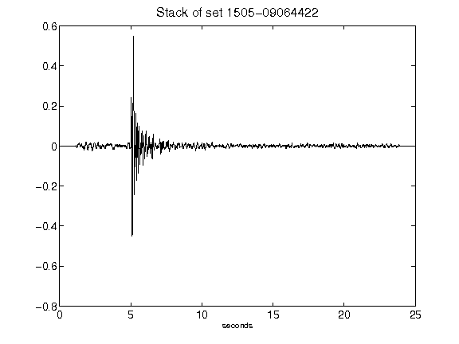](figures/1505-09064422_Stack.png)[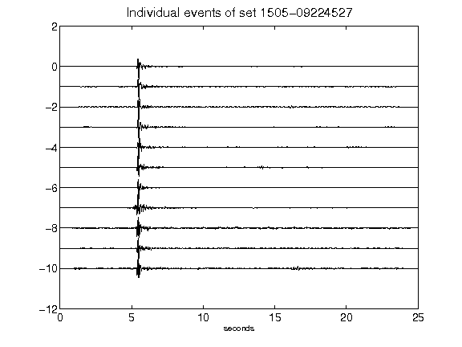](figures/1505-09224527_AllEv.png)[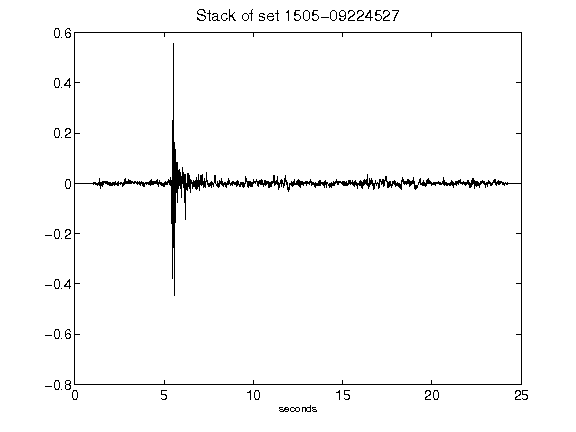](figures/1505-09224527_Stack.png)[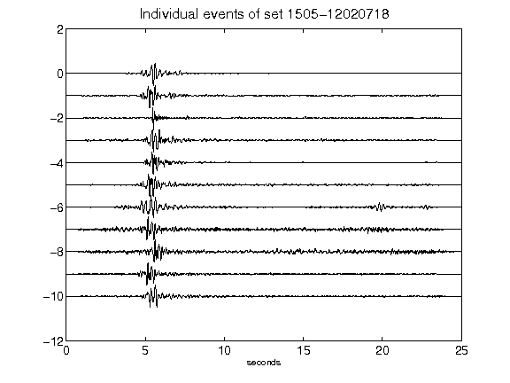](figures/1505-12020718_AllEv.png)[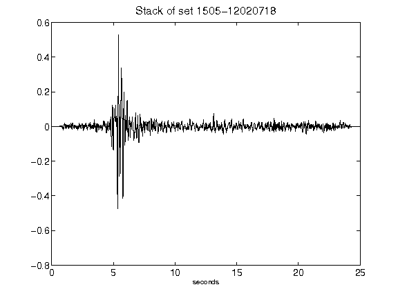](figures/1505-12020718_Stack.png)[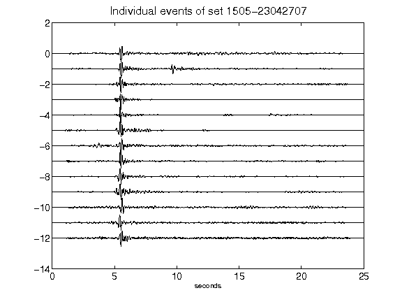](figures/1505-23042707_AllEv.png)[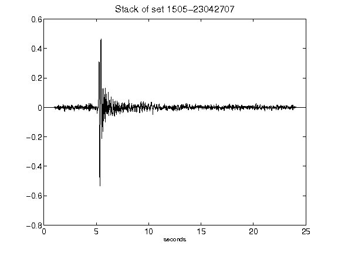](figures/1505-23042707_Stack.png)