# Repeating Earthquake Activity at RCM

## Waveforms
[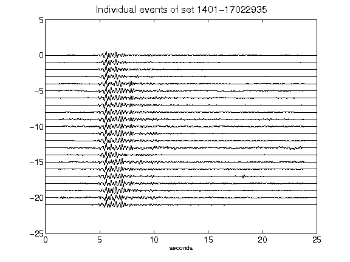](figures/1401-17022935_AllEv.png)[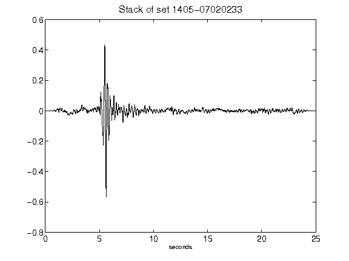](figures/1405-07020233_Stack.png)[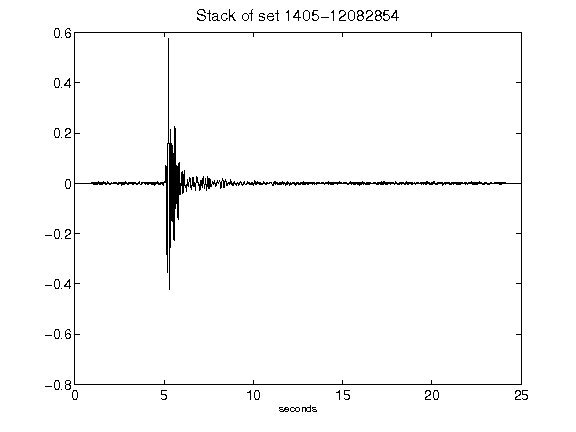](figures/1405-12082854_Stack.png)[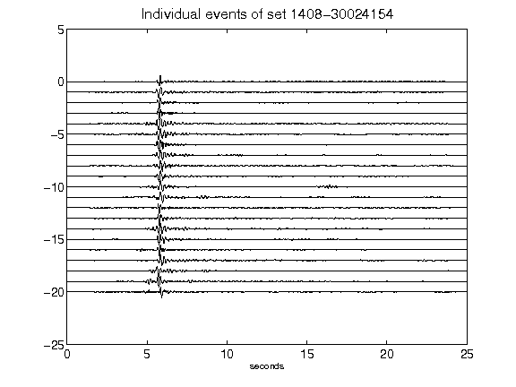](figures/1408-30024154_AllEv.png)[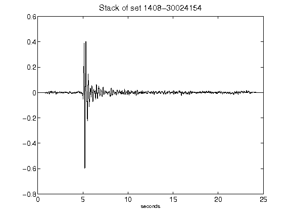](figures/1408-30024154_Stack.png)[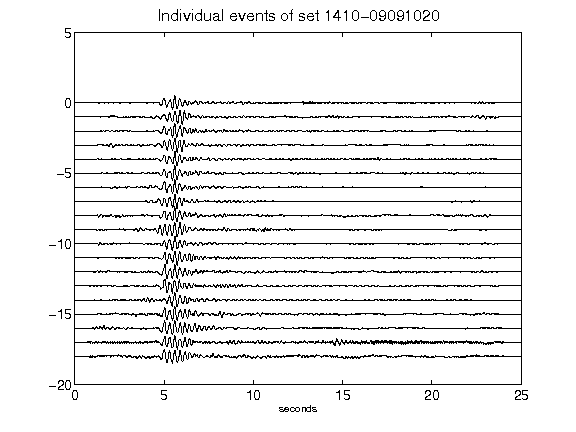](figures/1410-09091020_AllEv.png)[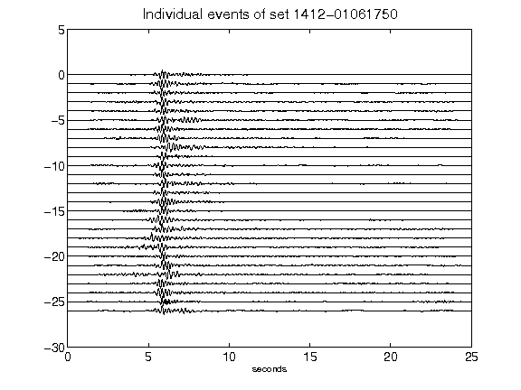](figures/1412-01061750_AllEv.png)[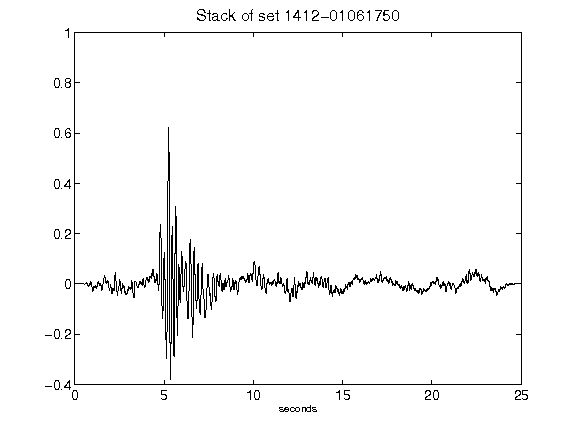](figures/1412-01061750_Stack.png)[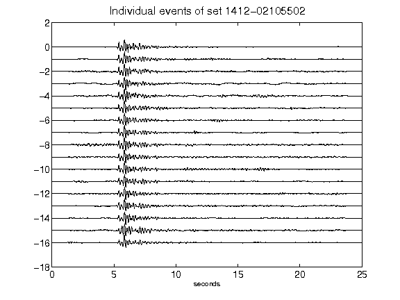](figures/1412-02105502_AllEv.png)[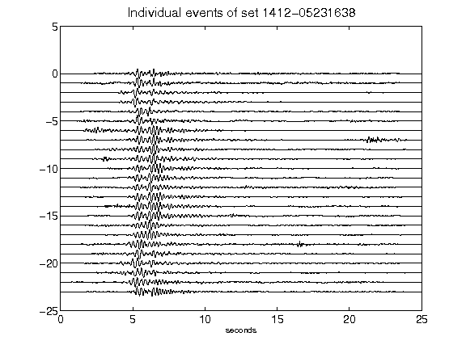](figures/1412-05231638_AllEv.png)[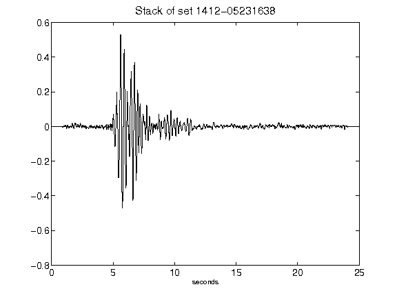](figures/1412-05231638_Stack.png)[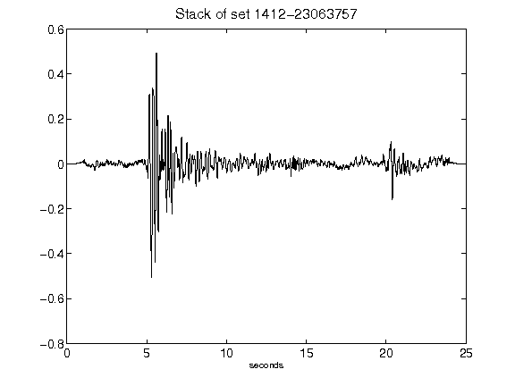](figures/1412-23063757_Stack.png)[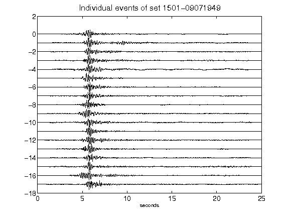](figures/1501-09071949_AllEv.png)[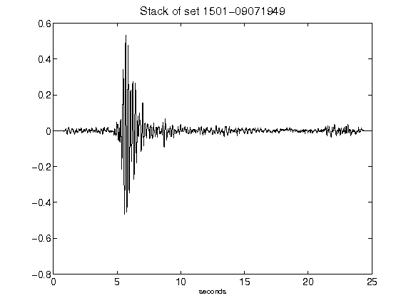](figures/1501-09071949_Stack.png)[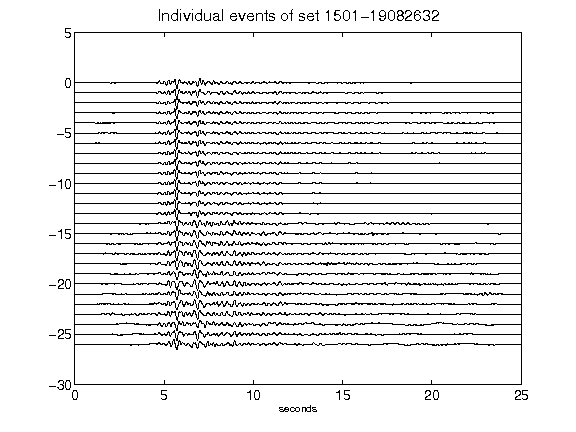](figures/1501-19082632_AllEv.png)[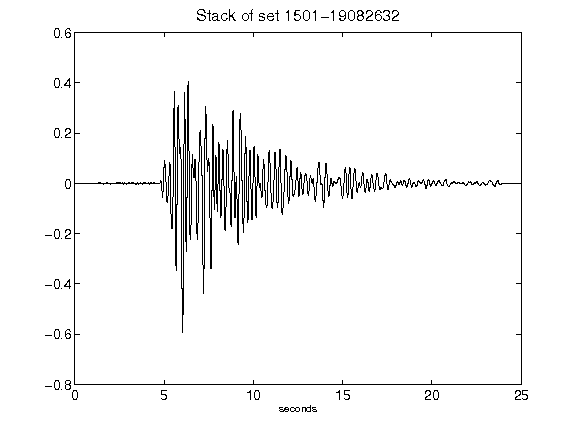](figures/1501-19082632_Stack.png)[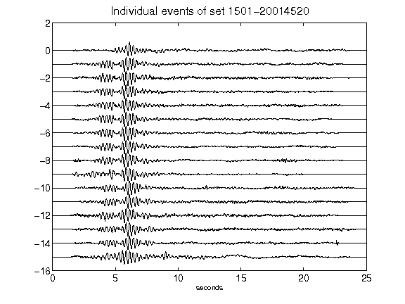](figures/1501-20014520_AllEv.png)[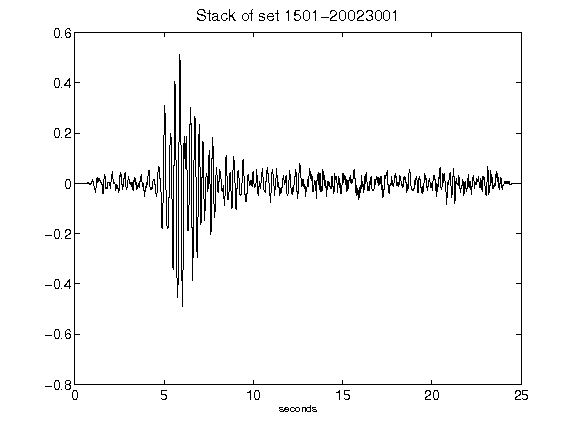](figures/1501-20023001_Stack.png)[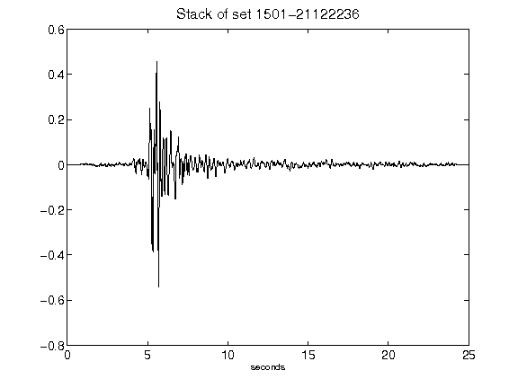](figures/1501-21122236_Stack.png)