# Repeating Earthquake Activity at RCM

## Waveforms
[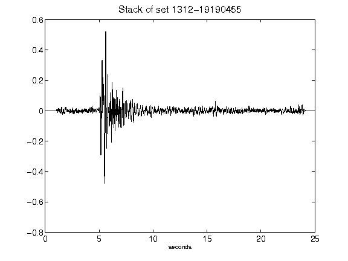](figures/1312-19190455_Stack.png)[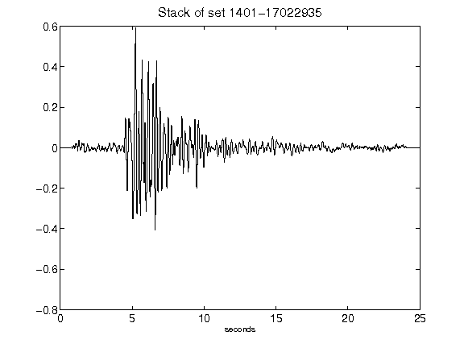](figures/1401-17022935_Stack.png)[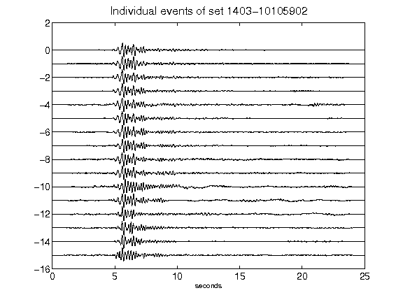](figures/1403-10105902_AllEv.png)[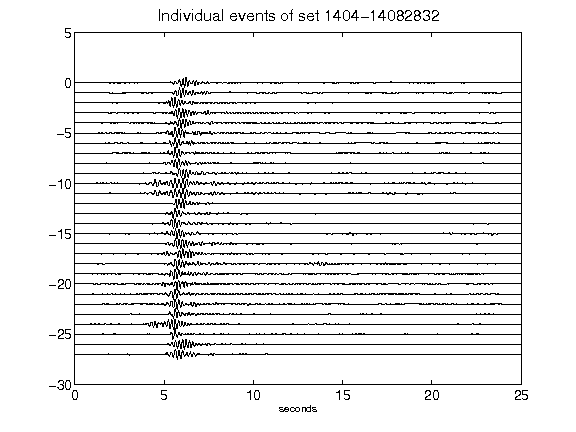](figures/1404-14082832_AllEv.png)[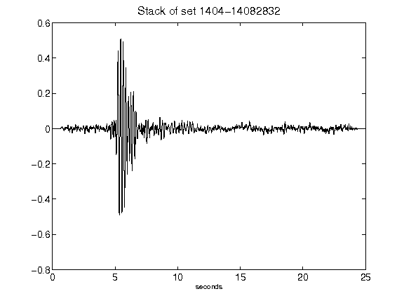](figures/1404-14082832_Stack.png)[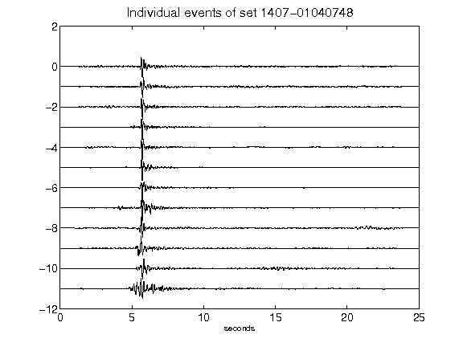](figures/1407-01040748_AllEv.png)[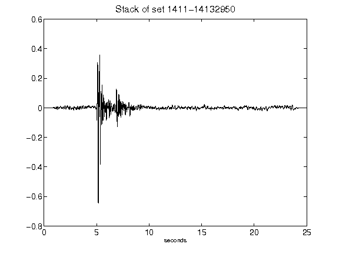](figures/1411-14132950_Stack.png)[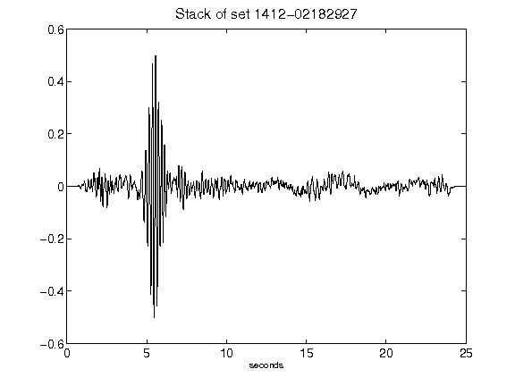](figures/1412-02182927_Stack.png)[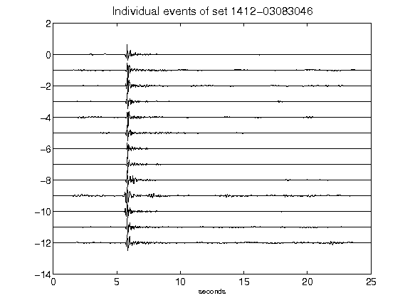](figures/1412-03083046_AllEv.png)[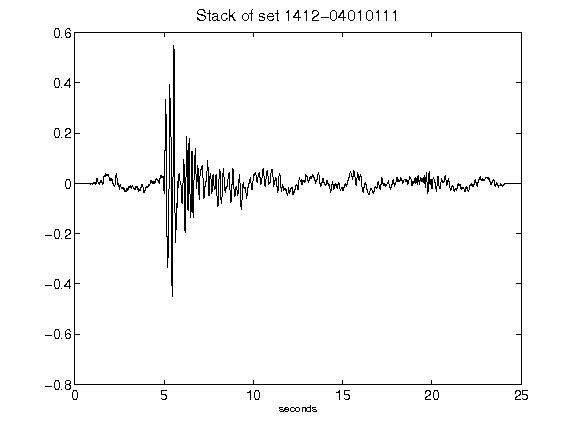](figures/1412-04010111_Stack.png)[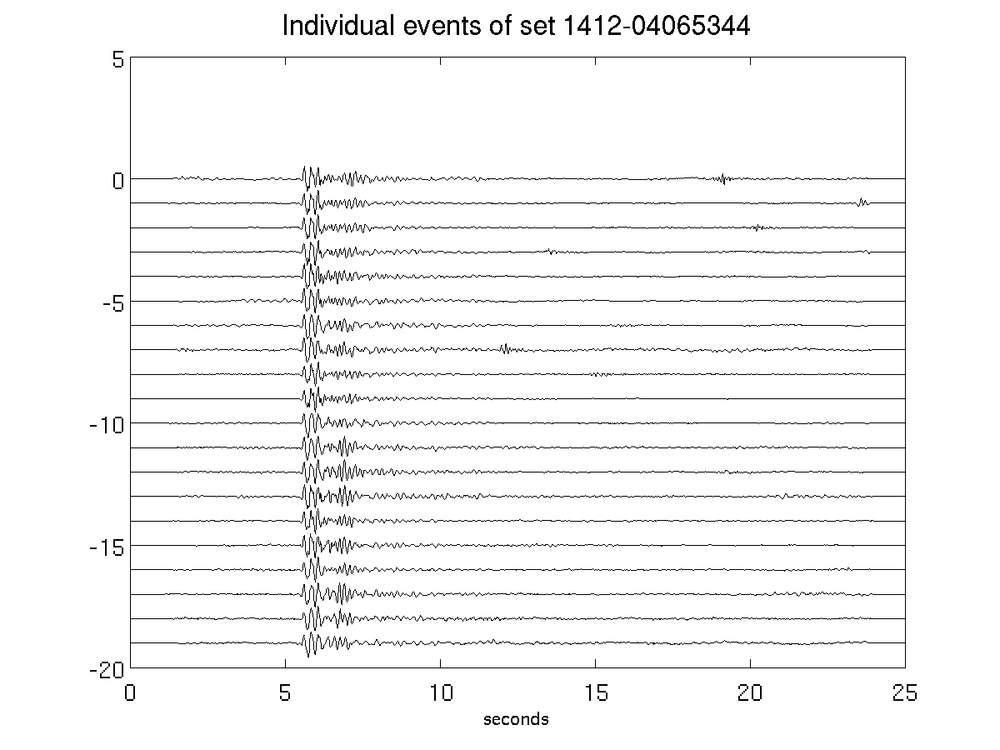](figures/1412-04065344_AllEv.png)[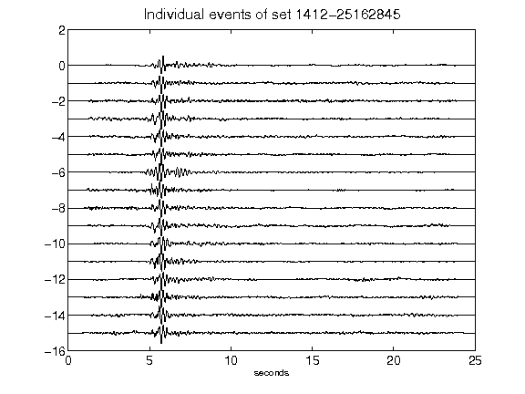](figures/1412-25162845_AllEv.png)[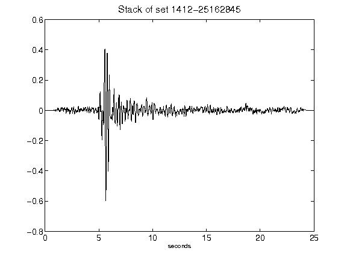](figures/1412-25162845_Stack.png)[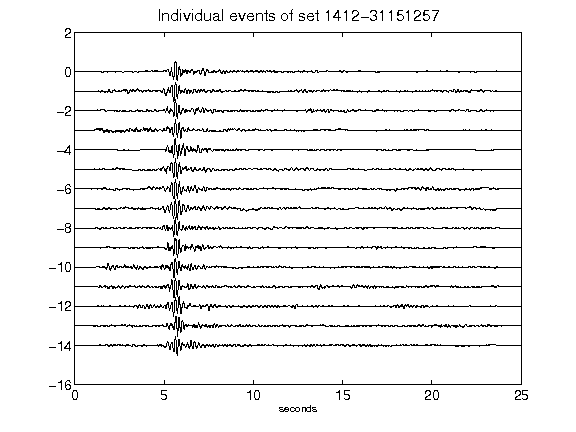](figures/1412-31151257_AllEv.png)[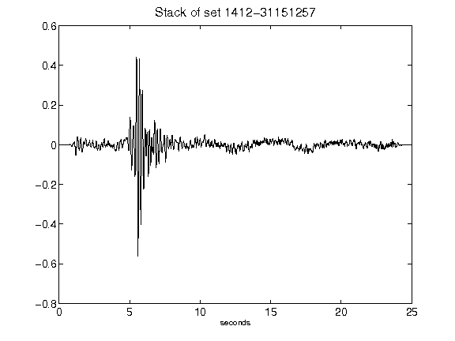](figures/1412-31151257_Stack.png)[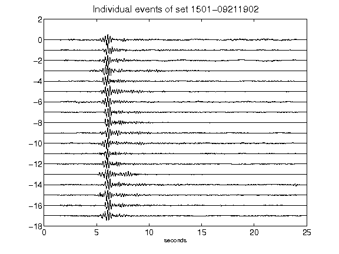](figures/1501-09211902_AllEv.png)[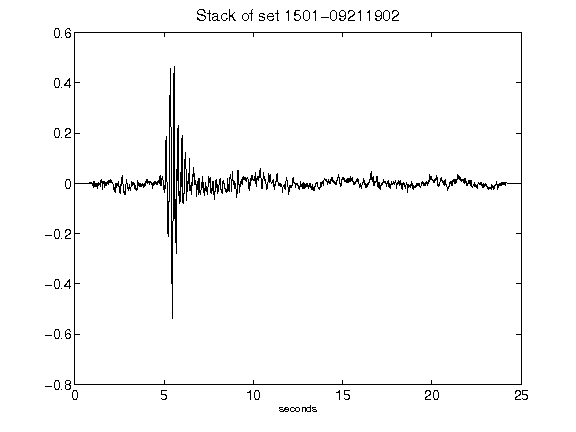](figures/1501-09211902_Stack.png)[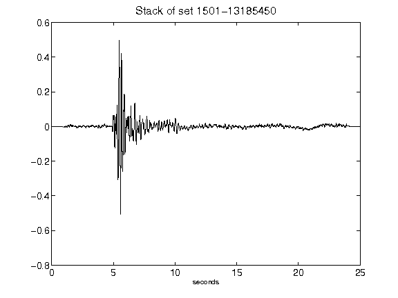](figures/1501-13185450_Stack.png)[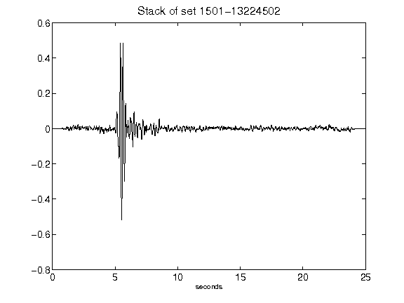](figures/1501-13224502_Stack.png)[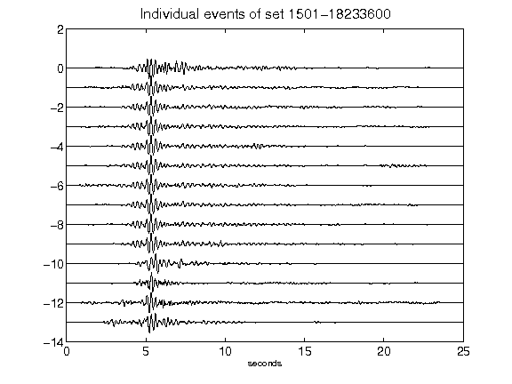](figures/1501-18233600_AllEv.png)[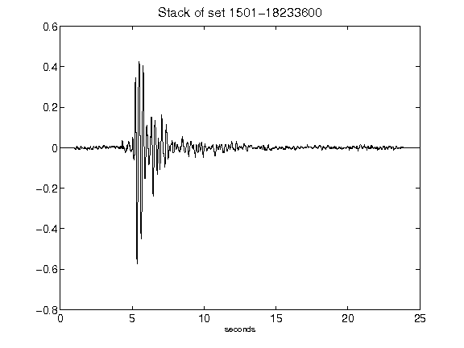](figures/1501-18233600_Stack.png)[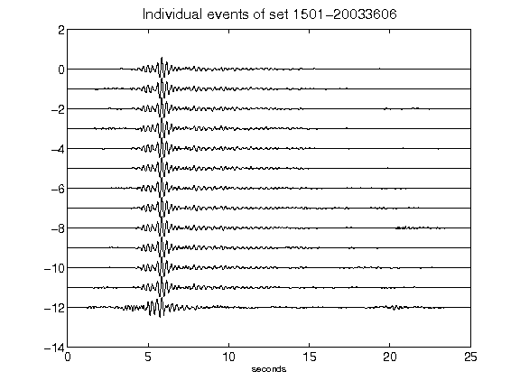](figures/1501-20033606_AllEv.png)[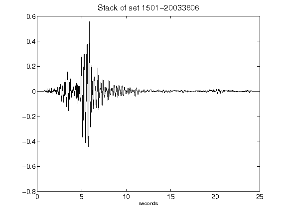](figures/1501-20033606_Stack.png)[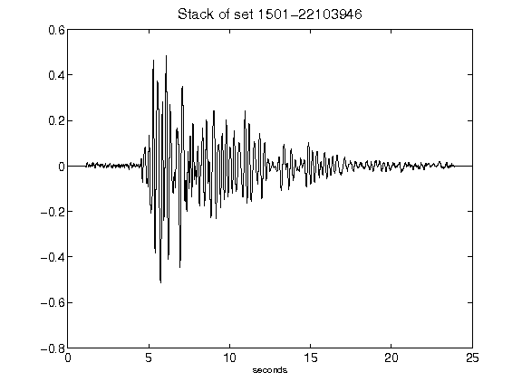](figures/1501-22103946_Stack.png)[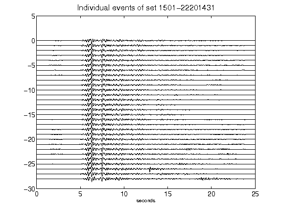](figures/1501-22201431_AllEv.png)[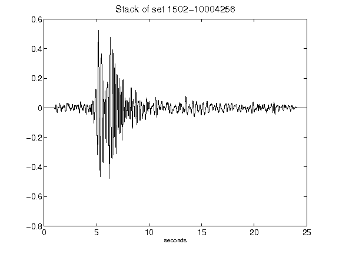](figures/1502-10004256_Stack.png)[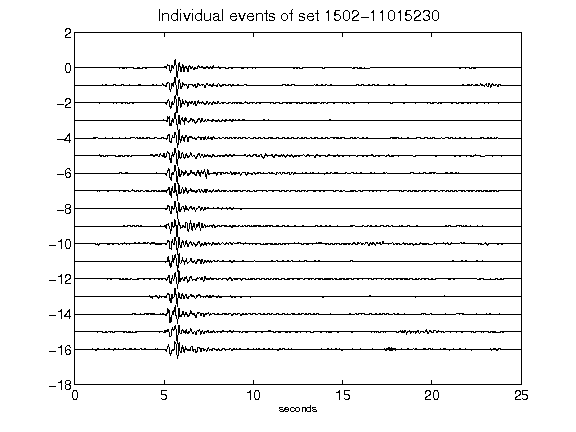](figures/1502-11015230_AllEv.png)[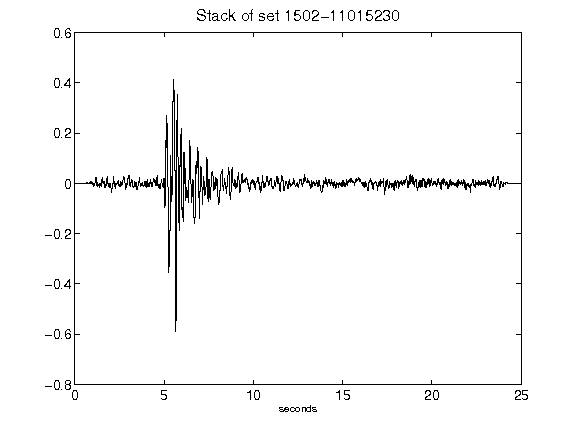](figures/1502-11015230_Stack.png)[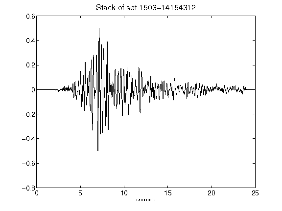](figures/1503-14154312_Stack.png)