# Repeating Earthquake Activity at RCM

## Waveforms
[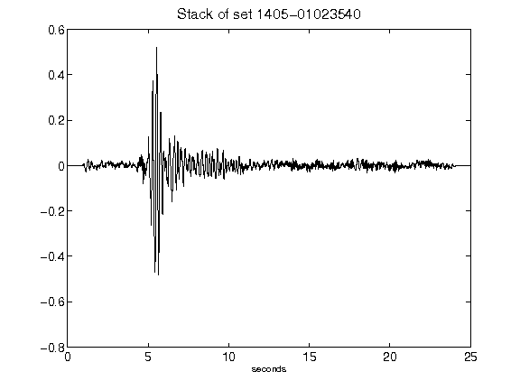](figures/1405-01023540_Stack.png)[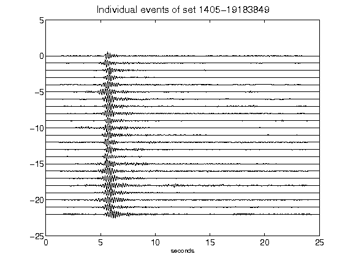](figures/1405-19183849_AllEv.png)[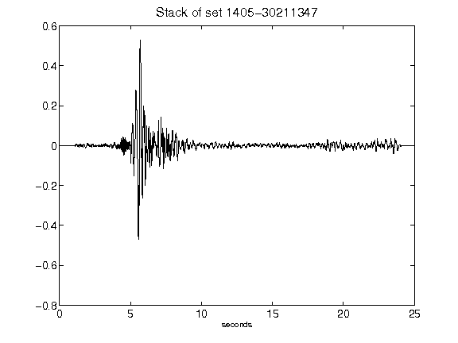](figures/1405-30211347_Stack.png)[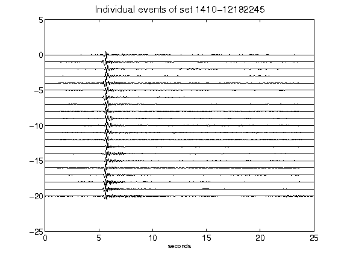](figures/1410-12182245_AllEv.png)[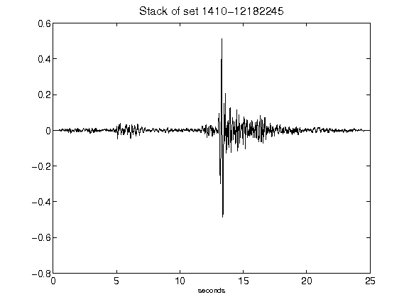](figures/1410-12182245_Stack.png)[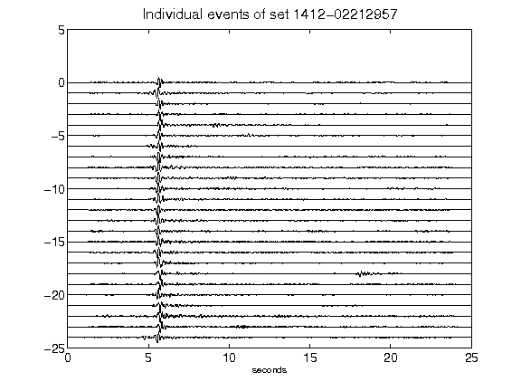](figures/1412-02212957_AllEv.png)[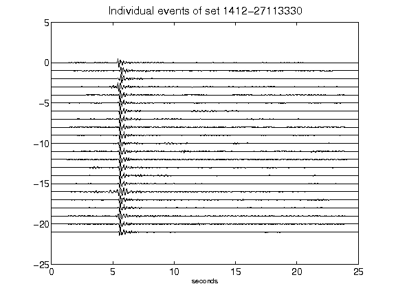](figures/1412-27113330_AllEv.png)[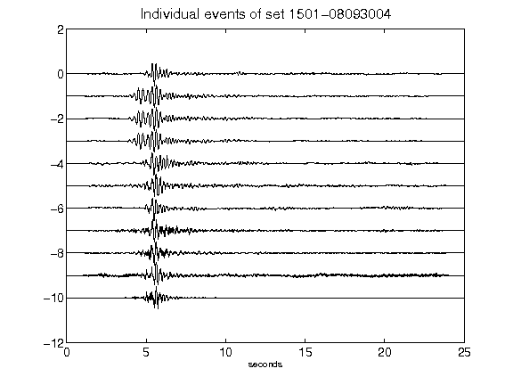](figures/1501-08093004_AllEv.png)[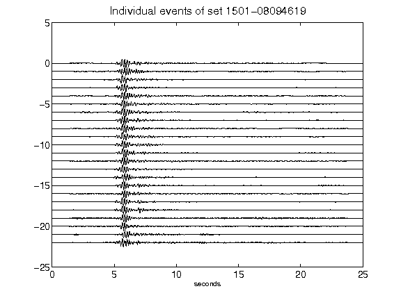](figures/1501-08094619_AllEv.png)[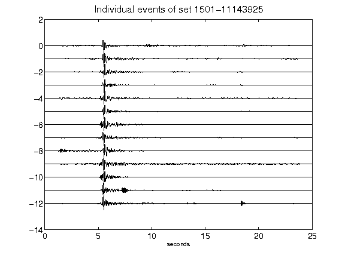](figures/1501-11143925_AllEv.png)[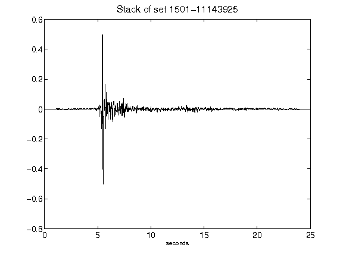](figures/1501-11143925_Stack.png)[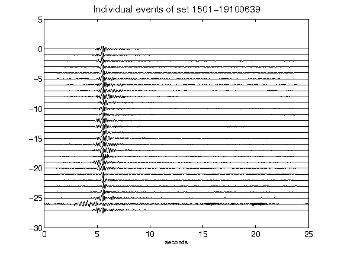](figures/1501-19100639_AllEv.png)[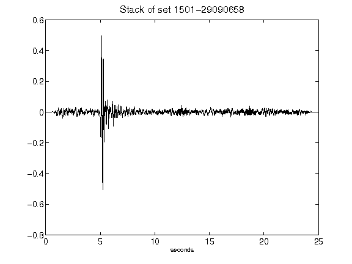](figures/1501-29090658_Stack.png)[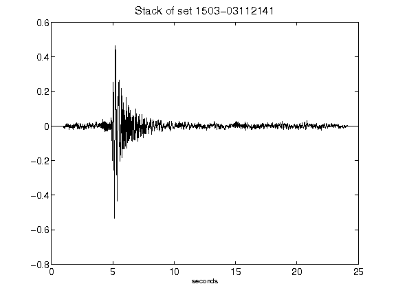](figures/1503-03112141_Stack.png)[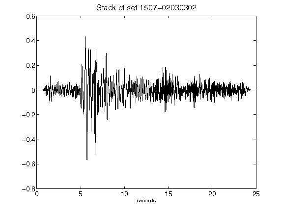](figures/1507-02030302_Stack.png)[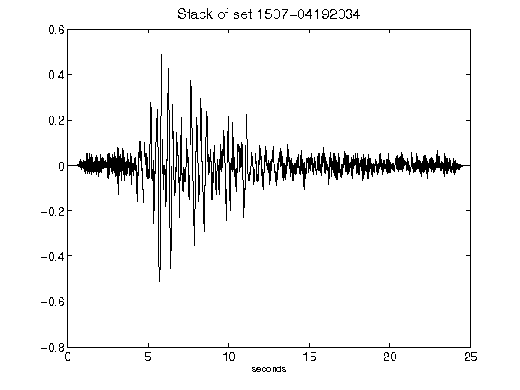](figures/1507-04192034_Stack.png)