# Repeating Earthquake Activity at RCM

## Waveforms
[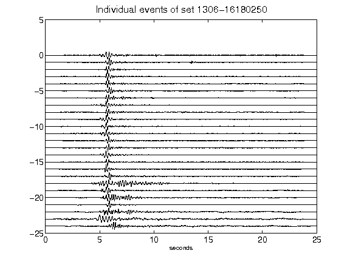](figures/1306-16180250_AllEv.png)[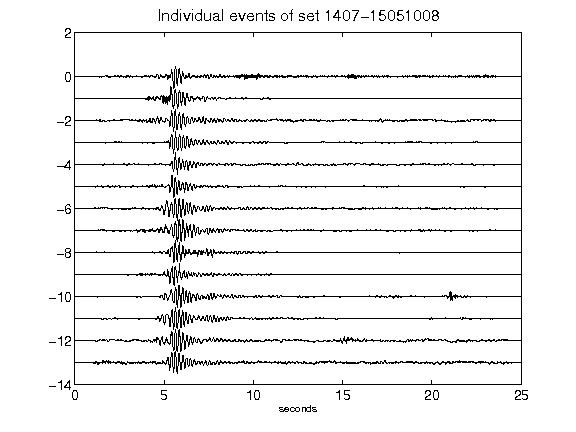](figures/1407-15051008_AllEv.png)[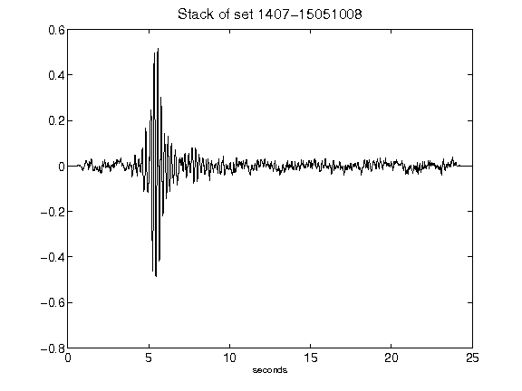](figures/1407-15051008_Stack.png)[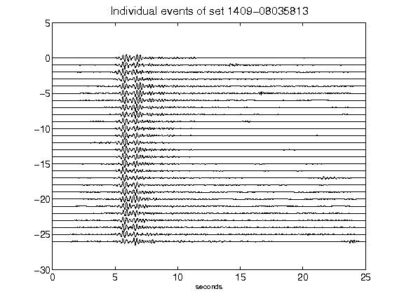](figures/1409-08035813_AllEv.png)[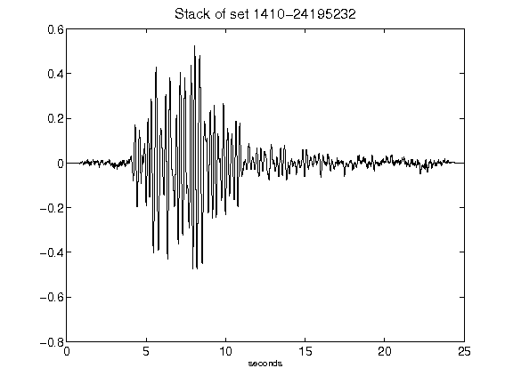](figures/1410-24195232_Stack.png)[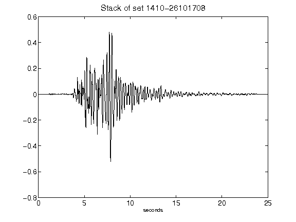](figures/1410-26101708_Stack.png)[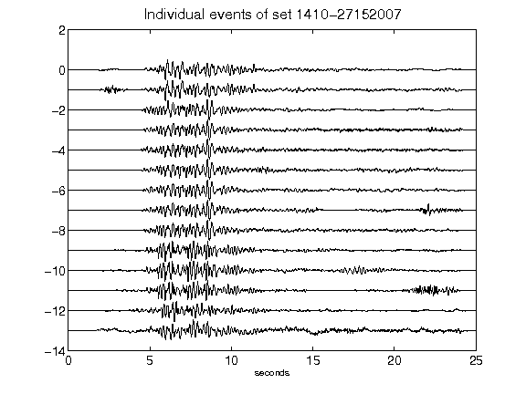](figures/1410-27152007_AllEv.png)[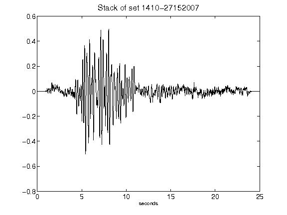](figures/1410-27152007_Stack.png)[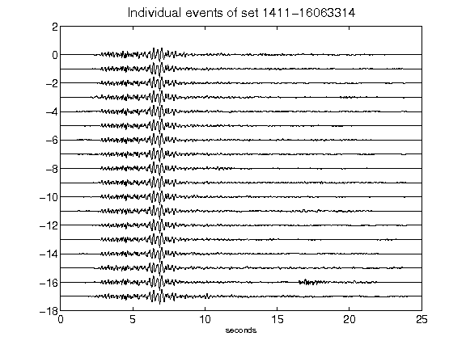](figures/1411-16063314_AllEv.png)[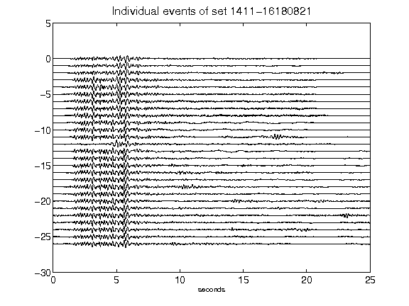](figures/1411-16180821_AllEv.png)[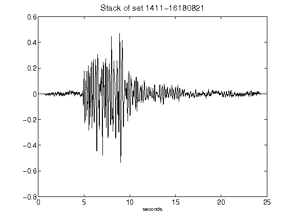](figures/1411-16180821_Stack.png)[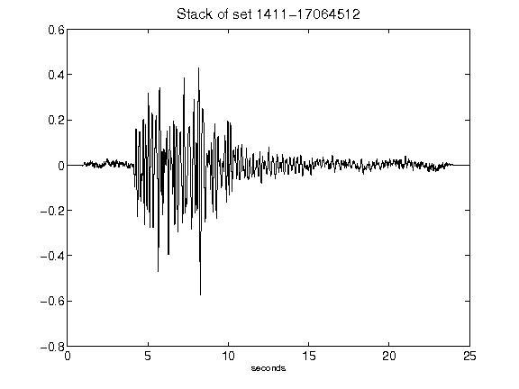](figures/1411-17064512_Stack.png)