# Repeating Earthquake Activity at RCM

## Waveforms
[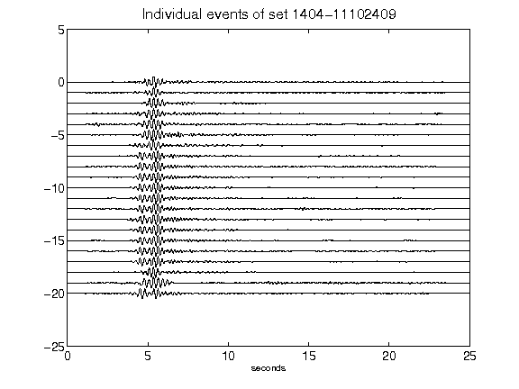](figures/1404-11102409_AllEv.png)[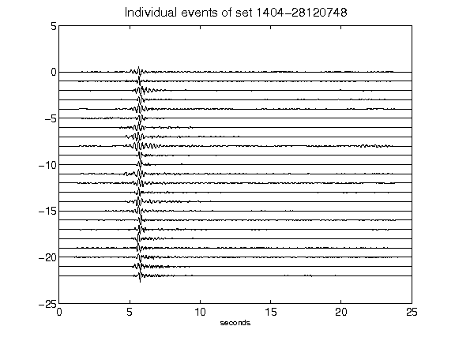](figures/1404-28120748_AllEv.png)[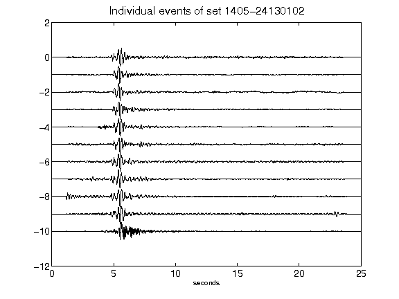](figures/1405-24130102_AllEv.png)[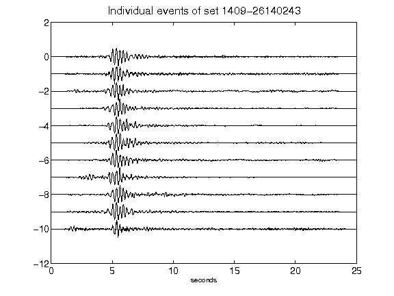](figures/1409-26140243_AllEv.png)[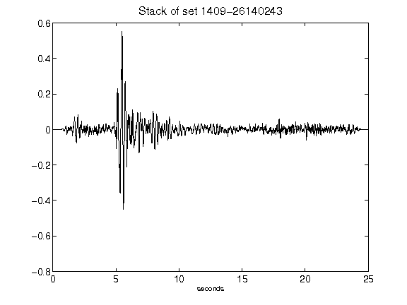](figures/1409-26140243_Stack.png)[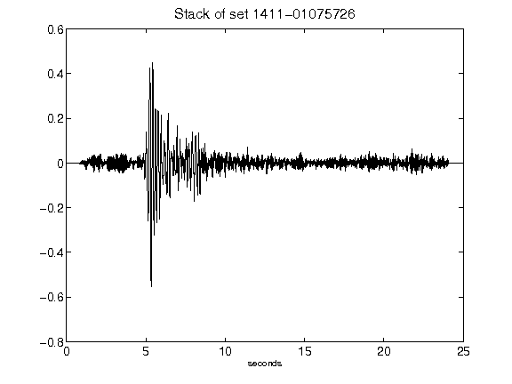](figures/1411-01075726_Stack.png)[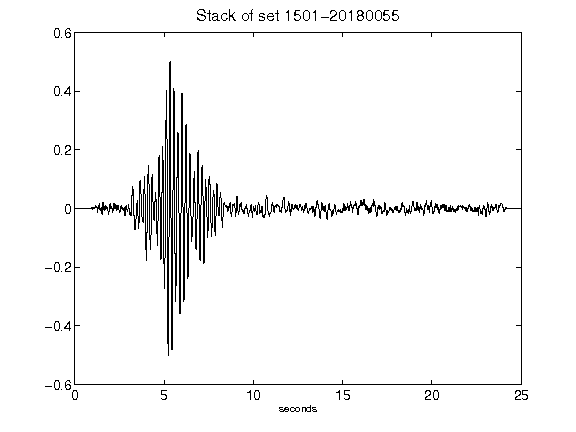](figures/1501-20180055_Stack.png)[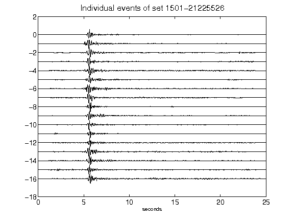](figures/1501-21225526_AllEv.png)[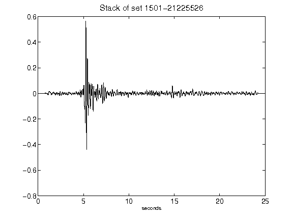](figures/1501-21225526_Stack.png)[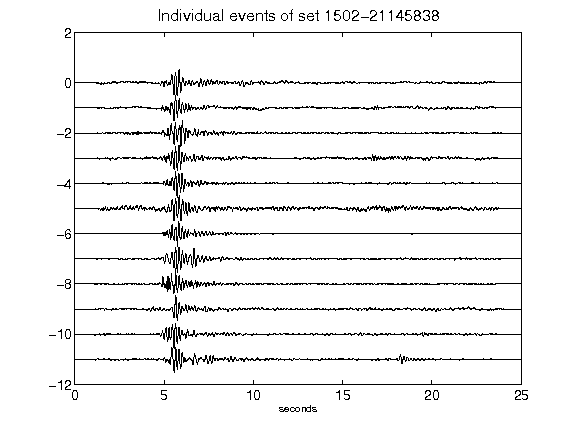](figures/1502-21145838_AllEv.png)[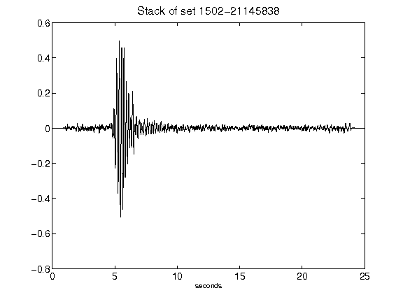](figures/1502-21145838_Stack.png)[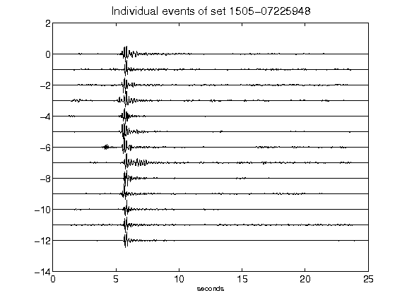](figures/1505-07225948_AllEv.png)[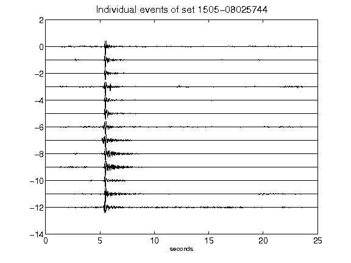](figures/1505-08025744_AllEv.png)[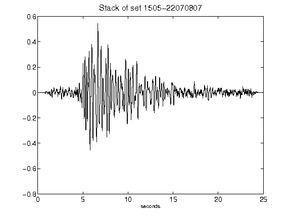](figures/1505-22070807_Stack.png)[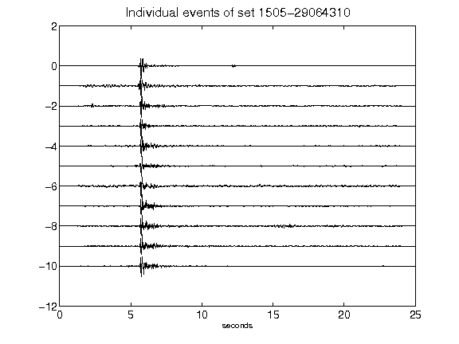](figures/1505-29064310_AllEv.png)[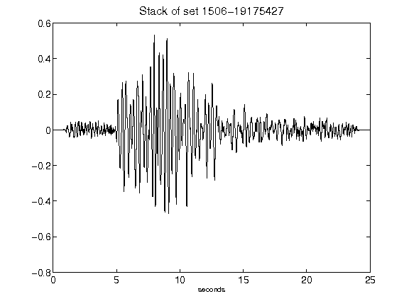](figures/1506-19175427_Stack.png)