# Repeating Earthquake Activity at RCM

## Waveforms
[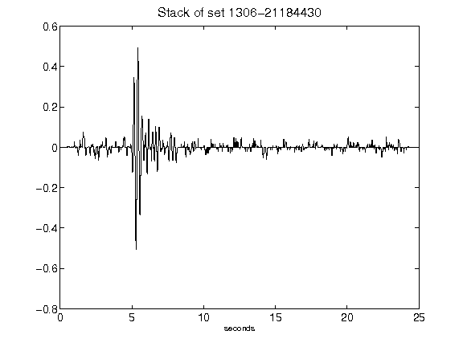](figures/1306-21184430_Stack.png)[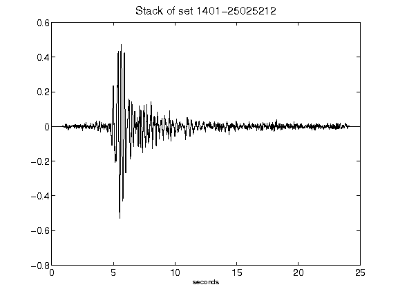](figures/1401-25025212_Stack.png)[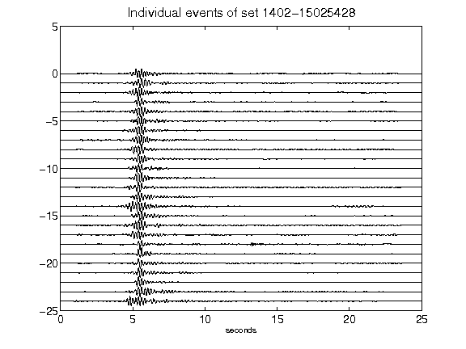](figures/1402-15025428_AllEv.png)[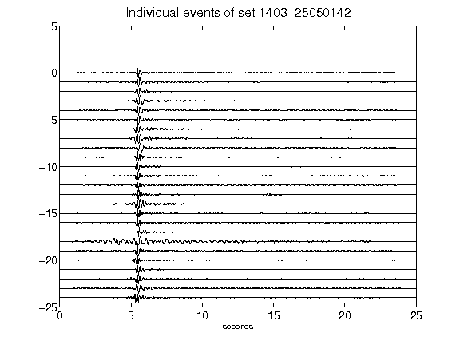](figures/1403-25050142_AllEv.png)[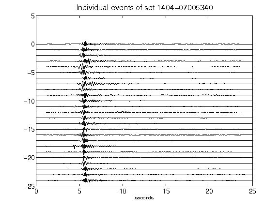](figures/1404-07005340_AllEv.png)[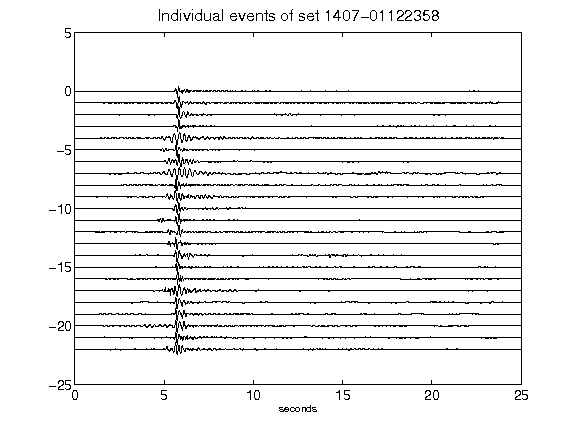](figures/1407-01122358_AllEv.png)[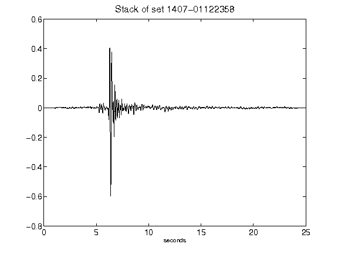](figures/1407-01122358_Stack.png)[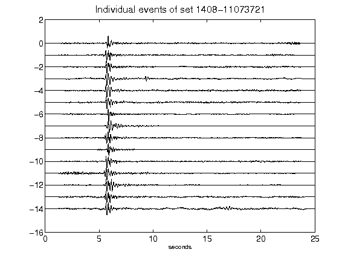](figures/1408-11073721_AllEv.png)[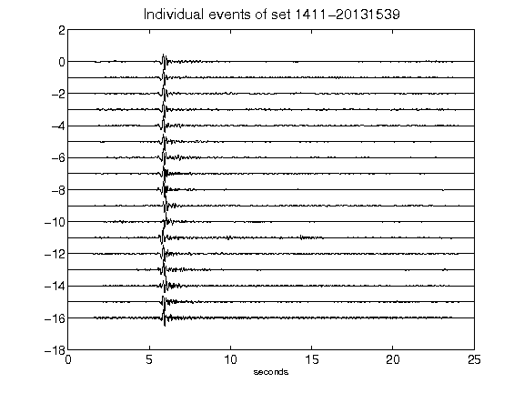](figures/1411-20131539_AllEv.png)[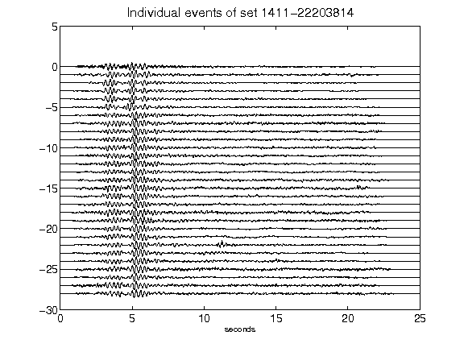](figures/1411-22203814_AllEv.png)[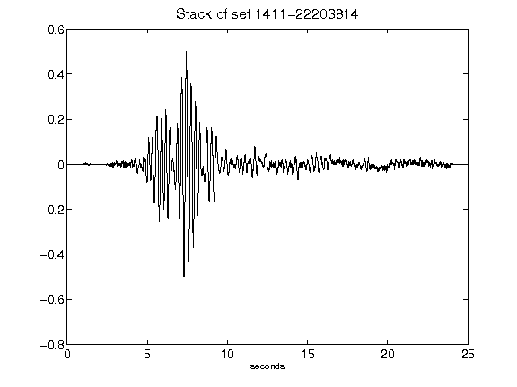](figures/1411-22203814_Stack.png)[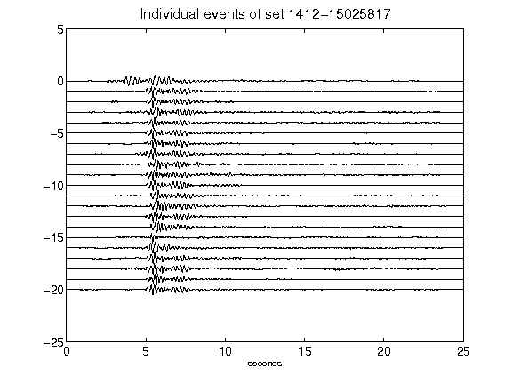](figures/1412-15025817_AllEv.png)[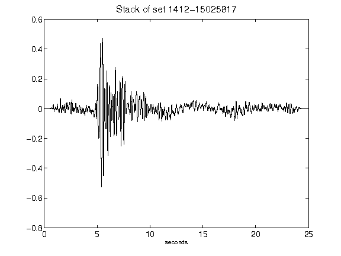](figures/1412-15025817_Stack.png)[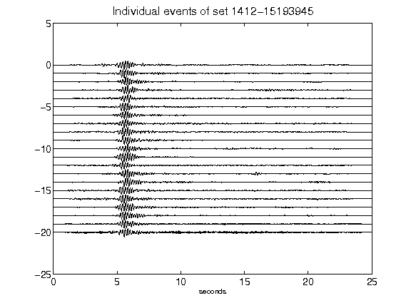](figures/1412-15193945_AllEv.png)[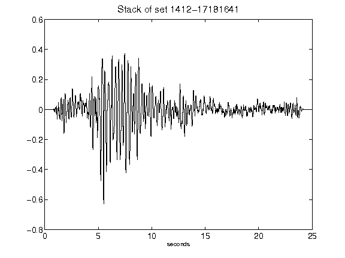](figures/1412-17181641_Stack.png)[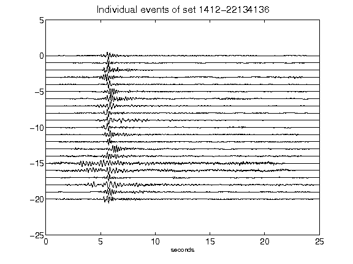](figures/1412-22134136_AllEv.png)[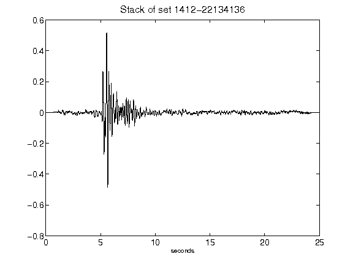](figures/1412-22134136_Stack.png)[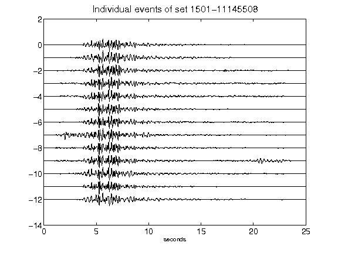](figures/1501-11145508_AllEv.png)[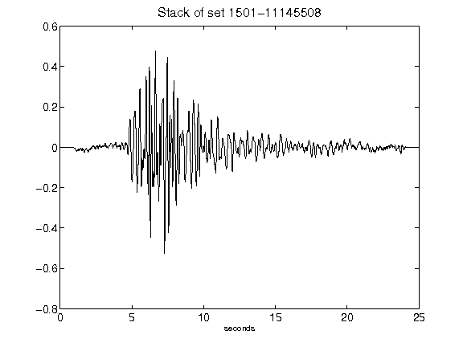](figures/1501-11145508_Stack.png)[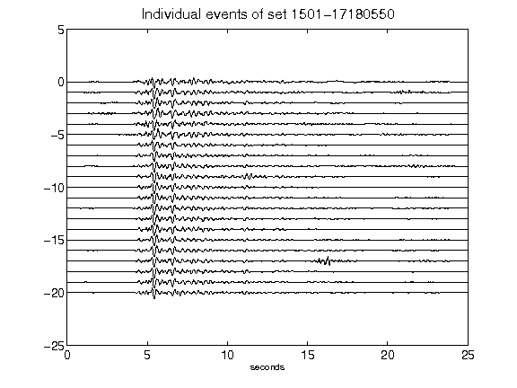](figures/1501-17180550_AllEv.png)[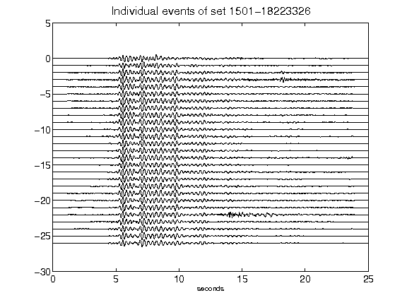](figures/1501-18223326_AllEv.png)[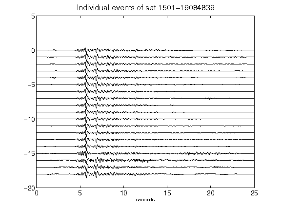](figures/1501-19084839_AllEv.png)[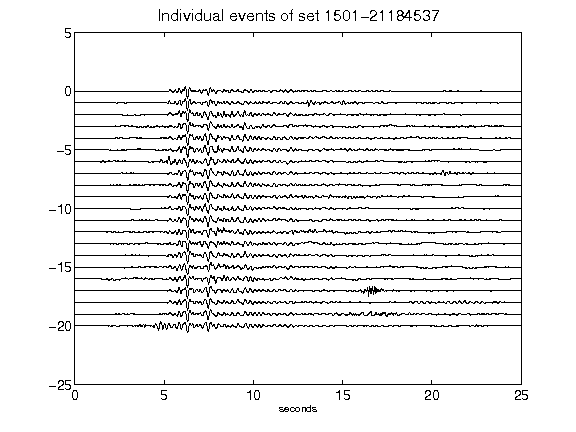](figures/1501-21184537_AllEv.png)[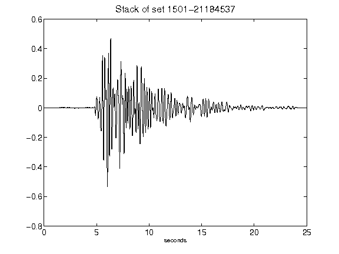](figures/1501-21184537_Stack.png)[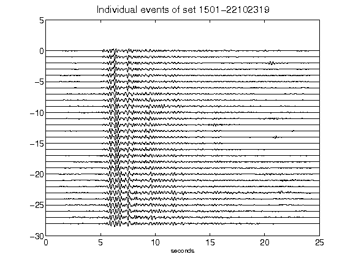](figures/1501-22102319_AllEv.png)[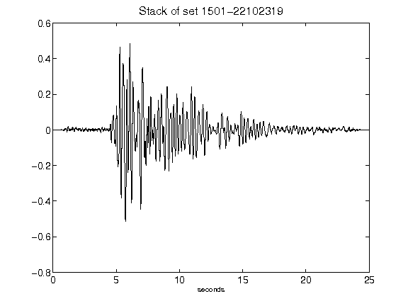](figures/1501-22102319_Stack.png)[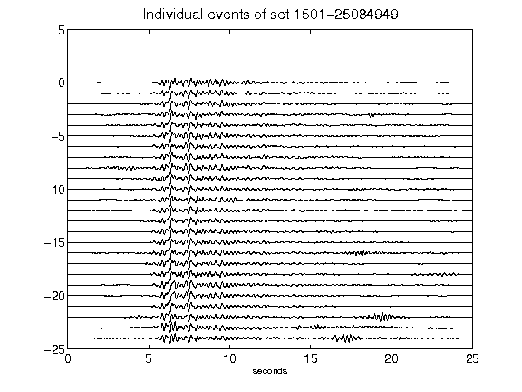](figures/1501-25084949_AllEv.png)[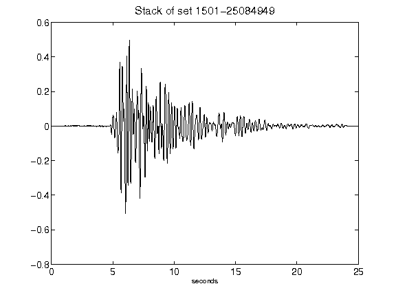](figures/1501-25084949_Stack.png)[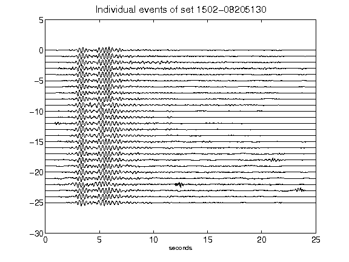](figures/1502-08205130_AllEv.png)[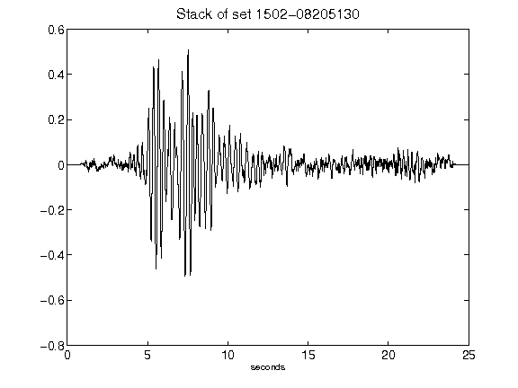](figures/1502-08205130_Stack.png)[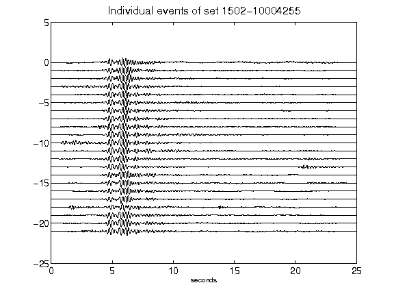](figures/1502-10004255_AllEv.png)[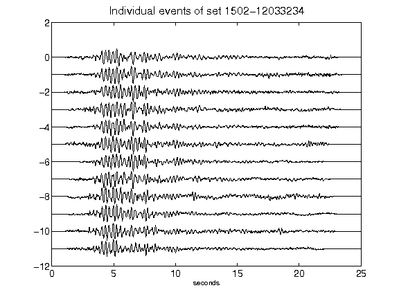](figures/1502-12033234_AllEv.png)