# Repeating Earthquake Activity at RCM

## Waveforms
[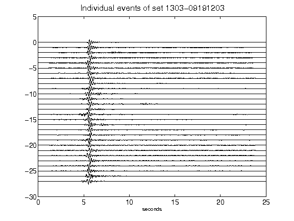](figures/1303-09191203_AllEv.png)[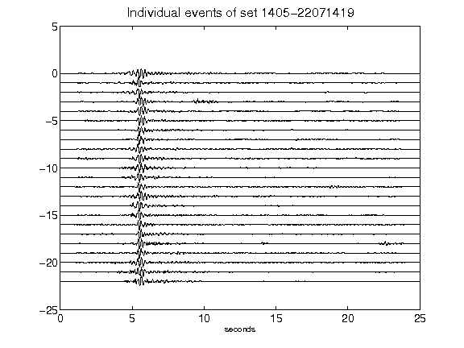](figures/1405-22071419_AllEv.png)[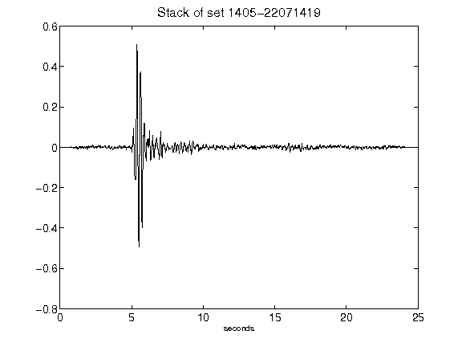](figures/1405-22071419_Stack.png)[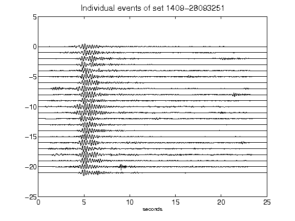](figures/1409-28093251_AllEv.png)[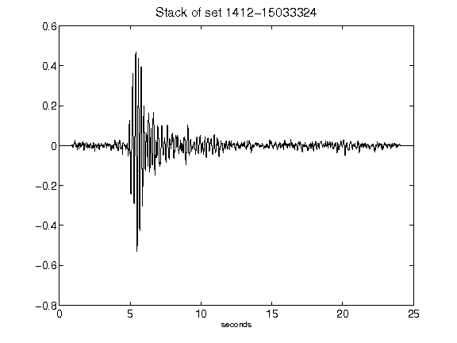](figures/1412-15033324_Stack.png)[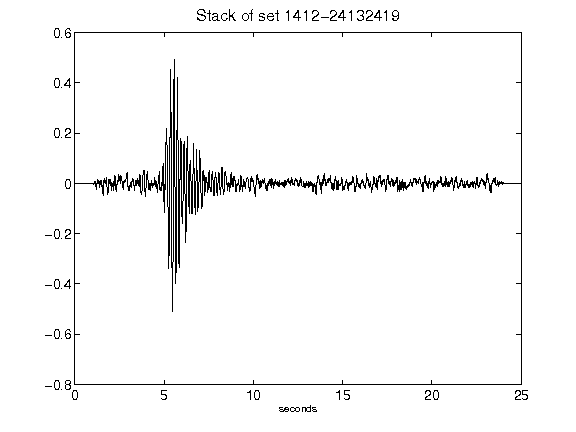](figures/1412-24132419_Stack.png)[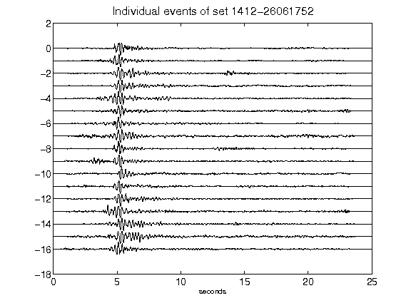](figures/1412-26061752_AllEv.png)[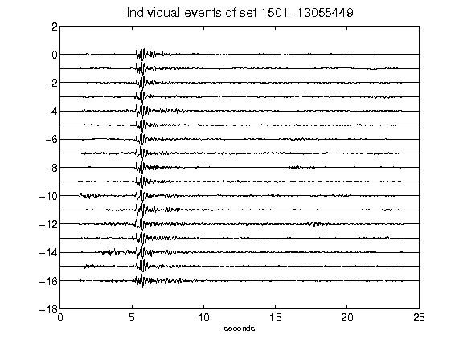](figures/1501-13055449_AllEv.png)[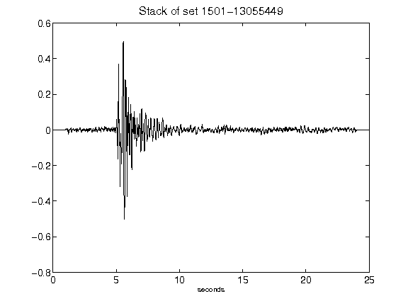](figures/1501-13055449_Stack.png)[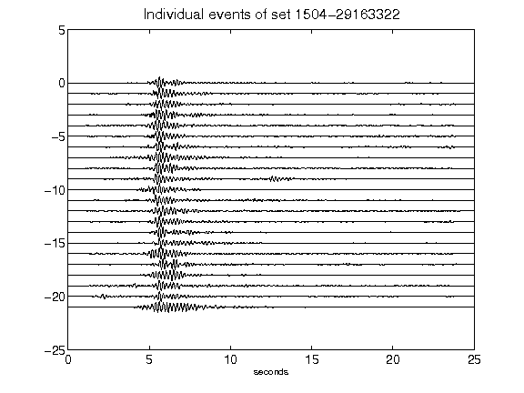](figures/1504-29163322_AllEv.png)[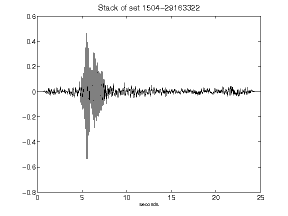](figures/1504-29163322_Stack.png)