# Repeating Earthquake Activity at RCM

## Waveforms
[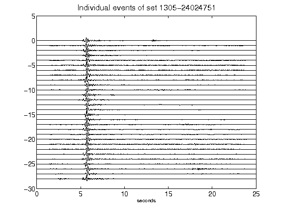](figures/1305-24024751_AllEv.png)[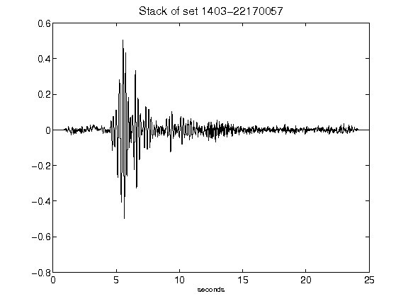](figures/1403-22170057_Stack.png)[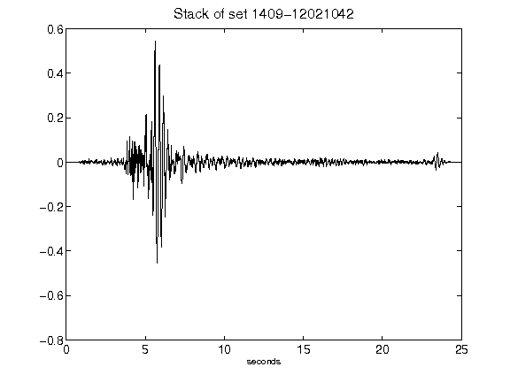](figures/1409-12021042_Stack.png)[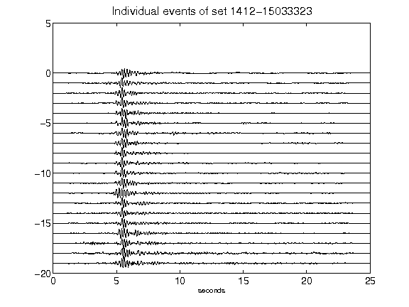](figures/1412-15033323_AllEv.png)[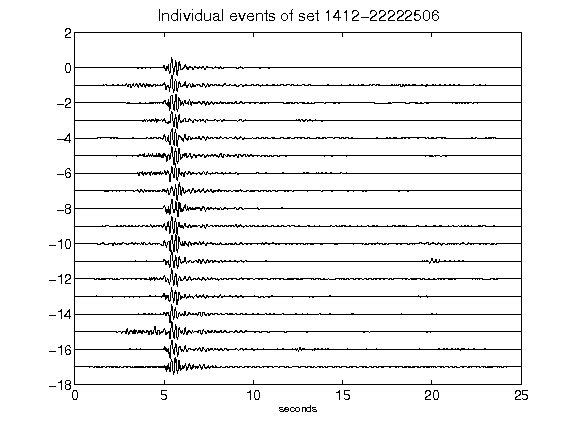](figures/1412-22222506_AllEv.png)[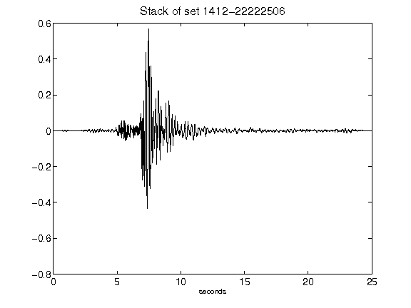](figures/1412-22222506_Stack.png)[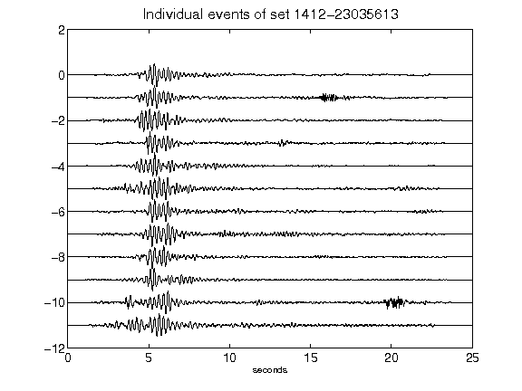](figures/1412-23035613_AllEv.png)[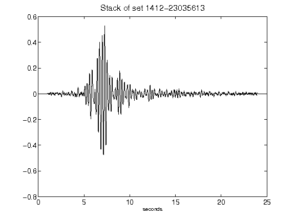](figures/1412-23035613_Stack.png)[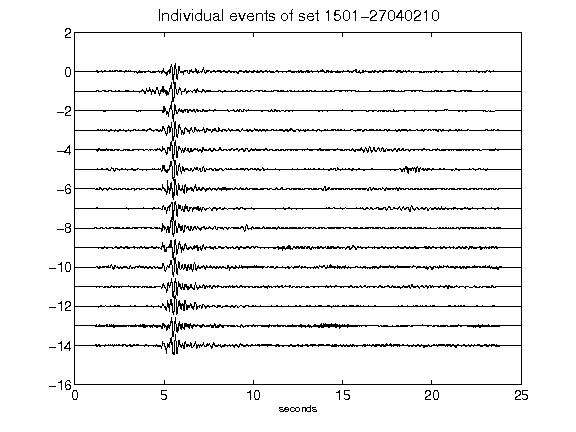](figures/1501-27040210_AllEv.png)[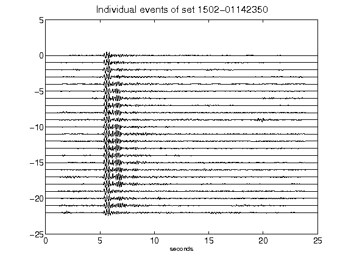](figures/1502-01142350_AllEv.png)[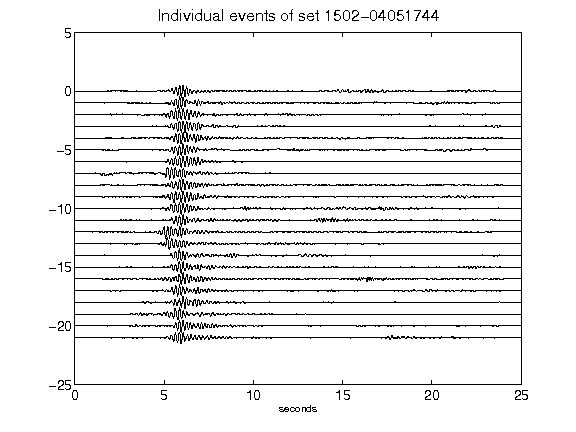](figures/1502-04051744_AllEv.png)[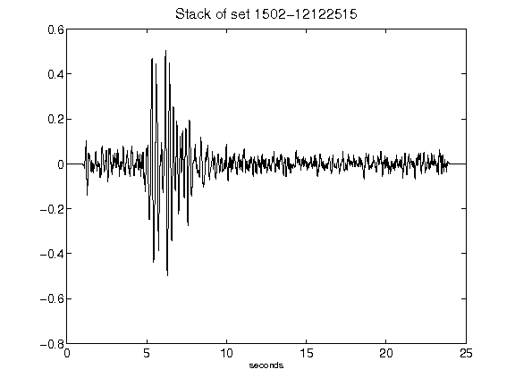](figures/1502-12122515_Stack.png)[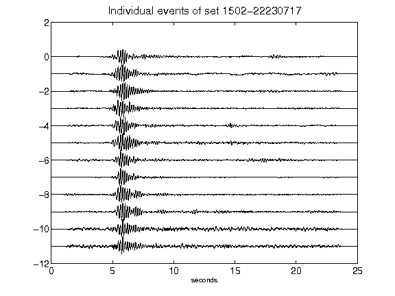](figures/1502-22230717_AllEv.png)[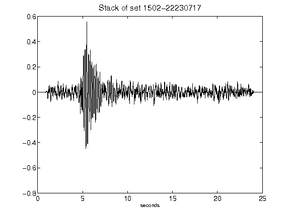](figures/1502-22230717_Stack.png)[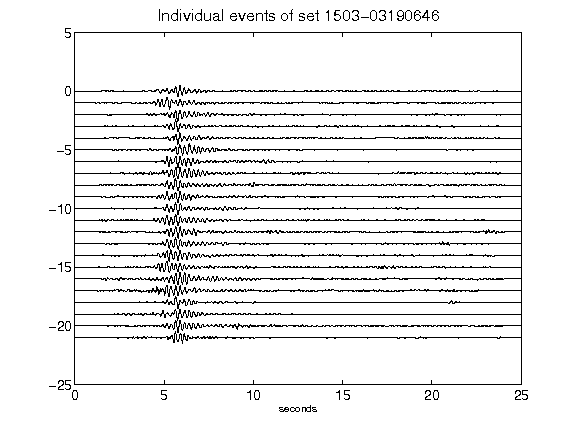](figures/1503-03190646_AllEv.png)[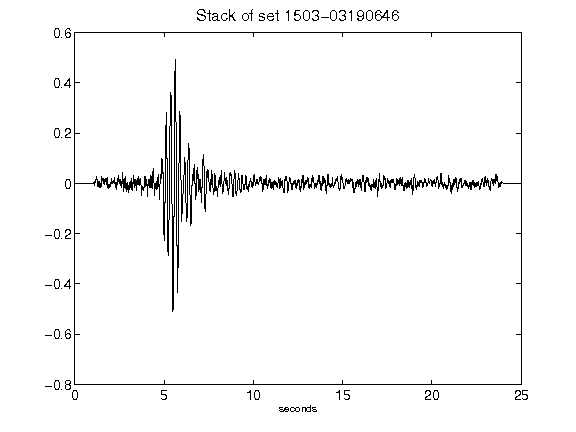](figures/1503-03190646_Stack.png)[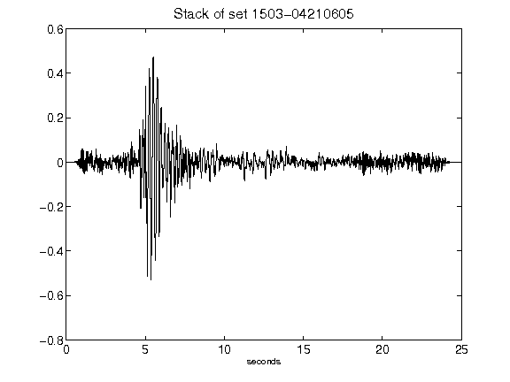](figures/1503-04210605_Stack.png)[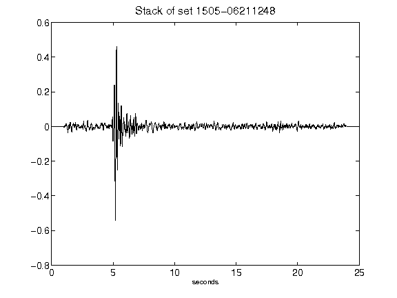](figures/1505-06211248_Stack.png)[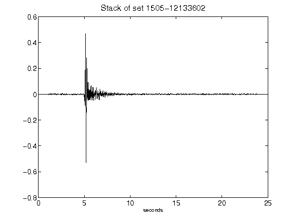](figures/1505-12133602_Stack.png)