# Repeating Earthquake Activity at RCM

## Waveforms
[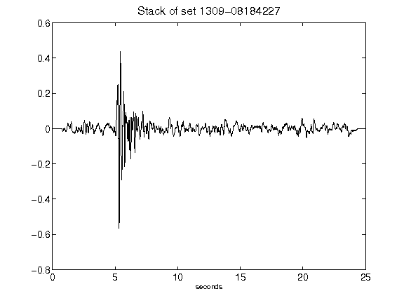](figures/1309-08184227_Stack.png)[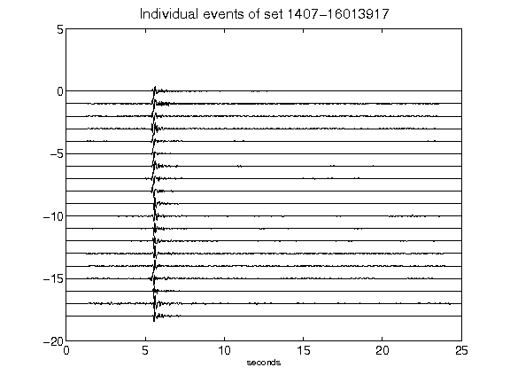](figures/1407-16013917_AllEv.png)[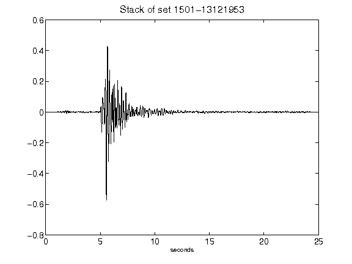](figures/1501-13121953_Stack.png)[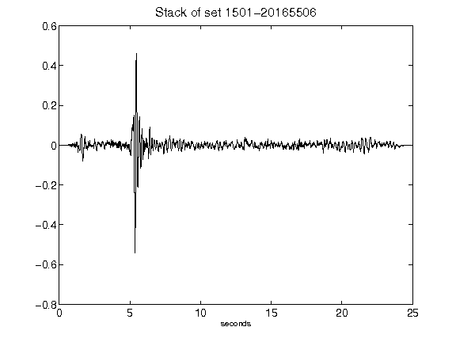](figures/1501-20165506_Stack.png)[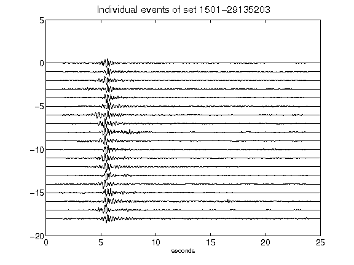](figures/1501-29135203_AllEv.png)[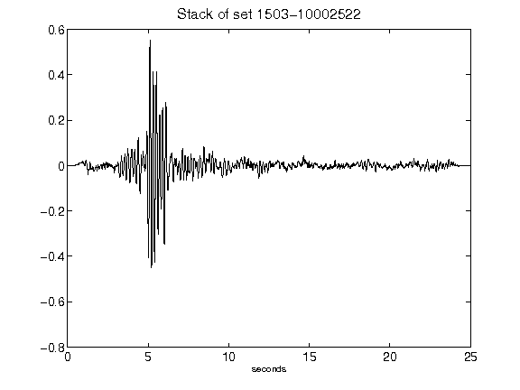](figures/1503-10002522_Stack.png)[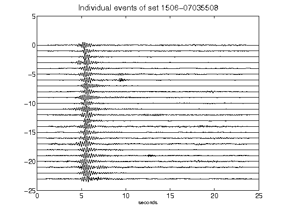](figures/1506-07035508_AllEv.png)[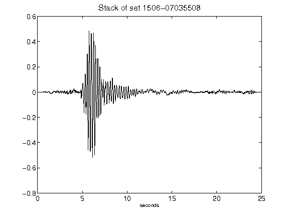](figures/1506-07035508_Stack.png)[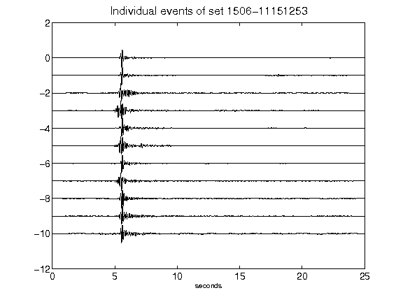](figures/1506-11151253_AllEv.png)[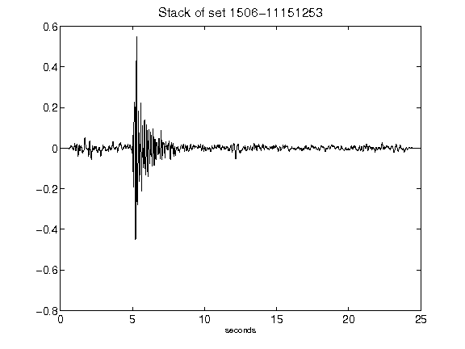](figures/1506-11151253_Stack.png)[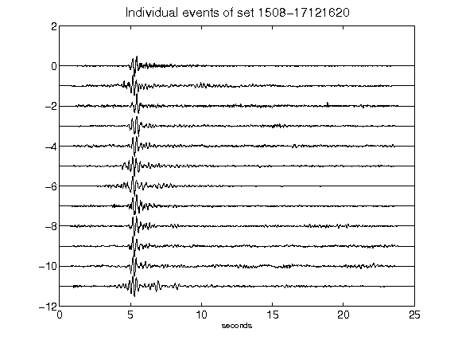](figures/1508-17121620_AllEv.png)[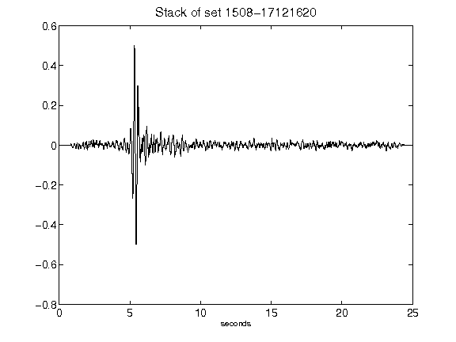](figures/1508-17121620_Stack.png)[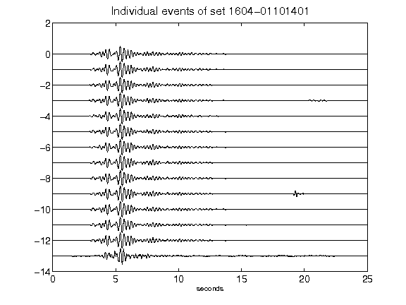](figures/1604-01101401_AllEv.png)[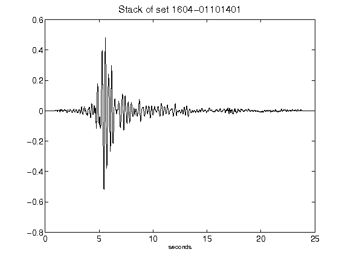](figures/1604-01101401_Stack.png)[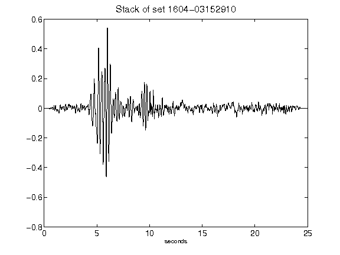](figures/1604-03152910_Stack.png)[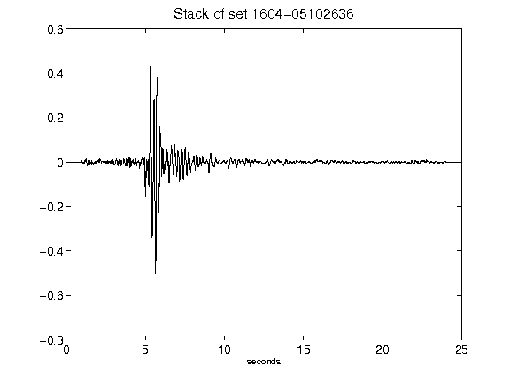](figures/1604-05102636_Stack.png)[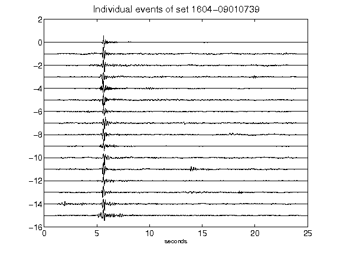](figures/1604-09010739_AllEv.png)[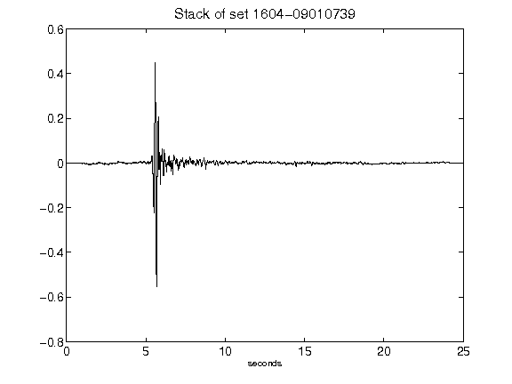](figures/1604-09010739_Stack.png)