# Repeating Earthquake Activity at RCM

## Waveforms
[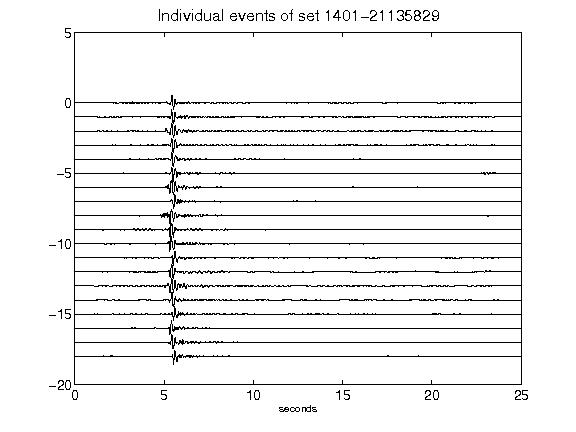](figures/1401-21135829_AllEv.png)[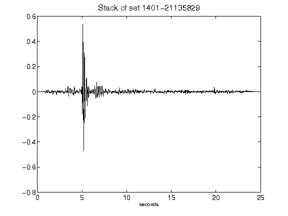](figures/1401-21135829_Stack.png)[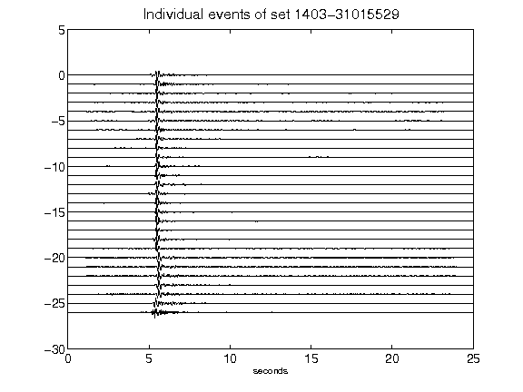](figures/1403-31015529_AllEv.png)[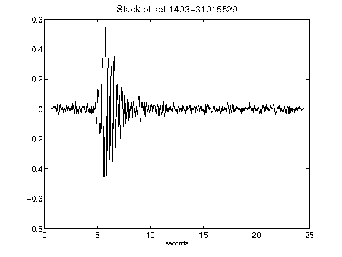](figures/1403-31015529_Stack.png)[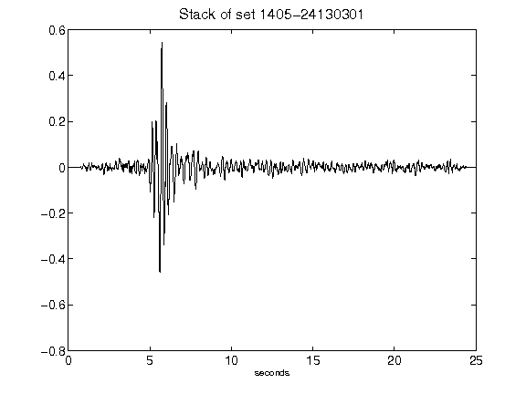](figures/1405-24130301_Stack.png)[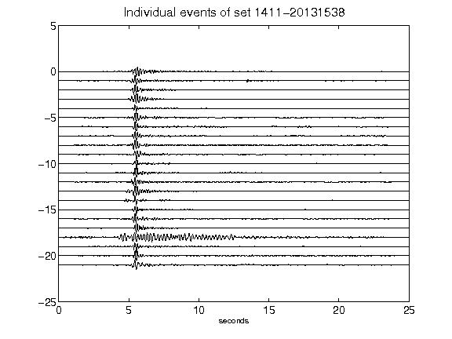](figures/1411-20131538_AllEv.png)[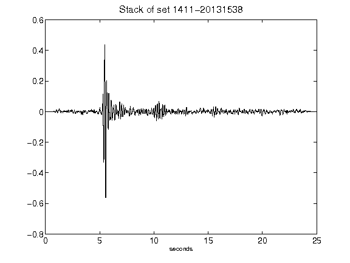](figures/1411-20131538_Stack.png)[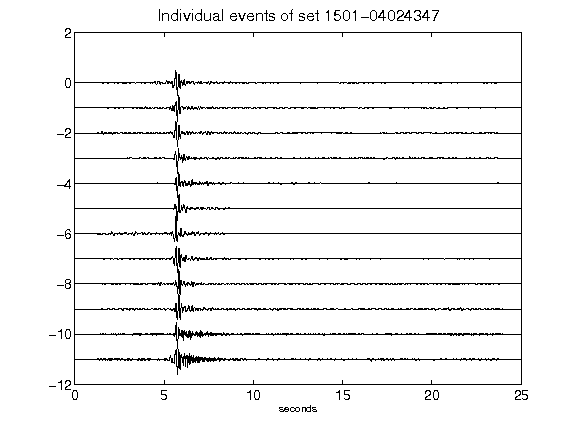](figures/1501-04024347_AllEv.png)[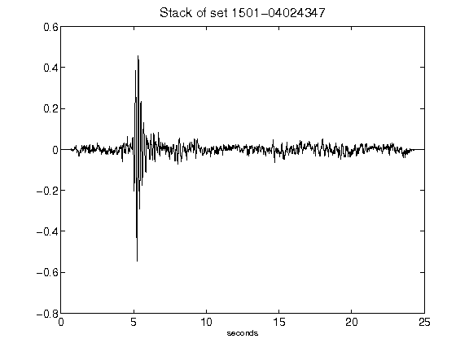](figures/1501-04024347_Stack.png)[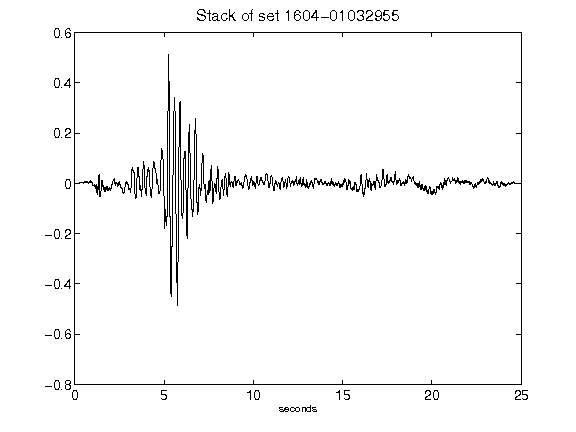](figures/1604-01032955_Stack.png)[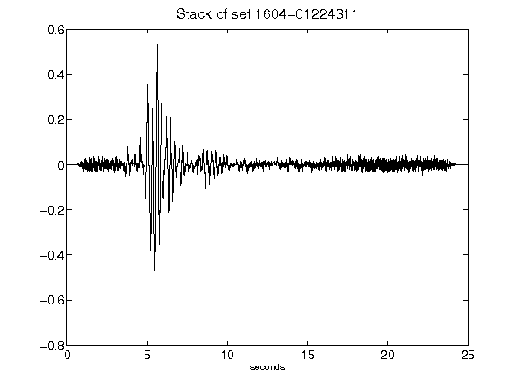](figures/1604-01224311_Stack.png)