# Repeating Earthquake Activity at RCM

## Waveforms
[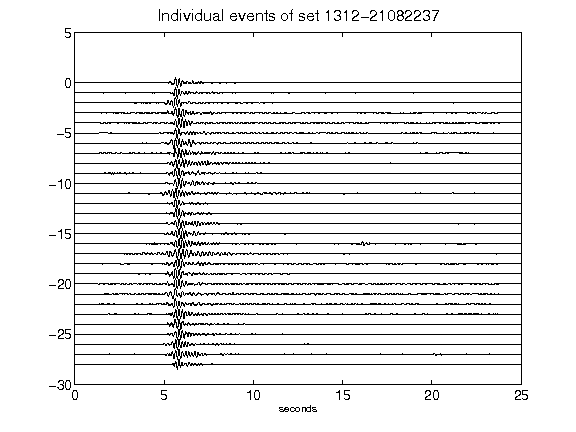](figures/1312-21082237_AllEv.png)[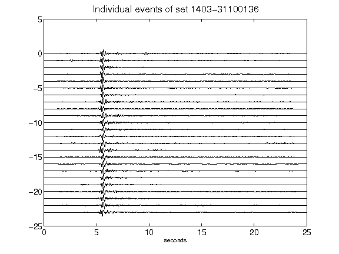](figures/1403-31100136_AllEv.png)[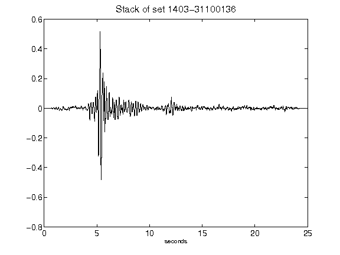](figures/1403-31100136_Stack.png)[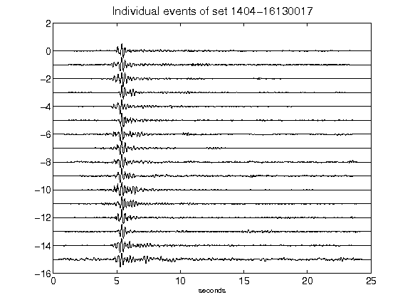](figures/1404-16130017_AllEv.png)[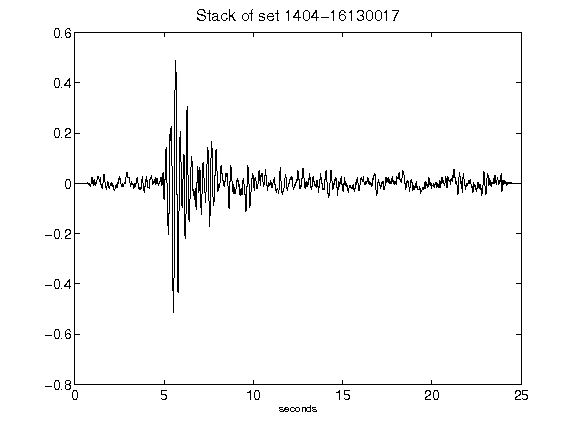](figures/1404-16130017_Stack.png)[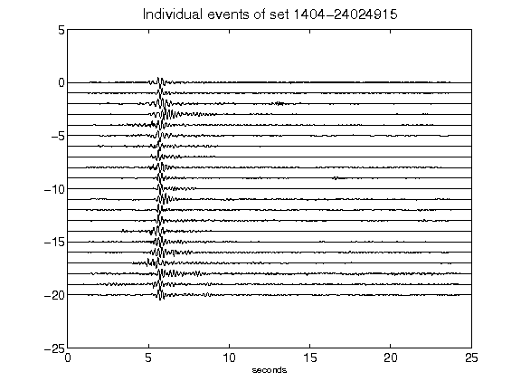](figures/1404-24024915_AllEv.png)[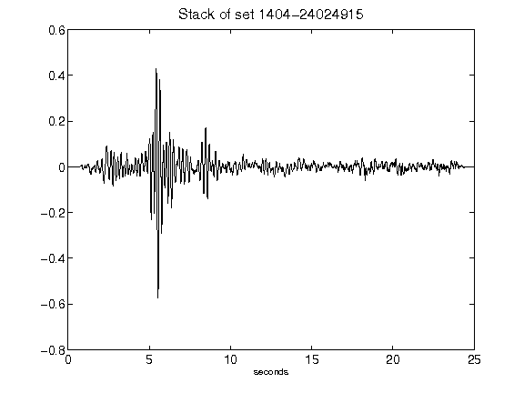](figures/1404-24024915_Stack.png)[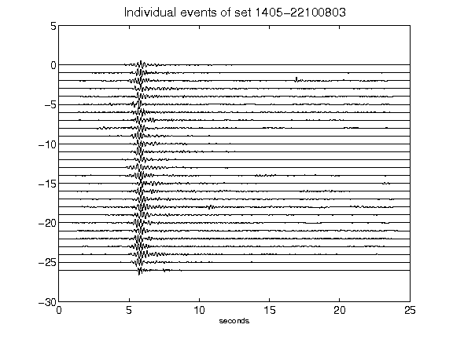](figures/1405-22100803_AllEv.png)[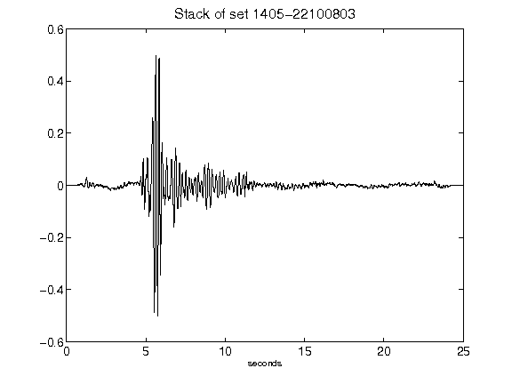](figures/1405-22100803_Stack.png)[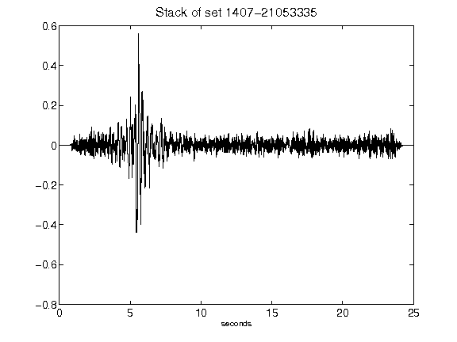](figures/1407-21053335_Stack.png)[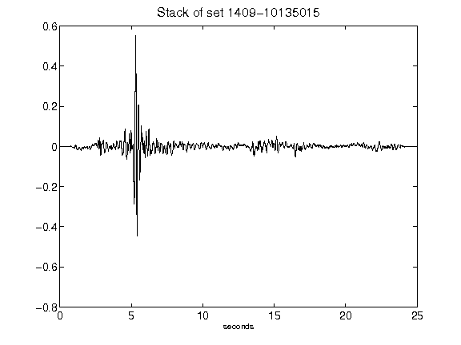](figures/1409-10135015_Stack.png)[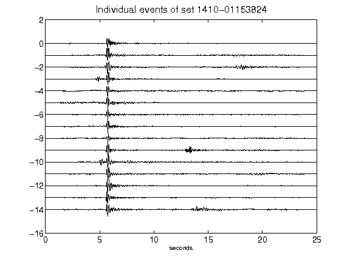](figures/1410-01153824_AllEv.png)[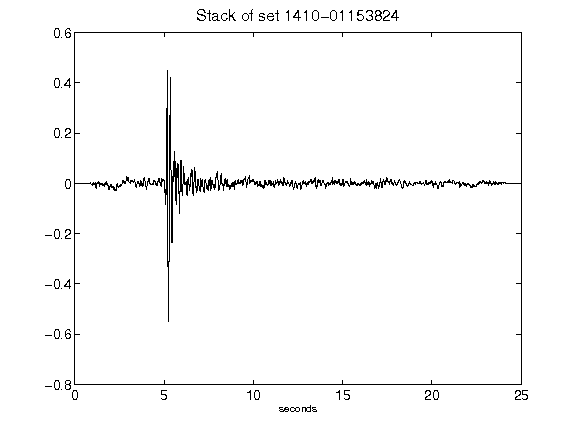](figures/1410-01153824_Stack.png)[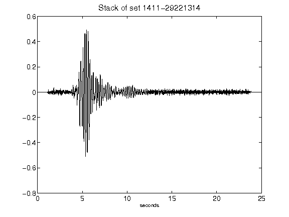](figures/1411-29221314_Stack.png)[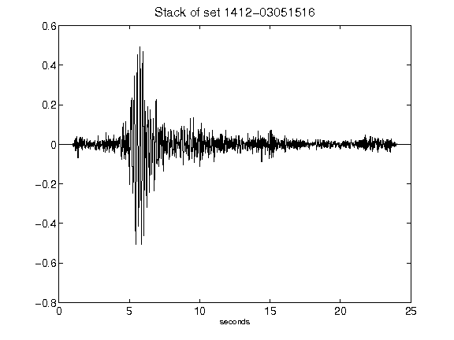](figures/1412-03051516_Stack.png)[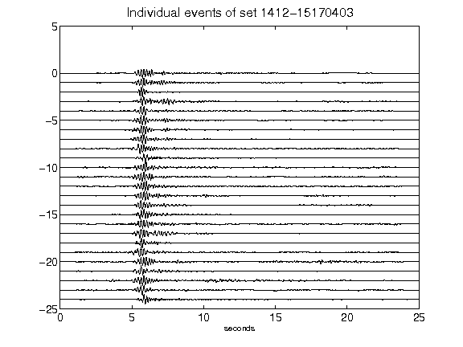](figures/1412-15170403_AllEv.png)[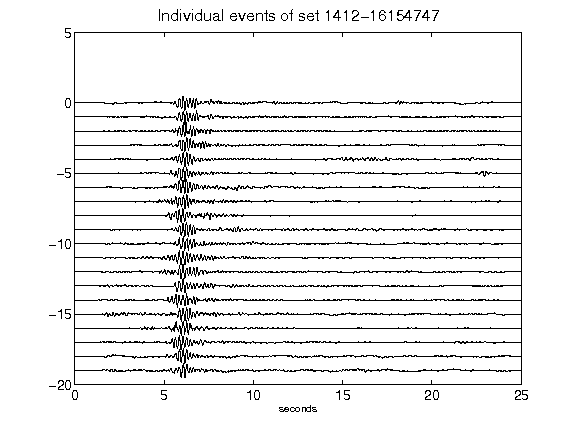](figures/1412-16154747_AllEv.png)[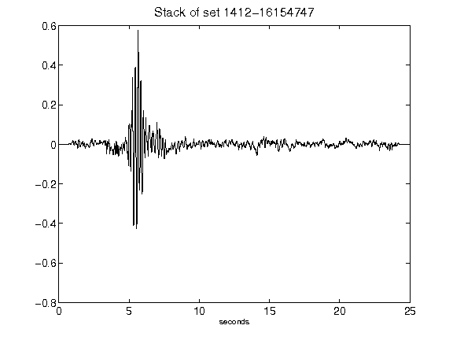](figures/1412-16154747_Stack.png)[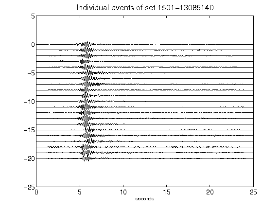](figures/1501-13085140_AllEv.png)[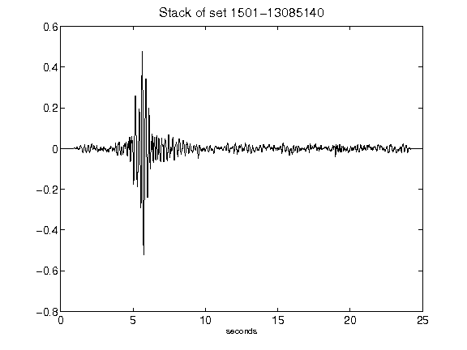](figures/1501-13085140_Stack.png)[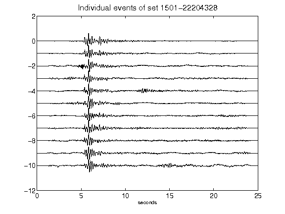](figures/1501-22204328_AllEv.png)[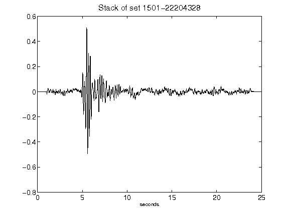](figures/1501-22204328_Stack.png)[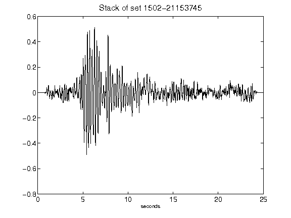](figures/1502-21153745_Stack.png)[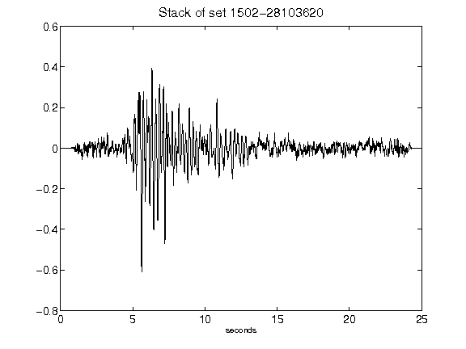](figures/1502-28103620_Stack.png)[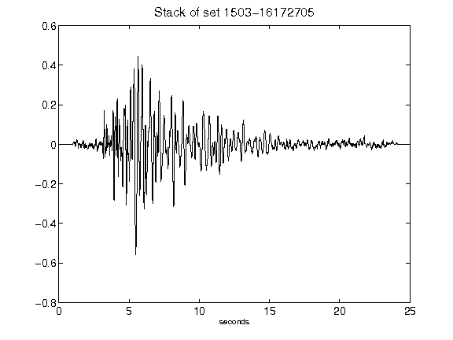](figures/1503-16172705_Stack.png)[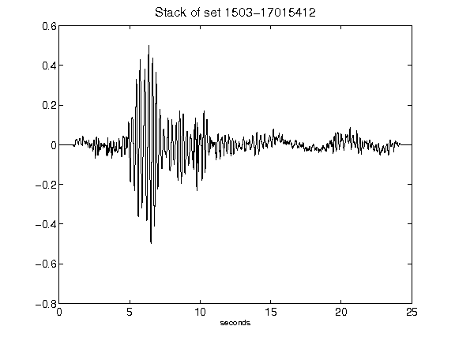](figures/1503-17015412_Stack.png)[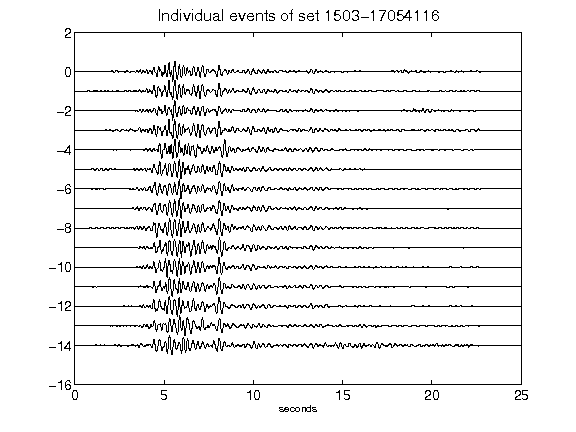](figures/1503-17054116_AllEv.png)[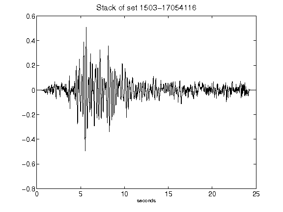](figures/1503-17054116_Stack.png)[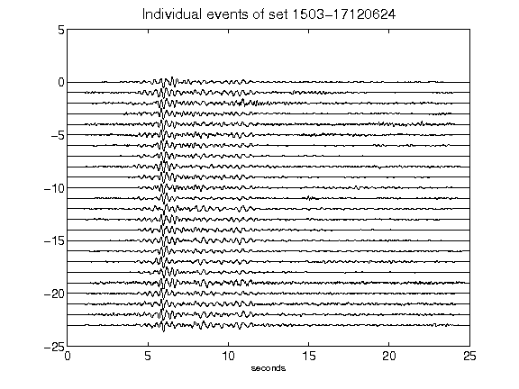](figures/1503-17120624_AllEv.png)[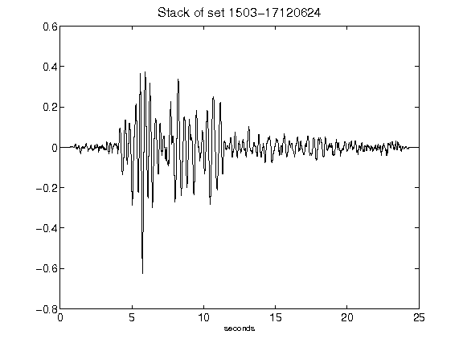](figures/1503-17120624_Stack.png)[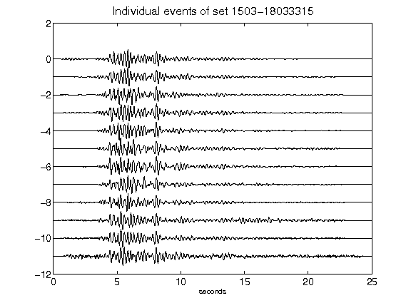](figures/1503-18033315_AllEv.png)[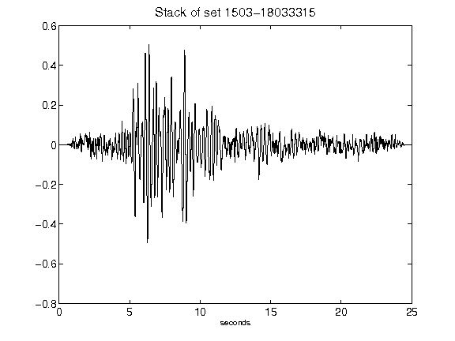](figures/1503-18033315_Stack.png)[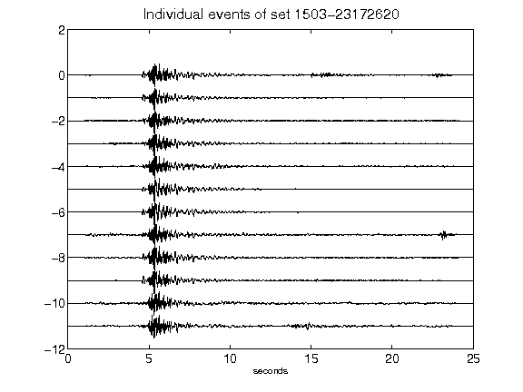](figures/1503-23172620_AllEv.png)[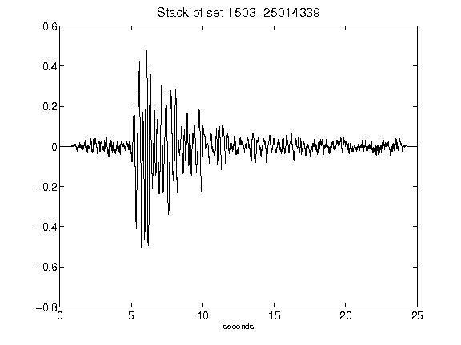](figures/1503-25014339_Stack.png)[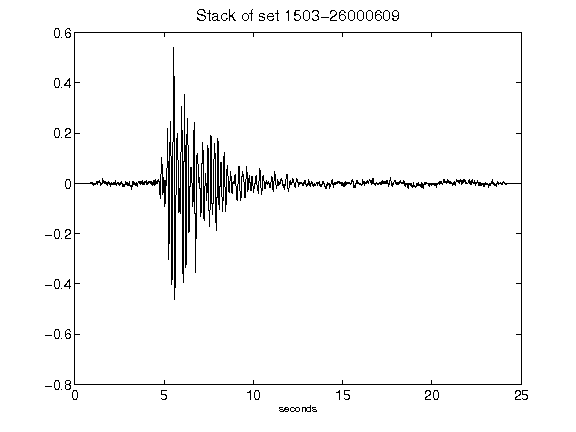](figures/1503-26000609_Stack.png)