# Repeating Earthquake Activity at RCM

## Waveforms
[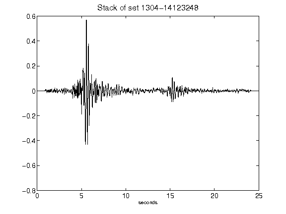](figures/1304-14123248_Stack.png)[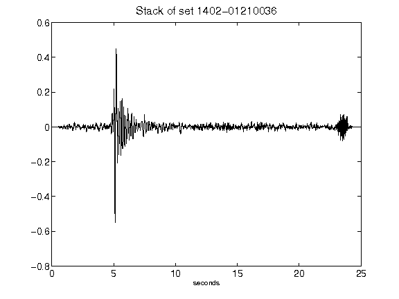](figures/1402-01210036_Stack.png)[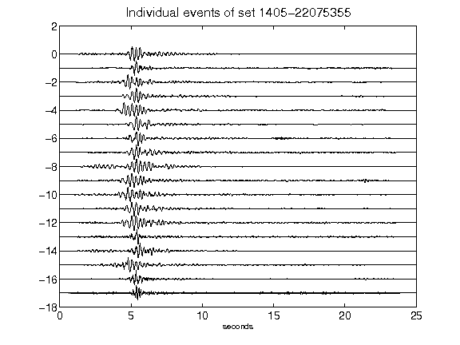](figures/1405-22075355_AllEv.png)[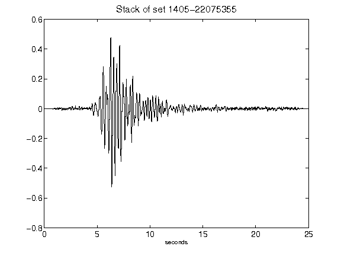](figures/1405-22075355_Stack.png)[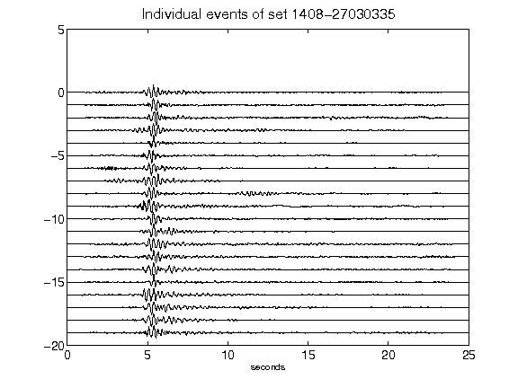](figures/1408-27030335_AllEv.png)[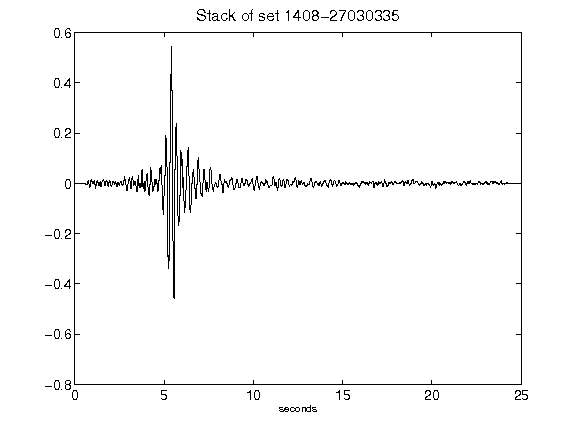](figures/1408-27030335_Stack.png)[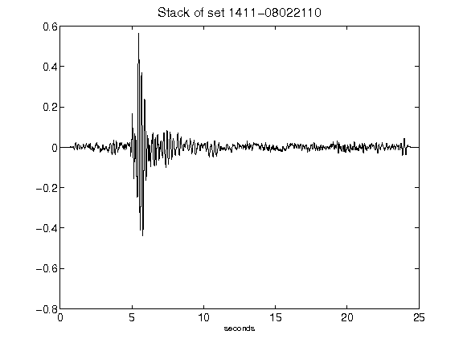](figures/1411-08022110_Stack.png)[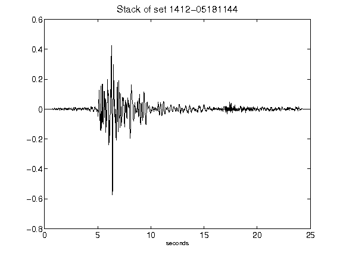](figures/1412-05181144_Stack.png)[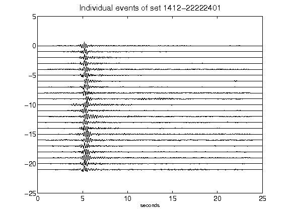](figures/1412-22222401_AllEv.png)[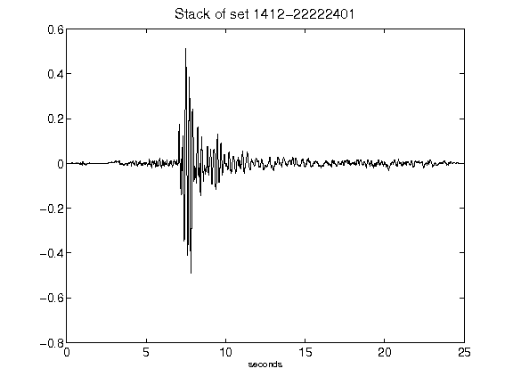](figures/1412-22222401_Stack.png)[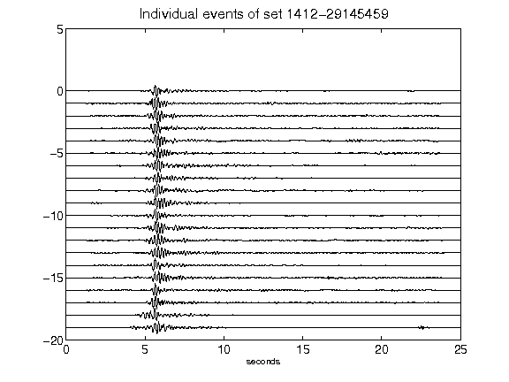](figures/1412-29145459_AllEv.png)[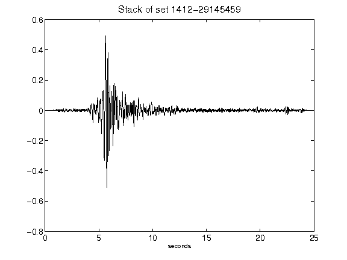](figures/1412-29145459_Stack.png)[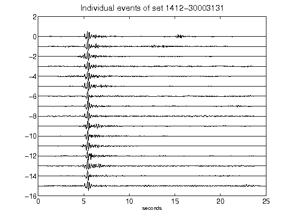](figures/1412-30003131_AllEv.png)[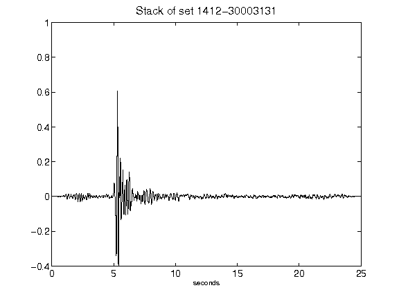](figures/1412-30003131_Stack.png)[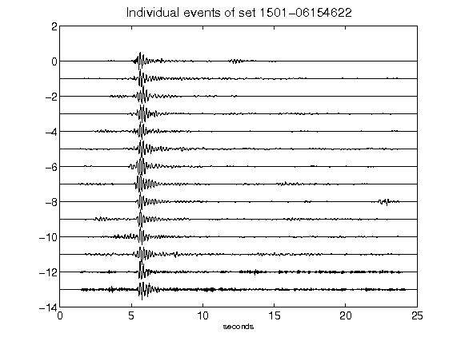](figures/1501-06154622_AllEv.png)[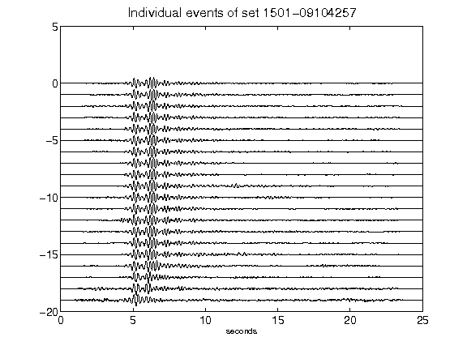](figures/1501-09104257_AllEv.png)[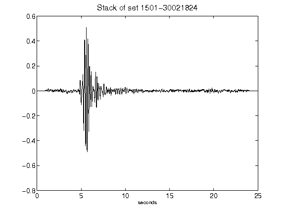](figures/1501-30021824_Stack.png)[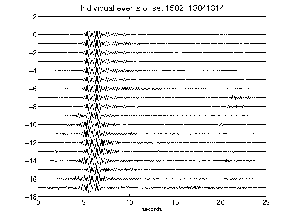](figures/1502-13041314_AllEv.png)[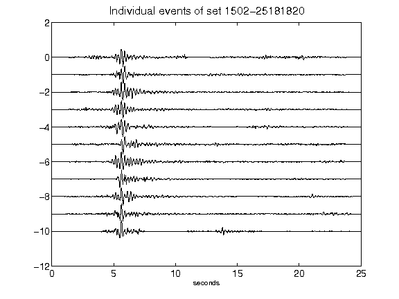](figures/1502-25181820_AllEv.png)[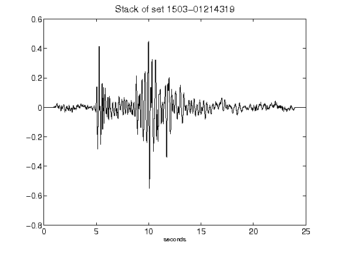](figures/1503-01214319_Stack.png)[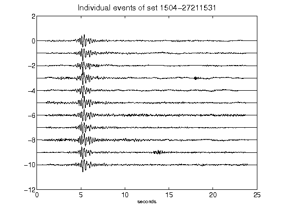](figures/1504-27211531_AllEv.png)[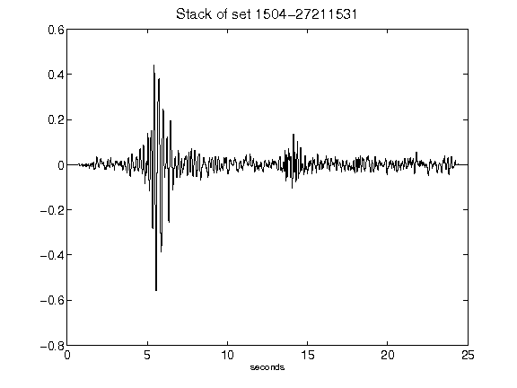](figures/1504-27211531_Stack.png)[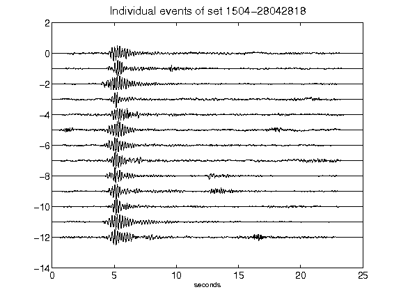](figures/1504-28042818_AllEv.png)[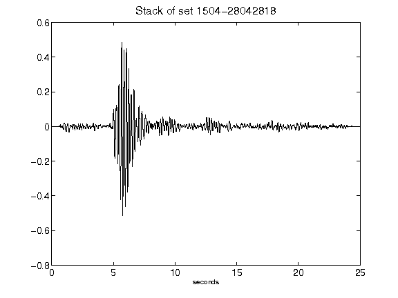](figures/1504-28042818_Stack.png)[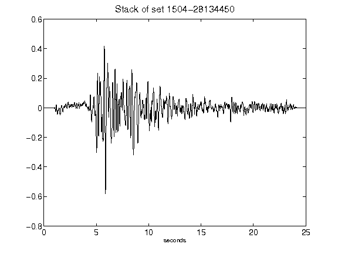](figures/1504-28134450_Stack.png)